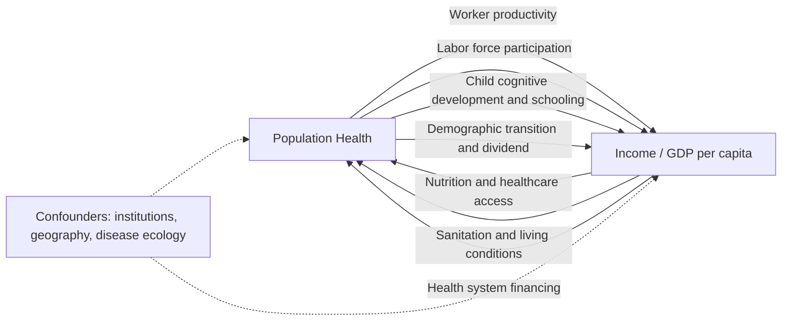

## Health and Economic Development Linkages

### Definition and Conceptual Scope

Health-development linkages refer to the bidirectional causal relationships between population health status and economic development outcomes. The field studies two distinct causal directions that are frequently conflated in casual empirical work but require different identification strategies:

- **Health → income (the "health capital" channel)**: improvements in health raise economic output and income through productivity, human capital accumulation, and demographic mechanisms
- **Income → health (the "income gradient" channel)**: economic growth and higher income raise health status through better nutrition, healthcare access, sanitation infrastructure, and health-related consumption

Because health and income are jointly determined by numerous omitted variables (institutional quality, education, geography, culture), and because reverse causality runs in both directions simultaneously, credible causal identification is a central methodological preoccupation of this literature, more so than in many other development economics subfields.

### Theoretical Framework: Health as Human Capital

Grossman's (1972) health capital model treats health as a durable capital stock that individuals invest in and that depreciates over time, analogous to physical capital. Health capital differs from other Beckerian human capital in that it directly enters the utility function (health is valued intrinsically, not only instrumentally) while also functioning as an input into market and non-market production (healthy time available for work).

This dual role generates the standard theoretical channels through which health affects economic output:

- **Direct productivity effects**: healthier workers have higher physical and cognitive capacity per hour worked, and illness-related absenteeism and presenteeism (reduced output while working through illness) both fall
- **Labor supply effects**: reduced morbidity and mortality raise labor force participation and effective working years, and reduce time diverted to caregiving for sick family members
- **Human capital complementarity**: health in early childhood affects cognitive development and educational attainment (a child suffering from malnutrition or chronic disease attends school less and learns less conditional on attendance), so health capital and human capital accumulate jointly rather than independently
- **Investment horizon effects**: higher life expectancy raises the expected return to human capital investment (a longer expected working life increases the payoff to years spent in school), which several models (e.g., Kalemli-Ozcan, Ryder, and Weil) formalize as a mechanism linking mortality decline to education investment
- **Savings and investment effects**: longer expected lifespans raise incentives to save for retirement, potentially raising the aggregate savings rate and capital accumulation, a mechanism central to some accounts of the East Asian "demographic dividend"

### The Demographic Transition and the Demographic Dividend

Health improvements (particularly reductions in infant and child mortality) interact with fertility decisions through the demographic transition, which is itself a major channel connecting health to growth:

- Mortality decline typically precedes fertility decline, producing a transitional period of rapid population growth
- As fertility subsequently falls (partly in response to lower child mortality reducing the number of births needed to achieve a target number of surviving children — the "quantity-quality trade-off" formalized by Becker and Lewis), the dependency ratio falls, temporarily raising the share of the population in working ages
- This shift can generate a **demographic dividend**: a temporary boost to per-capita income growth from a rising working-age share, independent of any productivity improvement, provided the economy can productively employ the expanding labor force (a large literature attributes a meaningful share of the East Asian "miracle" growth episode to this mechanism, notably in work by Bloom and Williamson)
- The dividend is not automatic: it requires complementary conditions (adequate job creation, education investment, sound institutions) to convert the demographic window into growth; without these, a large working-age cohort can instead generate unemployment and social instability rather than a growth dividend

### Empirical Identification Strategies

Because of the reverse-causality and omitted-variable problems noted above, the empirical literature has developed several strategies to isolate the causal effect of health on income:

**Instrumental variables using disease ecology**: exploits geographically or historically determined variation in disease burden that is plausibly unrelated to unobserved economic potential. The most cited example is Acemoglu and Johnson (2007), who use the international epidemiological transition (post-WWII introduction of antibiotics, DDT, and vaccines) as a source of exogenous variation in mortality decline across countries with differing pre-existing disease environments. Their central finding is that the resulting large increases in life expectancy raised population but did not produce a detectable increase in GDP per capita over the following decades — output grew roughly proportionally with population, implying a limited or negligible short-to-medium-run effect on income *per capita*, in contrast to the effects predicted by simple cross-country regressions of income on life expectancy.

**Natural experiments in specific disease eradication**: studies exploiting the timing and geography of malaria eradication campaigns (e.g., Bleakley's studies of hookworm eradication in the U.S. South and malaria eradication across multiple countries) generally find substantial *individual-level* returns to childhood disease eradication — cohorts exposed to eradication in childhood show higher adult income, educational attainment, and literacy than earlier cohorts or cohorts in non-eradication areas. [Inference] The apparent tension between these largely positive micro/cohort-level findings and the more muted aggregate cross-country findings of Acemoglu-Johnson is a live and only partially resolved issue in the literature, plausibly reconciled by general-equilibrium effects (e.g., diminishing returns to labor as population rises, land constraints) that attenuate the aggregate effect even when individual-level returns are genuinely positive.

**Randomized controlled trials on child health interventions**: a substantial experimental literature (deworming trials, most prominently the Kenya trials studied by Miguel and Kremer and later long-run follow-ups by Baird et al., and iron/micronutrient supplementation trials) provides some of the most credible individual-level evidence, generally finding positive effects of childhood health interventions on school attendance in the short run and, in some long-run follow-up studies, on adult labor market earnings decades later. [Inference] Effect sizes and, in some cases, statistical significance in this literature have been subject to active academic dispute and replication debate (notably around the original deworming study), so specific point estimates should be treated with appropriate caution rather than as settled parameters.

**Height and early-life health as a marker**: adult height, being substantially determined by nutrition and disease burden in utero and in early childhood, is widely used as a summary marker of early-life health capital; height is robustly correlated with adult wages, cognitive test scores, and productivity across many country contexts, though the degree to which height itself is causal (via, e.g., physical strength or as a marker for otherwise-unobserved early childhood health and cognitive investment) versus purely a correlated marker remains debated.

### Health and Aggregate Growth Accounting

At the macroeconomic level, health enters standard growth-accounting and cross-country growth regression frameworks (in the spirit of Mankiw-Romer-Weil augmented Solow models) as an additional component of the human capital stock, typically proxied by life expectancy at birth or the adult survival rate. Cross-sectional regressions of income on life expectancy generally show a strong positive correlation, but as the identification strategies above indicate, this correlation substantially overstates the causal effect running purely from health to income, since it fails to net out the income-to-health channel and the shared dependence of both variables on institutional quality, education, and geography (disease environment itself is correlated with historical institutional development, as emphasized in Acemoglu, Johnson, and Robinson's broader institutions literature).

### The Reverse Channel: Income to Health

The income-to-health direction is comparatively less contested but still involves important nuance:

- **The Preston curve**: plotting life expectancy against GDP per capita across countries reveals a strong positive but concave relationship (Preston, 1975) — higher income is associated with higher life expectancy, but with diminishing returns at high income levels, and importantly the *entire curve* has shifted upward over historical time even at constant income levels, indicating that a substantial share of historical mortality decline is attributable to non-income factors (public health knowledge diffusion, medical technology, vaccination, sanitation infrastructure) rather than income growth per se
- **Absolute income vs. relative income hypotheses**: within-country evidence on income and health/mortality is debated between models emphasizing the level of absolute income (material access to nutrition, healthcare, and living conditions) and models emphasizing relative income or income inequality (psychosocial stress channels, as argued by Wilkinson and others), with the relative-income/inequality channel considerably more contested in the empirical literature than the absolute-income channel
- **Health as a normal/luxury good**: cross-country evidence on the income elasticity of health expenditure has been used to characterize healthcare as a luxury good at the national level (health spending share of GDP rising with income), though this finding is sensitive to specification and country sample

### Sector-Specific Linkages in Development Practice

**Nutrition and stunting**: chronic undernutrition in early childhood (stunting) is linked in the literature to persistent deficits in cognitive development, schooling attainment, and adult earnings — the "1,000 days" window (conception to age two) is widely emphasized in development and public health policy as the critical period during which nutritional interventions have the largest and most persistent returns, based substantially on longitudinal cohort studies (e.g., Guatemala INCAP study follow-ups).

**Infectious disease burden**: beyond mortality, high endemic disease burden (malaria, HIV/AIDS, neglected tropical diseases) imposes direct economic costs through healthcare expenditure, reduced labor productivity among the chronically ill, and — in the case of HIV/AIDS in high-prevalence Sub-Saharan African countries during the epidemic's peak — measurable reductions in human capital accumulation as prime-age adult mortality reduced households' expected returns to investing in children's education and disrupted intergenerational knowledge transmission.

**Water, sanitation, and hygiene (WASH)**: improvements in access to clean water and sanitation are linked to reductions in diarrheal disease and other waterborne illness, which is a major driver of child mortality and stunting in many low-income settings; the returns to WASH infrastructure investment are frequently evaluated in the same RCT-based tradition as other child health interventions.

**Health system capacity and institutions**: cross-country and within-country evidence links health system strength (workforce density, facility access, health financing structure) to health outcomes independent of income, and health system weaknesses are frequently identified as binding constraints even where disease-specific interventions (vaccines, treatments) are technically available and affordable.

### Illustrative Diagram: Bidirectional Health-Income Causal Channels

### Illustrative Diagram: The Preston Curve (svg_diagram)

<svg xmlns="http://www.w3.org/2000/svg" viewBox="0 0 480 320">
<text x="240" y="24" text-anchor="middle" font-size="15" font-weight="bold" fill="#1a1a1a">Preston Curve (svg_diagram)</text>
<line x1="60" y1="270" x2="440" y2="270" stroke="#333" stroke-width="1.5" />
<line x1="60" y1="270" x2="60" y2="50" stroke="#333" stroke-width="1.5" />
<text x="250" y="298" text-anchor="middle" font-size="12" fill="#333">GDP per capita (log scale)</text>
<text x="24" y="160" text-anchor="middle" font-size="12" fill="#333" transform="rotate(-90 24 160)">Life expectancy at birth</text>
<path d="M 75 255 Q 150 100 250 70 T 430 60" fill="none" stroke="#2563eb" stroke-width="2.5" />
<text x="300" y="55" font-size="11" fill="#2563eb">Later period curve</text>
<path d="M 75 260 Q 160 160 260 120 T 430 100" fill="none" stroke="#dc2626" stroke-width="2.5" stroke-dasharray="6,4" />
<text x="300" y="140" font-size="11" fill="#dc2626">Earlier period curve</text>
<circle cx="150" cy="150" r="4" fill="#111" />
<text x="158" y="145" font-size="10" fill="#111">upward shift over time</text>
<text x="158" y="158" font-size="10" fill="#111">at constant income</text>
</svg>

### Key Points

- Health-development linkages run in both directions, and the literature's central methodological challenge is disentangling health→income effects from income→health effects and shared confounders
- Grossman's health-as-capital model, plus complementary demographic-transition mechanisms (mortality decline, fertility decline, demographic dividend), provide the main theoretical channels connecting health to growth
- Aggregate cross-country identification (Acemoglu and Johnson) finds limited effects of large life-expectancy gains on income per capita, in apparent tension with generally positive micro/cohort-level evidence from disease-eradication and RCT-based studies (Bleakley; Miguel and Kremer); this tension is only partially resolved and remains an active research area
- The Preston curve documents a strong but concave income-health relationship that has shifted upward historically independent of income, indicating non-income drivers (medical technology, public health knowledge) matter substantially
- The 1,000-day nutritional window is a central policy concept linking early-life health investment to long-run human capital and earnings outcomes
- Some influential empirical results in this literature (notably certain deworming trial estimates) have been subject to significant replication dispute and should be cited with appropriate caution regarding precise magnitudes

**Related Topics**

- Grossman model of health capital demand
- Demographic transition theory and the demographic dividend
- Quantity-quality trade-off in fertility (Becker-Lewis model)
- Instrumental variable identification strategies in development economics
- Nutrition, stunting, and early childhood development economics
- HIV/AIDS and macroeconomic impact in Sub-Saharan Africa
- Health system strengthening and universal health coverage economics
- Higher education and skills mismatch
- Institutions and long-run economic development (Acemoglu-Johnson-Robinson)
- Randomized controlled trials in development economics methodology