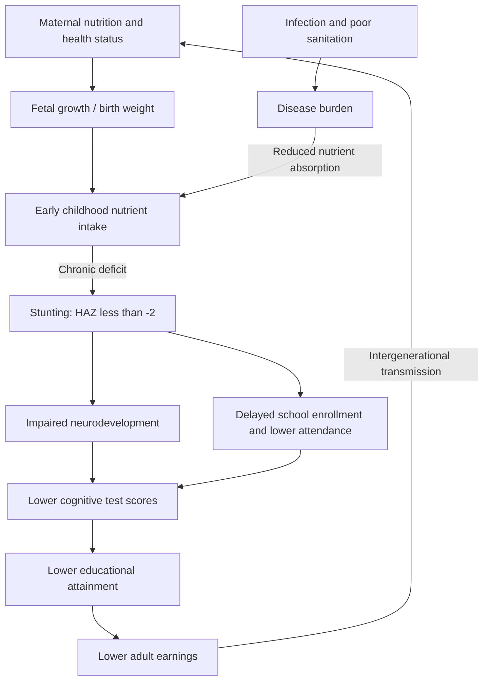

## Nutrition, Stunting, and Human Capital Formation

### Definition and Anthropometric Measurement

Stunting is defined by the WHO Child Growth Standards as height-for-age more than two standard deviations below the median of the reference population, reflecting chronic, cumulative undernutrition and/or repeated infection rather than acute food shortage. It is distinguished from related but conceptually distinct anthropometric measures:

- **Stunting (height-for-age z-score, HAZ < -2)**: chronic, long-term malnutrition; largely irreversible after the critical window has closed
- **Wasting (weight-for-height z-score, WHZ < -2)**: acute malnutrition, reflecting recent and severe weight loss or failure to gain weight; more responsive to short-term intervention and treatable through therapeutic feeding
- **Underweight (weight-for-age z-score, WAZ < -2)**: a composite measure capturing both chronic and acute dimensions, less analytically precise than the other two
- **Severe stunting/wasting**: more than three standard deviations below the reference median

Stunting prevalence is the primary indicator tracked in global nutrition monitoring (WHO Global Nutrition Targets, Sustainable Development Goal 2) precisely because of its association with irreversible long-run human capital deficits, distinguishing it from wasting, which is a more urgent but more remediable acute condition.

### The Critical Window: The First 1,000 Days

The dominant conceptual framework in this literature identifies the period from conception to a child's second birthday (approximately 1,000 days) as the critical window during which nutritional deficits produce the largest and most persistent effects on subsequent physical and cognitive development:

- **In utero period**: maternal nutritional status and health during pregnancy affect fetal growth; low birth weight (a marker of intrauterine growth restriction) is itself independently associated with worse later-life outcomes even conditional on subsequent childhood nutrition
- **0–6 months**: exclusive breastfeeding is emphasized as the primary recommended intervention, both for direct nutritional adequacy and for immune protection reducing infectious disease incidence, which interacts with nutritional status (see disease-nutrition interaction below)
- **6–24 months**: the complementary feeding period, during which dietary diversity and micronutrient adequacy (particularly iron, zinc, vitamin A, and iodine) become critical as breast milk alone becomes nutritionally insufficient
- After approximately 24 months, linear growth faltering becomes substantially harder to reverse; catch-up growth in height is limited, motivating the emphasis on prevention during the window rather than remediation afterward

[Inference] While the 1,000-day framework is very widely used in global nutrition policy and is grounded in a substantial body of longitudinal evidence, the degree of strict biological irreversibility after exactly 24 months (versus a more gradual decline in the returns to intervention) is a simplification of continuous underlying biological processes, and some cognitive and growth catch-up has been documented in specific intervention studies beyond this window, so the 1,000-day cutoff should be understood as a policy heuristic rather than a precise biological threshold.

### Nutrition-Disease Interaction: The Vicious Cycle

A central mechanism in the stunting literature is the bidirectional interaction between undernutrition and infectious disease:

- Undernutrition impairs immune function, increasing susceptibility to infection and increasing the severity and duration of infectious episodes (diarrheal disease, respiratory infection, malaria)
- Infection, particularly repeated diarrheal disease, reduces nutrient absorption (through intestinal damage and reduced appetite) and increases metabolic demands, worsening nutritional status
- This creates a self-reinforcing cycle, which has motivated the identification of **environmental enteric dysfunction (EED)** — a subclinical condition of chronic intestinal inflammation, believed to result from repeated exposure to fecal pathogens in environments with poor sanitation, that impairs nutrient absorption even in the apparent absence of overt diarrheal illness — as a potentially important and historically underappreciated contributor to stunting in high-pathogen-exposure environments. [Speculation on precise magnitude] The quantitative contribution of EED specifically (as opposed to overt diarrheal disease and dietary inadequacy) to observed stunting rates remains an active area of research with substantial measurement difficulty, since EED is not straightforwardly diagnosed through standard clinical indicators.

This interaction is the theoretical basis for water, sanitation, and hygiene (WASH) interventions being studied alongside direct nutritional interventions as complementary (rather than substitute) approaches to reducing stunting.

### Mechanisms Linking Stunting to Human Capital Outcomes

**Direct neurodevelopmental pathway**: nutritional deficits during the period of most rapid brain development (which substantially overlaps the first 1,000 days) are associated with structural and functional differences in brain development, plausibly mediating documented associations between early stunting and later cognitive test performance, though isolating the specific biological pathway from confounded socioeconomic pathways is methodologically difficult in observational data.

**Schooling channel**: stunted children in observational studies show, on average, later school enrollment, lower school attendance conditional on enrollment, and lower cognitive test scores and educational attainment conditional on attendance, consistent with nutrition operating partly through reduced capacity to benefit from a given quantity of schooling (a channel distinct from pure school-access constraints).

**Economic productivity channel**: adult height (as a marker of cumulative early-life nutritional and health status) is robustly correlated with adult wages across many country contexts in the labor economics literature, with proposed mechanisms including direct physical productivity effects (particularly salient in manual labor–intensive economies), cognitive ability correlated with early nutrition, and labor market signaling/discrimination effects that are harder to attribute a specific causal share to.

**Intergenerational transmission**: stunted girls are more likely, as adults, to have low pre-pregnancy weight and shorter stature themselves, and maternal nutritional status is a strong predictor of infant birth weight and subsequent child growth — creating a documented **intergenerational cycle of undernutrition** in which one generation's stunting predicts elevated stunting risk in the next generation, independent of contemporaneous household income.

### Empirical Evidence Base

**Long-run cohort studies**: the Guatemala INCAP (Instituto de Nutrición de Centro América y Panamá) longitudinal study, which followed children who received a high-protein nutritional supplement (Atole) versus a lower-energy supplement (Fresco) in early childhood starting in the late 1960s, remains one of the most cited pieces of long-run evidence, with follow-up studies decades later (notably work by Hoddinott, Maluccio, and coauthors) finding that early exposure to the more nutritionally complete supplement was associated with higher adult wages, more schooling, and better performance on cognitive tests, providing rare very-long-horizon experimental-adjacent evidence on the returns to early childhood nutrition.

**Cross-sectional and panel associations**: numerous Demographic and Health Survey (DHS)–based studies across low- and middle-income countries document robust cross-sectional associations between early stunting and later cognitive test scores and schooling outcomes, though the causal interpretation of purely observational cross-sectional stunting-outcome correlations is complicated by confounding household socioeconomic status, parental education, and other correlated investments.

**Randomized nutritional supplementation trials**: a substantial RCT literature evaluates specific nutritional interventions (micronutrient supplementation, lipid-based nutrient supplements, fortified complementary foods, iron and folic acid supplementation) with generally more consistent evidence of improved anthropometric and, in some studies, cognitive outcomes in the short-to-medium run, though effect sizes vary by intervention type, dosage, delivery context, and baseline deficiency prevalence, and long-run (adult outcome) RCT follow-ups remain rarer than short-run anthropometric and developmental assessments due to the multi-decade time horizon required.

**Deworming and combined health-nutrition interventions**: the broader literature on childhood health interventions with nutritional relevance (deworming trials, discussed extensively in the Miguel-Kremer tradition and subsequent long-run follow-ups by Baird and coauthors) intersects substantially with stunting-focused work, since intestinal parasitic infection is itself a driver of nutritional deficit through the disease-nutrition interaction mechanism described above. [Inference] As with the broader child health RCT literature, specific point estimates in this area have been subject to academic replication dispute and should be treated as subject to some ongoing debate rather than as uniformly settled.

### Economic Costing and Policy Framing

Stunting is frequently quantified in policy documents (World Bank, UNICEF) using cost-of-inaction framings that estimate aggregate GDP losses attributable to childhood stunting, typically built by combining: (a) estimated stunting-attributable deficits in cognitive test scores or schooling years, (b) established returns-to-schooling/cognitive-skill parameters from the labor economics literature (Mincerian-type returns), and (c) demographic stunting prevalence data, to produce an aggregate percentage-of-GDP estimate. [Inference] These aggregate cost estimates rest on a chain of assumptions (extrapolating micro-level returns-to-education parameters, assuming a specific causal magnitude for the stunting-to-cognition link, and assuming general-equilibrium effects do not substantially attenuate the aggregate figure) and should be treated as illustrative, policy-communication estimates rather than precisely identified causal magnitudes.

### Policy Intervention Categories

**Direct nutrition-specific interventions**: micronutrient supplementation (vitamin A, iron, zinc, iodine), promotion of exclusive breastfeeding and appropriate complementary feeding practices, management of acute malnutrition (therapeutic and supplementary feeding for wasting), and food fortification programs (salt iodization, staple food fortification).

**Nutrition-sensitive interventions**: interventions in adjacent sectors with nutritional spillovers, including WASH infrastructure (addressing the disease-nutrition interaction), agricultural interventions promoting dietary diversity (biofortification, homestead food production), conditional and unconditional cash transfer programs (addressing the underlying resource constraint on food access), and maternal education programs (correlated with improved child feeding practices).

**Multisectoral/integrated program design**: given the multiple interacting causal channels (disease, dietary inadequacy, caregiving practices, household resources), a significant body of program evaluation work studies combined interventions (e.g., nutrition plus early childhood stimulation, or nutrition plus cash transfer), with some evidence that combined approaches produce larger effects than single-sector interventions alone, though the evidence base on optimal intervention bundling and sequencing remains an active research area rather than fully settled.

### Illustrative Diagram: Stunting Causal Pathway to Human Capital

### Illustrative Diagram: Growth Faltering and the Critical Window (svg_diagram)

<svg xmlns="http://www.w3.org/2000/svg" viewBox="0 0 480 320">
<text x="240" y="24" text-anchor="middle" font-size="15" font-weight="bold" fill="#1a1a1a">Growth Faltering Timeline (svg_diagram)</text>
<line x1="60" y1="270" x2="440" y2="270" stroke="#333" stroke-width="1.5" />
<line x1="60" y1="270" x2="60" y2="50" stroke="#333" stroke-width="1.5" />
<text x="250" y="298" text-anchor="middle" font-size="12" fill="#333">Age (months)</text>
<text x="24" y="160" text-anchor="middle" font-size="12" fill="#333" transform="rotate(-90 24 160)">Height-for-age z-score</text>
<rect x="60" y="50" width="150" height="220" fill="#fef3c7" opacity="0.4" />
<text x="135" y="65" text-anchor="middle" font-size="10" fill="#92400e">Critical 1,000-day window</text>
<path d="M 60 90 L 210 200 L 300 220 L 440 225" fill="none" stroke="#dc2626" stroke-width="2.5" />
<text x="320" y="215" font-size="10" fill="#dc2626">Faltering, then plateau</text>
<path d="M 60 90 L 440 100" fill="none" stroke="#16a34a" stroke-width="2.5" stroke-dasharray="6,4" />
<text x="320" y="90" font-size="10" fill="#16a34a">Reference median</text>
<line x1="210" y1="50" x2="210" y2="270" stroke="#555" stroke-width="1" stroke-dasharray="3,3" />
<text x="215" y="45" font-size="10" fill="#555">~24 months</text>
</svg>

### Key Points

- Stunting (chronic, height-for-age deficit) is analytically distinct from wasting (acute, weight-for-height deficit); stunting is the primary marker of concern for long-run human capital because it reflects cumulative, largely irreversible growth faltering
- The first 1,000 days (conception to age two) is the policy-standard critical window, though the exact irreversibility cutoff is a heuristic rather than a precise biological threshold
- The nutrition-disease interaction (including environmental enteric dysfunction in high-pathogen environments) creates a mutually reinforcing cycle, which is the theoretical basis for combining WASH and nutrition interventions
- The Guatemala INCAP long-run follow-up remains a key evidence source linking early nutritional supplementation to adult wages, schooling, and cognitive outcomes decades later
- Stunting shows a documented intergenerational transmission pattern, independent of contemporaneous household income
- Aggregate GDP-loss estimates attributable to stunting are built from chained assumptions (cognitive deficit size, returns-to-education parameters, prevalence) and should be treated as illustrative policy communication rather than precisely identified causal estimates
- Effect sizes in several influential child-health/nutrition RCTs (notably in the deworming literature) have been subject to academic replication dispute and warrant appropriate caution regarding precise magnitudes

**Related Topics**

- Health and economic development linkages
- Grossman model of health capital
- Quantity-quality trade-off and household fertility decisions
- Water, sanitation, and hygiene (WASH) economics
- Conditional cash transfer programs and human capital investment
- Early childhood development and cognitive skill formation
- Randomized controlled trials in development economics methodology
- Intergenerational mobility and poverty traps
- Returns to education (Mincerian earnings function)
- Global nutrition policy and Sustainable Development Goal 2 targets