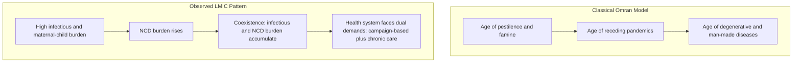

## Disease Burden in Developing Countries

### Definition and Measurement Framework

Disease burden refers to the aggregate impact of illness, injury, and premature death on a population, distinguished economically from simple mortality counts because it captures both fatal and non-fatal health loss in a single comparable metric. The standard metric is the **Disability-Adjusted Life Year (DALY)**:

$$DALY = YLL + YLD$$

where $YLL$ (Years of Life Lost) captures premature mortality relative to a reference life expectancy, and $YLD$ (Years Lived with Disability) captures time lived in a non-fatal health state weighted by a disability weight between 0 (full health) and 1 (equivalent to death). One DALY represents one lost year of healthy life. This framework, developed for the Global Burden of Disease (GBD) study, allows comparison across radically different conditions (e.g., blindness versus a fatal cardiovascular event) on a common scale, which is analytically essential for cost-effectiveness comparisons and health-budget prioritization exercises in development economics.

### The Epidemiological Transition Model

Omran's classical epidemiological transition theory (1971) posits three sequential phases as economies develop: an "age of pestilence and famine" (high mortality dominated by infectious disease and malnutrition), an "age of receding pandemics" (infectious disease mortality falls, population growth accelerates), and an "age of degenerative and man-made diseases" (non-communicable diseases, NCDs, become the dominant cause of death and disability as infectious disease recedes).

**The double burden critique**: a substantial body of literature applied to Sub-Saharan Africa and other low-income settings argues that the classical sequential model does not describe observed trajectories accurately. Rather than a clean replacement of communicable by non-communicable disease, many low-income countries exhibit a **double (or triple) burden of disease**: non-communicable diseases are expanding while maternal and nutritional conditions, injuries, mental health needs, and social vulnerability continue to shape morbidity and mortality, producing coexistence, interaction, and accumulation rather than replacement. This pattern is reinforced by within-country evidence: many low- and middle-income countries are undergoing rapid epidemiological transition with a rising NCD burden occurring against a background of existing infectious chronic disease epidemics, particularly HIV and tuberculosis in Sub-Saharan Africa, a pattern some authors term "colliding epidemics." [PubMed Central](https://pmc.ncbi.nlm.nih.gov/articles/PMC13506846/)[nih](https://www.ncbi.nlm.nih.gov/pmc/articles/PMC4071801/)

The Mozambique case study is frequently cited as an illustrative example: despite rising NCDs, the vast predominance of infectious disease burden means a double burden of disease model describes the country's actual epidemiological context more accurately than a strict transition model.

### Current Global Distribution of Burden (GBD 2023)

Recent Global Burden of Disease estimates document substantial aggregate progress alongside persistent and widening inequality:

- From 1990 to 2023, the global age-standardized DALY rate fell 36%, and from 2010 to 2023, DALY rates for communicable, maternal, neonatal, and nutritional (CMNN) diseases fell by almost 26%, led by diarrheal disease rates being cut in half, a 43% decrease in HIV/AIDS rates, and a 42% drop in tuberculosis rates. Neonatal disorders and lower respiratory infections remain the top causes of CMNN disease burden, though both have declined substantially (17% and 25% respectively). [Institute for Health Metrics and Evaluation](https://www.healthdata.org/news-events/newsroom/news-releases/new-global-burden-disease-study-mortality-declines-youth-deaths)[Institute for Health Metrics and Evaluation](https://www.healthdata.org/news-events/newsroom/news-releases/new-global-burden-disease-study-mortality-declines-youth-deaths)
- Despite this progress, the distributional trend is concerning: decades of progress toward closing the health gap in low-income regions are at risk of unraveling due to recent cuts to international aid funding, since these countries rely heavily on global health financing for primary care, medicine, and vaccines. [Institute for Health Metrics and Evaluation](https://www.healthdata.org/news-events/newsroom/news-releases/new-global-burden-disease-study-mortality-declines-youth-deaths)
- The GBD 2023 findings emphasize the need for policymakers to expand health priorities beyond child mortality reduction to include adolescents and young adults, particularly given injury-related burden patterns — injury DALY rates fell 16% from 2010–2023, but burden remains substantially higher in males, especially ages 10–24, who account for more than double the total injury DALYs of females. [Institute for Health Metrics and Evaluation](https://www.healthdata.org/news-events/newsroom/news-releases/new-global-burden-disease-study-mortality-declines-youth-deaths)

### Rising Non-Communicable Disease Burden in Low-Income Settings

A parallel and increasingly emphasized dimension of disease burden concerns the pace of NCD growth in economies least prepared to manage it:

- Demographic and epidemiological changes are shifting disease burden from communicable to noncommunicable disease in lower-income countries; within a generation, the share of disease burden attributable to NCDs in some poor countries is projected to exceed 80%, rivaling rich-country levels, but affecting much younger populations than in wealthy countries. This rise is driven by increased prevalence of modifiable behavioral risks such as unhealthy diets and tobacco use, combined with reductions in the infectious diseases that disproportionately killed children and adolescents historically. [Health Affairs](https://www.healthaffairs.org/doi/10.1377/hlthaff.2017.0708)[nih](https://www.ncbi.nlm.nih.gov/pmc/articles/PMC7705176/)
- This creates a severe preparedness mismatch: countries projected to see the greatest increases in NCD burden share tend to also rank lowest on health-system capacity indices and are expected to have the smallest increases in national health spending. This is compounded by a funding allocation mismatch, since non-communicable diseases receive only about 2% of overseas development assistance for health worldwide, despite their rising share of actual burden. [Health Affairs](https://www.healthaffairs.org/doi/10.1377/hlthaff.2017.0708)[nih](https://www.ncbi.nlm.nih.gov/pmc/articles/PMC7705176/)
- High body mass index (BMI) illustrates the risk-factor dimension of this shift: age-standardized DALY rates attributable to high BMI have tended to increase specifically in regions with the lowest Socio-demographic Index (SDI), even while declining in the highest-SDI regions, indicating the NCD risk-factor transition is not confined to middle-income "transitioning" economies alone. [nih](https://www.ncbi.nlm.nih.gov/pmc/articles/PMC7386577/)

### Neglected Tropical Diseases (NTDs) and the Poverty-Disease Link

Neglected tropical diseases occupy a distinctive analytical category because their burden is overwhelmingly concentrated among the poorest populations within poor countries, making them a paradigmatic case of disease as both a consequence and a cause of poverty:

NTDs are among the top ten communicable causes of ill health globally, contributing relatively low mortality but substantial morbidity; more than one billion people were infected with at least one NTD as of 2021, with approximately 1.5 billion more at risk, and NTDs account for an estimated 120,000 deaths and 14.1 million DALYs globally each year. Infection can lead to blindness, disfigurement, severe disability, malnutrition, or impaired childhood development, with individuals frequently infected by multiple diseases simultaneously; although NTDs are endemic in nearly 150 countries, the greatest burden is concentrated in low- and middle-income countries across Africa, Asia, and Latin America. [medrxiv](https://www.medrxiv.org/content/10.64898/2026.01.19.26344412.full.pdf)[medrxiv](https://www.medrxiv.org/content/10.64898/2026.01.19.26344412.full.pdf)

The economic significance of NTDs in development economics stems less from mortality (which is comparatively low relative to leading killers) and more from their chronic, disabling nature: because NTDs typically strike in childhood and persist for decades without killing, their cumulative productivity and human-capital cost (lost schooling, impaired cognitive development, reduced adult labor capacity) can be large relative to their DALY-based ranking, motivating dedicated global NTD control and elimination programs (mass drug administration, vector control) distinct from general primary healthcare investment.

### The Perinatal and Maternal-Child Health Channel

Reproductive, maternal, neonatal, and child health conditions remain disproportionately concentrated in low-income settings and interact directly with the human capital formation channels discussed elsewhere in this chapter (see nutrition/stunting and health-development linkages):

The leading causes of DALYs related to preterm birth and low birth weight are neonatal disorders, lower respiratory infections, and sudden infant death syndrome, with age-standardized DALY rates negatively correlated with Socio-demographic Index across 204 countries and territories. While death and DALY rates related to preterm birth and low birth weight declined substantially worldwide from 1990 to 2019, Sub-Saharan Africa was a notable exception to this declining trend — illustrating the regionally uneven nature of even well-established global health progress. [nih](https://www.ncbi.nlm.nih.gov/pmc/articles/PMC11239190/)[nih](https://www.ncbi.nlm.nih.gov/pmc/articles/PMC11239190/)

### Cancer and Non-Communicable Disease Burden Convergence

Cancer burden data illustrate the extent to which the "non-communicable disease" category itself is now substantially a developing-country phenomenon in absolute terms, even though age-standardized rates remain higher in wealthy countries:

In 2023, excluding non-melanoma skin cancers, there were 18.5 million incident cancer cases and 10.4 million cancer deaths globally, contributing 271 million DALYs; of these, 57.9% of incident cases and 65.8% of cancer deaths occurred in low-income to upper-middle-income countries based on World Bank income classifications, and cancer was the second leading cause of death globally in 2023, after cardiovascular disease. This confirms that even classically "rich-country" NCDs now impose their largest absolute burden in the developing world, purely as a function of population size and rising exposure, even where age-standardized incidence remains comparatively lower than in high-income countries. [nih](https://www.ncbi.nlm.nih.gov/pmc/articles/PMC12687902/)[nih](https://www.ncbi.nlm.nih.gov/pmc/articles/PMC12687902/)

### Chronic Respiratory Disease and Environmental Risk Factors

The COPD (chronic obstructive pulmonary disease) literature illustrates how environmental and occupational risk factors specific to developing-country contexts (biomass fuel use, ambient air pollution, occupational dust exposure) interact with disease burden distribution:

In 2021, COPD caused an estimated 213.4 million prevalent cases globally, 3.7 million deaths, and 79.8 million DALYs, with particulate matter pollution as the leading risk factor, accounting for 41.7% of global COPD DALYs. Geographic variation showed South Asia with the greatest age-standardized death rates, and the study's authors emphasized the need for targeted public health interventions and resource allocation particularly in low- and middle-income countries to address the growing COPD challenge. [Burden of chronic obstructive pulmonary disease and its attributable risk factors in 204 countries and territories, 1990–2021: results from the Global Burden of Disease Study 2021 +2](https://www.ncbi.nlm.nih.gov/pmc/articles/PMC12815125/)

### Economic Mechanisms Linking Disease Burden to Development

**Direct productivity loss**: morbidity reduces labor supply (absenteeism) and labor productivity conditional on working (presenteeism), with chronic and disabling conditions (NTDs, untreated NCDs, chronic infectious disease) generating particularly large cumulative productivity losses over a working lifetime relative to acute conditions.

**Health system fiscal burden**: rising NCD burden in low-income settings imposes a qualitatively different fiscal challenge than infectious disease control, since NCD management typically requires sustained, lifelong chronic care infrastructure (diagnostics, medication continuity, specialist referral systems) rather than the more episodic, campaign-based interventions (vaccination, mass drug administration, bed-net distribution) that have historically dominated donor-funded infectious disease programs — a structural mismatch between existing health system architecture and the emerging burden profile.

**Poverty-disease reinforcing cycle**: disease burden and poverty are mutually reinforcing at the household level — illness generates catastrophic health expenditure and lost labor income, pushing households into poverty or deeper poverty, while poverty itself is a primary risk factor for disease exposure (crowded housing, poor sanitation, inadequate nutrition, limited healthcare access), a dynamic frequently modeled as a poverty trap mechanism in development economics.

**Human capital formation interaction**: childhood disease burden interacts directly with the nutrition-cognition-schooling pathway (see stunting and human capital formation), while adult chronic disease burden interacts with the demographic dividend mechanism (see health and economic development linkages) by potentially truncating the productive working-age period that the dividend mechanism depends upon.

**Donor financing misallocation risk**: the persistent mismatch between the low share of health development assistance directed to NCDs and their rising share of actual burden represents a potential structural inefficiency in global health resource allocation, though the counter-argument in the literature emphasizes that infectious disease control retains high cost-effectiveness and externality-correction rationale (communicable diseases impose contagion externalities that NCDs do not), which can justify continued infectious-disease-weighted allocation on public-economics grounds even as burden composition shifts.

### Illustrative Diagram: Double Burden Model vs. Classical Transition

### Illustrative Diagram: Poverty-Disease Reinforcing Cycle (svg_diagram)

<svg xmlns="http://www.w3.org/2000/svg" viewBox="0 0 480 320">
<text x="240" y="24" text-anchor="middle" font-size="15" font-weight="bold" fill="#1a1a1a">Poverty-Disease Cycle (svg_diagram)</text>
<circle cx="150" cy="160" r="80" fill="#eff6ff" stroke="#2563eb" stroke-width="1.5" />
<text x="150" y="155" text-anchor="middle" font-size="12" font-weight="bold" fill="#1e3a8a">Poverty</text>
<text x="150" y="172" text-anchor="middle" font-size="10" fill="#333">crowded housing, poor</text>
<text x="150" y="185" text-anchor="middle" font-size="10" fill="#333">sanitation, malnutrition</text>
<circle cx="330" cy="160" r="80" fill="#fef2f2" stroke="#dc2626" stroke-width="1.5" />
<text x="330" y="155" text-anchor="middle" font-size="12" font-weight="bold" fill="#7f1d1d">Disease Burden</text>
<text x="330" y="172" text-anchor="middle" font-size="10" fill="#333">infectious and chronic</text>
<text x="330" y="185" text-anchor="middle" font-size="10" fill="#333">morbidity and disability</text>
<path d="M 225 140 Q 240 110 255 140" fill="none" stroke="#555" stroke-width="1.5" marker-end="url(#arrow)" />
<text x="240" y="105" text-anchor="middle" font-size="9" fill="#555">exposure risk raises</text>
<path d="M 255 190 Q 240 220 225 190" fill="none" stroke="#555" stroke-width="1.5" marker-end="url(#arrow)" />
<text x="240" y="235" text-anchor="middle" font-size="9" fill="#555">income loss, health costs</text>
</svg>

### Key Points

- DALYs (YLL plus YLD) are the standard comparable metric for disease burden, enabling cross-condition and cross-country comparison beyond simple mortality
- The classical Omran epidemiological transition (sequential infectious-to-NCD shift) is increasingly contested for Sub-Saharan Africa and other low-income settings, where a double/triple burden model (NCD growth coexisting with, not replacing, persistent infectious and maternal-child burden) better fits observed data
- NCD burden share is rising fastest precisely in the countries least prepared, both in health-system capacity and in development-assistance allocation, creating a structural preparedness gap
- NTDs exemplify the poverty-concentration pattern of disease burden: low mortality but high chronic morbidity concentrated among the poorest populations, with human-capital costs plausibly exceeding their DALY-based mortality ranking
- Maternal-neonatal and cancer burden data both show substantial regional divergence, with Sub-Saharan Africa as a persistent exception to otherwise declining global trends, and low- to middle-income countries now bearing the majority of global cancer incidence and mortality in absolute terms
- The poverty-disease relationship is bidirectional and self-reinforcing, a mechanism directly relevant to poverty trap models in development economics

**Related Topics**

- Health and economic development linkages
- Nutrition, stunting, and human capital formation
- Demographic transition and the demographic dividend
- Health system strengthening and universal health coverage economics
- Poverty traps and vicious cycle models in development economics
- HIV/AIDS and macroeconomic impact in Sub-Saharan Africa
- Global health financing and overseas development assistance allocation
- Neglected tropical disease control and mass drug administration economics
- Catastrophic health expenditure and medical poverty traps
- Socio-demographic Index (SDI) and cross-country health comparison methodology