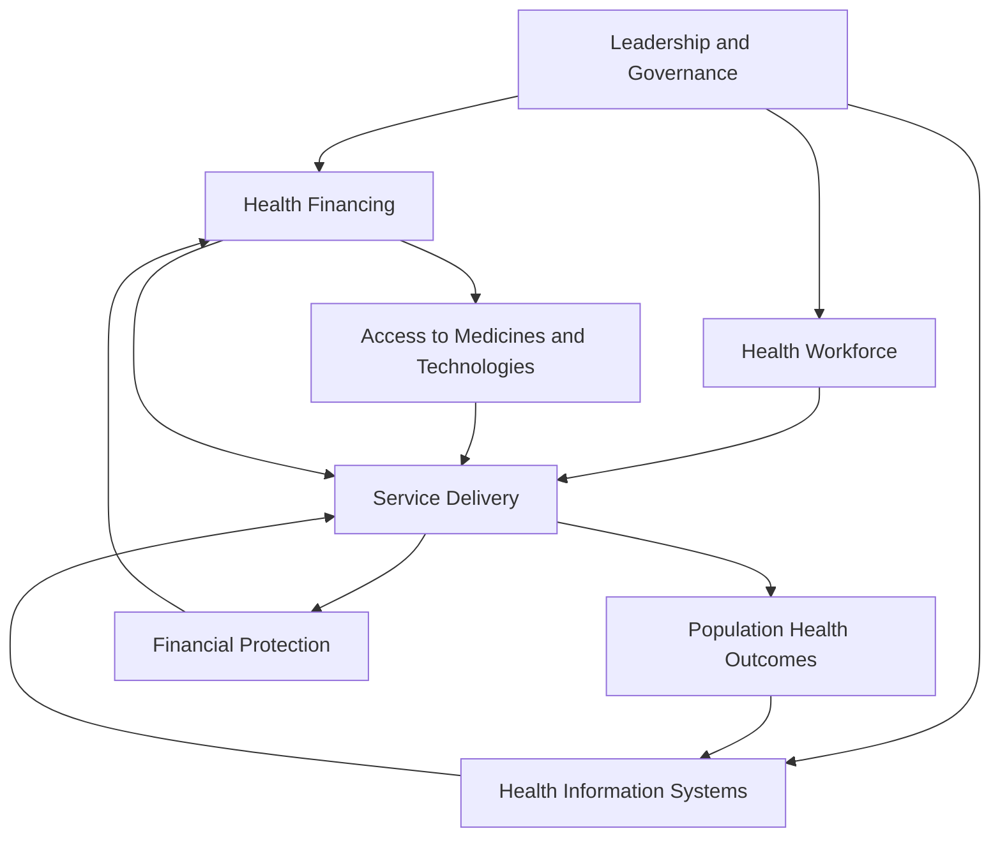

## Health Systems in Low-Income Settings

### Definition and the WHO Building Blocks Framework

A health system comprises all organizations, institutions, resources, and people whose primary purpose is to improve health. The dominant analytical framework used to structure health systems analysis, particularly in low-income settings, is the WHO's **six building blocks**:

1. **Service delivery**: the organization and provision of effective, safe, quality health services
2. **Health workforce**: the availability, distribution, competence, and productivity of health personnel
3. **Health information systems**: the generation, analysis, and use of reliable health data for decision-making
4. **Access to essential medicines and technologies**: equitable availability of quality, safe, and affordable medical products
5. **Health financing**: the mobilization, pooling, and allocation of funds to purchase health services
6. **Leadership and governance**: policy frameworks, regulation, accountability, and oversight

This framework is used both diagnostically (to identify binding constraints in a given system) and normatively (to structure investment and reform priorities), though it has been critiqued in the literature for treating the blocks as relatively siloed inputs rather than emphasizing the interactions and feedback loops between them, which are frequently where the most significant systemic weaknesses in low-income settings actually manifest.

### Health Financing Architecture

**Financing sources and pooling mechanisms**: health system financing in low-income countries typically draws on some combination of general government revenue (tax-financed), social or community-based health insurance contributions, out-of-pocket (OOP) payment at the point of service, and external development assistance for health (DAH). The mix across these sources is a central determinant of both financial protection and system sustainability.

**Out-of-pocket expenditure and catastrophic health spending**: low-income health systems are disproportionately reliant on OOP financing relative to high-income systems, which generates two well-documented adverse outcomes in the health economics literature:

- **Catastrophic health expenditure**: household health spending exceeding a threshold share (commonly defined as 10% or 25% of total household expenditure or of non-food expenditure) that forces cuts to other essential consumption
- **Medical impoverishment**: households pushed below the poverty line specifically due to health spending, a mechanism formalized and measured extensively by the World Bank/WHO Universal Health Coverage (UHC) monitoring framework, which tracks both financial protection indicators and service coverage indicators as joint UHC metrics

**Risk pooling rationale**: the core economic rationale for shifting away from OOP financing toward pooled financing mechanisms (tax-based systems or insurance) is standard insurance-market logic — health shocks are uncertain and potentially catastrophic at the individual level but predictable in aggregate, so pooling spreads risk and removes the incentive for individuals to forgo necessary care due to inability to pay at the point of use, which OOP-dominated systems otherwise induce.

**Community-Based Health Insurance (CBHI)**: given weak formal-sector employment (limiting payroll-tax-based social insurance) and limited state fiscal capacity for full tax-financed coverage, many low-income countries (notably in Sub-Saharan Africa, e.g., Rwanda's Mutuelles de Santé) have experimented with voluntary, community-level risk-pooling schemes. [Inference] The empirical literature on CBHI schemes finds generally positive but often modest effects on financial protection and utilization, with persistent challenges around adverse selection (healthier households opt out), low and unstable enrollment, limited risk pool size constraining actuarial viability, and heavy dependence on continued subsidy, such that CBHI is more often characterized in the literature as a transitional mechanism toward broader risk pooling than a stable long-run financing solution on its own.

**Development assistance for health (DAH)**: external donor financing constitutes a substantial share of total health expenditure in many low-income countries, concentrated disproportionately in specific disease verticals (HIV/AIDS, malaria, tuberculosis, immunization) relative to general health system strengthening or non-communicable disease management — a pattern with significant implications for system architecture (see vertical versus horizontal program design below) and for fiscal sustainability risk when donor priorities or funding levels shift.

### The Health Workforce Constraint

Health workforce density (physicians, nurses, and midwives per capita) is one of the most consistently identified binding constraints in low-income health systems:

- **The WHO workforce density threshold**: WHO has historically used minimum workforce density benchmarks (originally approximately 2.3 health workers per 1,000 population, later revised upward) below which countries are considered unlikely to achieve adequate coverage of essential health interventions; many low-income countries, particularly in Sub-Saharan Africa, fall substantially below these thresholds
- **Geographic maldistribution**: even where aggregate national workforce numbers are less severely constrained, rural and remote areas are systematically underserved relative to urban centers, driven by differential income opportunities, professional isolation, weaker infrastructure, and education/training access for workers' own children — a pattern extensively studied through health worker retention and rural placement incentive program evaluations
- **International migration ("brain drain")**: emigration of trained health workers from low-income to high-income countries, driven by large cross-country wage differentials and better working conditions, represents a documented net loss of publicly subsidized training investment for source countries, though the literature also notes offsetting channels (remittances, return migration, diaspora knowledge transfer) that complicate a simple net-loss characterization
- **Task-shifting and task-sharing**: given persistent physician and nurse scarcity, many low-income health systems have formally delegated specific clinical tasks to lower-cadre health workers (community health workers, clinical officers, lay health workers) — for example, HIV antiretroviral therapy initiation and monitoring shifted from physicians to nurses or clinical officers. A substantial evaluation literature finds task-shifting can maintain care quality for well-protocolized interventions while substantially expanding coverage and reducing cost per patient served, though quality assurance and supervision structures are critical design elements determining whether these gains are realized.

### Service Delivery Models

**Primary health care (PHC) orientation**: since the 1978 Alma-Ata Declaration, the dominant normative framework for low-income health system design has emphasized primary health care as the foundation of the system — accessible, community-oriented, first-contact care emphasizing prevention and basic treatment, as opposed to a hospital-centric, specialist-driven model. The Astana Declaration (2018) reaffirmed this orientation in the context of the UHC agenda.

**Community health worker (CHW) programs**: lay or minimally trained health workers based in communities, delivering a defined package of preventive and basic curative services (health education, basic maternal and child health services, referral, in some programs simple diagnosis and treatment of common childhood illnesses under integrated community case management protocols). CHW programs are among the most extensively evaluated service-delivery innovations in the global health economics literature, with a substantial RCT-based evidence base generally finding cost-effective improvements in specific targeted outcomes (child health service utilization, immunization coverage, in some settings child mortality), though program effectiveness is highly sensitive to design details — supervision intensity, incentive/compensation structure (volunteer versus paid), supply chain reliability for any commodities distributed, and integration with the formal referral system.

**Vertical versus horizontal (integrated) program design**: a long-standing structural debate in low-income health systems concerns whether disease-specific "vertical" programs (dedicated, often donor-funded structures for a single disease or intervention, e.g., a standalone HIV program with parallel staffing, supply chains, and information systems) or "horizontal," integrated primary care systems better serve population health given resource constraints.

- Vertical programs can achieve rapid scale-up and strong accountability for a specific, measurable outcome, which is part of why global disease-specific initiatives (Global Fund, PEPFAR, Gavi) have often been structured this way
- Critics argue vertical programs can fragment already-scarce health workforce and management capacity, create parallel and duplicative administrative systems, and crowd out attention to health needs outside the targeted vertical, generating a "diagonal" approach as a proposed middle ground — using disease-specific investment and financing to strengthen shared underlying system capacity (workforce, supply chain, information systems) that benefits the broader system
- [Inference] The empirical evidence comparing aggregate population-health outcomes under primarily vertical versus primarily horizontal/integrated system architectures is limited by the difficulty of finding valid counterfactuals at the system level, so this debate is better characterized as resting on a mix of theoretical argument, case study evidence, and normative preference among global health practitioners than on a small number of clean causal estimates

### Health Information Systems and Data Constraints

Reliable health information is both an input to health system management and itself a binding constraint in many low-income settings:

- **Civil registration and vital statistics (CRVS) gaps**: many low-income countries lack complete birth and death registration systems, meaning basic mortality and cause-of-death data must be estimated through indirect demographic methods (verbal autopsy, sample registration systems, household surveys such as the Demographic and Health Surveys) rather than direct administrative recording — this measurement gap itself constrains evidence-based health system management
- **Health Management Information Systems (HMIS)**: routine facility-based reporting systems (e.g., DHIS2, the most widely deployed platform globally) that aggregate service utilization and disease surveillance data; data quality and completeness in these systems varies substantially and is itself a frequent target of health system strengthening investment
- **Global Burden of Disease and modeled estimates**: given direct data gaps, much cross-country disease burden and health system performance monitoring relies on statistically modeled estimates (as produced by IHME's GBD study) rather than direct measurement, which is methodologically necessary but introduces its own estimation uncertainty that should be borne in mind when interpreting precise cross-country comparisons

### Universal Health Coverage (UHC) as an Organizing Policy Framework

UHC has become the dominant global normative and monitoring framework for health system reform, formalized as Sustainable Development Goal target 3.8. It is conceptually decomposed along three dimensions, often visualized as a "cube":

- **Population coverage**: what share of the population is covered
- **Service coverage**: what range of services is included in the covered package
- **Financial protection**: what share of the cost is covered versus paid out-of-pocket

Progress toward UHC requires expansion along all three dimensions simultaneously; expanding one dimension without the others (e.g., nominal universal population coverage with a narrow service package and high cost-sharing) produces only partial protection and is a common critique leveled at some national UHC reform programs that report high coverage rates on paper without commensurate financial protection gains.

### Governance, Decentralization, and Health System Reform

**Decentralization**: many low-income countries have pursued administrative and fiscal decentralization of health system management to sub-national (regional, district) government levels, motivated by arguments about improved local responsiveness and accountability. [Inference] The empirical literature on decentralization's effect on health outcomes is mixed and highly context-dependent, with outcomes plausibly determined more by the specific fiscal transfer design, local administrative capacity, and accountability mechanisms accompanying decentralization than by decentralization as a generic policy choice.

**Public-private mix**: low-income health systems typically feature a substantial private sector role, spanning formal private and NGO/faith-based providers to a large informal and often unregulated private provider sector (informal drug sellers, unlicensed practitioners) that is frequently the first point of contact for care, particularly in underserved rural areas. This has motivated public-private partnership and social franchising models aimed at improving quality and integration of existing private-sector care delivery rather than solely expanding public provision.

**Results-based/performance-based financing (RBF/PBF)**: a family of financing reforms that link facility or health-worker payment to verified outputs (e.g., number of institutional deliveries, immunizations administered) rather than pure input-based budgeting, piloted extensively in Sub-Saharan Africa (notably Rwanda) with donor support (World Bank's Health Results Innovation Trust Fund). [Inference] The evaluation literature on RBF finds generally positive but heterogeneous effects on targeted service utilization indicators, with effect sizes sensitive to program design (incentive size, verification rigor) and continuing debate over cost-effectiveness relative to alternative uses of the same funds, as well as concerns about incentive-driven distortion of non-incentivized services.

### Illustrative Diagram: WHO Health System Building Blocks and Interactions

### Illustrative Diagram: UHC Coverage Cube (svg_diagram)

<svg xmlns="http://www.w3.org/2000/svg" viewBox="0 0 480 340">
<text x="240" y="24" text-anchor="middle" font-size="15" font-weight="bold" fill="#1a1a1a">Universal Health Coverage Cube (svg_diagram)</text>
<polygon points="90,90 300,90 340,60 130,60" fill="#dbeafe" stroke="#2563eb" stroke-width="1.5" />
<polygon points="90,90 90,260 130,230 130,60" fill="#bfdbfe" stroke="#2563eb" stroke-width="1.5" />
<polygon points="90,260 300,260 340,230 130,230" fill="#eff6ff" stroke="#2563eb" stroke-width="1.5" />
<polygon points="300,90 340,60 340,230 300,260" fill="#93c5fd" stroke="#2563eb" stroke-width="1.5" />
<text x="195" y="180" text-anchor="middle" font-size="11" fill="#1e3a8a">Current pooled</text>
<text x="195" y="195" text-anchor="middle" font-size="11" fill="#1e3a8a">funds</text>
<text x="195" y="285" text-anchor="middle" font-size="12" fill="#333">Population: who is covered</text>
<text x="380" y="145" text-anchor="middle" font-size="12" fill="#333" transform="rotate(-90 380 145)">Services: which</text>
<text x="40" y="175" text-anchor="middle" font-size="12" fill="#333" transform="rotate(-90 40 175)">Cost share covered</text>
</svg>

### Key Points

- The WHO six building blocks (service delivery, workforce, information systems, medicines/technologies, financing, governance) is the dominant diagnostic and planning framework, though critiqued for underweighting cross-block interactions
- Heavy reliance on out-of-pocket financing is the central driver of catastrophic health expenditure and medical impoverishment in low-income settings, motivating the shift toward pooled financing (tax-based, insurance-based, or hybrid) mechanisms
- Health workforce density, geographic maldistribution, and international migration are consistently identified as the most binding structural constraints; task-shifting is a widely adopted, generally evidence-supported response, contingent on adequate supervision and protocol design
- The vertical-versus-horizontal (or "diagonal") program design debate reflects a genuine structural tension between rapid, accountable disease-specific scale-up and integrated system strengthening, without a small number of clean causal studies resolving it definitively
- Universal Health Coverage's three-dimensional framework (population, service, financial protection) is the current dominant global policy target, and superficial progress on population coverage alone (without service breadth or financial protection) is a recognized critique of some national reform efforts
- Results-based financing and community-based health insurance are actively piloted low-income-context financing innovations with generally positive but heterogeneous and context-sensitive evidence

**Related Topics**

- Disease burden in developing countries
- Health and economic development linkages
- Catastrophic health expenditure and medical poverty traps
- Community health worker program design and evaluation
- Global health financing architecture (Global Fund, Gavi, PEPFAR)
- Task-shifting and human resources for health economics
- Decentralization and public sector governance in developing economies
- Results-based and performance-based financing mechanisms
- Health insurance market design under adverse selection
- Randomized controlled trials in health systems research methodology