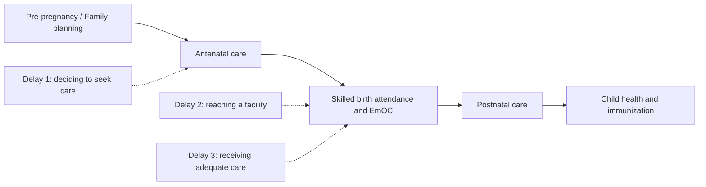

## Maternal and Child Health Interventions

### Scope and Rationale for Targeted Intervention

Maternal and child health (MCH) occupies a distinct position in health economics because it concentrates a disproportionate share of preventable mortality and morbidity into a narrow, well-defined biological window (pregnancy through early childhood), where a relatively small set of well-established, low-cost clinical interventions have demonstrated large and consistently replicated effects. This combination — high preventable burden plus high intervention cost-effectiveness — makes MCH one of the most extensively studied and prioritized areas within global health investment and development economics, and it interacts directly with the human capital formation channels discussed in nutrition/stunting and health-development linkages.

The economic case for MCH prioritization typically rests on three distinct arguments: (1) direct cost-effectiveness (many MCH interventions rank among the lowest cost-per-DALY-averted in global health), (2) intergenerational human capital externalities (maternal and early childhood health status determines lifetime cognitive and productive capacity, as covered in the stunting/human capital literature), and (3) equity considerations (MCH burden concentrates heavily among the poorest households and in high-fertility, high-mortality settings).

### The Continuum of Care Framework

The dominant organizing framework in MCH policy is the **continuum of care**, which emphasizes that maternal, newborn, and child health outcomes are causally linked across sequential life stages rather than independent targets, and that intervention effectiveness depends on continuity across this sequence rather than isolated point interventions:

- **Pre-pregnancy and family planning**: contraceptive access and birth spacing
- **Antenatal care (ANC)**: at least four (WHO now recommends eight) contact visits during pregnancy for risk screening, tetanus vaccination, malaria prophylaxis where relevant, and nutritional counseling/supplementation
- **Intrapartum care (labor and delivery)**: skilled birth attendance and access to emergency obstetric care
- **Postnatal care**: for both mother and newborn in the critical first days and weeks
- **Child health and immunization**: through the first years of life

The continuum-of-care concept is used analytically to explain why interventions targeting only one stage (e.g., improving delivery-room care without improving antenatal risk screening) often show attenuated impact relative to integrated packages — most maternal and neonatal deaths cluster around the intrapartum period and first 48 hours postpartum, meaning gaps immediately before or after delivery undermine returns to investment elsewhere in the continuum.

### Key Intervention Categories and Evidence Base

**Skilled birth attendance and emergency obstetric care**: presence of a trained provider (physician, nurse, or midwife) at delivery, combined with access to basic and comprehensive emergency obstetric care (EmOC) for managing complications (hemorrhage, obstructed labor, eclampsia, sepsis), is consistently identified in the literature as the single most consequential lever for reducing maternal mortality, since the majority of maternal deaths result from complications that are survivable with timely, competent intervention but rapidly fatal without it. Cross-country evidence robustly associates skilled birth attendance rates with maternal mortality ratios, though as with other cross-sectional health-outcome associations, some of this correlation reflects broader health-system and socioeconomic development rather than the isolated causal effect of birth attendance alone.

**Immunization**: routine childhood immunization (against measles, diphtheria, pertussis, tetanus, polio, and an expanding set of additional antigens including pneumococcal and rotavirus vaccines) is among the most extensively evaluated and consistently cost-effective public health interventions in the global health literature, with strong experimental and quasi-experimental evidence of mortality reduction, and generates positive externalities through herd immunity that provide a standard public-economics rationale (positive consumption externality, free-rider risk) for public subsidization or provision beyond simple private willingness to pay.

**Oral rehydration therapy (ORT) and management of childhood illness**: ORT for diarrheal disease management is a canonical example of a very low-cost, high-impact intervention in the global health economics literature, and its scale-up is credited with substantial historical reductions in diarrheal mortality; the **Integrated Management of Childhood Illness (IMCI)** framework subsequently generalized this approach into a standardized protocol-based algorithm for community and primary-care-level diagnosis and treatment of the leading causes of child mortality (pneumonia, diarrhea, malaria, malnutrition, measles) using simplified clinical decision rules deliverable by lower-cadre health workers.

**Kangaroo mother care (KMC)**: skin-to-skin contact and exclusive breastfeeding support for low-birth-weight and preterm infants, used as a low-cost, low-technology alternative or complement to incubator care in settings with limited neonatal intensive care capacity; the evidence base (including Cochrane systematic reviews) generally supports reduced mortality and morbidity for stable low-birth-weight infants relative to conventional care in resource-constrained settings.

**Family planning and birth spacing**: access to modern contraception reduces maternal mortality directly (by reducing the number of pregnancies exposed to obstetric risk, including unsafe abortion where legal access is restricted) and indirectly through birth-spacing effects on both maternal and child health outcomes — short inter-pregnancy intervals are associated with elevated risks of preterm birth, low birth weight, and maternal complications in the epidemiological literature. Family planning access also connects directly to the demographic transition and fertility-quality trade-off mechanisms discussed under health-development linkages.

**Nutritional interventions during pregnancy and lactation**: iron-folic acid supplementation, calcium supplementation (in populations with low dietary calcium intake, associated with reduced pre-eclampsia risk), and balanced energy-protein supplementation for undernourished pregnant women, feeding into the same early-life nutritional pathway discussed extensively in the stunting and human capital literature.

**Prevention of mother-to-child transmission (PMTCT) of HIV**: antiretroviral prophylaxis or treatment for HIV-positive pregnant women and their infants, one of the most dramatically successful vertical MCH interventions in the global health record, having reduced mother-to-child HIV transmission rates from a substantial baseline share of exposed infants to a small residual share in settings with high PMTCT program coverage.

### Economic Evaluation and Cost-Effectiveness Evidence

MCH interventions are disproportionately represented among the most cost-effective interventions identified in global cost-effectiveness compendia (such as the Disease Control Priorities project), a finding attributed to several structural features:

- Many core MCH interventions (ORT, immunization, basic antenatal screening) require low-cost commodities and can be delivered by lower-cadre health workers or through community-based platforms, keeping delivery cost per beneficiary low
- The DALY burden averted per case treated is large, because MCH conditions disproportionately affect young people with a large number of expected remaining life-years, mechanically producing large DALY-averted values per death or disability prevented under the standard DALY calculation
- Several MCH interventions exhibit strong complementarities (e.g., ANC visits serve as a platform for immunization, nutrition counseling, and referral simultaneously), lowering the marginal cost of bundling additional interventions onto an existing contact point — a rationale frequently invoked for integrated service delivery platform design

[Inference] While the broad conclusion that MCH interventions are highly cost-effective is well-supported across many independent analyses, specific cost-per-DALY figures vary substantially by country context, delivery platform, and baseline coverage level, so single point estimates from cost-effectiveness literature should be treated as context-dependent rather than universal constants.

### Demand-Side Interventions: Conditional Cash Transfers and Vouchers

Beyond supply-side service provision, a substantial evaluation literature addresses demand-side barriers to MCH service utilization (cost, opportunity cost of time, information gaps, intra-household bargaining constraints on women's health-seeking autonomy):

- **Conditional cash transfer (CCT) programs**: cash transfers conditioned on health-related behaviors (attending antenatal visits, completing child immunization schedules, well-child growth monitoring visits), most extensively studied through Latin American programs (Mexico's Oportunidades/Prospera, Brazil's Bolsa Família) and increasingly evaluated in African and Asian contexts. The evaluation literature generally finds CCTs increase targeted service utilization, with more mixed evidence on translating utilization increases into improved final health outcomes (as opposed to intermediate process indicators), reflecting the standard evaluation distinction between coverage/utilization effects and health-status effects.
- **Voucher schemes**: targeted subsidies (often for safe delivery services or specific commodities like insecticide-treated bed nets) redeemable at accredited public or private facilities, used to address financial access barriers while preserving some consumer choice across providers; evaluation evidence generally supports increased utilization of the targeted service, with more limited evidence on longer-run health outcome effects.
- **Results-based financing directed at MCH indicators**: as discussed in the broader health systems literature, performance-based payment schemes frequently use MCH indicators (institutional delivery rates, immunization completion) as target metrics, given their measurability and policy salience.

### Structural and Health-System Determinants of MCH Outcomes

**The "three delays" model**: a widely used conceptual framework for analyzing maternal mortality specifically identifies three sequential points of delay contributing to preventable death: (1) delay in deciding to seek care (driven by knowledge gaps, cost concerns, or household decision-making constraints), (2) delay in reaching a health facility (driven by transport infrastructure and geographic distance), and (3) delay in receiving adequate care once at the facility (driven by health workforce, supply, and facility-quality constraints). This framework is used to diagnose which specific intervention type (demand-side information/incentive programs, transport/referral system investment, or facility-quality/emergency obstetric care investment) is likely to be most binding in a given context, rather than assuming a single universal intervention priority.

**Women's autonomy and intra-household bargaining**: a body of literature within development economics links MCH service utilization to women's relative bargaining power within the household (influenced by factors such as female education, asset ownership, and labor market participation), building on the broader intra-household resource allocation literature — women with greater bargaining power are generally found in this literature to direct more household resources toward child health and nutrition, though the precise causal mechanisms and magnitude vary by context and study design.

**Urban-rural and wealth-based inequities**: MCH service coverage indicators (antenatal care attendance, skilled birth attendance, immunization completion) consistently show pronounced wealth-quintile and urban-rural gradients within countries in Demographic and Health Survey data, motivating the equity-explicit design of many MCH programs (geographic targeting, means-tested subsidies) as distinct from purely average-coverage-maximizing program design.

### Illustrative Diagram: Continuum of Care and the Three Delays Framework

### Illustrative Diagram: MCH Cost-Effectiveness Positioning (svg_diagram)

<svg xmlns="http://www.w3.org/2000/svg" viewBox="0 0 480 320">
<text x="240" y="24" text-anchor="middle" font-size="15" font-weight="bold" fill="#1a1a1a">Cost-Effectiveness Comparison (svg_diagram)</text>
<line x1="70" y1="270" x2="440" y2="270" stroke="#333" stroke-width="1.5" />
<line x1="70" y1="270" x2="70" y2="50" stroke="#333" stroke-width="1.5" />
<text x="255" y="298" text-anchor="middle" font-size="12" fill="#333">Cost per beneficiary</text>
<text x="30" y="160" text-anchor="middle" font-size="12" fill="#333" transform="rotate(-90 30 160)">DALYs averted per case</text>
<circle cx="120" cy="90" r="8" fill="#2563eb" />
<text x="135" y="85" font-size="10" fill="#333">Immunization</text>
<circle cx="150" cy="120" r="8" fill="#16a34a" />
<text x="165" y="115" font-size="10" fill="#333">Oral rehydration therapy</text>
<circle cx="220" cy="150" r="8" fill="#f59e0b" />
<text x="235" y="145" font-size="10" fill="#333">Antenatal care package</text>
<circle cx="320" cy="100" r="8" fill="#dc2626" />
<text x="335" y="95" font-size="10" fill="#333">Emergency obstetric care</text>
<circle cx="380" cy="220" r="8" fill="#7c3aed" />
<text x="330" y="240" font-size="10" fill="#333">Neonatal intensive care</text>
</svg>

### Key Points

- The continuum-of-care framework emphasizes that MCH outcomes depend on continuity across pregnancy, delivery, and early childhood, and that isolated single-stage interventions typically show attenuated impact relative to integrated packages
- Skilled birth attendance combined with access to emergency obstetric care is the most consistently identified lever for maternal mortality reduction, since most maternal deaths are survivable complications given timely competent care
- Core MCH interventions (immunization, ORT, IMCI-protocol case management) are disproportionately represented among the most cost-effective global health interventions, driven by low delivery cost, large averted DALYs per case, and strong complementarities across a single contact platform
- Demand-side interventions (conditional cash transfers, vouchers) generally show robust effects on service utilization but more mixed evidence on translating utilization gains into final health-status outcomes
- The "three delays" framework provides a structured diagnostic for identifying whether demand-side, transport/access, or facility-quality constraints are the binding barrier in a given context, rather than assuming a universal single intervention priority
- Women's intra-household bargaining power is empirically linked to MCH resource allocation and utilization, connecting this topic to the broader intra-household allocation literature in development economics

**Related Topics**

- Disease burden in developing countries
- Health systems in low-income settings
- Nutrition, stunting, and human capital formation
- Health and economic development linkages
- Conditional cash transfer programs and human capital investment
- Intra-household bargaining and resource allocation models
- Family planning, fertility, and the demographic transition
- Cost-effectiveness analysis and Disease Control Priorities methodology
- HIV/AIDS prevention and mother-to-child transmission programs
- Community health worker program design and evaluation