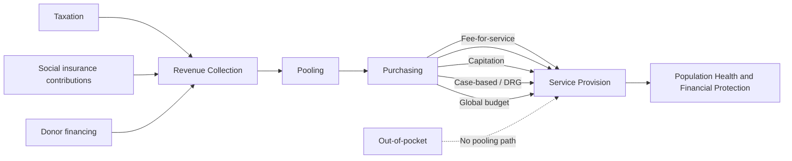

## Health Insurance and Financing Mechanisms

### Conceptual Foundations: Why Health Insurance Markets Are Distinctive

Health insurance markets are a canonical application of information economics because they combine two classic sources of market failure — adverse selection and moral hazard — with unusually severe intensity relative to most other insurance lines, due to the private, evolving, and partially self-known nature of health risk. This makes health financing design a first-order topic in health economics generally, and a particularly acute policy problem in low- and middle-income settings where regulatory and administrative capacity to correct these failures is often weaker.

**Adverse selection** (Akerlof's "market for lemons" logic, formalized for insurance by Rothschild and Stiglitz): if insurers cannot fully observe individual health risk, and individuals have better private information about their own risk than insurers do, high-risk individuals disproportionately select into insurance (or into more generous plans) at a given premium, pushing the pool's average cost above what the premium was priced for. This can generate an unraveling dynamic — insurers raise premiums in response, low-risk individuals exit, average risk rises further — potentially collapsing the voluntary insurance market entirely in the absence of corrective mechanisms.

**Moral hazard**: once insured, individuals face a lower marginal price for healthcare consumption at the point of use, which economic theory predicts increases utilization beyond the level that would occur under the true marginal cost — this is *ex post* moral hazard (overconsumption of already-needed care, or consumption of low-value care) and is distinguished in some treatments from *ex ante* moral hazard (reduced preventive effort because insurance cushions the financial consequence of illness). The RAND Health Insurance Experiment remains the most influential empirical demonstration that cost-sharing (deductibles, coinsurance) measurably reduces utilization, establishing the empirical basis for demand-side cost-sharing as a standard (though welfare-ambiguous, since some deterred utilization is genuinely low-value while some is not) policy tool.

**Provider-side moral hazard and supplier-induced demand**: a related but distinct concern is that information asymmetry between provider and patient (the patient typically cannot independently verify whether a recommended test or treatment is medically necessary) allows providers, particularly under fee-for-service payment, to induce demand beyond the clinically optimal level — a concern central to provider payment mechanism design (see below).

### The Financing Function Decomposed

The WHO health financing framework decomposes financing into three analytically distinct functions, each with its own design choices and market failure considerations:

1. **Revenue collection/mobilization**: how funds are raised — general taxation, payroll-based social health insurance contributions, private insurance premiums, out-of-pocket payment, or external donor financing
2. **Pooling**: how collected funds are aggregated across individuals to spread financial risk — ranging from no pooling (pure out-of-pocket) to large national risk pools
3. **Purchasing/strategic purchasing**: how pooled funds are used to pay providers for services — encompassing both *what* is purchased (the covered benefits package) and *how* providers are paid (the payment mechanism)

This three-function decomposition is useful analytically because a health system can score very differently across the three dimensions — for instance, a system might mobilize revenue efficiently but pool it in small, fragmented risk pools that undermine cross-subsidization from healthy to sick and rich to poor.

### Financing Models: A Comparative Typology

| Model | Revenue source | Pooling mechanism | Canonical examples | Key design tension |
| --- | --- | --- | --- | --- |
| Tax-financed (Beveridge-type) | General taxation | National pool, typically government-administered | UK NHS, many low-income countries' public systems | Requires strong fiscal/tax administration capacity; access not directly tied to contribution |
| Social health insurance (Bismarck-type) | Payroll-based mandatory contributions | Sickness funds or national insurer, often multiple competing or non-competing funds | Germany, Japan, South Korea | Weak in economies with large informal-sector employment, since payroll contributions require formal wage employment to collect |
| Private voluntary insurance | Individual or employer-paid premiums | Risk pools defined by insurer/plan, often risk-rated | US employer-based system (historically), supplementary private insurance in mixed systems | Prone to adverse selection and risk segmentation absent regulation (mandates, community rating, risk adjustment) |
| Community-based health insurance (CBHI) | Voluntary community-level premiums, often subsidized | Small, localized risk pools | Rwanda's Mutuelles de Santé and similar Sub-Saharan African schemes | Small pool size limits actuarial viability; adverse selection risk from voluntary enrollment |
| Out-of-pocket (no pooling) | Direct payment at point of service | None | Dominant residual financing mode in many low-income settings absent other coverage | No risk protection; drives catastrophic expenditure and medical impoverishment |

[Inference] Most real-world health systems are hybrids across several of these categories rather than pure types — for example, many middle-income countries combine a tax-financed safety net for the poor and informal sector with contributory social insurance for formal-sector workers, a structural split that itself generates well-documented equity and labor-market-distortion concerns (see informal sector interaction below).

### The Informal-Sector Constraint in Low-Income Settings

A structural feature distinguishing low-income-country health financing design from high-income-country design is the limited applicability of payroll-based social health insurance, given that a large share (often the majority) of the workforce is informally employed and thus outside any payroll contribution mechanism:

- This has motivated the widespread adoption of **voluntary contributory schemes for the informal sector** (frequently CBHI-type, as discussed in the health systems entry), generally with limited enrollment and retention absent substantial government subsidy
- It also motivates debate over the appropriate balance between contributory financing (social insurance, tying entitlement to payment) and non-contributory, tax-financed coverage for informal and poor populations — several countries (e.g., Thailand's Universal Coverage Scheme, Ghana's National Health Insurance Scheme) have moved toward substantially tax-subsidized coverage extension to informal-sector and poor populations specifically because contributory approaches proved insufficient to achieve meaningful population coverage in this segment
- The dual contributory/non-contributory structure that results in many countries can create equity concerns and fragmentation if benefit packages, provider networks, or quality differ systematically between the formal-sector-insured and the subsidized/informal-sector-covered populations

### Provider Payment Mechanisms

How pooled funds are transferred to providers is a central lever shaping both efficiency and quality, with each mechanism carrying characteristic incentive distortions:

- **Fee-for-service (FFS)**: providers paid per service delivered; creates incentive for supplier-induced demand and volume maximization, but preserves incentive to see patients and deliver indicated care (unlike some alternative mechanisms)
- **Capitation**: providers paid a fixed amount per enrolled patient per period, regardless of services delivered; shifts financial risk to the provider, creating incentive to control costs and potentially under-provide care (particularly for costly patients), motivating risk-adjustment of capitation payments in more sophisticated systems
- **Case-based/diagnosis-related group (DRG) payment**: fixed payment per case/episode based on diagnosis category, intended to balance the incentive structures of FFS and capitation by rewarding efficient within-episode care while still linking payment to a defined clinical event
- **Global budgets**: a fixed total budget allocated to a facility or region over a period, common for hospital-level payment in many public systems; strong cost-control incentive but weak direct incentive to expand service volume or improve individual patient outcomes absent complementary quality-monitoring mechanisms
- **Results-based/performance-based financing (RBF/PBF)**: payment tied to verified outputs (as discussed under health systems in low-income settings), used increasingly in low-income contexts as an overlay on other base payment mechanisms specifically to counteract under-provision incentives inherent in capitation or global budget systems

[Inference] No single payment mechanism dominates across all objectives (cost control, quality, access, administrative simplicity); most systems use blended payment models combining elements of several mechanisms, and the optimal blend is context-dependent on administrative capacity to monitor and adjust for the distortions each mechanism introduces.

### Risk Adjustment and Risk Equalization

Where multiple insurers or pools coexist within a system (as under social health insurance with multiple sickness funds, or regulated private insurance markets), **risk adjustment** mechanisms transfer funds from pools with healthier-than-average enrollees to pools with sicker-than-average enrollees, based on observable risk factors (age, sex, diagnosed chronic conditions), to remove insurers' incentive to compete on risk selection ("cherry-picking" healthy enrollees) rather than on efficiency or quality. This is a standard regulatory tool in mature multi-payer systems but is less commonly implemented in low-income settings, where the number of distinct competing risk pools is typically smaller and administrative capacity for sophisticated risk-adjustment formulas is more constrained.

### Benefit Package Design and Priority Setting

Strategic purchasing requires defining which services are covered — the benefits package — a decision with direct efficiency and equity implications given resource constraints in low-income systems:

- **Explicit priority-setting frameworks**: increasingly, health systems use cost-effectiveness analysis (cost per DALY averted, as discussed under maternal and child health interventions) combined with equity and budget-impact considerations to explicitly determine which interventions are included in a publicly financed benefits package, rather than allowing implicit rationing through provider discretion or informal payment
- **Essential health services packages**: many low-income countries define a minimum guaranteed package (often emphasizing primary health care, maternal and child health, and communicable disease control, reflecting both cost-effectiveness rankings and equity/burden concentration) as the initial target for universal coverage expansion, with progressive expansion of the package as fiscal space permits — the standard sequencing logic embedded in the UHC framework's "service coverage" dimension

### Illustrative Diagram: Health Financing Functions and Flows

### Illustrative Diagram: Adverse Selection Unraveling Dynamic (svg_diagram)

<svg xmlns="http://www.w3.org/2000/svg" viewBox="0 0 480 320">
<text x="240" y="24" text-anchor="middle" font-size="15" font-weight="bold" fill="#1a1a1a">Adverse Selection Death Spiral (svg_diagram)</text>
<rect x="60" y="60" width="140" height="60" rx="8" fill="#eff6ff" stroke="#2563eb" stroke-width="1.5" />
<text x="130" y="95" text-anchor="middle" font-size="11" fill="#1e3a8a">Premium set at</text>
<text x="130" y="110" text-anchor="middle" font-size="11" fill="#1e3a8a">average pool risk</text>
<path d="M 200 90 L 260 90" stroke="#555" stroke-width="1.5" marker-end="url(#arrow2)" />
<rect x="260" y="60" width="160" height="60" rx="8" fill="#fef2f2" stroke="#dc2626" stroke-width="1.5" />
<text x="340" y="85" text-anchor="middle" font-size="11" fill="#7f1d1d">Low-risk individuals</text>
<text x="340" y="100" text-anchor="middle" font-size="11" fill="#7f1d1d">exit voluntary pool</text>
<path d="M 340 120 L 340 160" stroke="#555" stroke-width="1.5" marker-end="url(#arrow2)" />
<rect x="260" y="160" width="160" height="60" rx="8" fill="#fef2f2" stroke="#dc2626" stroke-width="1.5" />
<text x="340" y="185" text-anchor="middle" font-size="11" fill="#7f1d1d">Average pool risk rises,</text>
<text x="340" y="200" text-anchor="middle" font-size="11" fill="#7f1d1d">premium increases</text>
<path d="M 260 190 L 200 190" stroke="#555" stroke-width="1.5" marker-end="url(#arrow2)" />
<rect x="60" y="160" width="140" height="60" rx="8" fill="#fef3c7" stroke="#d97706" stroke-width="1.5" />
<text x="130" y="185" text-anchor="middle" font-size="11" fill="#92400e">Pool shrinks toward</text>
<text x="130" y="200" text-anchor="middle" font-size="11" fill="#92400e">only highest-risk enrollees</text>
</svg>

### Key Points

- Health insurance markets are shaped by unusually severe adverse selection and moral hazard problems, motivating regulatory correction mechanisms (mandates, risk adjustment, cost-sharing) largely absent in unregulated voluntary insurance
- The three-function decomposition (revenue collection, pooling, purchasing) is the standard analytical lens for diagnosing where a given health financing system is underperforming, since strong performance on one function does not imply strong performance on the others
- Low-income settings face a structural constraint largely absent in high-income system design: large informal-sector employment limits the reach of payroll-based social health insurance, motivating voluntary informal-sector schemes (typically limited in scale) and a growing shift toward tax-subsidized non-contributory coverage extension
- Provider payment mechanism choice (fee-for-service, capitation, case-based, global budget, RBF) is not neutral with respect to incentives, and each carries a characteristic distortion risk that must be actively managed rather than eliminated
- Explicit benefit-package priority setting, grounded in cost-effectiveness analysis, is increasingly used to make politically and fiscally difficult rationing decisions transparent rather than leaving them to implicit provider discretion or informal payment
- Most real-world financing systems are hybrids across the stylized typology, and hybrid contributory/non-contributory structures can themselves generate equity and fragmentation concerns if benefit levels or quality diverge across the different covered populations

**Related Topics**

- Health systems in low-income settings
- Disease burden in developing countries
- Universal Health Coverage and the coverage cube framework
- Adverse selection and the Rothschild-Stiglitz insurance model
- Moral hazard and the RAND Health Insurance Experiment
- Informal sector labor markets and social protection design
- Cost-effectiveness analysis and priority-setting in health policy
- Results-based and performance-based financing mechanisms
- Fiscal capacity and taxation in developing economies
- Catastrophic health expenditure and medical poverty traps