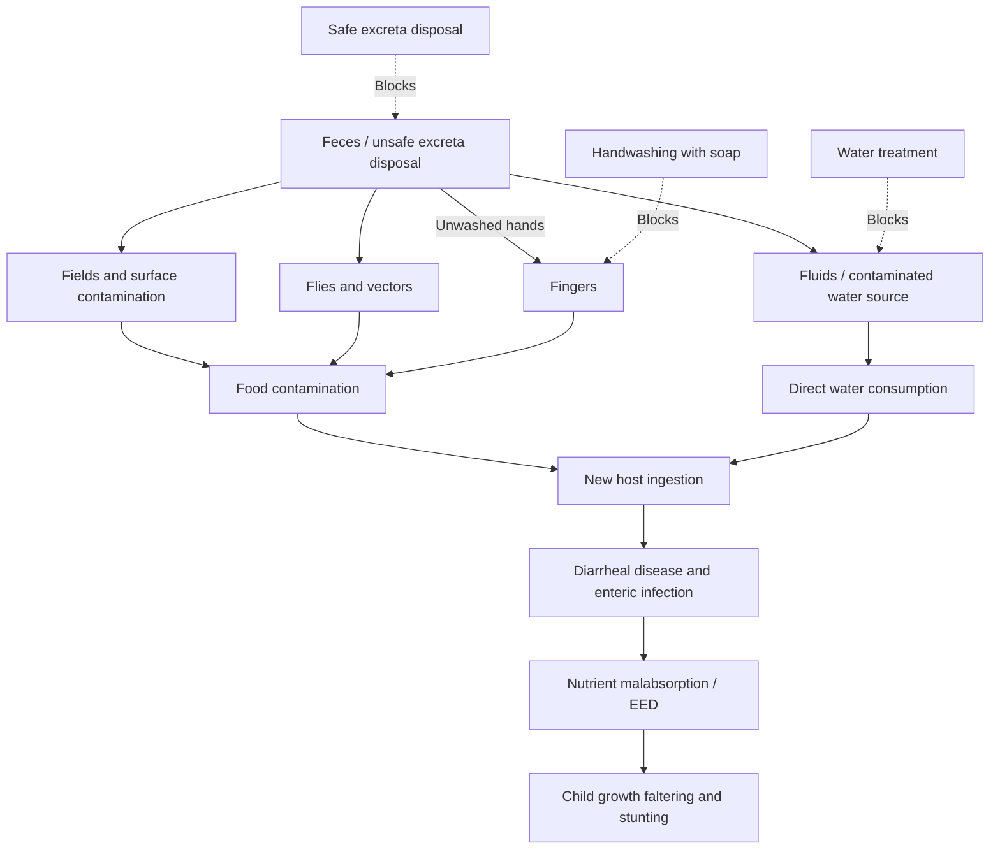

## Sanitation and Water Access

### Definition and Measurement Framework

Water, sanitation, and hygiene (WASH) access is measured through a standardized service-ladder framework maintained by the WHO/UNICEF Joint Monitoring Programme (JMP), which classifies household access along ordinal categories rather than a simple binary access/no-access measure:

**Drinking water service ladder**: *safely managed* (accessible on premises, available when needed, free from contamination) > *basic* (improved source, collection time under 30 minutes round trip) > *limited* (improved source, over 30 minutes) > *unimproved* (unprotected well or spring) > *surface water* (direct collection from rivers, ponds, lakes)

**Sanitation service ladder**: *safely managed* (improved facility, not shared, excreta safely disposed in situ or treated off-site) > *basic* (improved facility, not shared with other households) > *limited* (improved facility, shared) > *unimproved* (pit latrine without a slab, hanging latrine) > *open defecation*

This ladder structure matters analytically because aggregate "improved water/sanitation access" statistics historically used in the Millennium Development Goals era masked substantial heterogeneity in service quality and reliability that the safely-managed category is designed to capture, and because progress on eliminating open defecation (the bottom rung) is a distinct policy problem from upgrading from basic to safely managed service (the upper rungs), requiring different intervention types.

### Theoretical Channels Linking WASH to Health and Development

**The fecal-oral disease transmission pathway**: inadequate sanitation and contaminated water are the primary transmission routes for a cluster of diarrheal and enteric pathogens; the standard "F-diagram" used in public health (Fluids, Fields, Flies, Fingers, Food, Feces) organizes the multiple environmental transmission pathways by which fecal pathogens reach a new host, and is used to identify which specific WASH intervention (safe excreta disposal, handwashing, safe water storage, food hygiene) interrupts which specific transmission route — a framework important because a single WASH intervention addressing only one pathway (e.g., a protected water source) may leave other transmission routes (e.g., open defecation contaminating fields, or poor handwashing) fully intact, potentially explaining why some single-intervention WASH trials show weaker effects than a naive read of the underlying disease biology would predict.

**Environmental enteric dysfunction (EED) and the nutrition-WASH interaction**: as discussed in the nutrition and stunting literature, chronic subclinical intestinal inflammation from repeated fecal pathogen exposure in poor-sanitation environments is hypothesized to impair nutrient absorption even without overt diarrheal illness, providing the biological rationale for combining WASH and nutritional interventions rather than treating them as substitutes.

**Human capital and time-use channels**: unsafe or distant water sources impose a direct time cost of water collection, disproportionately borne by women and girls in most studied contexts, with documented opportunity costs for school attendance (particularly for girls) and for women's labor market participation and income-generating activity time. Poor school sanitation facilities are separately documented in the education economics literature as a barrier to school attendance, particularly for menstruating adolescent girls, connecting WASH investment to the human capital and gender-gap-in-education literatures.

**Externalities and the public-good character of sanitation**: sanitation exhibits a distinctive negative-externality structure — an individual household's open defecation or unsafe excreta disposal imposes disease risk on neighboring households through shared water sources, shared land, and vector transmission, meaning individual sanitation investment decisions do not internalize the full social benefit of improved sanitation. This externality structure is the standard economic rationale for public subsidization or community-level intervention design (as opposed to relying purely on private household willingness-to-pay), and is central to the design logic of community-level sanitation programs discussed below.

### Empirical Evidence Base: RCTs and the "Replication Gap" Debate

WASH is one of the most extensively studied intervention areas in the development RCT literature, and also one where the gap between epidemiological plausibility and randomized trial effect sizes has generated significant methodological debate:

**Landmark multi-country WASH RCTs**: several large, well-powered cluster-randomized trials (notably the WASH Benefits trials in Kenya and Bangladesh, and the SHINE trial in Zimbabwe) tested combined water, sanitation, handwashing, and/or nutrition interventions against child growth (linear growth/stunting) and, in some arms, child diarrhea and cognitive development outcomes. [Inference] A widely discussed and somewhat unresolved finding across this cluster of major trials is that combined WASH interventions frequently produced smaller effects on child linear growth than many researchers and funders had expected based on prior observational and biological plausibility arguments, though effects on diarrheal disease incidence were in some trials more consistent with expectations; this divergence between disease-incidence and growth-outcome effects has motivated ongoing investigation into whether effect sizes were attenuated by imperfect intervention compliance/uptake, insufficient intervention intensity or duration, background sanitation conditions in control communities, or a genuinely more limited causal role of WASH-specific pathways in growth faltering relative to other contributing factors (dietary quality, disease burden from non-fecal-oral pathogens) than earlier evidence suggested.

- This debate is analytically important beyond the specific trials themselves, since it illustrates a broader methodological point in development economics: strong biological plausibility and observational correlation do not always translate into detectable causal effects at the scale and intensity deliverable through a real-world program, and well-powered RCTs can meaningfully update prior beliefs derived from correlational or smaller-scale evidence.

**Community-Led Total Sanitation (CLTS)**: a widely adopted behavior-change approach to eliminating open defecation, distinct from subsidized latrine construction, which uses facilitated community-level processes (often involving mapping open defecation sites and triggering collective disgust/shame responses) to generate a bottom-up community decision to become "open defecation free," with households typically self-financing latrine construction rather than receiving direct hardware subsidies. [Inference] The evaluation literature on CLTS finds it can be effective at increasing latrine coverage and reducing open defecation, particularly given the externality/collective-action rationale for a community-level rather than purely household-level approach, but evidence on health outcome impacts (versus latrine coverage/behavior change per se) is more mixed, and sustained long-run usage (as opposed to initial construction) has been identified as a recurring implementation challenge in several evaluated programs.

**Water quality interventions and point-of-use treatment**: chlorination and other point-of-use water treatment technologies have been extensively studied, with a body of evidence (including work associated with Michael Kremer and coauthors) generally finding that provision of free or low-cost chlorine dispensers at shared water points, combined with take-up-promoting design features, can achieve meaningfully higher sustained usage than approaches relying on household purchase of treatment products, illustrating a broader finding in the health-product-adoption literature that even small positive prices or convenience frictions can substantially depress take-up of health-protective products relative to their apparent health benefit — a pattern also documented for bed nets and other preventive health commodities.

### Willingness-to-Pay and the Subsidy Debate

A recurring policy and research debate concerns whether WASH products and infrastructure (water connections, latrines, water treatment products) should be provided free, subsidized, or sold at full cost recovery price, paralleling a broader debate in the health-product literature (also relevant to insecticide-treated bed nets):

- **Free/heavily subsidized provision** arguments emphasize the positive externality rationale (sanitation's public-good character), evidence that even modest prices substantially depress adoption of health-protective products among poor households (motivating concern about underinvestment relative to the social optimum if pricing is left to unsubsidized markets), and equity considerations given WASH access gaps are concentrated among the poorest households
- **Cost-recovery/willingness-to-pay-based pricing** arguments emphasize that some payment can improve targeting toward genuinely valued and used products (screening out low-value uptake), can support program financial sustainability absent continued donor subsidy, and that psychological ownership from payment may improve maintenance and sustained usage relative to free distribution — though the empirical evidence for this "sunk cost" behavioral argument specifically in the WASH context is more contested than the adoption-suppression evidence for pricing
- [Inference] The literature has not converged on a single universal answer, and the CLTS model's emphasis on community-triggered household self-financing for latrines, contrasted with the general finding favoring free or low-cost provision for water treatment products, illustrates that the optimal subsidy design plausibly differs by product type (durable household infrastructure with strong private benefit and externality from neighbors' behavior, versus a recurring-cost consumable requiring sustained behavioral compliance) rather than a single subsidy rule applying uniformly across the WASH sector

### Infrastructure Investment and Urban-Rural Divergence

**Piped water and sewerage network economics**: urban water and sanitation infrastructure (piped networks, centralized treatment) exhibits substantial economies of scale and network characteristics similar to other utility infrastructure, motivating public provision or regulated utility models in most systems; rural and peri-urban areas, where network economics are less favorable given lower population density, rely more heavily on decentralized solutions (boreholes, protected wells, on-site sanitation such as pit latrines or septic systems), which the JMP service-ladder framework is specifically designed to capture and compare against networked alternatives.

**Rapid urbanization and informal settlement challenges**: rapid, often unplanned urban growth in many developing-country cities has outpaced formal utility network expansion, producing large populations in informal settlements dependent on unimproved or shared facilities, water vendors at high per-unit prices relative to piped water (a well-documented "poverty penalty" in water pricing, where poor households without network access often pay substantially more per liter than wealthier households with piped connections), and elevated disease transmission risk from high-density unimproved sanitation.

**Climate change and water stress interaction**: [Inference] Rising water scarcity and increasing rainfall variability associated with climate change are increasingly identified in the sector literature as compounding factors affecting the reliability and sustainability of both existing and planned water infrastructure investment in many developing regions, though the precise magnitude of climate-attributable versus other drivers of water stress in any specific location involves modeling uncertainty beyond the scope of a single universal estimate.

### Illustrative Diagram: WASH Transmission Pathways and Intervention Points (F-Diagram Logic)

### Illustrative Diagram: WASH Service Ladder (svg_diagram)

<svg xmlns="http://www.w3.org/2000/svg" viewBox="0 0 480 320">
<text x="240" y="24" text-anchor="middle" font-size="15" font-weight="bold" fill="#1a1a1a">Sanitation Service Ladder (svg_diagram)</text>
<rect x="140" y="60" width="200" height="40" fill="#16a34a" opacity="0.85" />
<text x="240" y="85" text-anchor="middle" font-size="12" fill="white">Safely managed</text>
<rect x="140" y="105" width="200" height="40" fill="#65a30d" opacity="0.85" />
<text x="240" y="130" text-anchor="middle" font-size="12" fill="white">Basic</text>
<rect x="140" y="150" width="200" height="40" fill="#eab308" opacity="0.85" />
<text x="240" y="175" text-anchor="middle" font-size="12" fill="white">Limited (shared)</text>
<rect x="140" y="195" width="200" height="40" fill="#f97316" opacity="0.85" />
<text x="240" y="220" text-anchor="middle" font-size="12" fill="white">Unimproved</text>
<rect x="140" y="240" width="200" height="40" fill="#dc2626" opacity="0.85" />
<text x="240" y="265" text-anchor="middle" font-size="12" fill="white">Open defecation</text>
<text x="240" y="295" text-anchor="middle" font-size="11" fill="#333">Progressive improvement (JMP ladder, top to bottom)</text>
</svg>

### Key Points

- The WHO/UNICEF JMP service ladder framework replaces a simple binary access measure with graded categories (safely managed, basic, limited, unimproved, open defecation/surface water), reflecting that service quality and reliability vary substantially even among nominally "improved" sources
- The F-diagram organizes multiple fecal-oral transmission pathways, explaining why single-channel WASH interventions may leave other transmission routes open and show weaker effects than the underlying disease biology alone would suggest
- Large recent multi-country WASH RCTs (WASH Benefits, SHINE) found smaller-than-expected effects on child linear growth despite stronger biological plausibility, generating an active and only partially resolved methodological debate about intervention intensity, compliance, and the relative causal weight of WASH versus other stunting drivers
- Sanitation's externality structure (individual open defecation imposes disease risk on neighbors) provides the standard economic rationale for community-level intervention approaches such as CLTS, rather than relying solely on individual household willingness-to-pay
- Even small positive prices meaningfully suppress adoption of health-protective WASH products, a pattern consistent with the broader health-product-adoption literature (also documented for bed nets), though the optimal subsidy level appears to differ by product type rather than following a single universal rule
- Time costs of water collection and inadequate school sanitation connect WASH access directly to gender gaps in education and women's labor force participation, linking this topic to the human capital and gender-and-development literatures

**Related Topics**

- Nutrition, stunting, and human capital formation
- Disease burden in developing countries
- Health and economic development linkages
- Randomized controlled trials in development economics methodology
- Public goods, externalities, and collective action problems
- Gender gaps in education and time-use economics
- Health product adoption and behavioral economics of prevention
- Urban infrastructure economics and informal settlements
- Higher education and skills mismatch
- Climate change adaptation and water resource economics