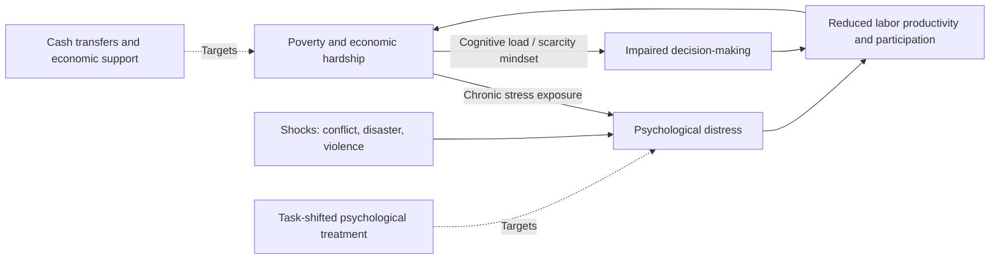

## Mental Health in Development Contexts

### Definition and Scope in the Development Economics Literature

Mental health in development economics is studied as both an outcome affected by economic conditions (poverty, shocks, conflict) and as a determinant of economic outcomes (labor productivity, decision-making capacity, human capital investment) — a bidirectional structure analogous to the general health-income relationship but with distinctive measurement and identification challenges specific to psychological states. The field draws on epidemiology, clinical psychology, and economics, and has grown substantially as a distinct research area within development economics over roughly the past two decades, alongside the broader Global Burden of Disease documentation of mental and substance use disorders as a major and historically underweighted contributor to global disability burden.

### Measurement Challenges

Mental health measurement in development contexts faces several challenges distinct from most physical health metrics used elsewhere in this chapter:

- **Screening instrument validity across cultural contexts**: standardized screening tools (e.g., the Patient Health Questionnaire-9 for depressive symptoms, the General Health Questionnaire) were predominantly developed and validated in high-income, Western clinical populations; their psychometric validity, cultural equivalence, and appropriate diagnostic thresholds in different low- and middle-income country contexts is an active area of methodological research, and cross-cultural comparability of screening-based prevalence estimates should be treated with more caution than comparable physical health metrics
- **Distinguishing distress from disorder**: development economics research frequently measures psychological distress or subjective wellbeing (continuous scales capturing symptom severity) rather than clinical diagnosis, which is a methodologically pragmatic choice for survey-based research but means many "mental health" findings in the economics literature speak to population distress levels rather than diagnosed disorder prevalence — an important distinction when interpreting reported effect sizes
- **Self-report bias and stigma**: social desirability bias and stigma around mental illness, which varies substantially by cultural context, can affect self-reported symptom disclosure in ways that are difficult to fully correct for in survey design

### Theoretical Channels: Poverty and Mental Health

The literature identifies a bidirectional relationship between poverty and mental health distinct from the general health-income relationship discussed elsewhere in this chapter:

**Poverty → mental health (the "social causation" channel)**: economic hardship, food insecurity, unstable housing, and chronic financial strain are hypothesized and empirically associated with elevated psychological distress, through mechanisms including chronic stress exposure, reduced control over life circumstances, and exposure to associated adverse conditions (violence, family instability) that correlate with poverty.

**Mental health → poverty (the "social selection" or "drift" channel, and the productivity channel)**: psychological distress and mental illness can impair labor market participation and productivity, and — a mechanism receiving particular attention in the behavioral development economics literature — can affect economic decision-making capacity itself. A body of work associated with Mullainathan and Shafir's "scarcity" framework argues that poverty-induced cognitive load (the mental bandwidth consumed by financial stress and constant trade-off calculation) can itself impair decision-making and forward planning, creating a channel through which poverty and psychological/cognitive strain reinforce each other independent of, though related to, clinically defined mental illness. [Inference] The scarcity/bandwidth framework has been influential in the field but individual empirical studies within this literature (including some widely cited cognitive-load experiments) have faced replication and interpretation debate, so its specific quantitative claims should be treated as an active research area rather than uniformly settled.

**The vicious cycle framing**: these two channels combined generate a proposed poverty-mental health vicious cycle, structurally analogous to the poverty-disease cycle discussed under disease burden, motivating interest in mental health interventions as a potential lever for breaking broader poverty traps, though establishing this specific causal loop empirically (as opposed to each channel considered separately) requires research designs capable of addressing bidirectional causality, which remains a live methodological challenge.

### Prevalence and Burden Estimates

Global Burden of Disease estimates consistently identify mental and substance use disorders (particularly depressive and anxiety disorders) as a leading contributor to years lived with disability (YLD) globally, though — reflecting the measurement challenges noted above — cross-country prevalence comparisons in this domain carry more estimation uncertainty than for most physical health conditions, and the "treatment gap" (the share of people with a diagnosable disorder who receive no formal treatment) is documented as very large in most low- and middle-income country contexts, reflecting both severe health workforce constraints (very low ratios of psychiatrists and trained mental health specialists per capita in many low-income countries) and under-detection within general health services.

### Mental Health Consequences of Specific Development-Relevant Shocks

**Conflict and displacement**: populations exposed to armed conflict, forced displacement, and refugee status show elevated prevalence of psychological distress and trauma-related symptoms in the epidemiological literature, motivating a substantial applied research and humanitarian-programming literature on mental health and psychosocial support (MHPSS) interventions in conflict-affected and refugee settings, often integrated into broader humanitarian response programming.

**Natural disasters and climate shocks**: exposure to natural disasters, and a growing research literature on climate-related stressors (drought exposure affecting agricultural livelihoods, for instance), is associated with elevated psychological distress in affected populations, an area of increasing research interest given projected climate change impacts in agriculture-dependent developing economies.

**Economic shocks and unemployment**: job loss and income shocks are associated with elevated psychological distress in both high-income and developing-country studies, consistent with the broader poverty-mental health social causation channel, though the specific magnitude and duration of these effects vary across study contexts.

**Gender-based violence**: exposure to intimate partner violence and other forms of gender-based violence is robustly associated with elevated depression and anxiety symptom prevalence in the global health literature, an intersection increasingly studied jointly with the economics of intra-household bargaining and women's economic empowerment programming.

### Intervention Evidence: Task-Shifted Psychological Treatment

Given severe specialist mental health workforce shortages in most low- and middle-income countries, a substantial and increasingly well-developed evaluation literature has tested **task-shifted psychological interventions** — structured, manualized psychological treatments (frequently adapted cognitive-behavioral therapy or interpersonal therapy protocols) delivered by trained lay counselors or community health workers rather than specialist mental health professionals, under supervision structures analogous to task-shifting approaches used elsewhere in low-resource health systems (see health systems in low-income settings).

- Several influential randomized controlled trials (including early foundational work in South Asia on lay-counselor-delivered treatment for depression, and subsequent trials across multiple LMIC settings) have found meaningful reductions in depressive symptom severity from these task-shifted interventions relative to usual care, contributing to a growing evidence base supporting the feasibility of scaling psychological treatment delivery without relying on scarce specialist capacity
- The **World Health Organization's Mental Health Gap Action Programme (mhGAP)** provides a standardized intervention guide designed to support integration of basic mental health screening and management into non-specialist primary care settings, reflecting the broader task-shifting and primary-care-integration logic applied elsewhere in low-income health system design
- [Inference] While this evidence base has grown substantially and is more developed than a decade ago, the number of rigorously evaluated interventions remains considerably smaller than for many physical health interventions discussed elsewhere in this chapter, and generalizability of specific program effects across different cultural and health-system contexts remains an area requiring context-specific evaluation rather than assumed transferability

### Economic Evaluation and Cross-Sectoral Interest

Mental health interventions have drawn growing interest from development economists partly because of documented interactions with core development economics interventions:

- Some evaluations of anti-poverty programs (cash transfers, livelihood/economic empowerment programs) have included mental health or psychological wellbeing as secondary outcomes, with a body of evidence generally finding cash transfer programs associated with reduced psychological distress among recipients, plausibly operating through the poverty-mental health social causation channel discussed above, though effect sizes and consistency vary across the specific programs and contexts studied
- Conversely, there is growing research interest in whether psychological/mental health interventions can improve economic outcomes (labor supply, decision-making, program take-up) as a secondary benefit, an active but comparatively newer area of inquiry relative to the more established cash-transfer-to-mental-health direction
- [Inference] This cross-sectoral evidence base, while growing, is still considerably thinner than the long-established literatures on nutrition-education linkages or health-productivity linkages discussed elsewhere in this chapter, and specific claims about mental health interventions' downstream economic returns should be treated as an emerging rather than mature area of the literature

### Illustrative Diagram: Poverty-Mental Health Bidirectional Channels

### Key Points

- Mental health measurement in development contexts faces distinctive cross-cultural validity and self-report challenges not present to the same degree for most physical health metrics used elsewhere in this chapter
- A bidirectional poverty-mental health relationship is proposed in the literature (social causation and social selection/productivity channels), structurally analogous to the general poverty-disease cycle, though establishing the specific causal loop empirically remains methodologically challenging
- The scarcity/cognitive-bandwidth framework linking poverty to impaired decision-making has been influential but includes specific studies subject to ongoing replication debate, warranting caution about precise quantitative claims
- Task-shifted psychological treatment delivered by trained lay counselors is a well-evidenced response to severe specialist workforce shortages, with a growing but still comparatively limited RCT base relative to physical health interventions
- The treatment gap for diagnosable mental disorders is documented as very large in most low- and middle-income settings, reflecting both workforce constraints and under-detection in general health services
- Cross-sectoral evidence linking mental health to core development interventions (cash transfers, livelihood programs) is a genuinely growing but still comparatively early-stage area of the literature

**Related Topics**

- Disease burden in developing countries
- Health systems in low-income settings
- Behavioral economics of poverty and scarcity
- Conditional cash transfer programs and wellbeing outcomes
- Conflict, displacement, and humanitarian economics
- Gender-based violence and intra-household bargaining
- Task-shifting and human resources for health economics
- Climate shocks and livelihood economics
- Subjective wellbeing measurement in development economics
- Randomized controlled trials in health intervention evaluation