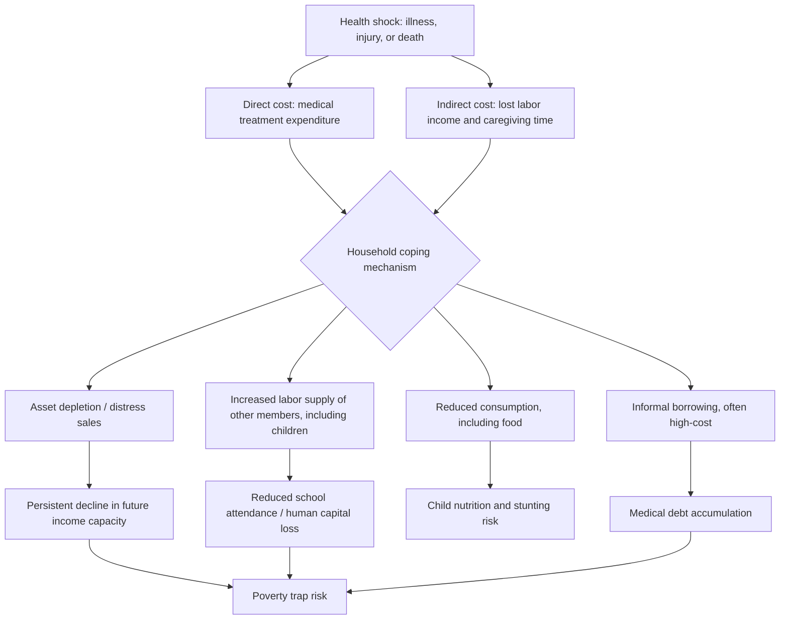

## Health Shocks and Household Welfare

### Definition and Conceptual Placement

A health shock refers to an unanticipated adverse health event — acute illness, injury, disability onset, or death of a household member — that generates both direct costs (medical treatment expenditure) and indirect costs (lost labor income, caregiving time diversion) at the household level. This topic sits within the broader household risk and vulnerability literature in development economics, but is treated as analytically distinct from other shock types (weather, price shocks) because of a set of structural features specific to health risk: health shocks are typically less spatially covariate than weather shocks (illness in one household does not directly predict illness in a neighboring household to the same degree a drought does), which has significant implications for which risk-coping mechanisms are theoretically available and empirically observed, as discussed below.

### Theoretical Framework: Risk-Coping and the Consumption-Smoothing Literature

The dominant theoretical lens is the household risk-coping and consumption-smoothing literature, which asks whether households can maintain stable consumption in the face of income shocks despite incomplete insurance and credit markets — a question with a specific and heavily tested sub-literature applied to health shocks:

**Full risk-sharing / complete markets benchmark**: under the theoretical benchmark of complete insurance markets (formalized in tests following Townsend's classic risk-sharing framework), household consumption should respond only to aggregate (village- or community-wide) shocks and not at all to idiosyncratic shocks affecting only that household, since idiosyncratic risk would be fully diversified away through informal or formal insurance mechanisms. Health shocks provide one of the most-used empirical testing grounds for this hypothesis, because they are relatively idiosyncratic (household-specific) shocks that are also plausibly exogenous to the household's own economic choices (conditional on some controls), addressing a key identification concern in this literature.

**Empirical rejection of full insurance**: a large empirical literature, beginning prominently with studies in rural India, Indonesia, and other developing-country contexts, consistently rejects the full risk-sharing hypothesis specifically with respect to major illness shocks — household consumption (and specific consumption categories, particularly non-medical consumption) falls measurably following a major illness or death of a working-age household member, indicating health shocks are not fully insured against through whatever informal or formal mechanisms are locally available. This is one of the more robust empirical regularities in the household risk literature and has been replicated across many country contexts using panel household survey data.

**Why health shocks are harder to insure than other risks**: the literature identifies several features that make health-specific risk especially difficult to insure through standard informal mechanisms (interhousehold transfers, reciprocal gift/loan networks) relative to other idiosyncratic shocks:

- **Severity and cost uncertainty**: major illness episodes can generate very large and unpredictable treatment costs relative to typical household income, exceeding what informal transfer networks (calibrated more around smaller, more frequent shocks) can typically absorb
- **Correlated timing of income loss and expenditure need**: a health shock to a working-age household member simultaneously reduces household labor income (the affected member cannot work, and often a caregiver's labor is also diverted) and increases expenditure need (treatment costs), a "double hit" not shared by many other shock types where the income loss and the extra expenditure need are less directly coincident
- **Duration and chronicity**: chronic or recurring health conditions generate repeated shocks rather than a single one-time cost, straining reciprocal informal insurance arrangements that function better for one-off, reciprocated transfers
- **Asymmetric information and moral hazard concerns limiting formal insurance**: as discussed under health insurance and financing mechanisms, adverse selection and moral hazard concerns limit the development of formal health insurance markets, particularly in the absence of regulatory correction mechanisms, leaving many households in low-income settings without formal insurance to fall back on

### Coping Mechanisms and Their Welfare Consequences

Given incomplete formal insurance, the empirical literature documents several coping mechanisms households use in response to health shocks, several of which carry adverse longer-run welfare consequences beyond the immediate consumption smoothing they achieve:

**Asset depletion and distress sales**: households frequently liquidate productive assets (livestock, land, tools) or savings to cover treatment costs and offset lost income, which smooths current consumption but can permanently reduce future income-generating capacity — a mechanism through which a transitory health shock can generate a persistent decline in household welfare, connecting this literature directly to poverty trap models where a sufficiently severe shock pushes a household below a threshold from which recovery to the pre-shock trajectory is not automatic.

**Borrowing, often at high cost**: informal borrowing (from moneylenders, relatives, or shopkeepers) is a commonly documented response, and in settings with poorly developed formal credit markets this borrowing frequently carries high interest costs or unfavorable terms, contributing to the broader "medical debt trap" phenomenon documented across multiple country contexts.

**Labor supply adjustments**: households frequently increase labor supply of other (unaffected) household members, including — a mechanism receiving particular research attention — increased child labor and reduced school attendance among children in affected households, directly connecting health shocks to the human capital and schooling literatures discussed elsewhere in this chapter; some studies also document added-worker effects among adult women in response to a male household head's health shock.

**Migration**: in some contexts, health shocks (particularly shocks reducing the earning capacity of a primary income earner) are documented as a driver of subsequent household member migration in search of alternative income sources, though the direction of this relationship (health shocks driving migration decisions versus migration itself sometimes generating health risk) requires careful contextual interpretation.

**Reduced non-health consumption, including food**: several studies document reductions specifically in food consumption and other basic consumption categories following major illness shocks, raising direct concern for nutritional status of other household members (particularly children) even when the shock itself affected only one household member — a mechanism linking this topic to the nutrition and human capital literature through an indirect, income-shock channel distinct from the direct nutrition-disease interaction discussed there.

### Medical Impoverishment and Catastrophic Health Expenditure

As introduced under health systems in low-income settings, health shocks are a primary driver of two related but distinct welfare-measurement concepts extensively used in the health financing literature:

- **Catastrophic health expenditure**: out-of-pocket health spending exceeding a defined threshold share of household total or non-food expenditure (commonly 10% or 25%), used as an indicator of financial burden independent of whether the household is pushed into poverty
- **Medical impoverishment**: households pushed below an absolute or relative poverty line specifically as a result of health spending, calculated by comparing pre- and post-health-expenditure consumption or income against a poverty threshold — this measure directly links health shock exposure to poverty dynamics and is tracked as a core indicator in the joint World Bank/WHO Universal Health Coverage monitoring framework

The magnitude of medical impoverishment in a given country is a direct function of the health financing architecture discussed under health insurance and financing mechanisms — greater reliance on out-of-pocket payment (versus pooled, pre-paid financing) mechanically increases both catastrophic expenditure incidence and medical impoverishment for a given underlying disease burden and treatment-seeking pattern, which is part of the core economic rationale for the pooled-financing and universal-coverage policy agenda.

### Mortality Shocks: A Distinct Sub-Case

The death of a working-age household member (as opposed to illness alone) constitutes a particularly severe form of health shock studied as a distinct case in the literature, given the permanent loss of the deceased member's labor income and human capital, combined in many contexts with substantial funeral expenditure that itself can rival or exceed medical treatment costs incurred prior to death:

- **The HIV/AIDS mortality literature**: a substantial body of research, concentrated on high-HIV-prevalence Sub-Saharan African contexts during the epidemic's peak, specifically studied the household welfare consequences of prime-age adult mortality, documenting effects on surviving children's schooling and nutritional outcomes, asset depletion, and household composition changes (including increased prevalence of orphan-headed and grandparent-headed households), connecting this sub-literature directly to the broader health-and-development-linkages literature on HIV/AIDS's macroeconomic and human capital impact
- **Funeral costs as a distinct expenditure shock**: in several studied contexts, funeral and related ceremonial expenditure has been documented as a substantial and sometimes underappreciated component of the total financial shock associated with a household death, adding to (rather than substituting for) prior medical expenditure

### Policy and Design Implications

The consumption-smoothing failure evidence directly motivates several policy responses studied elsewhere in this chapter and in the broader social protection literature:

- **Health insurance and risk pooling** (covered under health insurance and financing mechanisms) directly addresses the core market failure identified in this literature — the absence of adequate formal insurance against health-specific idiosyncratic risk
- **Social protection and safety net programs** (cash transfers, public works programs) are in some contexts explicitly designed or evaluated with attention to their role in helping households cope with health shocks specifically, alongside their broader poverty-reduction objectives
- **Health financing reform toward pooled, pre-paid mechanisms** reduces the point-of-service financial burden that drives both catastrophic expenditure and the asset-depletion/borrowing coping responses documented in this literature, providing a direct empirical link between the household welfare evidence discussed here and the macro-level financing architecture debates covered elsewhere in this chapter

### Illustrative Diagram: Health Shock Transmission to Household Welfare

### Illustrative Diagram: Full Risk-Sharing Test Logic (svg_diagram)

<svg xmlns="http://www.w3.org/2000/svg" viewBox="0 0 480 300">
<text x="240" y="24" text-anchor="middle" font-size="15" font-weight="bold" fill="#1a1a1a">Testing Full Risk-Sharing (svg_diagram)</text>
<line x1="60" y1="250" x2="440" y2="250" stroke="#333" stroke-width="1.5" />
<line x1="60" y1="250" x2="60" y2="50" stroke="#333" stroke-width="1.5" />
<text x="250" y="278" text-anchor="middle" font-size="12" fill="#333">Time</text>
<text x="24" y="150" text-anchor="middle" font-size="12" fill="#333" transform="rotate(-90 24 150)">Household consumption</text>
<line x1="60" y1="120" x2="440" y2="120" stroke="#16a34a" stroke-width="2.5" stroke-dasharray="6,4" />
<text x="330" y="112" font-size="11" fill="#16a34a">Predicted under full insurance (flat)</text>
<path d="M 60 120 L 200 120 L 210 200 L 260 190 L 300 170 L 440 160" fill="none" stroke="#dc2626" stroke-width="2.5" />
<text x="270" y="220" font-size="11" fill="#dc2626">Observed: drop at health shock</text>
<line x1="210" y1="60" x2="210" y2="250" stroke="#555" stroke-width="1" stroke-dasharray="3,3" />
<text x="215" y="55" font-size="10" fill="#555">Health shock occurs</text>
</svg>

### Key Points

- Health shocks are a canonical, heavily used empirical testing ground for the full risk-sharing hypothesis, and the literature robustly rejects full insurance — consumption measurably falls following major illness or death of a household member across many studied contexts
- Health shocks are structurally harder to informally insure than many other idiosyncratic shocks because of their size unpredictability, the coincident timing of income loss and expenditure need, and their potential chronicity
- Coping mechanisms (asset depletion, high-cost borrowing, child labor increases, reduced food consumption) achieve some consumption smoothing but frequently carry adverse longer-run consequences, providing a direct empirical link between transitory health shocks and persistent poverty-trap dynamics
- Catastrophic health expenditure and medical impoverishment are the standard measurement concepts linking health shock exposure to poverty outcomes, and both are mechanically driven by the underlying health financing architecture (out-of-pocket reliance versus pooled financing)
- Mortality shocks, particularly in the HIV/AIDS mortality literature, constitute a distinct and more severe sub-case, with documented effects on children's schooling and nutrition, household composition, and asset depletion, compounded in many contexts by substantial funeral expenditure

**Related Topics**

- Health insurance and financing mechanisms
- Health systems in low-income settings
- Disease burden in developing countries
- Poverty traps and vicious cycle models in development economics
- Consumption smoothing and informal risk-sharing networks (Townsend risk-sharing tests)
- Child labor and household economic decision-making
- Nutrition, stunting, and human capital formation
- HIV/AIDS and macroeconomic impact in Sub-Saharan Africa
- Social protection and safety net program design
- Catastrophic health expenditure and medical poverty traps