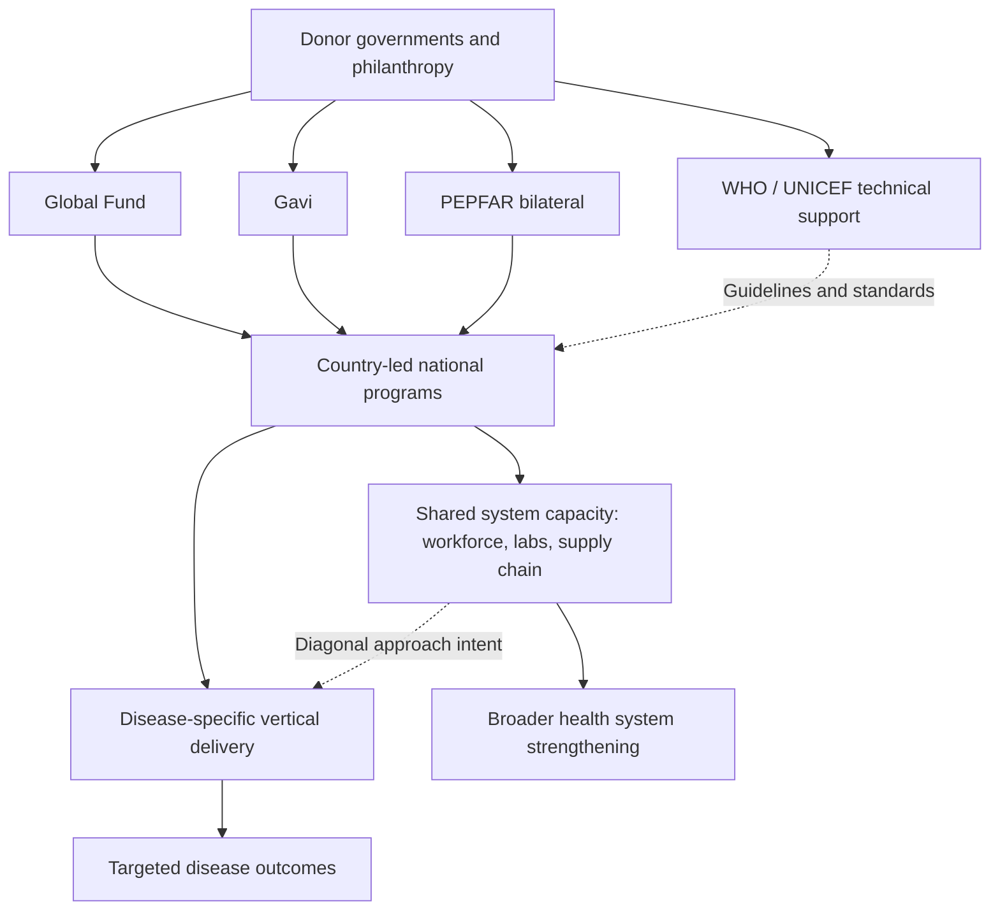

## Global Health Initiatives and Aid Effectiveness

### Definition and Scope

Global health initiatives (GHIs) refer to the large, often disease-specific multilateral and bilateral financing and program mechanisms that channel development assistance for health (DAH) from donor countries and private philanthropy to recipient-country health programs. This topic sits at the intersection of health economics and the broader foreign aid effectiveness literature in development economics, inheriting both the general methodological debates about aid effectiveness (fungibility, conditionality, institutional effects) and health-sector-specific design questions (vertical versus horizontal program architecture, disease prioritization, sustainability).

### Major Institutional Architecture

**The Global Fund to Fight AIDS, Tuberculosis and Malaria**: established in 2002 as a multilateral financing mechanism (not an implementing agency itself) that pools donor contributions and disburses grants to country-led programs against the three named diseases, using a country-ownership model in which national coordinating mechanisms (typically multi-stakeholder bodies including government, civil society, and affected communities) develop funding proposals for Global Fund review and financing.

**Gavi, the Vaccine Alliance**: established in 2000 as a public-private partnership (bringing together WHO, UNICEF, the World Bank, vaccine manufacturers, and donor and implementing country governments) focused specifically on expanding childhood immunization coverage in low-income countries, notable for its co-financing model requiring recipient countries to contribute an increasing domestic share of vaccine costs over time as a graduation mechanism toward full domestic financing, and for its market-shaping role in negotiating lower vaccine prices for low-income markets through pooled procurement and demand guarantees.

**PEPFAR (U.S. President's Emergency Plan for AIDS Relief)**: a large bilateral U.S. government program launched in 2003, historically one of the largest single-country bilateral global health investments, focused predominantly on HIV/AIDS treatment, prevention, and care, operating through both direct bilateral channels and as a major contributor to the Global Fund.

**WHO and multilateral technical agencies**: distinct from the financing-focused GHIs above, WHO, UNICEF, and related UN agencies play primarily normative, technical-guidance, and coordination roles (setting clinical guidelines, disease classification standards, and health system frameworks referenced throughout this chapter) alongside more limited direct program financing relative to the major GHIs.

**Major philanthropic actors**: private foundations, most prominently the Bill & Melinda Gates Foundation, have become major global health financing and agenda-setting actors, particularly influential in vaccine-related research and development financing, disease eradication campaigns (notably polio), and in shaping the broader global health research and metrics agenda (including substantial funding for the Global Burden of Disease study infrastructure).

### The Vertical-Horizontal Design Debate Revisited

As introduced under health systems in low-income settings, the dominant structural critique of major GHIs concerns their characteristically vertical, disease-specific design:

- **Case for vertical financing**: disease-specific GHIs can demonstrate clear, measurable, attributable results (a compelling case for a specific funding stream to donors and legislatures), achieve rapid scale-up through dedicated management and supply chains insulated from broader health system weaknesses, and maintain strong accountability linking funding to specific health outcomes
- **Case against, and the fragmentation critique**: critics argue that parallel vertical program structures (separate supply chains, separate reporting systems, separate often better-paid staff recruited away from general health system roles) can fragment scarce health workforce and management capacity, crowd out attention and resources for health needs outside the funded verticals (including the rising NCD burden discussed under disease burden in developing countries), and create sustainability risk if a program's core functions (drug procurement, monitoring systems) are never integrated into resilient domestic health system infrastructure
- **The "diagonal" approach as an attempted synthesis**: exemplified conceptually by shifts in some Global Fund and Gavi program design toward explicitly using disease-specific financing to strengthen shared underlying system capacity (health workforce training, laboratory systems, supply chain and information systems) that benefits the broader health system beyond the targeted disease — a design response directly to the fragmentation critique, though [Inference] the extent to which diagonal-design commitments are realized in actual program implementation, versus remaining largely vertical in practice despite diagonal framing in program documents, is a recurring point of contention in the sector's own self-evaluation literature

### Empirical Evidence on GHI Effectiveness

**Disease-specific outcome evidence**: the strongest and most consistently documented evidence of GHI effectiveness concerns the specific targeted disease outcomes — substantial, well-documented increases in access to antiretroviral therapy, malaria bed net and treatment coverage, tuberculosis case detection and treatment, and childhood immunization coverage in recipient countries are attributed in large part to Global Fund, PEPFAR, and Gavi financing, and correspond to the substantial documented declines in HIV/AIDS, tuberculosis, and malaria-attributable disease burden and mortality discussed under disease burden in developing countries.

**Health system spillover evidence — more contested**: evidence on whether GHI investment strengthens or weakens the broader health system beyond the targeted disease is considerably more mixed and methodologically contested than the disease-specific outcome evidence. [Inference] Some studies and program evaluations document positive spillovers (e.g., laboratory and supply chain infrastructure built for HIV programs subsequently used for other conditions, health worker training with generalizable skills), while others document the fragmentation and workforce-diversion concerns noted above; the balance of evidence appears highly context- and program-specific rather than supporting a single universal conclusion in either direction, and this remains an active area of health systems research rather than a settled question.

### General Foreign Aid Effectiveness Debates Applied to Health

The broader development economics aid effectiveness literature contributes several conceptual tools and controversies directly relevant to global health financing specifically:

**Aid fungibility**: a standard concern in the aid effectiveness literature is that earmarked aid for a specific purpose (e.g., a health-sector-specific grant) may simply free up domestic government resources previously allocated to that purpose for reallocation elsewhere in the budget, meaning the marginal effect of the aid on total health spending can be smaller than the nominal grant amount if fungibility is substantial — an empirical question studied through examining whether domestic health budget allocations shift in response to inflows of earmarked health aid, with mixed findings across country studies regarding the degree of fungibility observed.

**The Easterly-Sachs style macro debate**: the broader foreign aid literature contains a long-standing and unresolved debate, associated prominently with the contrasting positions of William Easterly (skeptical of large-scale, centrally planned aid effectiveness, emphasizing accountability and feedback-mechanism weaknesses) and Jeffrey Sachs (advocating substantially scaled-up aid investment to escape poverty traps, associated with the Millennium Villages Project and similar large-scale integrated intervention models) regarding whether large aid inflows generically improve development outcomes at the macro level. [Inference] This macro-level debate has been highly influential in shaping global health financing discourse but has not been definitively resolved by the empirical aid-growth literature, which has generally struggled to identify robust, generalizable causal effects of aggregate aid flows on macroeconomic growth, in contrast to the more robust micro-level evidence available for specific, well-evaluated health interventions discussed throughout this chapter.

**Conditionality design**: aid effectiveness research distinguishes between different conditionality structures (ex ante policy conditions attached to disbursement, versus results-based or output-based conditionality tied to verified performance), with results-based financing approaches (discussed under health systems in low-income settings) representing a health-sector-specific application of the broader shift in aid effectiveness thinking toward output/results-based rather than pure input or policy-conditionality models.

**Donor coordination and transaction costs**: fragmentation among multiple donors and initiatives operating in a single recipient country's health sector, each with distinct reporting requirements, procurement rules, and priority-setting processes, is documented in the aid effectiveness literature (echoing the Paris Declaration and Busan Partnership frameworks on aid effectiveness principles more broadly) as imposing substantial administrative burden and coordination costs on recipient-country health ministries, a concern that predates but applies directly to the proliferation of health-specific GHIs.

### Country Ownership and Domestic Resource Mobilization

A recurring design principle across contemporary GHI architecture is an explicit transition pathway from donor dependence toward domestic financing:

- **Gavi's co-financing and graduation model**: requires increasing domestic government contribution to vaccine costs as a country's income rises, with a formal graduation process removing eligibility once a country crosses defined income thresholds, explicitly designed to build in a sustainability transition from the outset rather than assuming indefinite donor financing
- **Domestic resource mobilization emphasis**: reflecting broader global health financing policy discourse (including WHO and World Bank advocacy), there is increasing emphasis on strengthening recipient-country domestic tax capacity and health budget allocation as the ultimately necessary foundation for sustainable UHC progress, with donor financing conceptualized as bridging or catalytic rather than a permanent substitute for domestic financing capacity
- **Sustainability risk from graduation and funding volatility**: [Inference] a body of program evaluation and policy analysis literature raises concern about service disruption risk when countries graduate from GHI eligibility or when donor funding levels shift for reasons unrelated to recipient-country program performance (donor-country domestic political and fiscal considerations), a structural vulnerability inherent to reliance on externally determined financing that is distinct from, but interacts with, the general questions about DAH concentration in specific disease verticals discussed under disease burden in developing countries

### Illustrative Diagram: Global Health Financing Architecture

### Illustrative Diagram: Vertical vs. Diagonal Program Design (svg_diagram)

<svg xmlns="http://www.w3.org/2000/svg" viewBox="0 0 480 300">
<text x="240" y="24" text-anchor="middle" font-size="15" font-weight="bold" fill="#1a1a1a">Vertical vs Diagonal Design (svg_diagram)</text>
<rect x="40" y="60" width="180" height="200" fill="#eff6ff" stroke="#2563eb" stroke-width="1.5" />
<text x="130" y="85" text-anchor="middle" font-size="12" font-weight="bold" fill="#1e3a8a">Vertical Program</text>
<rect x="60" y="100" width="140" height="30" fill="#93c5fd" />
<text x="130" y="120" text-anchor="middle" font-size="10" fill="#1e3a8a">Dedicated supply chain</text>
<rect x="60" y="140" width="140" height="30" fill="#93c5fd" />
<text x="130" y="160" text-anchor="middle" font-size="10" fill="#1e3a8a">Dedicated staff</text>
<rect x="60" y="180" width="140" height="30" fill="#93c5fd" />
<text x="130" y="200" text-anchor="middle" font-size="10" fill="#1e3a8a">Dedicated M&amp;E system</text>
<text x="130" y="240" text-anchor="middle" font-size="10" fill="#555">Fast, accountable, isolated</text>
<rect x="260" y="60" width="180" height="200" fill="#fef3c7" stroke="#d97706" stroke-width="1.5" />
<text x="350" y="85" text-anchor="middle" font-size="12" font-weight="bold" fill="#92400e">Diagonal Program</text>
<rect x="280" y="100" width="140" height="30" fill="#fde68a" />
<text x="350" y="120" text-anchor="middle" font-size="10" fill="#92400e">Shared supply chain</text>
<rect x="280" y="140" width="140" height="30" fill="#fde68a" />
<text x="350" y="160" text-anchor="middle" font-size="10" fill="#92400e">Trained general workforce</text>
<rect x="280" y="180" width="140" height="30" fill="#fde68a" />
<text x="350" y="200" text-anchor="middle" font-size="10" fill="#92400e">Integrated HMIS</text>
<text x="350" y="240" text-anchor="middle" font-size="10" fill="#555">Slower, spillover benefits</text>
</svg>

### Key Points

- The major global health initiatives (Global Fund, Gavi, PEPFAR) exhibit strong, well-documented effectiveness on their specific targeted disease outcomes, corresponding to the large declines in HIV/AIDS, tuberculosis, and malaria burden discussed under disease burden in developing countries
- Evidence on broader health-system spillover effects (positive or negative) from vertical GHI investment is considerably more contested than disease-specific outcome evidence, and appears highly context- and program-dependent rather than resolved in either direction
- The general foreign aid effectiveness literature contributes directly relevant conceptual tools (fungibility, conditionality design, donor coordination costs) and an unresolved macro-level debate (Easterly-Sachs) about aggregate aid effectiveness, distinct from the more robust micro-evidence base for specific well-evaluated interventions
- Contemporary GHI design increasingly builds in explicit sustainability and domestic-financing transition mechanisms (Gavi's co-financing and graduation model), reflecting recognition that donor financing is intended as catalytic rather than permanent
- Funding volatility and graduation-driven service disruption represent a structural sustainability risk inherent to reliance on externally determined financing, distinct from but related to the broader DAH allocation concerns raised under the rising NCD burden discussion

**Related Topics**

- Disease burden in developing countries
- Health systems in low-income settings
- Health insurance and financing mechanisms
- Foreign aid effectiveness and the Easterly-Sachs debate
- Results-based and performance-based financing mechanisms
- Universal Health Coverage and domestic resource mobilization
- HIV/AIDS and macroeconomic impact in Sub-Saharan Africa
- Vaccine markets, pooled procurement, and market-shaping mechanisms
- Health and economic development linkages
- Institutions and aid conditionality in development economics