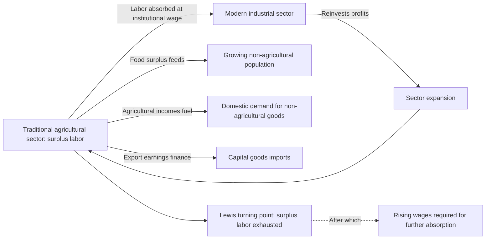

## Role of Agriculture in Structural Transformation

### Definition and Conceptual Framework

Structural transformation refers to the long-run reallocation of economic activity — output, employment, and population — away from agriculture and toward industry and services, typically accompanied by rural-to-urban migration and rising labor productivity across all sectors. It is one of the most robust empirical regularities in the development economics literature, observed across virtually every historical case of sustained economic growth, and agriculture's specific role within this process — as both a sector that shrinks in relative importance and a sector that must perform certain functions to enable the transformation of the rest of the economy — is a central and long-studied topic in agricultural and development economics.

### Historical Stylized Facts

Cross-country and historical time-series evidence establishes several robust patterns central to this literature:

- **Declining agricultural output share**: agriculture's share of GDP falls systematically as per-capita income rises, a pattern so consistent across countries and time periods that it is treated as one of the most robust stylized facts in growth and development economics (documented extensively in cross-country work following Kuznets and Chenery)
- **Declining but stickier agricultural employment share**: agriculture's share of total employment also falls with rising income, but typically lags the decline in its output share — meaning agricultural labor productivity (output per worker) tends to be lower than non-agricultural labor productivity for an extended period during the transition, a persistent cross-country productivity gap that itself has generated substantial research attention (discussed below)
- **Non-monotonic relationship with urbanization**: as agricultural employment share falls, urbanization rises, though the precise pace and relationship between these two shifts varies by country, and in some contemporary developing-country contexts urbanization has proceeded without a commensurate shift into高-productivity urban formal employment, generating "urbanization without industrialization" concerns discussed under premature deindustrialization below

### Theoretical Foundations: Dual-Economy Models

**The Lewis model (1954)**: the foundational formal framework for this literature posits a dual economy consisting of a traditional agricultural sector with surplus labor (labor whose marginal product is at or near zero, or below the prevailing subsistence/institutional wage) and a modern capitalist industrial sector. Structural transformation occurs as the modern sector absorbs surplus agricultural labor at a roughly constant institutionally-determined wage (set at a premium above rural subsistence income), reinvesting profits to expand further, until the surplus labor pool is exhausted — the point conventionally termed the **Lewis turning point**, after which further labor absorption requires rising wages, since the marginal product of agricultural labor is no longer near zero.

**Critiques and refinements of the Lewis framework**: the assumption of zero or near-zero marginal product agricultural labor has been extensively critiqued and empirically tested; the **Fei-Ranis extension** formalized the model further by making agricultural surplus (both labor and the food surplus needed to feed the growing industrial workforce) a more central mechanism, since a industrial sector expanding by absorbing agricultural labor also requires the remaining, smaller agricultural workforce to generate enough food surplus to feed the growing non-agricultural population — a linkage central to the discussion of agriculture's structural role below.

**The Harris-Todaro extension**: incorporates rural-to-urban migration decisions under urban unemployment risk, modeling migration as driven by expected (rather than actual) urban-rural wage differentials, which can generate persistent urban unemployment or underemployment as an equilibrium outcome even while migration continues — a framework used to explain observed patterns of urban informal-sector growth and urban unemployment coexisting with continued rural-to-urban migration in many developing countries.

### Agriculture's Structural Functions in the Transformation Process

Beyond simply shrinking as a share of the economy, the literature (particularly following Johnston and Mellor's influential formalization of agriculture's multiple contributions) identifies several distinct functions agriculture must perform to enable structural transformation elsewhere in the economy:

- **Product/food contribution**: providing sufficient food to feed a growing non-agricultural population without triggering food price inflation that would erode urban real wages and non-agricultural competitiveness — closely related to the Fei-Ranis food-surplus mechanism above
- **Factor contribution**: releasing labor and, in some models, capital (agricultural savings) for use in the expanding non-agricultural sectors
- **Market contribution**: rural agricultural incomes constitute a domestic demand source for non-agricultural goods (particularly in the early stages of industrialization before export markets or urban demand alone are sufficient), so rising agricultural productivity and incomes can directly stimulate non-agricultural sector growth through this demand-linkage channel
- **Foreign exchange contribution**: agricultural export earnings historically financed capital goods imports needed for industrialization in many developing economies, particularly before manufactured or service exports became viable foreign exchange sources
- [Inference] The relative importance of these four channels is debated and plausibly varies by country and historical period — for instance, the foreign exchange contribution channel is generally considered to have been more critical in earlier historical industrialization episodes than in contemporary economies with more diversified potential foreign exchange sources, though this is a matter of historical interpretation rather than a precisely quantified finding

### Agricultural Productivity Growth as a Precondition

A central and empirically well-supported proposition in this literature is that rising agricultural productivity (output per worker or per hectare) is generally a precondition for, rather than merely a byproduct of, successful structural transformation, for reasons directly tied to the structural functions above:

- Without rising agricultural productivity, releasing agricultural labor to the non-agricultural sector risks reducing food output below the level needed to feed the growing urban population, absent increased food imports (which themselves require foreign exchange, often earned by the same agricultural sector, creating a potential binding constraint)
- Historical case study evidence (East Asian green revolution-era agricultural productivity growth, for instance) is frequently cited as illustrating agricultural productivity growth preceding or co-occurring with, rather than following, the most rapid phases of industrial structural transformation in several well-studied historical growth episodes, consistent with (though not definitively proving, given the observational nature of this cross-country historical evidence) the productivity-precondition hypothesis
- This has generated a long-standing (and not fully resolved) policy debate about the relative developmental priority of agricultural investment versus direct industrial-sector investment in the early stages of a country's development strategy, echoing historical debates (e.g., the "balanced growth" versus "unbalanced growth" strategy debates of early development economics) about optimal intersectoral investment sequencing

### The Agricultural-Non-Agricultural Productivity Gap

A persistent and heavily studied empirical puzzle in this literature is the observed cross-country and within-country gap between measured labor productivity in agriculture versus non-agriculture — in many developing countries, output per worker in agriculture is measured as a small fraction of output per worker in non-agriculture, a gap considerably larger than observed in developed economies:

- **Measurement/mismeasurement explanations**: a body of literature (notably associated with Gollin, Lagakos, and Waugh) argues that a substantial portion of the observed gap reflects measurement issues rather than a genuine allocative inefficiency — including unmeasured or under-measured home-consumed agricultural output, systematic differences in hours worked between sectors, differences in worker human capital/selection between sectors (if less-skilled workers disproportionately remain in agriculture), and price-index/deflator differences between rural and urban areas that are not always fully corrected for in national accounts data
- **Genuine misallocation explanations**: an alternative and not mutually exclusive strand of the literature argues that at least part of the observed gap reflects genuine labor misallocation — barriers to labor mobility (land tenure and property rights constraints tying households to farming, credit market failures preventing investment in the human or physical capital needed to transition to non-agricultural work, and information frictions about non-agricultural opportunities) that prevent labor from moving to its higher-productivity use even where such mobility would be privately and socially beneficial
- [Inference] The literature has not fully resolved the relative quantitative contribution of measurement error versus genuine misallocation to the observed gap, and the balance of evidence appears to vary depending on the specific data sources, country context, and methodological adjustments applied in a given study, making this an area where reasonable researchers continue to disagree on precise magnitudes even while agreeing the raw, unadjusted productivity gap substantially overstates the "true" allocative gap

### Premature Deindustrialization and Contemporary Divergence from Historical Patterns

A significant strand of more recent literature, associated prominently with Dani Rodrik, documents that many contemporary developing countries are exhibiting a structural transformation pattern that diverges from the historical East Asian and earlier European/North American sequence:

- **Premature deindustrialization**: manufacturing employment and output shares in many contemporary developing countries are peaking at considerably lower levels of per-capita income, and at an earlier stage of development, than occurred historically in now-developed economies or in the East Asian "miracle" economies — meaning labor is moving out of agriculture directly into services (often lower-productivity informal services) without passing through a substantial labor-absorbing manufacturing phase
- **Implications for the traditional structural transformation growth escalator**: since manufacturing has historically been viewed as possessing particularly strong unconditional productivity convergence properties (a tendency for manufacturing productivity to converge toward global frontier levels somewhat independent of broader domestic institutional quality, a finding also associated with Rodrik's work), premature deindustrialization raises concern that some contemporary developing economies may be transitioning out of agriculture without gaining full access to this particular growth-escalator mechanism, instead moving into services sectors with more heterogeneous and often weaker productivity convergence properties
- [Inference] The causes of premature deindustrialization are actively debated, with candidate explanations including globalization and increased developing-country manufacturing competition from China and other early industrializers, capital-intensive and labor-saving technical change in manufacturing reducing its labor-absorption capacity relative to historical patterns, and country-specific institutional and policy factors; no single explanation commands full consensus in the literature, and the relative importance of these channels likely varies by country and time period

### Land Institutions and Agricultural Transformation

Structural transformation's agricultural side is also shaped by land tenure and land market institutions, an area with direct interaction to labor mobility questions:

- **Land tenure security and investment incentives**: secure land tenure and well-functioning land rental and sales markets are generally argued in the literature to support both agricultural productivity investment (since farmers with secure tenure have stronger incentive to invest in land-improving practices) and labor mobility (since functioning land rental markets allow households to release labor to non-agricultural activity while retaining land-based income through rental arrangements, rather than being forced to choose between farming and complete land abandonment)
- **Land fragmentation and farm size**: in many developing-country contexts, historical and demographic pressures have produced small and fragmented landholdings, which the literature debates as both a potential constraint on agricultural productivity (via lost economies of scale in mechanization) and, in the inverse-farm-size-productivity literature, sometimes empirically associated with higher yield per hectare on smaller plots (attributed to more intensive labor application and supervision), a genuinely contested empirical relationship in agricultural economics that interacts with, but is analytically somewhat distinct from, the broader structural transformation literature

### Illustrative Diagram: Structural Transformation and the Lewis Model

### Illustrative Diagram: Sectoral Shares Over the Development Path (svg_diagram)

<svg xmlns="http://www.w3.org/2000/svg" viewBox="0 0 480 320">
<text x="240" y="24" text-anchor="middle" font-size="15" font-weight="bold" fill="#1a1a1a">Structural Transformation Path (svg_diagram)</text>
<line x1="60" y1="270" x2="440" y2="270" stroke="#333" stroke-width="1.5" />
<line x1="60" y1="270" x2="60" y2="50" stroke="#333" stroke-width="1.5" />
<text x="250" y="298" text-anchor="middle" font-size="12" fill="#333">Per-capita income (rising)</text>
<text x="24" y="160" text-anchor="middle" font-size="12" fill="#333" transform="rotate(-90 24 160)">Sector share</text>
<path d="M 60 70 Q 200 100 440 240" fill="none" stroke="#16a34a" stroke-width="2.5" />
<text x="330" y="230" font-size="11" fill="#16a34a">Agricultural output share</text>
<path d="M 60 90 Q 220 130 440 220" fill="none" stroke="#65a30d" stroke-width="2.5" stroke-dasharray="6,4" />
<text x="330" y="205" font-size="11" fill="#65a30d">Agricultural employment share (lags)</text>
<path d="M 60 260 Q 220 180 440 90" fill="none" stroke="#2563eb" stroke-width="2.5" />
<text x="330" y="100" font-size="11" fill="#2563eb">Non-agricultural output share</text>
</svg>

### Key Points

- Structural transformation — the shift of output and employment from agriculture toward industry and services — is one of the most robust empirical regularities in development economics, with agricultural employment share consistently lagging agricultural output share decline
- The Lewis dual-economy model and its Fei-Ranis and Harris-Todaro extensions remain the foundational theoretical frameworks, though the zero-marginal-product surplus labor assumption has been substantially critiqued and refined
- Agriculture performs multiple structural functions beyond simply shrinking (product/food, factor, market, and foreign exchange contributions), and rising agricultural productivity is generally treated as a precondition for, rather than merely a byproduct of, successful structural transformation
- The persistent measured agricultural-non-agricultural productivity gap reflects a debated combination of measurement issues (unmeasured home consumption, worker selection, price deflators) and genuine labor misallocation (mobility barriers, credit constraints), with the relative contribution of each not fully resolved in the literature
- Premature deindustrialization, documented prominently by Rodrik, describes many contemporary developing countries transitioning out of agriculture directly into lower-productivity services without a substantial labor-absorbing manufacturing phase, raising concern about reduced access to manufacturing's historical productivity-convergence properties
- Land tenure security and functioning land rental markets interact directly with labor mobility decisions central to the transformation process, connecting this topic to the broader land institutions literature in agricultural economics

**Related Topics**

- Agricultural productivity and the green revolution
- Land tenure systems and property rights in developing economies
- Rural-urban migration and the Harris-Todaro model
- Premature deindustrialization (Rodrik)
- Informal sector labor markets and urban underemployment
- Higher education and skills mismatch
- Health and economic development linkages
- Balanced versus unbalanced growth strategies in development economics
- Total factor productivity measurement and cross-country misallocation
- Export-oriented industrialization and foreign exchange constraints