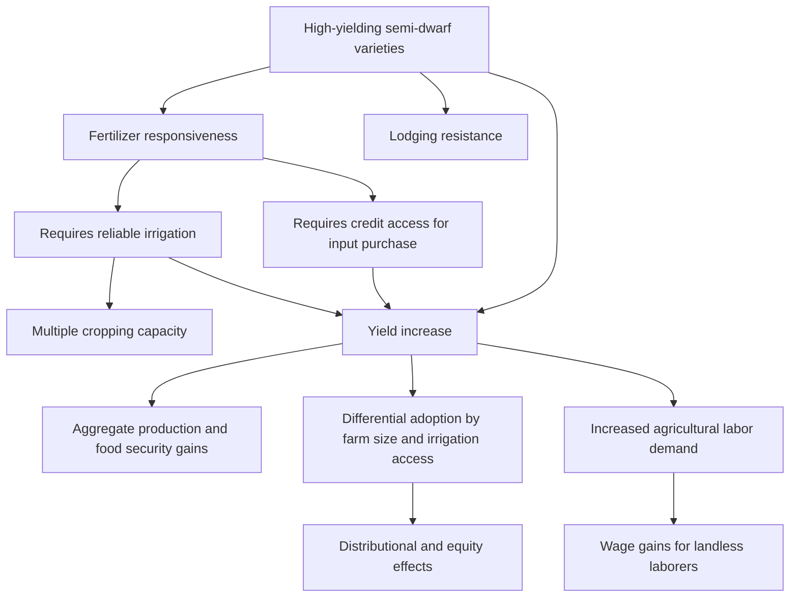

## Green Revolution: Origins and Impacts

### Definition and Historical Origins

The Green Revolution refers to the package of agricultural technology transfer and adoption — centered on high-yielding crop varieties (HYVs), synthetic fertilizer, irrigation expansion, and complementary agronomic practices — that substantially raised cereal grain yields across large parts of the developing world, predominantly from the mid-1960s through the 1980s, with Asia and parts of Latin America as the primary sites of adoption.

**Institutional origins**: the technological foundation traces to plant breeding research initiated in Mexico in the 1940s, led by Norman Borlaug (working through a Rockefeller Foundation-supported program that became the International Maize and Wheat Improvement Center, CIMMYT), which developed semi-dwarf, disease-resistant, fertilizer-responsive wheat varieties. Parallel work on rice, centered at the International Rice Research Institute (IRRI) in the Philippines (established 1960), produced the widely adopted IR8 variety in 1966. This international agricultural research center model was subsequently formalized and expanded through the Consultative Group on International Agricultural Research (CGIAR), established in 1971, which remains the dominant institutional structure for internationally coordinated agricultural research for development.

**Geographic and crop pattern**: adoption was concentrated initially in wheat and rice, and geographically concentrated in regions with existing or newly developed irrigation infrastructure (the new varieties' yield potential was strongly complementary with reliable water control and fertilizer application) — most prominently India's Punjab and Haryana states, Pakistan, the Philippines, Indonesia, and parts of Latin America. Sub-Saharan Africa saw comparatively limited Green Revolution technology adoption during this original wave, a pattern extensively analyzed in the subsequent literature (discussed below).

### The Technological Package and Its Complementarities

A defining analytical feature of the Green Revolution, central to understanding both its impact and its distributional consequences, is that the core innovation (high-yielding semi-dwarf varieties) functioned as part of a tightly complementary technological package rather than as a standalone input:

- **Semi-dwarf plant architecture**: shorter stalks allowed plants to allocate more resources to grain rather than stalk growth, and critically, to avoid lodging (falling over) under the weight of grain when heavily fertilized — a trait that made the varieties specifically fertilizer-responsive in a way traditional tall varieties were not
- **Fertilizer responsiveness**: the yield gains from HYV adoption were realized only in combination with substantially increased synthetic nitrogen fertilizer application, making fertilizer access, affordability, and (in many contexts) subsidized provision a binding complementary input
- **Irrigation and water control**: reliable water availability was necessary both to realize yield potential and to enable multiple cropping cycles per year in some adopting regions, meaning the returns to HYV adoption were sharply lower or negative in rainfed, unirrigated agricultural areas
- **Complementary agronomic inputs**: pesticide use, more precise planting density, and other management practice changes typically accompanied successful adoption

This tight input complementarity is central to explaining the documented **uneven geographic and socioeconomic adoption pattern** discussed below, since access to irrigation, credit (to finance fertilizer purchase), and extension services was not uniformly distributed.

### Empirical Evidence on Yield and Production Impacts

The aggregate production impact of Green Revolution technology adoption is among the most robustly documented findings in agricultural economics:

- Cereal yields in adopting regions rose substantially over the adoption period, with wheat and rice yields in South Asia in particular showing marked acceleration coinciding with the timing of HYV introduction and diffusion
- Cross-country and within-country panel studies exploiting the staggered timing of HYV introduction across regions (a research design frequently used given the technology's geographically and temporally staggered rollout) have found robust evidence attributing measured increases in cereal production and yields specifically to Green Revolution technology adoption, distinguishing this effect from concurrent but separate trends (general economic growth, other agricultural investments)
- The aggregate food security implication most frequently cited in the literature is that Green Revolution-driven production growth is widely credited with helping many adopting countries, most notably India, avert the large-scale famine outcomes that mid-20th-century population growth projections (prominently associated with Malthusian-influenced predictions in the 1960s, such as Paul Ehrlich's widely discussed but subsequently much-debated projections) had anticipated

### Household and Distributional Impacts

Beyond aggregate production effects, a substantial applied microeconomics literature has studied household-level and distributional consequences of Green Revolution adoption, with more contested and heterogeneous findings than the aggregate production evidence:

**Farm household income and poverty effects**: studies generally find HYV-adopting households experienced income gains, and several influential studies (including long-running village-level panel studies conducted by the International Crops Research Institute for the Semi-Arid Tropics, ICRISAT, in India) document poverty reduction associated with adoption in studied village economies, operating both directly (higher farm income for adopters) and indirectly through labor market effects (increased demand for agricultural labor in adopting areas, benefiting landless and near-landless households who supply labor rather than land).

**Equity concerns and differential access**: a substantial critical literature, particularly prominent in the 1970s and 1980s, raised concern that Green Revolution technology adoption favored larger, better-capitalized, and irrigation-access-endowed farmers over smallholder, rainfed, and resource-poor farmers, given the technology package's dependence on credit access (to finance fertilizer and other purchased inputs) and irrigation — potentially widening within-agricultural-sector income inequality even while raising aggregate production and average incomes. [Inference] The empirical literature testing this equity concern directly has produced genuinely mixed findings across different studied regions and time periods, with some studies finding adoption diffused relatively broadly across farm sizes over time (as initial adoption-cost barriers eased through learning, input market development, and government-subsidized credit and input programs) and others finding more persistent differential adoption and benefit-capture by larger or better-endowed farmers, such that the equity impact appears highly context-dependent rather than following a single universal pattern.

**Labor market and wage effects**: increased labor demand in Green Revolution-adopting regions (associated with more intensive cultivation practices and, in some contexts, expanded multiple cropping) is documented in several studies as raising agricultural wages in adopting areas, a channel through which landless agricultural laborers — who by definition could not directly adopt the land-embodied HYV technology — nonetheless captured some of the technology's benefits, partially offsetting the direct-adoption equity concern raised above.

**Regional divergence**: because adoption was concentrated in irrigated and favorable agroecological zones, the Green Revolution is documented in several studies as having widened regional income disparities within adopting countries between well-irrigated, high-adoption regions and rainfed, low-adoption regions, a distinct dimension of the broader equity debate from the farm-size dimension discussed above.

### Environmental and Sustainability Consequences

A substantial body of subsequent literature has documented environmental consequences of Green Revolution-style intensive input-based agriculture, feeding into contemporary debates about agricultural sustainability and the design of subsequent agricultural technology strategies:

- **Groundwater depletion**: intensive irrigation, particularly in regions relying on groundwater extraction (Punjab, India being a heavily studied case) rather than surface irrigation, has been associated with measurable groundwater table decline over subsequent decades, raising longer-run sustainability concerns for the specific production model in the most intensively adopting regions
- **Soil health and nutrient depletion**: some studies document soil health degradation and micronutrient depletion associated with sustained high-intensity monocropping and heavy synthetic fertilizer reliance, motivating subsequent research and policy attention to integrated soil management and more balanced fertilization practices
- **Biodiversity and genetic diversity concerns**: the widespread adoption of a comparatively narrow set of high-yielding varieties is documented in the literature as having reduced on-farm genetic diversity relative to the traditional varietal diversity previously cultivated, a concern that has motivated subsequent crop genetic conservation efforts (seed banks, in situ conservation programs) and continued plant breeding diversification work within the CGIAR system
- **Pesticide and agrochemical externalities**: increased pesticide use associated with intensified monocropping has been linked in some studies to health and environmental externalities, though the magnitude and attribution of these effects specific to Green Revolution technology packages (as opposed to broader agricultural intensification trends) varies across the studied literature

### The Sub-Saharan Africa Gap and Subsequent "Africa Green Revolution" Efforts

A widely discussed comparative puzzle in this literature concerns why Sub-Saharan Africa saw substantially lower Green Revolution technology adoption during the original wave relative to Asia, motivating a distinct sub-literature on the causes and subsequent efforts to extend similar technology gains to African agriculture:

- **Candidate explanations for lower original-wave adoption**: the literature identifies several contributing factors including greater agroecological diversity across African farming systems (making a small number of standardized varieties less broadly applicable than in the more uniform irrigated lowland rice and wheat systems of Asia), more limited irrigation infrastructure, weaker input market development (fertilizer distribution, credit access), a greater predominance of root and tuber crops (cassava, yams) and legumes less amenable to the original wheat/rice-focused breeding programs, and weaker agricultural extension and research system capacity in many African contexts during the relevant period
- **Subsequent "Africa Green Revolution" initiatives**: substantial subsequent investment (including the Alliance for a Green Revolution in Africa, AGRA, established with Gates Foundation and Rockefeller Foundation support in 2006) has attempted to extend similar productivity-enhancing technology packages, with crop breeding efforts increasingly focused on Africa-relevant crops (maize, cassava, sorghum, and legumes) alongside broader input market and extension system strengthening. [Inference] The evaluation evidence on the effectiveness and impact of these subsequent African-focused initiatives is more limited and more contested than the retrospective evidence base on the original Asian Green Revolution, reflecting both the shorter time elapsed for long-run impact assessment and genuine ongoing debate within the literature about program design and measured outcomes to date

### Illustrative Diagram: Green Revolution Technology Package Complementarities

### Illustrative Diagram: Adoption Complementarity Map (svg_diagram)

<svg xmlns="http://www.w3.org/2000/svg" viewBox="0 0 480 300">
<text x="240" y="24" text-anchor="middle" font-size="15" font-weight="bold" fill="#1a1a1a">Adoption Requires Joint Access (svg_diagram)</text>
<circle cx="160" cy="140" r="90" fill="#dbeafe" opacity="0.6" stroke="#2563eb" stroke-width="1.5" />
<text x="120" y="90" text-anchor="middle" font-size="11" fill="#1e3a8a">Irrigation</text>
<circle cx="280" cy="140" r="90" fill="#dcfce7" opacity="0.6" stroke="#16a34a" stroke-width="1.5" />
<text x="330" y="90" text-anchor="middle" font-size="11" fill="#14532d">Credit access</text>
<circle cx="220" cy="210" r="90" fill="#fef3c7" opacity="0.6" stroke="#d97706" stroke-width="1.5" />
<text x="220" y="270" text-anchor="middle" font-size="11" fill="#92400e">Fertilizer supply</text>
<text x="220" y="150" text-anchor="middle" font-size="12" font-weight="bold" fill="#111">Full yield</text>
<text x="220" y="165" text-anchor="middle" font-size="12" font-weight="bold" fill="#111">potential realized</text>
</svg>

### Key Points

- The Green Revolution's core innovation — high-yielding semi-dwarf wheat and rice varieties developed through CIMMYT and IRRI under the subsequent CGIAR institutional umbrella — functioned as part of a tightly complementary package with fertilizer and irrigation, not as a standalone input, which is central to explaining both its impact and its uneven adoption pattern
- Aggregate production and yield effects are among the most robustly documented findings in agricultural economics, with Green Revolution adoption widely credited with helping avert anticipated large-scale famine outcomes in South Asia
- Distributional and equity effects at the household level are considerably more contested and context-dependent than the aggregate production evidence, with the literature divided between studies finding broad eventual diffusion across farm sizes and studies finding persistent differential benefit capture by larger, better-endowed farmers
- Documented environmental consequences (groundwater depletion, soil health degradation, reduced on-farm genetic diversity) have motivated substantial subsequent research and policy attention to more sustainable intensification approaches
- Sub-Saharan Africa's substantially lower original-wave adoption reflects a combination of greater agroecological diversity, weaker irrigation and input market infrastructure, and a crop mix less matched to the original wheat/rice-focused breeding programs, motivating subsequent Africa-focused initiatives (e.g., AGRA) whose evaluation evidence remains more limited than the retrospective evidence on the original Asian experience

**Related Topics**

- Role of agriculture in structural transformation
- Land tenure systems and property rights in developing economies
- Agricultural extension services and technology adoption
- CGIAR and international agricultural research systems
- Malthusian population models and food security debates
- Rural credit markets and input finance constraints
- Environmental sustainability in agricultural intensification
- Nutrition, stunting, and human capital formation
- Rural labor markets and agricultural wage determination
- Crop genetic diversity and seed system conservation