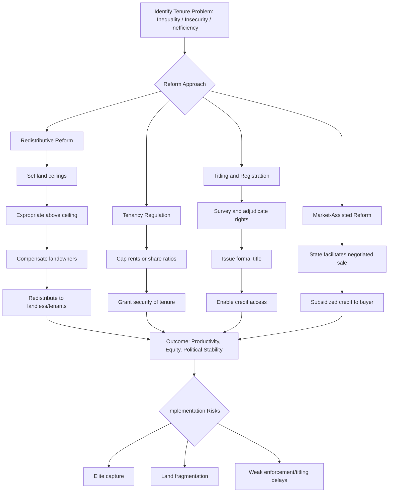

## Land Tenure Systems and Land Reform


### Definition and Conceptual Foundations

Land tenure refers to the set of rules, institutions, and social relationships that govern how land is held, used, transferred, and inherited within a society. It defines the rights, restrictions, and responsibilities that individuals and groups have with respect to land — not ownership in an absolute sense, but a "bundle of rights" that can include the right to use, lease, sell, bequeath, mortgage, or exclude others.

**Key Points**

- Tenure security refers to the certainty that a person's rights to land will be recognized by others and protected in cases of specific challenges.
- Land reform refers to deliberate, often state-led, changes to the distribution of landownership, tenancy arrangements, or land rights, typically aimed at redistributing land from large landholders to landless or land-poor cultivators.
- Tenure and reform interact with agricultural productivity, poverty reduction, social stability, and political economy, making this one of the most contested areas of development policy.

### Typology of Land Tenure Systems

#### Private Freehold Tenure

Individual or corporate ownership with the fullest bundle of rights (use, transfer, exclude, bequeath), typically registered under statutory law. Common in industrialized economies and increasingly promoted in developing contexts through titling programs.

#### Leasehold and Tenancy Systems

The cultivator does not own the land but holds use rights under a contract with a landowner. Major subtypes:

- **Fixed-rent tenancy**: Tenant pays a predetermined amount (cash or kind) regardless of output.
- **Sharecropping (métayage)**: Tenant pays a share of output (commonly 50%) to the landlord. Analyzed extensively in the Marshallian inefficiency literature, since the tenant bears the full cost of effort but only receives a fraction of the marginal product, leading to under-supply of labor relative to the social optimum.
- **Usufruct/customary leasing**: Informal, often unwritten arrangements common in traditional or communal systems.

#### Customary and Communal Tenure

Land rights governed by kinship, clan, or village-level institutions rather than statutory law. Common across Sub-Saharan Africa, parts of Southeast Asia (including the Philippines' ancestral domain systems under the Indigenous Peoples' Rights Act), and Pacific Island states. Rights are often usufructuary, allocated by traditional authorities, and layered (e.g., overlapping grazing, farming, and inheritance rights).

#### State and Public Land Tenure

Land owned by the state and allocated to users through leases, permits, or licenses (e.g., forest concessions, state farms, public agricultural land distributed under land reform programs).

#### Open-Access and Common Property Regimes

Distinguishing **common property** (a defined community with excludable, rule-governed access — e.g., communal grazing lands, communal irrigation systems) from **open access** (no defined rights-holder, prone to overexploitation per Hardin's "tragedy of the commons" framing) is essential. Elinor Ostrom's work demonstrated that well-designed common property institutions can sustainably manage shared resources without either privatization or state control.

### Land Reform: Objectives and Instruments

#### Core Objectives

1. **Equity**: Redistributing land from large, often underutilized estates to smallholders or the landless.
2. **Efficiency**: Correcting the inverse relationship between farm size and productivity often observed in developing agriculture, where small farms may achieve higher output per hectare due to more intensive family labor use.
3. **Political stability**: Reducing rural unrest linked to landlessness and inequality (historically a driver of reform in East Asia and Latin America).
4. **Tenure security**: Formalizing rights to encourage investment.

#### Instruments of Land Reform

**Redistributive land reform** — Expropriation (with or without compensation) of large landholdings above a ceiling, redistributed to landless or near-landless households. Classic cases: Japan (1946–1950), South Korea (1950s), Taiwan (1949–1953), and more contested cases in Latin America (Mexico, Bolivia, Peru) and the Philippines (Comprehensive Agrarian Reform Program, CARP, 1988).

**Tenancy reform** — Regulating or abolishing sharecropping, capping rents, and granting tenants security of tenure or the right to purchase land they cultivate (e.g., Operation Barga in West Bengal, India).

**Land consolidation** — Reorganizing fragmented plots into contiguous, more efficient units, common in post-socialist Eastern Europe and parts of East Asia.

**Titling and registration programs** — Formalizing informal or customary rights into legally recognized, transferable titles, often justified through Hernando de Soto's argument that formal title unlocks land as collateral for credit ("dead capital" thesis).

**Market-assisted land reform (MALR)** — A World Bank-promoted alternative to state expropriation, in which the state facilitates voluntary, negotiated land sales between willing sellers and willing buyers (often landless groups), using subsidized credit or grants. Applied in Brazil, Colombia, and South Africa's "willing buyer, willing seller" model.

**Collectivization** — State-directed pooling of land into collective or state farms, historically pursued in the USSR, Maoist China, and Vietnam, generally associated with severe productivity losses due to weakened work incentives, though de-collectivization (e.g., China's Household Responsibility System from 1978) produced large productivity gains.

### Theoretical Frameworks

#### The Inverse Farm Size–Productivity Relationship

Empirical observation, first documented systematically for Indian agriculture, that smaller farms often show higher output per unit of land than larger farms. Competing explanations include:

- Higher labor intensity per hectare on family farms due to lower monitoring costs relative to hired labor.
- Missing or imperfect land and credit markets that segment access by farm size.
- Soil quality differences correlating inversely with plot size [Inference — this remains debated, as some studies attribute part of the relationship to measurement error in land quality].

#### Principal-Agent Problems in Tenancy

Sharecropping is modeled as a second-best solution to a risk-sharing/incentive trade-off: fixed rent transfers full risk to the tenant (strong incentive, no insurance), wage labor transfers full risk to the landlord (full insurance, weak incentive), and sharecropping splits the difference. Formally, if a tenant's effort $e$ produces output $f(e)$ and receives a share $\alpha$ of output, the tenant maximizes:

$$\max_{e} \; \alpha f(e) - c(e)$$

where $c(e)$ is the cost of effort. Since $\alpha < 1$, the tenant's first-order condition $\alpha f'(e) = c'(e)$ yields effort below the socially efficient level where $f'(e) = c'(e)$.

#### Property Rights Theory

Secure, transferable property rights are theorized to:

- Increase incentives for long-term investment (irrigation, soil conservation, tree planting).
- Enable land to serve as collateral, improving credit access.
- Reduce transaction costs in land markets, enabling reallocation toward more productive users.

  Critics (e.g., studies on African customary tenure) note that formal titling can also disrupt functioning customary systems, disadvantage women and secondary rights-holders, and elite capture by better-connected registrants. [Inference — the net welfare effect of titling is highly context-dependent and contested in the empirical literature].

### Illustrative Case Studies

**East Asia (Japan, South Korea, Taiwan)**: Comprehensive, compensated redistributive reforms in the immediate post-WWII period, combined with strong agricultural extension and input support, are widely credited with contributing to broad-based rural income growth and low subsequent inequality, laying groundwork for later industrialization.

**China's Household Responsibility System (1978 onward)**: Shifted from collective to household-based farming while retaining state/collective ownership of land, granting long-term use rights. Associated with sharp productivity increases in the early reform period.

**Philippines (CARP/CARPER)**: Comprehensive Agrarian Reform Program covering both private agricultural land and public land, with retention limits and compensation to landowners. Implementation faced significant delays, landowner conversion of land to exempt uses, and disputes over compensation valuation, illustrating common political economy obstacles to redistributive reform. [Unverified — specific current implementation statistics should be checked against the latest Department of Agrarian Reform data, as coverage figures are periodically updated].

**Sub-Saharan Africa (customary tenure reform)**: Countries such as Rwanda, Ethiopia, and Ghana have pursued land certification programs to formalize customary rights without full privatization, aiming to preserve communal safeguards (e.g., protecting women's inheritance rights) while improving tenure security.

### Diagram: Land Tenure Bundle of Rights (svg_diagram)

<svg xmlns="http://www.w3.org/2000/svg" viewBox="0 0 760 420">
<text x="380" y="30" text-anchor="middle" font-size="18" font-weight="bold" fill="#1a1a1a">Bundle of Land Rights (svg_diagram)</text>
<circle cx="380" cy="220" r="150" fill="none" stroke="#2b6cb0" stroke-width="2" />
<text x="380" y="215" text-anchor="middle" font-size="14" font-weight="bold" fill="#2b6cb0">Land Parcel</text>
<text x="380" y="235" text-anchor="middle" font-size="11" fill="#4a5568">(underlying resource)</text>
<g font-size="13" fill="#1a1a1a">
<rect x="40" y="60" width="160" height="50" rx="6" fill="#ebf8ff" stroke="#2b6cb0" />
<text x="120" y="80" text-anchor="middle" font-weight="bold">Right to Use</text>
<text x="120" y="98" text-anchor="middle" font-size="11">Cultivate, graze, build</text>



```
<rect x="560" y="60" width="160" height="50" rx="6" fill="#ebf8ff" stroke="#2b6cb0" />
<text x="640" y="80" text-anchor="middle" font-weight="bold">Right to Exclude</text>
<text x="640" y="98" text-anchor="middle" font-size="11">Bar others' access</text>

<rect x="40" y="330" width="160" height="50" rx="6" fill="#ebf8ff" stroke="#2b6cb0" />
<text x="120" y="350" text-anchor="middle" font-weight="bold">Right to Transfer</text>
<text x="120" y="368" text-anchor="middle" font-size="11">Sell, lease, mortgage</text>

<rect x="560" y="330" width="160" height="50" rx="6" fill="#ebf8ff" stroke="#2b6cb0" />
<text x="640" y="350" text-anchor="middle" font-weight="bold">Right to Bequeath</text>
<text x="640" y="368" text-anchor="middle" font-size="11">Pass to heirs</text>

<rect x="300" y="10" width="160" height="50" rx="6" fill="#fffaf0" stroke="#dd6b20" />
<text x="380" y="30" text-anchor="middle" font-weight="bold" fill="#dd6b20" style="visibility:hidden"> </text>
<text x="380" y="35" text-anchor="middle" font-weight="bold">Right to Manage</text>
<text x="380" y="53" text-anchor="middle" font-size="11">Decide crop/use</text>
```

</g>
<line x1="200" y1="85" x2="270" y2="150" stroke="#a0aec0" stroke-width="1.5" />
<line x1="560" y1="85" x2="490" y2="150" stroke="#a0aec0" stroke-width="1.5" />
<line x1="200" y1="355" x2="270" y2="290" stroke="#a0aec0" stroke-width="1.5" />
<line x1="560" y1="355" x2="490" y2="290" stroke="#a0aec0" stroke-width="1.5" />
<line x1="380" y1="60" x2="380" y2="120" stroke="#a0aec0" stroke-width="1.5" />
</svg>

### Diagram: Land Reform Policy Pathway



### Common Implementation Challenges

- **Elite capture**: Politically influential landowners often secure exemptions, delay compensation disputes, or convert land to reform-exempt uses (e.g., reclassifying agricultural land as commercial/industrial).
- **Land fragmentation**: Redistribution into very small plots can undermine economies of scale, prompting later land consolidation policies.
- **Compensation financing**: Fiscal constraints on compensating landowners can stall or dilute reform (a persistent issue in Philippine CARP implementation and South African redistribution).
- **Gender and secondary rights**: Formal titling processes have historically registered land in male household heads' names, weakening women's customary use or inheritance rights. [Inference — this is a widely documented pattern in the gender and land literature, though outcomes vary by program design].
- **Credit and input complementarities**: Land access alone rarely raises productivity without complementary investment in credit, extension services, irrigation, and output markets. Behavior of specific credit or extension programs may vary by country and administrative capacity.

### Measuring Land Inequality and Tenure Security

Common metrics include the **Gini coefficient of landholding**, computed analogously to income Gini from a Lorenz curve of cumulative land share against cumulative landholder share:

$$G = 1 - 2\int_0^1 L(p)\,dp$$

where $L(p)$ is the Lorenz curve for landholding size. Tenure security is typically assessed through survey-based perception indices (e.g., perceived probability of losing land within a defined horizon) rather than purely legal status, since de jure rights and de facto security frequently diverge, particularly under customary or contested tenure.

### Related Topics

- Agricultural productivity and the farm size–productivity debate
- Rural credit markets and collateral constraints
- Property rights theory and the Coase theorem in agrarian contexts
- Green Revolution technology adoption and tenure interactions
- Rural-to-urban migration and land consolidation
- Gender and land rights in customary systems
- Common-pool resource management (Ostrom's design principles)
- Agrarian political economy and the political economy of reform resistance
- Cadastral surveying and land information systems (LIS/GIS in land administration)