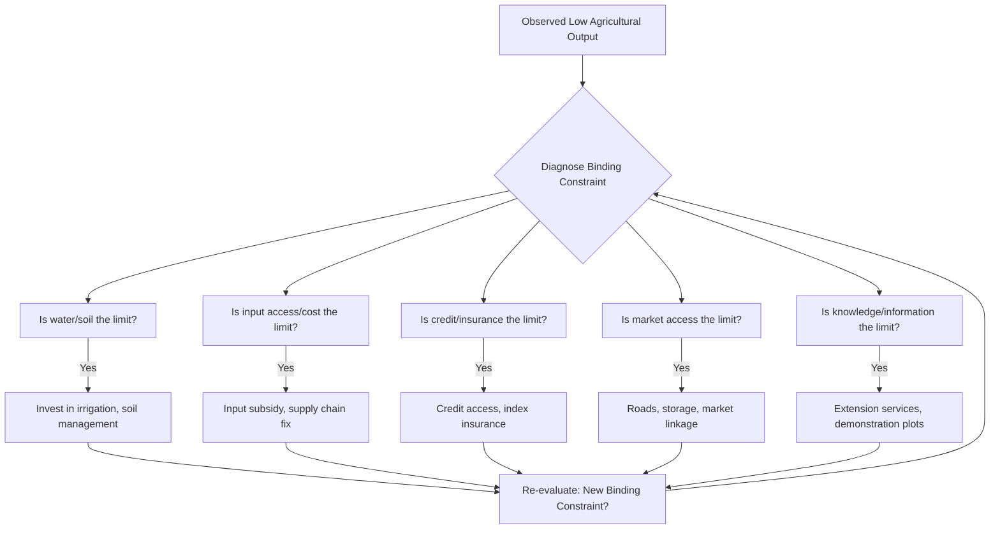

## Agricultural Productivity Constraints


### Definition and Scope

Agricultural productivity constraints are the biophysical, economic, institutional, and infrastructural factors that limit output per unit of land, labor, or capital in farming systems, particularly in developing-country contexts. Understanding these constraints is central to explaining persistent yield gaps between actual and potential production, and to designing interventions in rural development policy.

**Key Points**

- Productivity is typically measured as land productivity (yield per hectare), labor productivity (output per worker), or total factor productivity (TFP, output relative to a weighted bundle of all inputs).
- Constraints are rarely singular; they interact, meaning removing one binding constraint (e.g., credit) may reveal another (e.g., extension knowledge) as the new binding limit.
- The "yield gap" — the difference between potential yield under best-known practices and actual farmer yield — is a standard diagnostic concept in this literature.

### Classification of Constraints

#### Biophysical Constraints

- **Soil quality and degradation**: Nutrient depletion, erosion, salinization, and acidification reduce yields, particularly in continuously cropped smallholder systems without adequate replenishment.
- **Water availability**: Rainfall variability and lack of irrigation infrastructure expose yields to drought risk; only a minority of cultivated land in Sub-Saharan Africa is irrigated compared to much higher shares in South and East Asia. [Unverified — exact current irrigation coverage percentages should be checked against the latest FAO AQUASTAT figures, as they are periodically updated.]
- **Climate variability and change**: Shifting rainfall patterns, temperature stress, and increased frequency of extreme weather events (droughts, floods) elevate production risk and can permanently lower yield potential for some crops in some regions.
- **Pest and disease pressure**: Crop and livestock diseases (e.g., fall armyworm, cassava mosaic virus, African swine fever) can cause substantial yield and output losses where surveillance and control infrastructure is weak.

#### Input and Technology Constraints

- **Limited use of improved seeds and fertilizer**: Adoption rates of high-yielding varieties and inorganic fertilizer remain low among many smallholders relative to agronomic recommendations, often due to cost, availability, or perceived risk.
- **Mechanization gaps**: Reliance on manual or animal traction limits the timeliness of land preparation, planting, and harvesting, with knock-on effects on yield and labor allocation.
- **Weak agricultural research and extension systems**: Limited public investment in adaptive research (localized variety trials) and extension services (farmer training, demonstration plots) slows technology diffusion.

#### Market and Institutional Constraints

- **Credit market imperfections**: Absence of collateral (linked to land tenure insecurity), high transaction costs, and covariate risk (weather shocks affecting many borrowers simultaneously) lead to credit rationing, limiting farmers' ability to purchase inputs or invest in productivity-enhancing technology.
- **Insurance market failure**: Absence of affordable crop or weather insurance leaves farmers exposed to risk, inducing risk-averse behavior such as under-investment in profitable but variable-return technologies (a form of the theoretical "poverty trap" mechanism).
- **Output market access and price risk**: Poor road infrastructure, thin markets, and limited storage raise transaction costs and expose farmers to price volatility, reducing incentives to produce a marketable surplus.
- **Land tenure insecurity and fragmentation**: Insecure rights reduce incentives for long-term land investment (see related topic on land tenure); fragmented, small plots raise per-unit costs of mechanization and irrigation.
- **Labor market constraints**: Seasonal labor shortages at peak periods (planting, harvesting), especially where rural-urban migration has drawn away working-age labor, can bind timely farm operations.

#### Information and Behavioral Constraints

- **Information asymmetries**: Farmers may lack accurate information about input quality, optimal application rates, weather forecasts, or output prices.
- **Behavioral factors**: Present bias and limited attention can lead to under-investment in profitable inputs like fertilizer even when returns are demonstrably high, a finding central to behavioral development economics research on "learning" and "nudge"-style interventions (e.g., SMS reminders, commitment savings for input purchase).

### Theoretical Framework: The Yield Gap Decomposition

The yield gap can be conceptually decomposed as:

$$Y_p - Y_a = (Y_p - Y_w) + (Y_w - Y_a)$$

where $Y_p$ is potential yield (climate/genetic ceiling), $Y_w$ is water-limited (or resource-limited) potential yield under actual rainfed conditions, and $Y_a$ is actual farmer yield. The first term reflects the biophysical/agro-ecological ceiling; the second term — often called the "exploitable yield gap" — reflects the portion addressable through improved management, inputs, and practices, and is the primary target of most development interventions.

#### Binding Constraints Analysis

Drawing on the "growth diagnostics" approach (originally developed for macroeconomic growth constraints), agricultural productivity analysis often asks: which constraint, if relaxed, would generate the largest marginal increase in output? This diagnostic framing explains why input subsidy programs alone sometimes fail to raise yields — if the truly binding constraint is water availability or extension knowledge rather than fertilizer access, subsidizing fertilizer yields limited returns.

### The Total Factor Productivity (TFP) Approach

TFP growth is measured as the residual growth in output not explained by growth in measured inputs:

$$\text{TFP growth} = \dot{Y} - \sum_i s_i \dot{X}_i$$

where $\dot{Y}$ is output growth, $\dot{X}_i$ is growth in input $i$ (land, labor, capital, materials), and $s_i$ is that input's cost share. Cross-country agricultural TFP comparisons (notably maintained by the USDA Economic Research Service) are commonly used to assess whether growth in developing-country agriculture is driven by input intensification (extensification, more fertilizer/labor) versus genuine efficiency and technology gains.

### Illustrative Examples

**Fertilizer use and profitability in Sub-Saharan Africa**: Field experiments (e.g., work by Duflo, Kremer, and Robinson in Kenya) have found that returns to fertilizer application are often high on average but highly variable across seasons and plots, helping explain why farmers may rationally under-adopt in the absence of insurance mechanisms against a bad-return year.

**Green Revolution technology diffusion in South Asia**: Adoption of high-yielding rice and wheat varieties combined with irrigation expansion and fertilizer subsidies drove substantial yield increases in the 1960s–1980s, but with regionally uneven impact, being concentrated in irrigated areas, illustrating how a single technology's productivity impact is conditional on complementary infrastructure (irrigation) being present.

**Rural road investment**: Studies of rural road-building programs (e.g., in Ethiopia and elsewhere) generally find reduced transport costs are associated with increased market participation and, in some cases, input adoption, illustrating a market-access constraint interacting with technology adoption decisions. [Inference — magnitude of these effects is context-specific and varies with baseline market remoteness.]

### Diagram: Interacting Constraints on Farm Output (svg_diagram)

<svg xmlns="http://www.w3.org/2000/svg" viewBox="0 0 780 460">
<text x="390" y="30" text-anchor="middle" font-size="18" font-weight="bold" fill="#1a1a1a">Interacting Constraints on Farm Output (svg_diagram)</text>
<rect x="310" y="200" width="160" height="60" rx="8" fill="#fefcbf" stroke="#d69e2e" stroke-width="2" />
<text x="390" y="225" text-anchor="middle" font-size="13" font-weight="bold">Farm Output</text>
<text x="390" y="245" text-anchor="middle" font-size="11">(Yield / Ha)</text>
<g font-size="12" fill="#1a1a1a">
<rect x="40" y="80" width="170" height="55" rx="6" fill="#e6fffa" stroke="#319795" />
<text x="125" y="102" text-anchor="middle" font-weight="bold">Biophysical</text>
<text x="125" y="120" text-anchor="middle" font-size="10">Soil, water, climate, pests</text>



```
<rect x="570" y="80" width="170" height="55" rx="6" fill="#e6fffa" stroke="#319795" />
<text x="655" y="102" text-anchor="middle" font-weight="bold">Technology/Input</text>
<text x="655" y="120" text-anchor="middle" font-size="10">Seeds, fertilizer, mechanization</text>

<rect x="40" y="330" width="170" height="55" rx="6" fill="#faf5ff" stroke="#805ad5" />
<text x="125" y="352" text-anchor="middle" font-weight="bold">Market/Institutional</text>
<text x="125" y="370" text-anchor="middle" font-size="10">Credit, insurance, tenure, output markets</text>

<rect x="570" y="330" width="170" height="55" rx="6" fill="#faf5ff" stroke="#805ad5" />
<text x="655" y="352" text-anchor="middle" font-weight="bold">Information/Behavioral</text>
<text x="655" y="370" text-anchor="middle" font-size="10">Knowledge gaps, risk aversion, bias</text>
```

</g>
<line x1="210" y1="107" x2="320" y2="205" stroke="#718096" stroke-width="1.5" />
<line x1="570" y1="107" x2="460" y2="205" stroke="#718096" stroke-width="1.5" />
<line x1="210" y1="357" x2="320" y2="255" stroke="#718096" stroke-width="1.5" />
<line x1="570" y1="357" x2="460" y2="255" stroke="#718096" stroke-width="1.5" />

<text x="390" y="420" text-anchor="middle" font-size="11" fill="`#4a5568`" font-style="italic">Relaxing one constraint can reveal another as newly binding</text>

</svg>

### Diagram: Binding Constraint Diagnostic Logic



### Policy Response Instruments

- **Input subsidy programs**: Targeted or universal fertilizer/seed subsidies (e.g., Malawi's Farm Input Subsidy Program) aim to relax input cost constraints but raise fiscal sustainability and market-distortion concerns.
- **Agricultural extension reform**: Farmer field schools, ICT-based advisory services (SMS/voice-based agronomic advice), and demonstration plots to close information gaps.
- **Index-based weather insurance**: Payouts triggered by weather indices (rainfall, temperature) rather than individually assessed losses, designed to reduce basis risk relative to traditional crop insurance and lower administrative costs.
- **Rural infrastructure investment**: Roads, irrigation, and storage/cold-chain facilities to relax market-access and post-harvest loss constraints.
- **Land tenure formalization**: Addressed in depth under land tenure systems, relevant here as a precondition for productivity-enhancing investment.
- **Agricultural research investment**: Public and CGIAR-system investment in crop breeding (drought-tolerant, disease-resistant varieties) to raise the biophysical yield ceiling itself.

### Measurement Considerations

Behavior of specific productivity indicators may vary depending on data quality, particularly in contexts where farm-level yield and input-use data derive from farmer self-reporting rather than crop-cutting measurement, a documented source of measurement error in agricultural household surveys. Comparisons of TFP or yield gaps across countries or time periods should account for differences in agro-ecological conditions, cropping patterns, and survey methodology rather than being treated as directly comparable without adjustment.

### Related Topics

- Land tenure systems and land reform
- Green Revolution technology and diffusion economics
- Rural credit markets and microfinance
- Agricultural risk management and index insurance
- Rural infrastructure and market access
- Agricultural extension and farmer learning models
- Climate change adaptation in smallholder agriculture
- Post-harvest losses and value chain constraints
- Total factor productivity measurement in agriculture