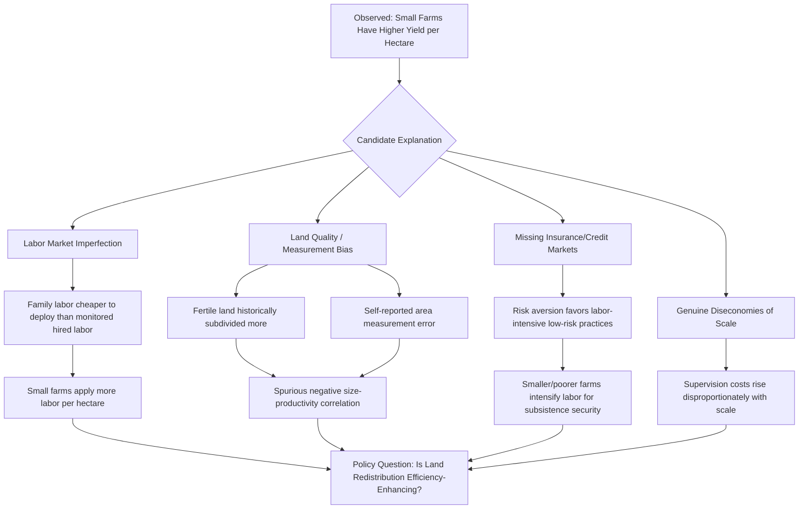

## Farm Size and Productivity Relationship

### Definition and Central Puzzle

The farm size–productivity relationship examines how output per unit of land (or other productivity measures) varies with farm size. The central empirical puzzle in development economics is the **inverse relationship (IR)**: numerous studies across developing countries find that smaller farms achieve higher yield per hectare than larger farms, contradicting the expectation from economies of scale that larger operations should be more productive.

**Key Points**

- The inverse relationship has been documented across many contexts, including classic studies on Indian agriculture, and has substantial implications for land reform and farm-size policy.
- The relationship is contested: whether it reflects a genuine behavioral/market-failure phenomenon or is an artifact of measurement error, omitted variables, or model misspecification remains an active empirical debate.
- The IR primarily concerns land productivity (yield/hectare); the relationship between farm size and labor productivity or total factor productivity is more ambiguous and, in some analyses, reverses direction.

### Historical and Empirical Background

The inverse relationship was first systematically documented in farm management surveys in India, where researchers observed that output value per acre declined monotonically as farm size increased. This finding was influential in the Indian land ceiling and redistributive reform debates of the 1960s–1970s, since it suggested that redistributing land from large to small holdings could raise aggregate output as well as improve equity — a rare case where equity and efficiency arguments appeared to align, rather than trade off.

Subsequent studies across Latin America, Sub-Saharan Africa, and other parts of Asia have found similar patterns, though the strength and consistency of the relationship varies by country, crop, and time period. [Inference — the IR is not universal; several later studies using better data (e.g., accounting for soil quality via plot-level fixed effects) find the relationship weakens or disappears, suggesting it may be partly an econometric artifact in some settings.]

### Competing Explanations

#### Labor Market Imperfections and Family Labor Intensity

The dominant theoretical explanation rests on dual labor markets: family labor and hired labor are imperfect substitutes because hired labor requires costly supervision (a "labor management" or "moral hazard" problem), while family labor is self-motivated and does not require monitoring. Small farms, which rely predominantly on family labor, apply labor more intensively per hectare than large farms, which must rely more on hired labor and therefore economize on labor input. This generates higher land productivity, but not necessarily higher labor productivity, on small farms.

Formally, if $w$ is the market wage and $w^*$ is the effective (supervision-inflated) cost of hired labor with $w^* > w$, a large farm employing hired labor equates the marginal product of labor to $w^*$, while a small farm using only family labor may push labor input further, down to where marginal product equals the (lower) shadow value of family time, or even below the market wage if off-farm employment options are limited.

#### Land Quality and Measurement Error

A long-standing critique holds that the IR is partly a statistical artifact:

- **Soil quality bias**: Farmers with more fertile land may historically have subdivided plots more (due to higher population pressure or historical land pressure on good land), so land quality is negatively correlated with farm size in the cross-section, producing a spurious inverse relationship if quality is not controlled for.
- **Output measurement error**: Especially in survey data relying on farmer self-reported area and output, measurement error in self-reported land area (classical measurement error) can mechanically generate a downward bias in the estimated size-productivity relationship, since output/area on the left-hand side and area appear on both sides of the ratio.

#### Missing Insurance and Credit Markets

Under imperfect insurance markets, poorer (typically smaller) farmers may prioritize labor-intensive, lower-risk practices for subsistence security, while wealthier (larger) farmers may substitute capital for labor and take on riskier, more mechanized, less labor-intensive practices — again generating higher labor input, and thus higher yield, on smaller holdings without this reflecting a genuine efficiency advantage in a market-failure-free counterfactual.

#### Economies of Scale (Counter-Forces)

Where they exist, economies of scale in mechanization, input purchasing (bulk discounts), access to credit and extension services, and marketing can favor larger farms, particularly for capital-intensive or export-oriented crops. This explains why, in some contexts (e.g., large-scale commercial agriculture, plantation crops), the relationship between farm size and productivity is flat or positive rather than inverse. [Inference — the balance between labor-intensity advantages of small farms and scale advantages of large farms is context- and crop-specific, and generalizing a single universal relationship across all agricultural settings is not well-supported by the evidence.]

### Formal Representation

A standard reduced-form regression testing the IR takes the form:

$$\ln(Y_i/A_i) = \beta_0 + \beta_1 \ln(A_i) + \mathbf{X}_i'\gamma + \varepsilon_i$$

where $Y_i/A_i$ is output value per unit of land on farm $i$, $A_i$ is farm area, and $\mathbf{X}_i$ is a vector of controls (soil quality, irrigation access, household characteristics). The inverse relationship corresponds to a statistically significant $\beta_1 < 0$. Because $A_i$ appears on both sides of the equation (in the dependent variable's denominator and as the regressor), measurement error in $A_i$ generates a mechanical negative bias in $\hat\beta_1$ even absent any true behavioral relationship — a well-known econometric identification challenge in this literature.

### Policy Implications

#### Implications for Land Reform

If the IR reflects a genuine efficiency relationship, land redistribution from large to small farms can be justified on efficiency grounds in addition to equity grounds, strengthening the case for land ceiling laws and redistributive reform (see land tenure systems and land reform). If the IR is instead largely a statistical artifact, this efficiency rationale for redistribution weakens considerably, though equity-based justifications remain independent of this debate.

#### Implications for Farm Consolidation Policy

Conversely, in contexts where the relationship is flat or positive (often true for capital-intensive or highly mechanized production), policies encouraging land consolidation, contract farming, or cooperative mechanization-sharing arrangements may be more appropriate for raising productivity than further fragmentation.

#### Complementary Investments

Because the IR is theorized to arise partly from labor-market and insurance-market imperfections rather than land itself, addressing the underlying market failures (rural insurance products, labor market development, credit access) may be a more robust policy lever than farm-size policy in isolation. [Inference — this is a reasonable extension of the theoretical literature but is less directly tested than the core IR findings themselves.]

### Diagram: Explanatory Pathways for the Inverse Relationship

### Illustrative Example

**Indian farm size surveys**: Early Indian farm management data showed output per acre declining with farm size across multiple states and crop years, a pattern that fed directly into the policy case for land ceiling legislation in the 1960s and 1970s. Later re-analyses using plot-level data with soil quality controls found the relationship persisted but with reduced magnitude, supporting a mixed interpretation combining both genuine labor-intensity effects and partial measurement artifacts. [Unverified — precise magnitude estimates vary substantially by study, dataset, and time period, and should be checked against the specific empirical paper if exact figures are needed.]

**Sub-Saharan African smallholder data**: Studies using GPS-measured (rather than self-reported) plot areas have found that the strength of the inverse relationship diminishes substantially when GPS measurement replaces farmer-reported area, providing evidence for the measurement-error explanation in at least some settings.

### Related Topics

- Land tenure systems and land reform
- Agricultural productivity constraints
- Rural labor markets and household labor allocation models
- Risk, insurance, and rural household decision-making
- Agricultural mechanization and economies of scale
- Measurement error in household survey data
- Total factor productivity measurement in agriculture
- Contract farming and vertical coordination in agribusiness