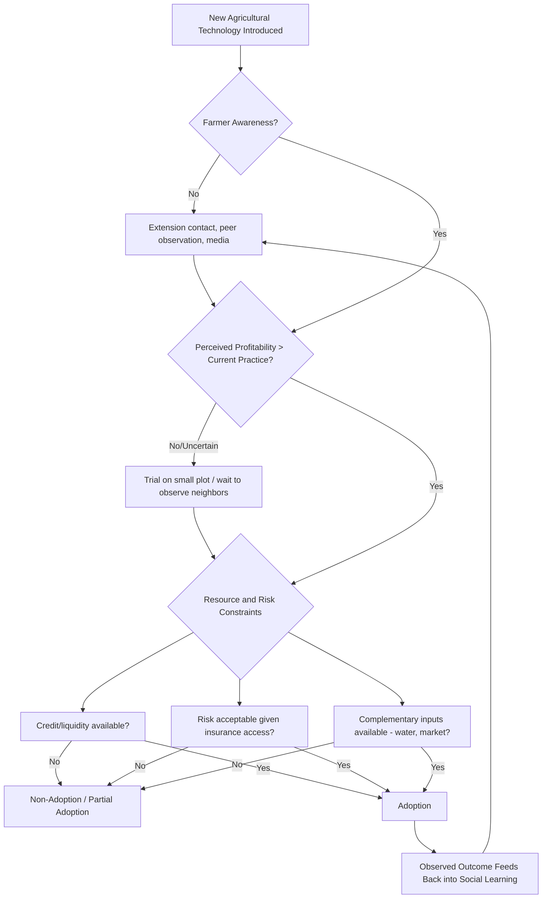

## Agricultural Technology Adoption

### Definition and Scope

Agricultural technology adoption refers to the process by which farmers decide to begin using a new input, practice, or innovation — such as improved seed varieties, inorganic fertilizer, irrigation equipment, pest management techniques, or digital advisory tools — and the economic factors that determine the speed, extent, and persistence of that uptake. This subfield sits at the intersection of development economics, agricultural economics, and behavioral economics, and is central to explaining why technically superior technologies often diffuse slowly or incompletely in developing-country agriculture.

**Key Points**

- Adoption is typically modeled as a function of expected profitability, risk, credit access, information, and behavioral factors, not simply technical superiority.
- The diffusion of innovation over time commonly follows an S-shaped adoption curve, with slow initial uptake, an acceleration phase, and eventual saturation.
- A large share of the contemporary empirical development literature (particularly randomized controlled trials) is devoted to identifying which specific constraint — credit, information, risk, or behavioral bias — is binding for a given technology in a given context.

### Classical Theoretical Frameworks

#### Diffusion of Innovations Theory

Rooted in Everett Rogers' sociological framework, this model classifies adopters along a curve — innovators, early adopters, early majority, late majority, laggards — and emphasizes that adoption spreads through social learning and communication networks over time, producing the characteristic S-curve of cumulative adoption.

#### Profit Maximization / Expected Utility Framework

The standard economic model treats adoption as a discrete choice where a risk-averse farmer adopts a new technology if its expected utility exceeds that of the existing practice:

$$E[U(\pi_{new})] > E[U(\pi_{old})]$$

where $\pi$ denotes profit under each technology. Because $U(\cdot)$ is typically assumed concave (risk aversion), a technology with higher expected profit but also higher profit variance may still be rejected by risk-averse farmers, even when it dominates in expected value — a key reason "objectively superior" technologies are not always adopted.

#### Threshold/Learning Models

Adoption models incorporating Bayesian learning (e.g., the classic work by Besley and Case on learning and technology adoption) treat farmers as updating beliefs about a technology's profitability based on their own experimentation and observation of neighbors' outcomes. This generates gradual, information-driven diffusion, and explains why adoption can spread through social networks even without formal extension contact.

### Key Constraints on Adoption (Cross-Referenced)

Technology adoption sits downstream of the broader productivity-constraint framework (see agricultural productivity constraints); the following are the specific mechanisms most studied in the adoption literature:

- **Credit constraints**: Up-front cost of seed, fertilizer, or equipment may exceed liquidity available to cash- and credit-constrained smallholders, even when the technology is profitable on average.
- **Risk and insurance gaps**: Absent insurance, farmers may rationally under-adopt technologies with higher expected but more variable returns (e.g., hybrid seed requiring precise input timing).
- **Information and learning costs**: Farmers may lack accurate knowledge of a technology's correct application, or be uncertain about its returns on their specific plot's soil and climate conditions.
- **Behavioral factors — present bias and limited attention**: A substantial experimental literature (e.g., work by Duflo, Kremer, and Robinson on fertilizer in Kenya) finds farmers who state an intention to purchase fertilizer at harvest time often fail to do so by planting time, consistent with present-biased preferences; small, time-limited discounts offered immediately after harvest (when farmers have cash and time to plan) have been shown to raise adoption more than larger subsidies offered at planting time.
- **Input and output market access**: Reliable access to genuine (non-counterfeit) inputs and to markets that reward higher output quality/quantity affects the profitability calculus.
- **Land tenure insecurity**: Reduces incentives for adoption of technologies with delayed or long-horizon returns (e.g., soil conservation investments, tree crops) — see land tenure systems and land reform.
- **Farm size and labor allocation interactions**: Some technologies (mechanization) favor larger operations; others (labor-intensive practices like System of Rice Intensification) may be more compatible with smaller, family-labor farms — connecting to the farm size–productivity relationship.

### The Adoption Decision as a Discrete Choice Model

Empirical adoption studies commonly use binary or ordered choice models. A standard probit/logit specification:

$$P(\text{Adopt}_i = 1) = \Phi(\beta_0 + \beta_1 X_i + \beta_2 Z_i + \varepsilon_i)$$

where $X_i$ includes household characteristics (wealth, education, farm size, risk preferences) and $Z_i$ includes technology-specific factors (relative price, perceived profitability, extension contact). A key methodological challenge is that adoption and outcomes (yield, income) are jointly determined with unobserved farmer ability or motivation, requiring instrumental variables, panel data with fixed effects, or randomized encouragement designs to identify causal effects of adoption on outcomes, rather than simply correlating adopters' outcomes with non-adopters'.

### Illustrative Examples

**Hybrid maize adoption in East Africa**: Adoption rates for hybrid maize varieties have varied substantially across countries and periods, with studies attributing gaps partly to seed market access and partly to farmers' uncertainty about variety performance under local rainfall conditions. [Unverified — precise current adoption rate figures vary by country and survey year and should be checked against recent national agricultural survey data if specific numbers are needed.]

**SMS-based agricultural extension**: Several field experiments testing SMS or voice-message based agronomic advisory services have found modest but positive effects on adoption of recommended practices, generally interpreted as evidence that information constraints are at least partially binding, though effect sizes are typically smaller than credit- or input-access interventions in the same contexts. [Inference — the relative importance of information versus other constraints appears to vary by technology and setting rather than following a single universal ranking.]

**Green Revolution seed-fertilizer packages**: The historical diffusion of high-yielding rice and wheat varieties in South Asia is a classic large-scale case, where adoption was strongly conditional on irrigation access, illustrating that adoption of one technology (seed) is often contingent on complementary infrastructure or inputs (water, fertilizer) being simultaneously available — a recurring theme distinguishing technology "packages" from standalone innovations.

**Digital agricultural tools (recent/emerging)**: Mobile-based platforms offering market price information, weather forecasts, and digital extension advice (e.g., services built on USSD or smartphone apps in Sub-Saharan Africa and South Asia) represent an active and evolving area; rigorous impact evidence is more limited and mixed than for input-based technologies, and specific platform architectures and reach continue to change rapidly. [Unverified — given the pace of change in this specific subsector, current platform names, coverage, and evaluation results should be checked against recent sources rather than relied upon from general background knowledge.]

### Diagram: Technology Adoption Decision Process

### Diagram: S-Curve of Technology Diffusion (svg_diagram)

<svg xmlns="http://www.w3.org/2000/svg" viewBox="0 0 700 380">
<text x="350" y="30" text-anchor="middle" font-size="18" font-weight="bold" fill="#1a1a1a">S-Curve of Technology Diffusion (svg_diagram)</text>
<line x1="70" y1="320" x2="650" y2="320" stroke="#2d3748" stroke-width="2" />
<line x1="70" y1="320" x2="70" y2="60" stroke="#2d3748" stroke-width="2" />
<text x="360" y="355" text-anchor="middle" font-size="12">Time</text>
<text x="30" y="190" text-anchor="middle" font-size="12" transform="rotate(-90 30 190)">Cumulative Adoption (%)</text>

<path d="M 70 315 C 200 315, 220 300, 280 250 C 340 190, 360 120, 420 90 C 480 70, 560 65, 650 62" fill="none" stroke="`#2b6cb0`" stroke-width="3" />

<text x="130" y="300" font-size="11" fill="`#4a5568`">Innovators</text>

<text x="250" y="270" font-size="11" fill="`#4a5568`">Early Adopters</text>

<text x="380" y="150" font-size="11" fill="`#4a5568`">Early/Late Majority</text>

<text x="540" y="80" font-size="11" fill="`#4a5568`">Laggards / Saturation</text>

</svg>

### Policy and Program Design Implications

- **Diagnose the binding constraint before designing interventions**: A subsidy addresses cost/credit constraints but will not resolve pure information gaps, and vice versa; program design should be matched to the diagnosed constraint using the same logic outlined under agricultural productivity constraints.
- **Timing interventions to behavioral patterns**: Offering inputs or discounts at the moment of harvest liquidity (rather than at planting) has been shown in specific experimental contexts to raise adoption of financial commitment devices for input purchase, though the magnitude of this effect may vary with local context and should not be assumed to generalize universally without local testing.
- **Leveraging social networks**: Because learning from peers is a documented adoption channel, programs sometimes deliberately target "seed" farmers or agro-dealers within a social network to accelerate diffusion, though the effectiveness of specific network-targeting strategies depends on network structure and is an active area of applied research.
- **Bundling complementary inputs**: Given that adoption of one technology is often conditional on availability of complements (irrigation, credit, extension), package-based program design (e.g., input plus credit plus extension bundles) is a common design response, albeit with higher implementation cost and complexity than single-input interventions.

### Related Topics

- Agricultural productivity constraints
- Farm size and productivity relationship
- Land tenure systems and land reform
- Behavioral economics of savings and credit in developing countries
- Randomized controlled trials in development economics
- Agricultural extension systems and farmer field schools
- Risk, insurance, and rural household decision-making
- Digital agriculture and ICT-based extension services
- Green Revolution technology and diffusion economics