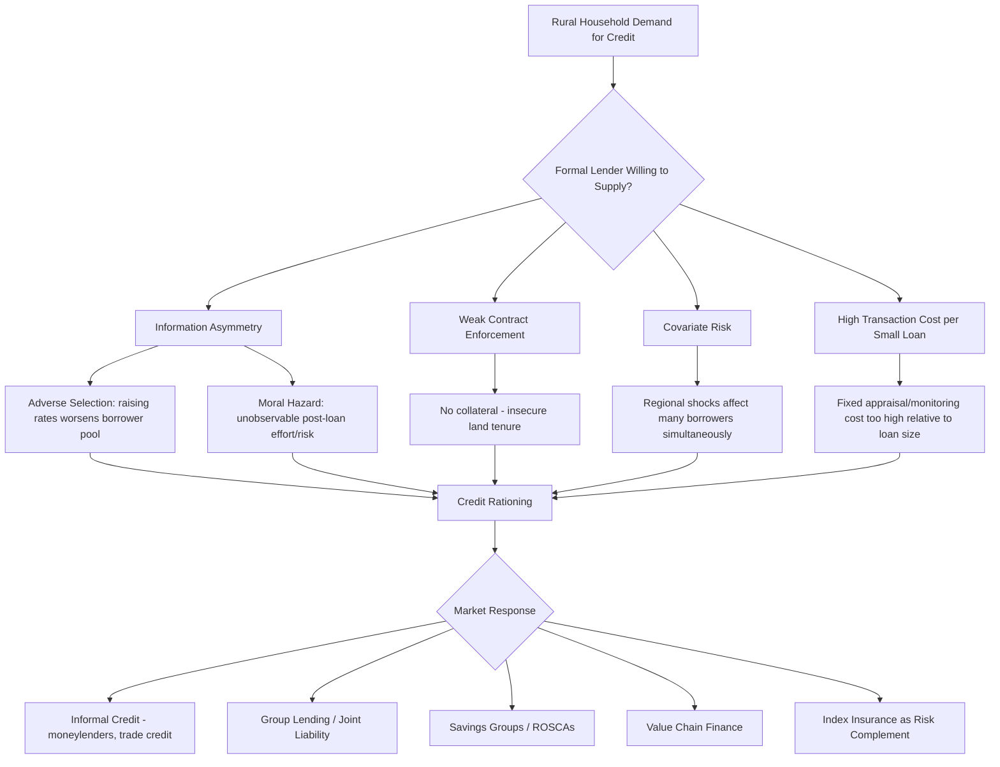

## Rural Credit and Financial Constraints

### Definition and Scope

Rural credit and financial constraints refer to the barriers rural households and farmers face in accessing formal and informal financial services — credit, savings, insurance, and payment mechanisms — that limit their ability to invest in agricultural production, smooth consumption across seasons, and manage risk. This is one of the most extensively studied topics in development economics, since credit market failures are frequently identified as a root cause behind other constraints discussed in this chapter, including low technology adoption and underinvestment relative to farm size.

**Key Points**

- Rural financial markets are characterized by pervasive market failures rooted in information asymmetries, weak contract enforcement, and covariate (correlated) risk.
- A "credit-constrained" household is one that would borrow more at the prevailing interest rate if lenders permitted it — distinguishing genuine rationing from voluntary non-borrowing due to low expected returns or risk aversion.
- Informal credit (moneylenders, rotating savings groups, trader credit) often coexists with formal credit precisely because it exploits local information and social enforcement mechanisms that formal lenders lack.

### Why Rural Credit Markets Fail: Core Theoretical Mechanisms

#### Asymmetric Information: Adverse Selection

Lenders cannot fully observe a borrower's riskiness before lending. If a single interest rate is charged to a pool of borrowers with heterogeneous risk, raising the interest rate to cover average default risk can drive safer borrowers out of the market (since they are being overcharged relative to their true risk), leaving a riskier residual pool — the classic Stiglitz-Weiss adverse selection result. This can lead a profit-maximizing lender to rationally ration credit (deny loans to some observationally identical applicants) rather than raise the interest rate to clear the market, since $\partial(\text{expected return})/\partial(\text{interest rate})$ can become negative beyond some point.

#### Asymmetric Information: Moral Hazard

Once a loan is disbursed, borrowers may take actions (effort level, riskiness of the investment) that are not fully observable to the lender, and that shift risk/return away from what was assumed at underwriting.

#### Limited Contract Enforcement

In the absence of reliable courts or seizable collateral (frequently linked to land tenure insecurity — see land tenure systems and land reform), lenders cannot reliably force repayment, further constraining the willingness to lend without collateral substitutes.

#### Covariate (Systemic) Risk

Agricultural income risk is spatially correlated — a drought or pest outbreak affects many borrowers in the same lending area simultaneously, undermining risk-pooling strategies (like village-based group lending) that work well for idiosyncratic risks but fail when shocks are covariate, since the lender cannot diversify away region-wide agricultural risk through its local loan portfolio alone.

#### High Transaction Costs

Small, geographically dispersed loan sizes typical of smallholder agriculture generate high fixed administrative costs per unit lent (loan appraisal, monitoring, collection), which formal financial institutions often find unprofitable relative to urban or larger commercial lending, historically motivating public development bank interventions and, more recently, mobile-money-based cost reduction strategies.

### Types of Rural Financial Arrangements

#### Formal Credit

Bank loans, agricultural development bank lending, and government-directed credit programs, typically requiring collateral (often land title) and formal documentation. Historically prone to poor repayment performance and heavy subsidization in many developing-country contexts, motivating a shift in development policy since the 1990s toward market-based microfinance approaches.

#### Microfinance and Group Lending

Joint-liability group lending models (popularized by the Grameen Bank in Bangladesh) substitute social collateral and peer monitoring for physical collateral, relying on the theoretical logic that borrowers have better information about their peers' risk and repayment capacity than a distant formal lender does, and that peer pressure/social sanction can substitute for legal enforcement. Empirical impact evidence from a series of randomized evaluations conducted across multiple countries in the 2010s generally found microcredit access produced modest effects on average business investment and household outcomes, without the transformative poverty-reduction effects originally hoped for, prompting a more measured view of microfinance's role in the broader development finance toolkit. [Inference — this "no effect / modest effect" characterization is well-supported by the multi-country RCT literature described, though results vary somewhat by study and outcome measure.]

#### Informal Credit

Moneylenders, input suppliers extending trade credit, landlords, and family/friend networks. Informal lenders often possess superior local information and enforcement mechanisms (repeated interaction, social ties) but may charge substantially higher interest rates than formal credit, reflecting both genuine risk/cost premiums and, in some documented cases, monopoly power in thin rural credit markets.

#### Rotating Savings and Credit Associations (ROSCAs) and Savings Groups

Member-based savings mechanisms in which participants contribute regularly to a common pool, with the full pot rotating to a different member each cycle (ROSCAs) or accumulating for group-decided lending and end-of-cycle payout (accumulating savings and credit associations, ASCAs). These mechanisms address both savings constraints (providing commitment devices against pressure to spend) and limited credit access, and have been extensively studied in the savings-constraints literature.

#### Value Chain and Contract Finance

Input suppliers, processors, or buyers extend credit (seed, fertilizer, cash advances) against future crop delivery, embedding credit within a broader marketing or contract-farming relationship, which can reduce enforcement costs since the buyer already has a commercial relationship and delivery leverage over the borrower.

#### Index-Based and Weather Insurance (Complementary to Credit)

Because covariate risk undermines both informal risk-sharing and formal lending, index-based insurance products (payouts tied to rainfall or satellite-derived indices rather than individually verified losses) have been developed as a complementary tool to reduce the systemic risk that constrains rural credit supply; adoption of such products has often been lower than anticipated by early models, motivating ongoing research into basis risk, trust, and liquidity constraints as barriers to insurance uptake itself. [Unverified — adoption rates and specific product designs vary considerably by country and continue to evolve, so current figures should be checked against recent sources if precision is required.]

### Formal Model: Credit Rationing under Adverse Selection

Consider a lender facing a pool of borrowers with heterogeneous project risk. Expected lender return per loan at interest rate $r$ can be written as:

$$E[\pi(r)] = p(r)(1+r)L - (1-p(r)) \cdot 0$$

where $p(r)$ is the probability of repayment (which itself depends on $r$ due to adverse selection and moral hazard: $p'(r) < 0$), and $L$ is the loan amount. Differentiating with respect to $r$:

$$\frac{dE[\pi]}{dr} = p(r)L + p'(r)(1+r)L$$

Beyond some interest rate $r^*$, the negative second term (fewer/riskier borrowers self-select into borrowing) dominates the positive first term (higher return per repaid loan), so $dE[\pi]/dr < 0$. A profit-maximizing lender then sets $r^*$ below the market-clearing rate and rations credit via quantity limits rather than price, leaving some observationally creditworthy borrowers unable to obtain loans at any price — the theoretical foundation for the widely observed phenomenon of credit rationing in imperfect-information credit markets.

### Illustrative Examples

**Grameen Bank and joint-liability lending (Bangladesh)**: The pioneering group-lending microfinance model demonstrated that high repayment rates were achievable among poor, collateral-lacking rural borrowers using social collateral mechanisms, substantially influencing global microfinance policy and practice from the 1980s onward.

**Randomized microcredit expansion evaluations**: A coordinated set of randomized evaluations of microcredit expansion across several countries (including studies in India, Mexico, Morocco, Bosnia, Mongolia, and the Philippines) generally found small or statistically insignificant average effects on household income and consumption, though with some heterogeneous effects for pre-existing businesses, reshaping the field's understanding of microcredit's likely impact scale.

**Mobile money and rural financial inclusion (Kenya M-Pesa)**: The mobile money system M-Pesa, launched in Kenya, has been extensively studied for its effects on rural households' ability to manage risk through remittance receipt and reduced transaction costs of transferring funds across social networks in response to shocks, illustrating how digital payment infrastructure can address transaction-cost dimensions of rural financial constraints even where formal credit remains limited. [Unverified — specific quantitative impact estimates and the platform's current scale/features should be checked against up-to-date sources given the pace of change in mobile financial services.]

**Warehouse receipt systems**: Programs allowing farmers to deposit stored crops in certified warehouses and borrow against the receipt (rather than selling immediately at post-harvest low prices) address both a credit constraint and a price-risk constraint simultaneously, illustrating an institutional design response engineered around the collateral-substitute problem.

### Diagram: Sources of Rural Credit Market Failure

### Diagram: Credit Rationing Under Adverse Selection (svg_diagram)

<svg xmlns="http://www.w3.org/2000/svg" viewBox="0 0 680 400">
<text x="340" y="30" text-anchor="middle" font-size="17" font-weight="bold" fill="#1a1a1a">Lender Expected Return vs. Interest Rate (svg_diagram)</text>
<line x1="70" y1="330" x2="620" y2="330" stroke="#2d3748" stroke-width="2" />
<line x1="70" y1="330" x2="70" y2="60" stroke="#2d3748" stroke-width="2" />
<text x="345" y="365" text-anchor="middle" font-size="12">Interest Rate (r)</text>
<text x="30" y="195" text-anchor="middle" font-size="12" transform="rotate(-90 30 195)">Expected Lender Return</text>

<path d="M 90 300 C 200 200, 280 110, 360 95 C 440 110, 520 200, 600 290" fill="none" stroke="`#c53030`" stroke-width="3" />

<line x1="360" y1="330" x2="360" y2="95" stroke="#4a5568" stroke-width="1" stroke-dasharray="4,4" />
<text x="360" y="350" text-anchor="middle" font-size="11" fill="#4a5568">r* (optimal, rationing rate)</text>
<circle cx="360" cy="95" r="5" fill="#c53030" />
<text x="450" y="70" font-size="11" fill="#4a5568">Adverse selection dominates beyond r*</text>
</svg>

### Policy and Program Design Implications

- **Collateral substitutes**: Group liability, warehouse receipts, and movable-asset registries address the enforcement constraint without requiring formal land title, relevant given the land tenure discussion elsewhere in this chapter.
- **Risk-sharing complements**: Because covariate risk is a structural barrier, credit-market interventions are increasingly paired with index insurance products, savings mechanisms, or public safety nets rather than treated as a standalone fix.
- **Digital financial infrastructure**: Mobile money and digital credit-scoring (using transaction or agricultural data) are active areas of innovation seeking to reduce transaction costs and improve information available to lenders, though rigorous, generalizable impact evidence for many specific digital-credit products remains more limited than for established microfinance and savings-group models. [Inference — this reflects the relative newness of many digital credit products compared to decades of accumulated microfinance research.]
- **Sequencing with other constraints**: As with technology adoption, credit access alone often fails to raise investment or productivity where information, risk, or output-market constraints are simultaneously binding, reinforcing the "diagnose the binding constraint" logic introduced in agricultural productivity constraints.

### Related Topics

- Land tenure systems and land reform
- Agricultural technology adoption
- Agricultural productivity constraints
- Farm size and productivity relationship
- Risk, insurance, and index-based weather products
- Microfinance institutions and group lending theory
- Mobile money and digital financial inclusion
- Rural savings behavior and commitment devices
- Randomized controlled trials in development finance research