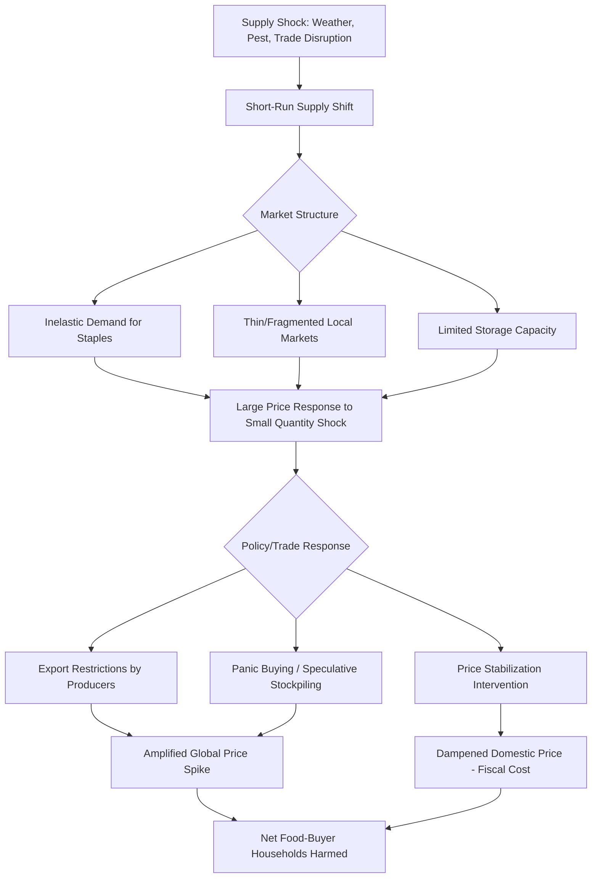

## Agricultural Markets and Price Volatility

### Definition and Scope

Agricultural markets and price volatility concerns how output and input markets for agricultural commodities function in developing economies, and why agricultural prices tend to exhibit greater short-run fluctuation than prices for most manufactured goods. This volatility has first-order welfare consequences for both producers (income risk) and consumers (food security), and interacts closely with the credit, insurance, and technology adoption constraints discussed elsewhere in this chapter.

**Key Points**

- Agricultural commodity prices are structurally prone to volatility because both supply (weather-dependent, lagged production cycles) and demand (relatively price- and income-inelastic for staple foods) respond sluggishly to price signals.
- Price volatility differs conceptually from price level: a market can have persistently high prices with low volatility, or fluctuate sharply around a stable long-run average; policy responses appropriate to one problem are not necessarily appropriate to the other.
- Market failures in storage, transport, and information transmission in developing-country contexts often amplify volatility beyond what fundamentals (weather, global supply/demand) alone would generate.

### Structural Sources of Agricultural Price Volatility

#### Inelastic Supply and Demand

Agricultural staple food demand is typically price- and income-inelastic in the short run (people do not sharply reduce staple food consumption when prices rise, nor sharply increase it when prices fall), and supply is constrained within a season by planting decisions already made months earlier. When a shock (drought, pest outbreak, trade disruption) shifts supply, the near-vertical short-run supply and demand curves mean even a modest quantity shock produces a large price change — a standard cobweb/inelastic-market diagram result:

$$\%\Delta P \approx \frac{\%\Delta Q_s}{\varepsilon_d - \varepsilon_s}$$

where $\varepsilon_d$ and $\varepsilon_s$ are (typically small in magnitude) short-run demand and supply elasticities, meaning a small supply shock $\%\Delta Q_s$ translates into a disproportionately large price movement.

#### The Cobweb Model and Production Lags

Agricultural production decisions (planting) are made based on prices observed at the time of planting, but realized output and its market price occur only after a lag (the growing season). This generates the classic **cobweb model** dynamic, in which farmers respond to last period's price with this period's planting decisions, producing potentially oscillating (or, under certain elasticity conditions, explosive or convergent) price cycles over successive periods:

$$Q_t^s = f(P_{t-1}), \quad P_t = D^{-1}(Q_t^s)$$

Whether the resulting price path converges, oscillates persistently, or diverges depends on the relative slopes of supply and demand curves — convergence requires demand to be more elastic (flatter) than supply.

#### Weather and Climate Shocks

Rainfall variability, temperature extremes, and increasingly climate change-linked weather volatility directly shift agricultural supply, and — because many staple crops are grown in geographically concentrated regions — a shock in a major producing region can move global or regional prices substantially.

#### Thin Markets and High Transaction Costs

In many developing-country rural markets, the number of active buyers and sellers is small, transport infrastructure is poor, and storage capacity is limited, meaning local prices can diverge sharply from regional or world prices and display high spatial and temporal volatility uncorrelated with broader market fundamentals — a market failure distinct from, and additive to, the structural inelasticity problem above.

#### Speculative and Financialized Trading (Global Commodity Markets)

For internationally traded commodities, activity in futures and derivatives markets, exchange rate movements, and cross-commodity linkages (e.g., biofuel-driven linkages between oil and maize prices) have been argued by some researchers to amplify price volatility beyond what physical fundamentals alone would predict, though the magnitude of this "financialization" effect on price levels versus volatility remains actively debated in the literature. [Inference — this is a genuinely contested empirical question rather than settled consensus, and should be presented as such.]

#### Trade Policy and Export Restrictions

Food-price spikes have historically triggered a cascade of export restrictions by producing countries seeking to protect domestic consumers, which — because they simultaneously reduce global tradable supply — have been documented to amplify rather than dampen the international price spike that triggered them in the first place, a well-documented dynamic during the 2007–2008 and 2010–2011 global food price crises.

### Welfare and Distributional Consequences

- **Producer risk**: Price volatility compounds production risk (yield variability) for farmers, discouraging investment in profitable but variable-return technologies (linking to agricultural technology adoption) and reinforcing risk-averse behavior.
- **Consumer welfare**: Since poor households in developing countries typically spend a large budget share on staple foods, price spikes disproportionately harm net food-buying poor households, while price crashes disproportionately harm net food-selling poor farm households — meaning volatility (in either direction) tends to hurt whichever side of the market a poor household is on.
- **Net buyers vs. net sellers**: A crucial and often overlooked distinction is that most poor rural households in developing countries are net food buyers even though they are farmers (they do not produce enough surplus to be net sellers), meaning food price increases can harm a majority of poor rural households despite popular framing of "farmers benefiting from high prices." [Inference — the precise net-buyer/net-seller split varies by country and should not be assumed universal, though the pattern of poor rural households being net buyers is documented across many developing-country household surveys.]

### Market and Policy Instruments for Managing Volatility

#### Storage and Buffer Stocks

Public or private grain reserves can smooth price fluctuations by releasing stock during shortages and accumulating during surpluses, though buffer stock schemes have a documented history of high fiscal cost, storage losses, and susceptibility to poor management or political interference in numerous developing-country implementations.

#### Price Stabilization Policies

Government-set minimum support prices, marketing boards, or price bands aim to reduce farmer-facing or consumer-facing volatility, but can generate fiscal costs, create incentives for smuggling/arbitrage when domestic and border prices diverge, and in some documented historical cases (state grain marketing monopolies) have suppressed farmer incentives and long-run production more than they stabilized short-run prices.

#### Trade Policy Instruments

Variable tariffs, export bans, and strategic reserves are used to insulate domestic markets from world price volatility, though as noted above, coordinated multi-country use of export restrictions during price spikes is well documented to be self-defeating at the aggregate level even where individually rational for a single exporting country (a collective action problem).

#### Market Information Systems

Public dissemination of price information (via radio, SMS, or digital platforms) aims to reduce the "thin market" problem by improving farmers' bargaining position and enabling arbitrage that narrows price gaps across locations; a body of applied research (e.g., studies of mobile-phone-based market information in West Africa) has found modest but generally positive effects on farmer prices received and reductions in cross-market price dispersion, though effect sizes vary by context and market structure. [Unverified — specific programs and their evaluated impact magnitudes should be checked against current sources given the pace of change in this space.]

#### Index-Based and Futures-Market Risk Instruments

As discussed under rural credit and financial constraints, index-based insurance and (for larger commercial farmers, cooperatives, or governments) commodity futures/options hedging are used to manage price risk without requiring physical storage, though smallholder access to formal futures markets remains limited in most developing-country contexts.

#### Contract Farming and Forward Contracts

Pre-agreed price contracts between farmers and buyers/processors shift price risk to the contracting party (often better positioned to hedge or absorb it), providing farmers price certainty in exchange for typically forgoing some upside if market prices later rise above the contracted price.

### Illustrative Examples

**2007–2008 and 2010–2011 global food price crises**: Global prices for staple grains (rice, wheat, maize) spiked sharply, driven by a combination of poor harvests in major producing regions, rising biofuel demand for maize, rising oil prices affecting input and transport costs, and a wave of export restrictions by rice- and wheat-exporting countries that amplified the price spike — a widely cited case study in the trade-policy-amplification mechanism described above.

**Ethiopian Commodity Exchange (ECX)**: Established to formalize and centralize trading of key commodities (notably coffee) with standardized grading, warehouse receipts, and transparent price discovery, aiming to reduce the thin-market and information-asymmetry problems affecting smallholder-linked commodity trade. [Unverified — the exchange's current commodity coverage and specific operational details should be checked against current sources, as institutional scope has evolved since establishment.]

**India's Minimum Support Price (MSP) system**: A long-standing price floor mechanism for select crops (notably rice and wheat), intended to protect farmer income, has been widely analyzed for its fiscal cost, its concentration of benefits among farmers with better market access (given uneven implementation of actual government procurement), and its influence on cropping pattern distortions favoring MSP-supported crops over others.

### Diagram: Price Volatility Transmission Mechanism

### Diagram: Cobweb Model of Price Cycles (svg_diagram)

<svg xmlns="http://www.w3.org/2000/svg" viewBox="0 0 640 420">
<text x="320" y="30" text-anchor="middle" font-size="17" font-weight="bold" fill="#1a1a1a">Cobweb Model: Converging Price Cycle (svg_diagram)</text>
<line x1="80" y1="350" x2="580" y2="350" stroke="#2d3748" stroke-width="2" />
<line x1="80" y1="350" x2="80" y2="60" stroke="#2d3748" stroke-width="2" />
<text x="330" y="380" text-anchor="middle" font-size="12">Quantity</text>
<text x="40" y="205" text-anchor="middle" font-size="12" transform="rotate(-90 40 205)">Price</text>
<line x1="120" y1="90" x2="500" y2="330" stroke="#2b6cb0" stroke-width="2" />
<text x="500" y="345" font-size="11" fill="#2b6cb0">Demand</text>
<line x1="180" y1="330" x2="440" y2="90" stroke="#c53030" stroke-width="2" />
<text x="440" y="80" font-size="11" fill="#c53030">Supply</text>

<polyline points="310,200 310,110 240,110 240,240 340,240 340,160 290,160 290,205" fill="none" stroke="`#38a169`" stroke-width="2" stroke-dasharray="5,3" />

<text x="360" y="200" font-size="11" fill="`#38a169`">Price path spirals inward toward equilibrium</text>

</svg>

### Related Topics

- Agricultural technology adoption
- Rural credit and financial constraints
- Farm size and productivity relationship
- Food security and consumption smoothing
- International trade policy and agricultural export restrictions
- Commodity futures markets and hedging instruments
- Storage economics and buffer stock policy
- Market information systems and ICT in agriculture
- Agricultural productivity constraints