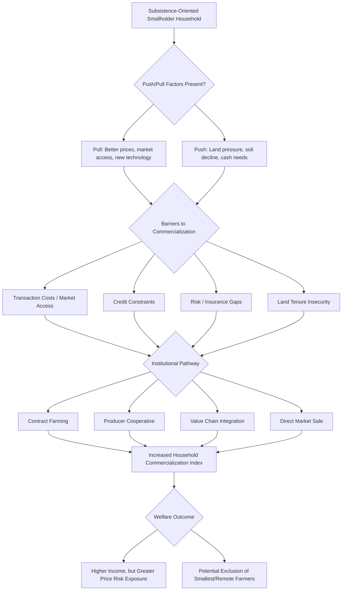

## Smallholder Farming and Commercialization

### Definition and Scope

Smallholder farming refers to agricultural production carried out on small landholdings (commonly defined as under 2 hectares, though thresholds vary by country and context), typically by household labor and often combining subsistence production with some degree of market participation. Commercialization refers to the process by which smallholder households shift from primarily subsistence-oriented production toward greater market orientation — selling a larger share of output, purchasing more inputs, and increasingly specializing production according to comparative advantage and market signals rather than solely household consumption needs.

**Key Points**

- Smallholders account for a large share of total farms and agricultural production in most developing countries, particularly across Sub-Saharan Africa and South and Southeast Asia.
- Commercialization is best understood as a continuum (from purely subsistence to fully commercial) rather than a binary state, and can be measured using indices such as the household commercialization index (value of crop sales / total value of crop production).
- The relationship between commercialization and household welfare is theoretically ambiguous and empirically context-dependent — commercialization can raise incomes but can also increase exposure to price risk and market failures.

### Conceptual Framework: The Household Commercialization Index

A standard measure of commercialization at the household level:

$$HCI_i = \frac{\text{Gross value of crop sales}_i}{\text{Gross value of all crop production}_i} \times 100$$

An index near 0 indicates a purely subsistence-oriented household; an index near 100 indicates a fully commercial household selling nearly all output. This index allows commercialization to be treated as a continuous outcome variable in regression analysis rather than an arbitrary binary classification, and is widely used in the applied agricultural household literature.

### Theoretical Models of the Smallholder Household

#### The Agricultural Household Model

Building on the separable farm-household framework, smallholder decision-making is often modeled in two stages under the assumption of complete and well-functioning markets:

1. **Production decision**: The household chooses input use and output mix to maximize farm profit, treating labor, land, and output as tradeable at market prices, independent of household consumption preferences (the "separability" result).
2. **Consumption/labor-supply decision**: Given resulting farm profit, the household allocates income and labor between farm work, off-farm work, and leisure/home production to maximize utility.

Separability breaks down when markets are missing or incomplete (e.g., no labor market, no credit market, no insurance market) — in that case, production decisions become entangled with household consumption preferences and risk attitudes, meaning two farms with identical land and technology but different household composition or risk tolerance may make different, non-profit-maximizing production choices. This non-separable case is generally considered more empirically relevant for many smallholder contexts in developing countries, and helps explain patterns such as the labor-intensity effects underlying the inverse farm size–productivity relationship.

#### Push and Pull Factors in Commercialization

- **Pull factors**: Rising output prices, improved market access (roads, market information), availability of profitable new technologies or crops, and access to credit that enables input purchase for market-oriented production.
- **Push factors**: Population pressure reducing per-capita landholding, declining soil fertility under subsistence cropping, or the need for cash income to meet non-farm obligations (school fees, health costs, tax payments) can push households toward selling more output even absent improved market conditions.

### Barriers to Smallholder Commercialization

Smallholder commercialization is constrained by the same broad categories of market failure discussed throughout this chapter, with some commercialization-specific manifestations:

- **Transaction costs and market access**: Poor rural roads and dispersed, small marketable surpluses per household raise the per-unit cost of getting output to market, often making commercial sale unprofitable below some threshold surplus level — a "transaction cost threshold" model in which some households are structurally excluded from market participation regardless of price incentives.
- **Credit constraints**: Purchasing inputs for higher-value, more market-oriented production (improved seed, fertilizer, irrigation) typically requires upfront capital that credit-constrained households lack (see rural credit and financial constraints).
- **Risk and insurance gaps**: Commercialization frequently entails greater exposure to price risk (in exchange for reduced self-sufficiency in staple food production), which risk-averse, credit- and insurance-constrained households may rationally avoid even where expected returns are higher — connecting directly to the price volatility risks discussed under agricultural markets and price volatility.
- **Land tenure insecurity**: Reduces incentives to invest in commercial crops with longer payback periods (e.g., perennial tree crops, orchards), as discussed under land tenure systems and land reform.
- **Contract enforcement and buyer power**: Smallholders selling to a small number of buyers/processors (monopsony-like local market structure) may capture a reduced share of value chain surplus, weakening commercialization incentives even where technically feasible.
- **Information gaps**: Limited knowledge of prevailing market prices, quality standards, or buyer requirements can prevent smallholders from making profitable market-oriented production decisions, connecting to the market information systems discussed under price volatility.

### Pathways and Institutional Arrangements for Commercialization

#### Contract Farming

Formal or informal agreements between farmers and buyers/processors specifying quantity, quality, price, and often input provision (seed, credit, technical advice) in advance of the growing season. Contract farming shifts some price and market risk to the contracting firm and can relax credit constraints (via input advances), but raises concerns about unequal bargaining power, contract enforcement, and potential exclusion of the smallest or most remote farmers from participation (since firms often prefer to contract with farmers who are more easily monitored and reliably deliver quality/quantity).

#### Producer Organizations and Cooperatives

Farmer groups can achieve economies of scale in input purchasing, output marketing, and access to credit or extension services that individual smallholders cannot achieve alone, and can improve farmers' bargaining position relative to buyers. Cooperative performance is documented to vary substantially based on governance quality, elite capture risk within the cooperative, and the specific value chain context. [Inference — this variability is well-established in the cooperative development literature, though drawing universal conclusions about cooperative effectiveness across all contexts is not well-supported by the mixed evidence.]

#### Value Chain Integration and Vertical Coordination

Modern retail and export supply chains (supermarkets, agro-processors) increasingly impose quality, food safety, and traceability standards that can create new market opportunities for commercializing smallholders but can also raise entry barriers that exclude smallholders lacking capital or technical capacity to meet standards, a documented tension in the "supermarketization" literature examining smallholder inclusion in modern value chains.

#### Digital Market Linkage Platforms (Recent/Emerging)

A growing set of digital platforms connect smallholders directly to buyers, provide price information, or facilitate aggregation and logistics (relevant recent examples include various e-commerce and agri-tech platforms operating across Sub-Saharan Africa and South Asia). Given the pace of change and variation in specific platform models, business viability, and evaluated impact in this subsector, current platform names, market coverage, and rigorous impact evidence should be checked against up-to-date sources rather than relied upon from general background knowledge. [Unverified — this is an actively evolving area where specific claims risk being outdated.]

### Diagram: Smallholder Commercialization Pathway

### Diagram: Separable vs. Non-Separable Household Models (svg_diagram)

<svg xmlns="http://www.w3.org/2000/svg" viewBox="0 0 740 380">
<text x="370" y="30" text-anchor="middle" font-size="17" font-weight="bold" fill="#1a1a1a">Separable vs Non-Separable Household Models (svg_diagram)</text>
<rect x="40" y="70" width="300" height="270" rx="8" fill="#ebf8ff" stroke="#2b6cb0" stroke-width="2" />
<text x="190" y="100" text-anchor="middle" font-size="14" font-weight="bold" fill="#2b6cb0">Separable (Complete Markets)</text>
<rect x="70" y="130" width="240" height="50" rx="5" fill="#ffffff" stroke="#2b6cb0" />
<text x="190" y="160" text-anchor="middle" font-size="12">Production: profit-max given prices</text>
<text x="190" y="200" text-anchor="middle" font-size="20">↓</text>
<rect x="70" y="220" width="240" height="50" rx="5" fill="#ffffff" stroke="#2b6cb0" />
<text x="190" y="250" text-anchor="middle" font-size="12">Consumption: allocate resulting income</text>
<text x="190" y="305" text-anchor="middle" font-size="11" fill="#2c5282">Decisions independent of preferences</text>
<rect x="400" y="70" width="300" height="270" rx="8" fill="#fff5f5" stroke="#c53030" stroke-width="2" />
<text x="550" y="100" text-anchor="middle" font-size="14" font-weight="bold" fill="#c53030">Non-Separable (Missing Markets)</text>
<rect x="430" y="150" width="240" height="90" rx="5" fill="#ffffff" stroke="#c53030" />
<text x="550" y="180" text-anchor="middle" font-size="12">Production and Consumption</text>
<text x="550" y="200" text-anchor="middle" font-size="12">jointly determined</text>
<text x="550" y="220" text-anchor="middle" font-size="11">(labor, credit, or insurance</text>
<text x="550" y="235" text-anchor="middle" font-size="11">markets missing/incomplete)</text>
<text x="550" y="305" text-anchor="middle" font-size="11" fill="#822727">Household risk/preferences shape output choice</text>
</svg>

### Illustrative Examples

**Kenyan horticultural export value chains**: Smallholder participation in high-value export horticulture (e.g., fresh vegetables for European supermarkets) has been extensively studied for its potential to raise smallholder incomes, alongside documented risk that stringent food safety and traceability standards can favor larger, better-capitalized farms, sometimes shifting sourcing away from smallholders over time. [Inference — the specific pattern of inclusion versus exclusion varies by crop, buyer, and period, and should not be generalized as a universal trajectory across all export value chains.]

**Contract sugarcane and dairy schemes (South and Southeast Asia)**: Long-standing contract farming arrangements in sugarcane and dairy sectors are commonly cited as examples where processor-provided input credit and guaranteed off-take have supported smallholder commercialization, though the distribution of contract-related bargaining power and price-setting between processor and farmer remains a persistent point of policy and research attention.

**Ethiopian and Rwandan cooperative-based coffee marketing**: Coffee cooperatives have been used as an institutional vehicle to help smallholders access specialty and export markets, with performance varying by cooperative governance quality and access to complementary services such as quality-grading infrastructure.

### Related Topics

- Agricultural markets and price volatility
- Rural credit and financial constraints
- Agricultural technology adoption
- Farm size and productivity relationship
- Land tenure systems and land reform
- Agricultural household models and non-separability
- Value chains and vertical coordination in agribusiness
- Cooperative economics and collective action
- Rural non-farm employment and income diversification