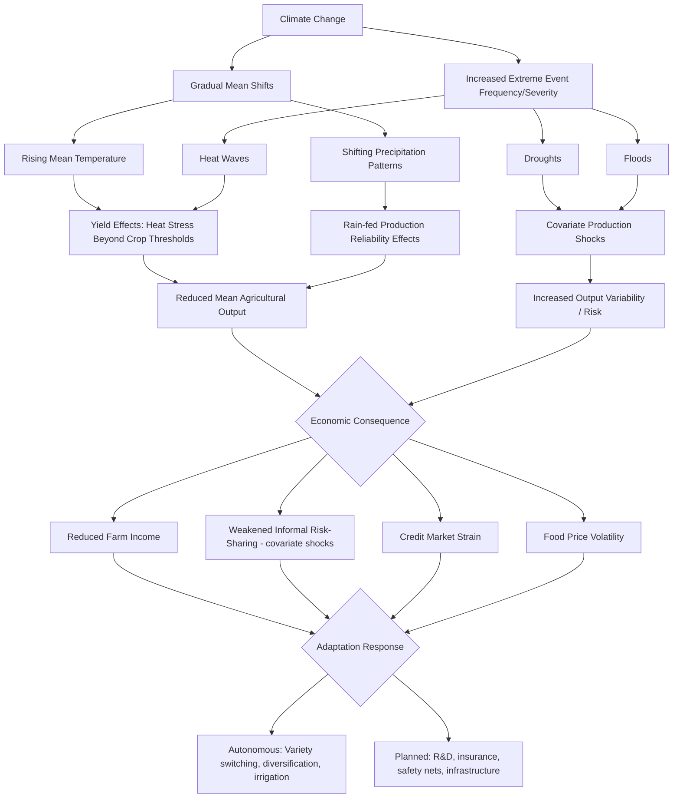

## Climate Change Effects on Agriculture

### Definition and Scope

Climate change effects on agriculture refers to the impact of long-term shifts in temperature, precipitation patterns, and the frequency/intensity of extreme weather events on agricultural production systems, and the economic analysis of how farmers and rural economies adapt to — and are affected by — these changes. This topic connects biophysical climate science to the economic constraints discussed throughout this chapter, since climate change intensifies many pre-existing productivity, credit, and market risks facing smallholder agriculture.

**Key Points**

- Climate change affects agriculture through both gradual shifts in mean conditions (warming trends, changing rainfall patterns) and increased frequency/severity of discrete extreme events (droughts, floods, heat waves).
- Developing-country agriculture, and smallholder rain-fed systems in particular, are widely assessed as disproportionately vulnerable due to greater reliance on climate-sensitive rain-fed production, limited adaptive capacity (credit, insurance, irrigation infrastructure), and geographic concentration in regions already near heat and aridity thresholds for major crops.
- Economic analysis distinguishes between climate change's effects on the level and variability of agricultural output, since these two dimensions call for different types of policy and household-level response (yield-enhancing technology versus risk-management instruments).

### Biophysical Channels of Impact

#### Temperature Effects

Crop yield response to temperature is generally characterized by an inverted-U relationship: yields increase with temperature up to a crop-specific optimum, then decline sharply beyond that threshold due to heat stress on plant physiology (e.g., reduced grain-fill duration, increased evapotranspiration stress). Because many tropical and sub-tropical agricultural regions already operate near or above these thresholds for staple crops such as maize, further warming is projected by climate-crop modeling studies to reduce yields in these regions even as some higher-latitude regions may see yield gains from warming, a pattern generating substantial spatial heterogeneity in projected climate impacts.

#### Precipitation Variability

Changes in the timing, quantity, and reliability of rainfall affect rain-fed agriculture (the dominant production system for most Sub-Saharan African and many South Asian smallholders) both through changes in total seasonal rainfall and through changes in intra-seasonal distribution (e.g., delayed onset of rains, increased frequency of dry spells during critical growth stages), with the latter often more consequential for yield outcomes than total seasonal rainfall alone.

#### Extreme Weather Events

Increased frequency and/or intensity of droughts, floods, and tropical storms directly damages standing crops and agricultural infrastructure, and — because these events are covariate (affecting many farmers in a region simultaneously) — they undermine informal risk-sharing arrangements and formal credit/insurance markets in the same way discussed under rural credit and financial constraints.

#### CO2 Fertilization Effects

Elevated atmospheric CO2 concentrations can increase photosynthetic rates and water-use efficiency for some plant types (particularly C3 crops like wheat, rice, and soybeans, more so than C4 crops like maize), a partially offsetting effect incorporated into crop simulation models, though its magnitude under realistic field conditions (as opposed to controlled experiments) remains an active area of scientific research and is generally considered insufficient to fully offset heat and water stress impacts in most tropical staple-crop contexts. [Inference — the degree of offset is genuinely contested in the agronomic literature and should not be presented as a settled, precisely quantified effect.]

#### Pest, Disease, and Weed Pressure

Changing temperature and humidity patterns can shift the geographic range and severity of crop pests, livestock diseases, and weed competition, with documented range expansions of some agricultural pests into previously unaffected regions, though specific pest-by-pest projections carry substantial scientific uncertainty.

### Economic Modeling Approaches

#### Production Function / Crop Simulation Approach

Biophysical crop models (e.g., DSSAT, APSIM-type frameworks) simulate yield response to projected climate variables under specified management assumptions, then feed these yield projections into economic models to estimate production, price, and welfare effects. This approach allows explicit modeling of agronomic mechanisms but requires assumptions about future farmer management practices that may not hold if farmers adapt in unmodeled ways.

#### Ricardian (Hedonic) Approach

Pioneered in the climate-agriculture economics literature, this approach regresses observed farmland value or net revenue on climate variables (average temperature, precipitation) across a cross-section of locations, under the logic that land value already capitalizes farmers' long-run adaptation to local climate:

$$V_i = \beta_0 + \beta_1 T_i + \beta_2 T_i^2 + \beta_3 R_i + \beta_4 R_i^2 + \mathbf{X}_i'\gamma + \varepsilon_i$$

where $V_i$ is farmland value or net revenue in location $i$, $T_i$ is temperature, $R_i$ is precipitation, and $\mathbf{X}_i$ includes soil and other controls. This method has the advantage of implicitly capturing farmer adaptation (since it uses observed outcomes under prevailing climate), but has been critiqued for potentially conflating climate effects with unobserved cross-sectional differences (e.g., market access, historical land quality) between regions with different climates, and for not accounting for the possibility that future climate change may exceed the range of historical climate variation observed in the cross-section — an out-of-sample extrapolation concern.

#### Panel/Weather-Shock Approach

More recent empirical work exploits year-to-year weather variation within the same location (using panel data with location fixed effects) to estimate the short-run causal effect of weather shocks on yields or farm income, avoiding the cross-sectional confounding concern of the Ricardian approach, but at the cost of potentially understating farmers' longer-run adaptive capacity (since a single bad-weather year does not allow time for adaptations like switching crop varieties or adopting irrigation).

### Adaptation Strategies

#### Autonomous (Farmer-Level) Adaptation

- **Crop and variety switching**: Shifting toward more heat- or drought-tolerant varieties or crop species.
- **Diversification**: Planting multiple crops or varieties with different climate sensitivities to spread risk (an extension of the risk-management logic discussed under rural credit and financial constraints).
- **Adjusted planting dates**: Shifting planting timing in response to changing rainfall onset patterns.
- **Water management**: Adoption of irrigation, water harvesting, and soil moisture conservation techniques where feasible.
- **Income diversification**: Shifting household labor toward non-farm income sources to reduce dependence on climate-exposed farm income.

#### Planned (Policy-Level) Adaptation

- **Agricultural research and development**: Public investment in breeding heat- and drought-tolerant crop varieties (an ongoing focus of CGIAR-system agricultural research centers).
- **Irrigation infrastructure investment**: Expanding irrigation coverage to reduce rain-fed dependence, connecting to the biophysical constraints discussed under agricultural productivity constraints.
- **Index-based weather insurance**: Providing payouts triggered by weather indices to help farmers manage climate-related income risk, as discussed under rural credit and financial constraints — a tool of particular relevance given that climate change is expected to increase the frequency of the covariate shocks that most challenge informal risk-sharing.
- **Social protection and safety nets**: Cash transfer or public works programs that can be scaled up in response to climate shocks (e.g., drought-triggered safety net expansions) to protect consumption without requiring farmers to sell productive assets in bad years.
- **Climate information services**: Improved weather forecasting and agro-climatic advisory services to support farmer decision-making, connecting to the information-constraint discussion under agricultural technology adoption.

### Diagram: Climate Change Impact Pathways in Agriculture

### Diagram: Crop Yield Response to Temperature (svg_diagram)

<svg xmlns="http://www.w3.org/2000/svg" viewBox="0 0 680 380">
<text x="340" y="30" text-anchor="middle" font-size="17" font-weight="bold" fill="#1a1a1a">Crop Yield Response to Temperature (svg_diagram)</text>
<line x1="80" y1="330" x2="600" y2="330" stroke="#2d3748" stroke-width="2" />
<line x1="80" y1="330" x2="80" y2="60" stroke="#2d3748" stroke-width="2" />
<text x="340" y="360" text-anchor="middle" font-size="12">Temperature</text>
<text x="40" y="195" text-anchor="middle" font-size="12" transform="rotate(-90 40 195)">Crop Yield</text>

<path d="M 100 300 C 200 130, 280 90, 340 85 C 400 90, 480 160, 580 310" fill="none" stroke="`#38a169`" stroke-width="3" />

<line x1="340" y1="330" x2="340" y2="85" stroke="#4a5568" stroke-width="1" stroke-dasharray="4,4" />
<text x="340" y="350" text-anchor="middle" font-size="11" fill="#4a5568">Optimal Temperature Threshold</text>

<text x="150" y="270" font-size="11" fill="`#2f855a`">Yield-enhancing warming</text>

<text x="440" y="260" font-size="11" fill="`#c53030`">Heat-stress yield decline</text>

</svg>

### Illustrative Examples

**Sub-Saharan African maize projections**: Multiple crop-climate modeling studies project net yield declines for maize across large parts of Sub-Saharan Africa under most future warming scenarios, driven primarily by heat stress during critical growth stages, though projected magnitudes vary substantially across models, emission scenarios, and time horizons. [Unverified — specific quantitative yield-loss projections vary widely across studies and should be checked against the most current climate-crop modeling literature if precise figures are needed.]

**Index-insurance pilots in drought-prone regions**: Weather-index insurance products (e.g., pilots in Kenya, Ethiopia, and India) have been developed specifically to address the covariate drought risk that undermines both informal risk-sharing and formal agricultural credit, illustrating the direct link between climate risk and the rural financial market failures discussed earlier in this chapter. Documented uptake has often been lower than anticipated, motivating ongoing research into basis risk (index payouts not matching an individual farmer's actual loss) and trust/liquidity barriers to purchase.

**Historical Ricardian studies (Africa, India, U.S.)**: Cross-sectional Ricardian analyses of farmland value/climate relationships across multiple countries have generally found non-linear, inverted-U relationships between temperature and agricultural land value consistent with the biophysical heat-stress mechanism, while debates persist in the literature over the appropriate econometric handling of unobserved regional confounders. [Inference — this summarizes a general pattern across a body of related studies rather than a single definitive result.]

### Related Topics

- Agricultural productivity constraints
- Rural credit and financial constraints
- Agricultural markets and price volatility
- Agricultural technology adoption
- Smallholder farming and commercialization
- Index-based weather insurance design
- Social protection and safety net programs
- Water resource management and irrigation economics
- Crop breeding and agricultural research (CGIAR system)