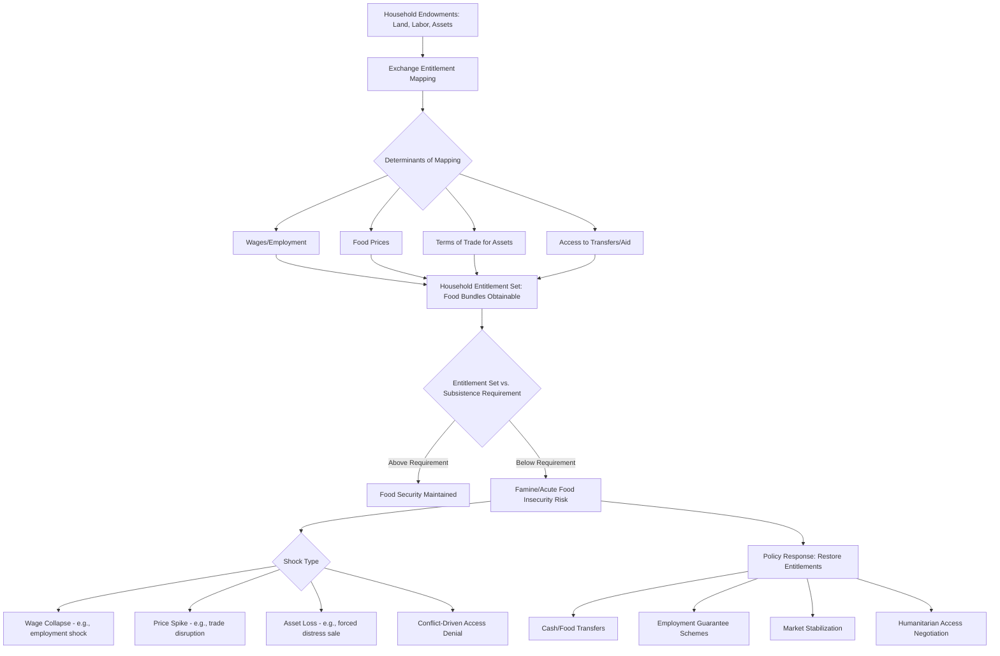

## Food Security and Famine Economics

### Definition and Scope

Food security is conventionally defined around four pillars: **availability** (sufficient food is physically present), **access** (households have the economic and physical means to obtain it), **utilization** (food is nutritionally used effectively by the body, linked to health, sanitation, and dietary diversity), and **stability** (these conditions hold reliably over time). Famine economics is the specialized subfield analyzing the causes, dynamics, and prevention of famine — a term of art in this literature denoting an extreme, geographically and temporally bounded food security crisis associated with mass mortality, formally distinguished from chronic hunger or malnutrition by scale, acuteness, and (under frameworks like the Integrated Food Security Phase Classification, IPC) specific mortality and malnutrition thresholds.

**Key Points**

- The most influential theoretical advance in famine economics is Amartya Sen's entitlement approach, which reframed famine as fundamentally a failure of access (purchasing power/entitlement to food) rather than necessarily a failure of aggregate food availability.
- Famines have historically occurred even amid adequate or only moderately reduced aggregate national food supply, a finding central to the entitlement framework and to modern famine early-warning and response design.
- Modern famine and food-crisis analysis emphasizes political economy factors (conflict, governance failure, denial of humanitarian access) as frequently necessary conditions for famine, distinguishing contemporary famine drivers from a purely climatic or agronomic framing.

### Sen's Entitlement Approach

#### Core Theoretical Contribution

Sen's framework, developed most prominently in his analysis of the 1943 Bengal famine, argues that famine results from a collapse in an individual's or household's "entitlement set" — the full range of food bundles a person can legally acquire given their endowments (assets, labor, land) and the exchange entitlements (prices, wages, exchange rates) that convert those endowments into food. Formally, a person's entitlement set can be represented as:

$$E_i = \{x : x \text{ is a food bundle obtainable from endowment } \omega_i \text{ via legal exchange entitlement mapping } f\}$$

Famine occurs when a shift in $f$ (e.g., collapsing agricultural wages, rising food prices, loss of employment) shrinks $E_i$ below subsistence requirements for a substantial population, even if aggregate food availability (total national food supply) has not fallen commensurately — or, in some documented historical cases, has not fallen at all.

#### Key Implication: Availability Decline Is Neither Necessary Nor Sufficient

This reframing has major policy implications: famine response and prevention cannot rely solely on tracking aggregate food supply (e.g., national grain stocks, harvest estimates), since a population subgroup can experience a famine-level entitlement collapse driven by wage collapse, asset loss, or price shocks even when national aggregate supply appears adequate. Conversely, aggregate food shortfalls do not automatically produce famine if entitlement-protecting mechanisms (functioning labor markets, effective public distribution, social protection) remain intact.

### Classification and Determinants Framework

#### The Food Security Pyramid / Nested Determinants

Food security outcomes are commonly modeled as nested across levels:

- **National/regional availability**: Aggregate production, trade, and stocks.
- **Household access**: Income, assets, market prices, and social transfers determining a household's capacity to acquire food.
- **Individual utilization**: Intra-household food allocation, health status, water/sanitation access, and caregiving practices affecting whether acquired food translates into adequate nutrition.

A shock or failure at any level can undermine food security even if the levels above it remain adequate — for instance, adequate national availability and household access can still coexist with individual-level undernutrition if intra-household allocation is unequal or disease burden undermines nutrient utilization.

#### Political Economy Drivers of Contemporary Famine

The historical record of documented 20th and 21st century famines shows a strong association with conflict, authoritarian governance failures, and in some clearly documented cases, active political decisions restricting food access or humanitarian relief to a targeted population, rather than purely exogenous natural disaster. This has shifted much of contemporary famine-prevention policy discourse toward emphasizing governance, humanitarian access, and conflict resolution alongside traditional agricultural and food-aid responses. [Inference — while there is broad scholarly consensus that political factors are central to most modern famines, attributing precise causal weight to political versus climatic factors in any single specific case remains a matter of historical and political analysis rather than a settled quantitative finding.]

### Measurement Tools and Early Warning Systems

#### Integrated Food Security Phase Classification (IPC)

A standardized five-phase scale (from "Minimal" to "Famine") used by international humanitarian and government agencies to classify the severity of food insecurity in a given population and area, incorporating indicators such as acute malnutrition prevalence, mortality rates, and coping strategy indicators, with the "Famine" classification (Phase 5) requiring specific documented thresholds to be met. [Unverified — exact current IPC phase thresholds and classification protocol details should be checked against current IPC technical documentation, as protocols are periodically refined.]

#### Household-Level Indicators

- **Dietary Diversity Score**: Counting the number of distinct food groups consumed by a household or individual over a reference period, used as a proxy for both caloric adequacy and micronutrient diversity.
- **Coping Strategies Index**: Measuring the frequency and severity of behaviors households adopt in response to food shortfalls (reducing meal frequency, selling productive assets, reducing adult food intake to protect children), used as an early-warning proxy that can detect deteriorating food security before mortality or acute malnutrition indicators rise.
- **Famine Early Warning Systems Network (FEWS NET)**: A prominent multi-agency early warning system combining climate, market price, conflict, and livelihood data to project food security outcomes ahead of crises, informing humanitarian response planning.

### Policy Instruments

#### Food Aid and Transfers

- **In-kind food aid**: Direct provision of food commodities, historically the dominant humanitarian response, but subject to well-documented critiques including high logistics costs, potential local market disincentive effects (depressing local farmer prices if aid is poorly targeted or timed), and slower response speed compared to some alternatives.
- **Cash and voucher transfers**: Increasingly used where markets are functioning (i.e., food is available locally but households lack purchasing power, consistent with the entitlement framing), allowing households to purchase preferred foods locally and supporting local market activity rather than potentially undermining it, though cash transfers are less appropriate where the underlying problem is genuine local unavailability rather than access.

#### Social Protection and Safety Nets

- **Productive Safety Net Programs**: Combining public works employment or unconditional transfers with the aim of protecting consumption during predictable lean seasons or shocks while (in productive/public-works variants) building community assets, with Ethiopia's Productive Safety Net Programme frequently cited as a large-scale example of this design approach.
- **Scalable/shock-responsive safety nets**: Programs designed with pre-established triggers (e.g., drought indices) to rapidly scale up transfer coverage or amounts in response to an emerging shock, integrating the safety net and humanitarian response functions rather than treating them as entirely separate systems.

#### Market and Trade Policy

- Maintaining open trade and avoiding panic-driven export restrictions during price spikes (see agricultural markets and price volatility) is widely recommended in the famine-prevention literature, given the documented history of export restrictions amplifying, rather than resolving, food price crises.
- Strategic food reserves, where well-managed, can provide a supply buffer for emergency response, though as discussed under price volatility, buffer stock schemes carry documented risks of high fiscal cost and mismanagement.

#### Humanitarian Access and Conflict-Sensitive Response

Given the strong association between conflict and contemporary famine risk, humanitarian access negotiation and conflict-sensitive program design are treated as central (not peripheral) components of famine prevention and response in much of the current policy literature, distinguishing modern famine response frameworks from earlier, more purely technical/logistical framings.

### Diagram: Sen's Entitlement Framework

### Diagram: Food Security Nested Determinants (svg_diagram)

<svg xmlns="http://www.w3.org/2000/svg" viewBox="0 0 700 400">
<text x="350" y="30" text-anchor="middle" font-size="17" font-weight="bold" fill="#1a1a1a">Nested Determinants of Food Security (svg_diagram)</text>
<rect x="120" y="60" width="460" height="300" rx="10" fill="#ebf8ff" stroke="#2b6cb0" stroke-width="2" />
<text x="350" y="90" text-anchor="middle" font-size="13" font-weight="bold" fill="#2b6cb0">National/Regional Availability</text>
<rect x="160" y="120" width="380" height="200" rx="10" fill="#e6fffa" stroke="#319795" stroke-width="2" />
<text x="350" y="150" text-anchor="middle" font-size="13" font-weight="bold" fill="#319795">Household Access</text>
<rect x="200" y="180" width="300" height="110" rx="10" fill="#fefcbf" stroke="#d69e2e" stroke-width="2" />
<text x="350" y="210" text-anchor="middle" font-size="13" font-weight="bold" fill="#975a16">Individual Utilization</text>
<text x="350" y="235" text-anchor="middle" font-size="11" fill="#744210">Intra-household allocation,</text>
<text x="350" y="252" text-anchor="middle" font-size="11" fill="#744210">health, sanitation, disease burden</text>

<text x="350" y="340" text-anchor="middle" font-size="11" fill="`#4a5568`" font-style="italic">A failure at any inner or outer layer can undermine food security outcomes</text>

</svg>

### Illustrative Examples

**1943 Bengal Famine**: Sen's foundational case study, in which he documented that aggregate food availability in Bengal during the famine year was not substantially lower than in preceding non-famine years, while wartime inflation, wage stagnation for certain occupational groups, and speculative hoarding sharply reduced the exchange entitlements of specific vulnerable groups (notably agricultural laborers), producing mass mortality despite the absence of a comparable availability collapse — the paradigmatic evidence base for the entitlement approach.

**1974 Bangladesh Famine**: Frequently cited as a further illustration of the entitlement approach, in which flooding disrupted agricultural labor demand and wages for landless laborers even though aggregate rice availability for the year was not at its lowest point relative to other years, again pointing to an access/entitlement collapse for a specific occupational group rather than a pure aggregate-supply story. [Unverified — as with most historical famine case analyses, the precise weighting of availability versus entitlement factors in this case has been subject to some scholarly debate and should be treated as an area of ongoing historical-economic analysis rather than a single uncontested figure.]

**Ethiopia's Productive Safety Net Programme (PSNP)**: A large-scale, multi-donor social protection program combining public works and direct transfers, frequently studied as an example of shifting from reactive emergency food aid toward predictable, chronic-vulnerability-oriented safety net design, illustrating the policy shift toward addressing entitlement stability rather than only responding after acute crisis onset.

**2011 and 2017 Horn of Africa food crises**: Both episodes are widely analyzed in the humanitarian and academic literature as cases where conflict and access restrictions (alongside drought) played a central role in determining which specific areas crossed into famine or near-famine classification, consistent with the political-economy emphasis in contemporary famine analysis. [Inference — the relative contribution of conflict versus drought varies by specific locality within these broader crises and is not uniform across the entire affected region.]

### Related Topics

- Agricultural markets and price volatility
- Rural credit and financial constraints
- Climate change effects on agriculture
- Social protection and safety net program design
- Conflict economics and humanitarian response
- Nutrition economics and intra-household resource allocation
- Poverty measurement and vulnerability analysis
- Public distribution systems and food subsidy programs