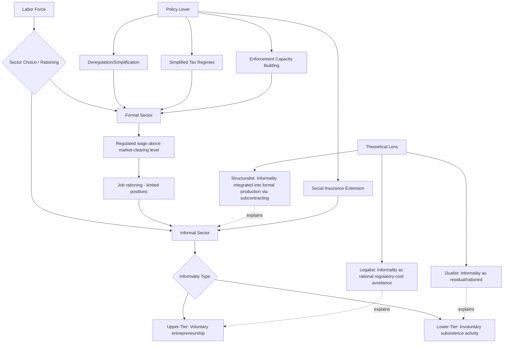

## Formal versus Informal Sector Employment

### Definition and Scope

The formal-informal sector distinction categorizes economic activity based on registration status, regulatory compliance, and social protection coverage. The **formal sector** comprises enterprises and employment relationships registered with the state, subject to labor regulation, taxation, and typically offering social security contributions, written contracts, and legal recourse. The **informal sector** encompasses economic activities operating outside these formal regulatory and protective frameworks — unregistered enterprises, unwritten employment arrangements, and workers lacking social insurance coverage — regardless of the legality of the underlying activity itself.

**Key Points**

- Informality is now generally understood as a continuum of employment characteristics (contract status, social security coverage, firm registration, tax compliance) rather than a strict binary, since a single worker or enterprise can be formal on some dimensions and informal on others.
- The informal sector constitutes a substantial share of total employment in most developing economies, often exceeding half of non-agricultural employment across large parts of Sub-Saharan Africa, South Asia, and Latin America. [Unverified — precise current cross-country informality shares should be checked against recent ILO statistics, as figures are periodically revised and vary considerably by measurement methodology and country.]
- Two competing theoretical traditions — the dualist and the legalist/voluntarist views — offer fundamentally different explanations for why informality persists, with direct implications for appropriate policy response.

### Defining and Measuring Informality

#### Enterprise-Based (Production) Definition

Following the International Labour Organization's original 1993 framework, the informal sector is defined at the enterprise level: unincorporated enterprises owned by households, not constituted as separate legal entities from their owners, typically small-scale and often unregistered, regardless of the working conditions of employees within them.

#### Employment-Based (Job) Definition

A complementary and increasingly emphasized approach (formalized in ILO guidelines from 2003 onward) defines informality at the level of the individual job rather than the enterprise: an **informal job** is one lacking basic legal or social protections — no written contract, no social security contribution, no paid leave entitlement — regardless of whether the employing enterprise itself is formally registered. This distinction matters because formal (registered) enterprises can and do employ workers informally (e.g., without contracts or benefits), and informal enterprises can occasionally provide job characteristics resembling formal employment.

#### Key Measurement Indicators

- Enterprise registration status (business license, tax registration)
- Written employment contract presence
- Social security/pension contribution coverage
- Paid sick leave and annual leave entitlement
- Employer size (below a legal threshold often exempting the firm from certain labor regulations)

### Theoretical Frameworks

#### The Dualist View

Rooted in the original Lewis dual-economy model and subsequent Harris-Todaro-style extensions, the dualist view treats the informal sector as a residual, subordinate segment of a segmented labor market — informal workers are those who could not obtain rationed formal-sector jobs (which pay above market-clearing wages due to minimum wage laws, unionization, or efficiency-wage considerations) and therefore queue for formal employment while surviving in low-productivity informal activity in the interim. Under this view, informality is fundamentally involuntary and reflects insufficient formal job creation relative to labor force growth.

#### The Legalist / Voluntarist View

Associated with Hernando de Soto's influential analysis, this view holds that informality is substantially a rational response to excessive regulatory and tax burdens imposed by the formal legal system — entrepreneurs and workers voluntarily choose informality because the costs of formalization (registration fees, compliance costs, taxes) exceed its benefits (legal protection, credit access, market access) given their scale of operation. Under this framing, reducing bureaucratic and regulatory burden should induce voluntary formalization.

#### The Structuralist View

An intermediate position holding that informality is not merely a residual (dualist) or a free choice (legalist), but is functionally integrated into and often actively reproduced by the formal economy — formal firms subcontract to informal producers or use informal labor arrangements specifically to reduce labor costs and regulatory exposure, meaning informality expands and contracts systematically with formal-sector business cycles and outsourcing strategies rather than existing as a wholly separate segment.

#### Heterogeneity Within Informality

Contemporary labor economics increasingly emphasizes that the informal sector itself is heterogeneous, commonly decomposed into:

- **Upper-tier informality**: Often voluntary, including successful informal entrepreneurs who could formalize but choose not to (consistent with elements of the legalist view), sometimes earning more than comparable formal-sector workers.
- **Lower-tier informality**: Largely involuntary subsistence activity and informal wage employment, characterized by low earnings, poor working conditions, and limited entry barriers (consistent with elements of the dualist view).

This "upper-tier/lower-tier" heterogeneity helps reconcile evidence that appears simultaneously consistent with both dualist and legalist perspectives depending on which segment of informal employment a given study examines.

### Formal Model: Harris-Todaro Extension to Informality

The classic Harris-Todaro migration model can be extended to a three-sector framework (formal urban, informal urban, rural) in which the informal sector serves as a market-clearing residual absorbing labor that queues unsuccessfully for rationed formal jobs. Migration/sector-choice equilibrium requires expected income equalization across accessible options:

$$w_r = p \cdot w_f + (1-p) \cdot w_i$$

where $w_r$ is the rural wage, $w_f$ is the (regulation-rationed, above-market-clearing) formal urban wage, $w_i$ is the informal urban wage or expected informal earnings, and $p$ is the probability of obtaining a formal job. Since $w_f$ is fixed above the market-clearing level (by minimum wage law, unionization, or efficiency wage considerations) and cannot adjust downward to absorb excess labor supply, the informal sector wage $w_i$ and the job-finding probability $p$ become the adjustment margins that reconcile expected income across sectors — formalizing the dualist intuition that informality functions as a labor market safety valve.

### Determinants of Informality Size

- **Labor regulation stringency**: Higher minimum wages, stricter hiring/firing regulations, and mandatory benefit costs are commonly associated (in cross-country and micro-level studies) with larger informal sector shares, consistent with both dualist (rationing) and legalist (regulatory-cost avoidance) mechanisms, though the causal magnitude of this relationship remains debated and likely varies with enforcement capacity. [Inference — the direction of this relationship is broadly supported across multiple empirical traditions, though precise elasticities are contested and enforcement quality appears to substantially mediate the relationship.]
- **Tax burden and administrative complexity**: Higher effective tax rates and more complex registration/compliance procedures are associated with larger informal sectors in cross-country studies, central to the legalist policy prescription of simplifying business registration.
- **Enforcement capacity**: Weak state capacity to monitor and enforce labor and tax regulation allows informality to persist even where formal legal requirements are stringent on paper, a key reason why formal regulatory stringency alone does not fully predict observed informality levels across countries.
- **Level of economic development**: Informality shares are empirically strongly negatively correlated with GDP per capita across countries, consistent with structural transformation theories in which formal wage employment expands as economies develop and shift out of subsistence agriculture and small-scale trade.
- **Education and skill levels**: Lower average educational attainment in the labor force is associated with reduced access to formal-sector jobs, which disproportionately demand credentialed or specific skills.

### Consequences of Informality

#### For Workers

- Reduced access to social insurance (pensions, health insurance, unemployment protection), increasing vulnerability to income shocks and old-age poverty.
- Generally lower and more volatile earnings, though with substantial heterogeneity (upper-tier informal entrepreneurs can out-earn formal wage employees).
- Limited legal recourse against unfair dismissal or workplace conditions.

#### For Firms and the Macroeconomy

- Informal firms typically have restricted access to formal credit (due to lack of verifiable financial records and collateral documentation), constraining their growth potential — connecting to the credit market failure mechanisms discussed under rural credit and financial constraints.
- Reduced tax revenue base, constraining public investment and social protection financing capacity.
- Potential productivity losses from resource misallocation, if informal firms remain artificially small to avoid regulatory/tax detection thresholds, a documented pattern sometimes termed a "missing middle" in firm-size distributions in some developing economies. [Inference — the missing-middle pattern and its attribution specifically to regulatory threshold effects (versus other explanations like credit or managerial capacity constraints) remains an active area of empirical debate.]

### Policy Responses and Formalization Strategies

#### Deregulation and Simplification (Legalist-Informed)

Streamlining business registration procedures (e.g., one-stop registration windows, reduced minimum capital requirements) aims to lower the cost side of the formalization decision; cross-country evaluations of such reforms have generally found modest effects on formalization rates, suggesting registration cost alone is often not the sole or primary barrier. [Unverified — effect sizes vary considerably across the specific reform evaluations in this literature and should be checked against recent studies for precise figures.]

#### Simplified Tax Regimes

Presumptive or simplified small-business tax schemes (flat, low-rate taxation for small firms below a revenue threshold) aim to reduce compliance costs and increase the relative attractiveness of formal registration.

#### Social Insurance Extension

Extending non-contributory or subsidized social insurance to informal workers (e.g., health insurance schemes not tied to formal employment status) aims to decouple social protection from formalization, recognizing that near-universal formalization is unlikely in many developing-country contexts in the medium term.

#### Labor Regulation Reform

Adjusting the stringency or enforcement threshold of labor regulations (e.g., graduated regulatory requirements by firm size) aims to reduce the incentive for firms to remain artificially small or informal to avoid compliance costs, though such reforms face a policy trade-off between reducing informality incentives and maintaining worker protections that the regulations were designed to provide.

#### Strengthening Enforcement Capacity

Improving state capacity for labor inspection and tax administration is sometimes proposed as a complement to deregulation, on the logic that even simplified regulations require credible enforcement to shift the cost-benefit calculus meaningfully toward formalization.

### Diagram: Formal-Informal Sector Dynamics

### Diagram: Formal-Informal Employment as a Continuum (svg_diagram)

<svg xmlns="http://www.w3.org/2000/svg" viewBox="0 0 720 320">
<text x="360" y="30" text-anchor="middle" font-size="17" font-weight="bold" fill="#1a1a1a">Informality as a Continuum, Not a Binary (svg_diagram)</text>
<line x1="60" y1="180" x2="660" y2="180" stroke="#2d3748" stroke-width="3" />
<polygon points="660,180 645,172 645,188" fill="#2d3748" />
<circle cx="100" cy="180" r="8" fill="#c53030" />
<text x="100" y="215" text-anchor="middle" font-size="11">Subsistence</text>
<text x="100" y="230" text-anchor="middle" font-size="11">informal wage work</text>
<circle cx="270" cy="180" r="8" fill="#dd6b20" />
<text x="270" y="215" text-anchor="middle" font-size="11">Unregistered</text>
<text x="270" y="230" text-anchor="middle" font-size="11">micro-enterprise</text>
<circle cx="440" cy="180" r="8" fill="#d69e2e" />
<text x="440" y="215" text-anchor="middle" font-size="11">Registered firm,</text>
<text x="440" y="230" text-anchor="middle" font-size="11">informal employees</text>
<circle cx="610" cy="180" r="8" fill="#2f855a" />
<text x="610" y="215" text-anchor="middle" font-size="11">Fully formal</text>
<text x="610" y="230" text-anchor="middle" font-size="11">contract + benefits</text>

<text x="100" y="150" text-anchor="middle" font-size="11" fill="`#4a5568`">Lower-tier</text>

<text x="610" y="150" text-anchor="middle" font-size="11" fill="`#4a5568`">Formal</text>

</svg>

### Illustrative Examples

**Peru and Latin American informality studies**: De Soto's foundational fieldwork documenting the extensive bureaucratic procedures and time required to legally register a small business in Peru was highly influential in shaping the legalist policy agenda for regulatory simplification adopted across multiple Latin American countries from the 1990s onward.

**India's Employees' State Insurance and firm-size regulatory thresholds**: Indian labor regulation has been extensively studied for evidence of "bunching" in firm-size distributions just below regulatory thresholds that trigger additional compliance obligations, cited as evidence consistent with both dualist rationing dynamics and legalist regulatory-avoidance behavior, though the precise contribution of labor regulation specifically (versus other threshold-linked taxes or requirements) to observed bunching patterns remains debated in the literature. [Inference — bunching evidence is well-documented in several studies, but attributing it definitively and exclusively to labor regulation specifically, as opposed to other regulatory or tax thresholds that often coincide with the same firm-size cutoffs, is contested.]

**Sub-Saharan African urban informal trade sectors**: Extensive informal retail and service activity in urban areas across Sub-Saharan Africa has been documented as absorbing labor unable to secure formal wage employment, consistent with dualist interpretations, while simultaneously including a significant share of relatively successful informal entrepreneurs, illustrating the upper-tier/lower-tier heterogeneity discussed above.

### Related Topics

- Rural credit and financial constraints
- Smallholder farming and commercialization
- Rural-to-urban migration and the Harris-Todaro model
- Minimum wage policy in developing economies
- Social protection extension to informal workers
- Firm size distributions and the "missing middle" phenomenon
- Tax administration and presumptive taxation regimes
- Labor market segmentation theory