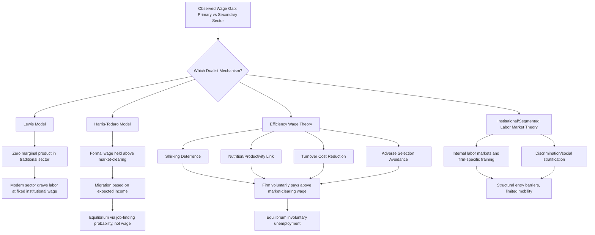

## Labor Market Dualism Theories

### Definition and Scope

Labor market dualism theories are a family of theoretical frameworks explaining why labor markets in developing (and, in modified form, some developed) economies appear segmented into distinct sub-markets — typically a higher-wage, more protected "primary" or "formal" segment and a lower-wage, less protected "secondary" or "informal" segment — with limited or restricted mobility between them, rather than functioning as a single, competitive, market-clearing labor market. Dualism theories provide the core analytical foundation for understanding persistent wage differentials, rationing-based unemployment, and the size and dynamics of the informal sector discussed elsewhere in this chapter.

**Key Points**

- The defining claim of dualist theory is that observed wage and employment differences across labor market segments reflect structural market segmentation rather than solely differences in worker productivity or preferences, distinguishing it sharply from competitive labor market models where wage differences reflect only compensating differentials or human capital differences.
- Several distinct dualist traditions exist — the Lewis model, the Harris-Todaro model, efficiency wage theory, and institutional/segmented labor market theory — sharing the core segmentation intuition but differing in the specific mechanism generating and sustaining the wage gap between segments.
- Dualism theories carry direct policy implications: if wage differentials reflect genuine market failure/rationing rather than voluntary sorting, then policies targeting only the secondary/informal sector (without addressing formal-sector rationing or its underlying causes) are unlikely to close the gap.

### The Lewis Dual-Economy Model

#### Core Structure

W. Arthur Lewis's foundational 1954 model divides the economy into a **traditional/subsistence sector** (predominantly agricultural, characterized by surplus labor with marginal productivity near or at zero) and a **modern/capitalist sector** (industrial, urban, wage-employing). The model's central mechanism is that the modern sector can draw labor from the traditional sector at a roughly constant "institutional" wage (set modestly above subsistence-sector average income, sufficient to induce migration) without needing to raise wages to attract additional workers, because the traditional sector's labor surplus means withdrawing workers does not reduce traditional-sector output.

$$w_m = w_s(1 + \theta)$$

where $w_m$ is the modern-sector wage, $w_s$ is the subsistence-sector average income, and $\theta$ is a constant premium (often cited around 30 percent in Lewis's original formulation) sufficient to compensate for urban migration costs and cost-of-living differences. Because $w_m$ remains fixed as modern-sector employment expands (an essentially perfectly elastic labor supply curve facing the modern sector), all productivity gains from capital accumulation in the modern sector accrue as profit rather than being competed away through rising wages, generating a high reinvestable surplus that (in the model's optimistic scenario) drives continued industrial expansion until the labor surplus is exhausted — the so-called "Lewis turning point," after which wages in both sectors begin to rise together as the economy transitions to a single, integrated, higher-wage labor market.

#### Critiques and Limitations

The zero (or near-zero) marginal product of labor assumption in traditional agriculture has been extensively challenged empirically, with several studies finding positive marginal product even in labor-abundant peasant agriculture, undermining the "costless labor withdrawal" mechanism central to the original model. [Inference — this is a long-standing and largely accepted critique in the development economics literature, though the model retains substantial value as a stylized framework for understanding structural transformation dynamics even where its precise zero-marginal-product assumption does not hold exactly.]

### The Harris-Todaro Model

#### Core Structure

Developed to explain the empirical puzzle of continued rural-to-urban migration despite substantial observed urban unemployment, the Harris-Todaro model replaces Lewis's assumption of costless labor absorption with an explicit job-rationing mechanism: the urban formal wage $w_u$ is held above the market-clearing level by institutional forces (minimum wage legislation, union bargaining power, or efficiency wage considerations), creating persistent urban job rationing. Migration decisions are modeled as based on **expected** urban income rather than the certain urban wage:

$$E[w_u] = p \cdot w_u$$

where $p$ is the probability of securing a formal urban job (commonly proxied by the urban formal employment rate). Migration equilibrium occurs when expected urban income equals the rural wage $w_r$:

$$w_r = p \cdot w_u$$

Since $w_u$ is fixed above market-clearing levels, equilibrium is restored not through wage adjustment but through $p$ adjusting downward (via continued in-migration and urban unemployment/underemployment) until expected incomes across sectors equalize — meaning urban unemployment (or informal-sector absorption, in extended versions of the model) is not a market failure the model treats as anomalous, but rather a rational equilibrium outcome of the migration decision given formal-sector wage rigidity.

#### Extension to Three Sectors (Formal-Informal-Rural)

As discussed under formal versus informal sector employment, the basic two-sector Harris-Todaro framework is commonly extended to three sectors by introducing an urban informal sector as a market-clearing wage segment absorbing labor that queues unsuccessfully for rationed formal jobs, refining the migration equilibrium condition to $w_r = p \cdot w_f + (1-p) \cdot w_i$.

### Efficiency Wage Theory

#### Core Mechanism

Efficiency wage models provide a firm-level, profit-maximizing rationale for why employers might voluntarily pay wages above the market-clearing level, generating involuntary unemployment/rationing without requiring exogenously imposed institutional wage floors. Several distinct mechanisms have been proposed:

- **Shirking model** (Shapiro-Stiglitz): Because worker effort is imperfectly monitored, firms pay wages above the market-clearing level to raise the cost of job loss if caught shirking, deterring shirking; if all firms behave this way, an equilibrium involuntary unemployment pool emerges that serves as an additional (beyond direct monitoring) deterrent to shirking, since job loss now carries the additional cost of a spell of unemployment before finding a replacement job.
- **Nutrition/health-based efficiency wages**: Particularly relevant in very poor developing-economy contexts, if worker productivity depends on caloric intake and nutritional status, firms may find it profit-maximizing to pay a wage above the market-clearing rate specifically to ensure workers can afford adequate nutrition to sustain labor productivity, generating a wage floor from a fundamentally different mechanism than shirking-deterrence.
- **Turnover-cost models**: Higher wages reduce costly labor turnover (hiring and training costs), potentially justifying above-market wages even without a monitoring problem.
- **Adverse selection (Weiss) models**: If worker quality/ability is not directly observable, offering a higher wage can attract a higher-average-quality applicant pool, an efficiency-wage mechanism structurally analogous to adverse selection dynamics in credit markets (see rural credit and financial constraints).

#### Formal Shirking Model Sketch

In the Shapiro-Stiglitz framework, the no-shirking condition requires the wage to satisfy:

$$w^* \geq w_r + \frac{c \cdot (\lambda + q)}{q}$$

where $w_r$ is the reservation/alternative wage, $c$ is the cost of effort, $\lambda$ is the exogenous job separation rate, and $q$ is the detection probability for shirking. Since $w^*$ exceeds the market-clearing wage, aggregate labor demand at $w^*$ falls short of labor supply, generating equilibrium involuntary unemployment that functions as the market-wide "discipline device" sustaining the no-shirking condition for all firms simultaneously.

### Institutional / Segmented Labor Market Theory

Drawing on an earlier institutionalist labor economics tradition (Doeringer and Piore), this view emphasizes that primary-sector jobs are characterized by internal labor markets — firm-specific job ladders, training investment, and implicit long-term employment relationships — that create genuine barriers to entry from the secondary sector, distinct from a simple price-based (wage) rationing story. Under this view, segmentation is reinforced by employer human-capital investment incentives (firms invest in training only for workers they expect to retain, creating a self-reinforcing primary-sector advantage) and, in some applications of the theory, by discrimination or social stratification along lines such as gender, ethnicity, or caste that systematically channel certain groups into the secondary segment regardless of underlying productivity.

### Comparing the Dualist Traditions

| Framework | Segmentation Mechanism | Key Adjustment Margin |
| --- | --- | --- |
| Lewis | Zero marginal product surplus labor | Employment quantity, constant wage |
| Harris-Todaro | Institutionally rigid formal wage | Job-finding probability / informal absorption |
| Efficiency Wage | Firm-optimal above-market wage (monitoring, nutrition, turnover, selection) | Equilibrium involuntary unemployment |
| Institutional/Segmented | Internal labor markets, training investment, discrimination | Entry barriers, limited inter-segment mobility |

### Diagram: Comparative Mechanisms of Labor Market Dualism

### Diagram: Harris-Todaro Migration Equilibrium (svg_diagram)

<svg xmlns="http://www.w3.org/2000/svg" viewBox="0 0 700 380">
<text x="350" y="30" text-anchor="middle" font-size="17" font-weight="bold" fill="#1a1a1a">Harris-Todaro Migration Equilibrium (svg_diagram)</text>
<rect x="60" y="80" width="180" height="90" rx="8" fill="#ebf8ff" stroke="#2b6cb0" stroke-width="2" />
<text x="150" y="115" text-anchor="middle" font-size="13" font-weight="bold">Rural Sector</text>
<text x="150" y="140" text-anchor="middle" font-size="12">Wage: w_r</text>
<text x="150" y="158" text-anchor="middle" font-size="11">(market-clearing)</text>
<rect x="460" y="60" width="190" height="80" rx="8" fill="#c6f6d5" stroke="#2f855a" stroke-width="2" />
<text x="555" y="90" text-anchor="middle" font-size="13" font-weight="bold">Urban Formal Sector</text>
<text x="555" y="112" text-anchor="middle" font-size="12">Wage: w_u (rigid, high)</text>
<text x="555" y="128" text-anchor="middle" font-size="11">Job probability: p</text>
<rect x="460" y="180" width="190" height="80" rx="8" fill="#feebc8" stroke="#dd6b20" stroke-width="2" />
<text x="555" y="210" text-anchor="middle" font-size="13" font-weight="bold">Urban Informal Sector</text>
<text x="555" y="232" text-anchor="middle" font-size="12">Wage: w_i (flexible)</text>
<text x="555" y="248" text-anchor="middle" font-size="11">Probability: (1-p)</text>
<line x1="240" y1="125" x2="460" y2="100" stroke="#4a5568" stroke-width="2" />
<line x1="240" y1="140" x2="460" y2="210" stroke="#4a5568" stroke-width="2" />
<polygon points="460,100 445,95 448,108" fill="#4a5568" />
<polygon points="460,210 445,203 448,216" fill="#4a5568" />

<text x="330" y="330" text-anchor="middle" font-size="12" fill="`#2d3748`">Equilibrium condition: w_r = p·w_u + (1−p)·w_i</text>

<text x="330" y="350" text-anchor="middle" font-size="11" fill="`#4a5568`" font-style="italic">Adjustment occurs via job probability p, not via w_u</text>

</svg>

### Empirical Evidence and Contemporary Assessment

Empirical labor economics research has generally found evidence supportive of some degree of genuine segmentation (persistent wage gaps between comparable workers in formal versus informal jobs, even after controlling for observable human capital), though the magnitude of the unexplained gap — and thus how much of observed differentials reflects genuine dualism versus unobserved worker heterogeneity (ability, effort, sorting on unmeasured characteristics) — remains a subject of ongoing empirical debate using panel data and worker fixed-effects methods to address the sorting concern. [Inference — this characterizes a genuine, active empirical literature rather than a fully settled question, and the degree of segmentation found varies considerably by country, time period, and econometric method used.]

### Illustrative Examples

**Sub-Saharan African urban labor markets**: Studies of urban labor markets across several Sub-Saharan African countries have documented patterns broadly consistent with Harris-Todaro dynamics — continued rural-urban migration alongside significant urban un/underemployment — motivating both academic modeling refinements and policy debate over urban bias in development strategy.

**Manufacturing wage premiums in East and Southeast Asia**: Studies of formal manufacturing sector wage premiums relative to informal/agricultural earnings during the region's period of export-led industrialization have been used both to test Lewis-model predictions about the "turning point" (wage convergence as surplus labor is exhausted) and, in China's case specifically, to debate whether and when such a turning point has been reached. [Unverified — the specific timing and evidence for a "Lewis turning point" in any given country remains a genuinely debated empirical question in the literature and should be checked against current research rather than assumed settled.]

**Efficiency wages in early industrial contexts**: Henry Ford's well-documented 1914 "five-dollar day" wage increase, substantially above prevailing market wages, is frequently cited as an early real-world illustration of efficiency-wage logic (reducing costly labor turnover and raising worker effort/productivity), predating the formal theoretical models but consistent with their predicted mechanism.

### Related Topics

- Formal versus informal sector employment
- Rural-to-urban migration and structural transformation
- Minimum wage policy in developing economies
- Efficiency wages and unemployment theory
- Rural credit and financial constraints
- Smallholder farming and commercialization
- Wage differentials and discrimination in labor markets
- Structural transformation and the Lewis turning point