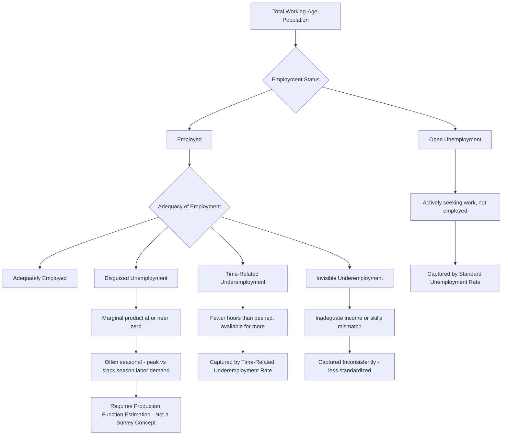

## Underemployment and Disguised Unemployment

### Definition and Scope

Underemployment and disguised unemployment describe forms of labor market slack that are not captured by conventional open-unemployment statistics, making them central diagnostic concepts for labor markets in developing economies where formal unemployment insurance and job-search infrastructure are limited, and where most workers cannot afford to remain openly unemployed and instead accept inadequate work. **Underemployment** refers broadly to a mismatch between a worker's actual employment situation and their capacity or willingness to work more, or more productively. **Disguised unemployment** is a more specific theoretical concept describing labor whose removal from a given activity would not reduce total output, implying the worker's true marginal contribution is at or near zero despite being nominally "employed."

**Key Points**

- Open unemployment rates in many developing economies are often low not because labor markets are healthy, but because most workers cannot afford unemployment and instead accept low-productivity, low-hours, or low-earnings work — meaning underemployment, not open unemployment, is frequently the more diagnostically important labor market slack indicator.
- Disguised unemployment is a theoretical/analytical concept (labor with zero or near-zero marginal product) distinguished from the more empirically measurable concept of visible/time-related underemployment (workers who want and are available for more hours than they currently work).
- The concept of disguised unemployment played a foundational role in early development economics, particularly the Lewis dual-economy model, though the empirical validity of the zero-marginal-product assumption has been substantially contested.

### Conceptual Distinctions

#### Time-Related (Visible) Underemployment

The standard, internationally comparable statistical definition (per ILO guidelines): a person is time-related underemployed if they worked fewer hours than a specified threshold during a reference period, wanted to work additional hours, and were available to do so. This is a directly measurable labor force survey concept, distinct from the more theoretical disguised unemployment construct.

#### Inadequate Employment Situations (Invisible Underemployment)

A broader, less standardized category encompassing employment that is inadequate along dimensions other than hours — inadequate income relative to a reference standard, mismatch between a worker's skills/qualifications and the job performed (skills underutilization), or unstable/insecure employment conditions. Because these dimensions are harder to define and measure consistently across countries, invisible underemployment statistics are less internationally comparable than time-related underemployment figures.

#### Disguised Unemployment (Theoretical Concept)

Originating in early structural development economics (notably associated with the Lewis model discussed under labor market dualism theories), disguised unemployment describes a situation where the marginal product of an additional worker in a given activity — typically smallholder family agriculture — is zero or near-zero, such that the worker's removal would not reduce total output of that activity. This is conceptually distinct from underemployment in that it is defined purely in terms of marginal productivity rather than hours worked or worker preferences — a worker might be disguised-unemployed while nominally working full hours, if their presence adds nothing to total output because tasks are effectively shared or duplicated among excess family labor.

### Theoretical Foundations of Disguised Unemployment

#### The Zero Marginal Product Hypothesis

The original disguised unemployment thesis (developed in various forms by economists including Rosenstein-Rodan, Nurkse, and formalized within Lewis's dual-economy framework) posited that traditional peasant agriculture in labor-abundant developing economies harbored substantial surplus labor whose marginal product was at or near zero, due to fixed land availability combined with an inherited social/family obligation to provide subsistence employment to all family members regardless of the labor actually needed for production.

Formally, if agricultural output is $Q = f(L, T)$ with land $T$ fixed and labor $L$ subject to diminishing returns, the disguised unemployment thesis holds that at the prevailing (large) family labor force $L_0$:

$$\frac{\partial Q}{\partial L}\bigg|_{L_0} \approx 0$$

implying labor could be withdrawn from agriculture (e.g., transferred to urban industrial employment, as in the Lewis model) without any reduction in agricultural output — the theoretical basis for the "costless" industrial labor supply central to the Lewis growth mechanism.

#### Critiques of the Zero Marginal Product Hypothesis

This hypothesis has been substantially challenged on both theoretical and empirical grounds:

- **Theoretical critique (Schultz)**: T.W. Schultz's influential critique argued that if peasant agriculture were genuinely characterized by zero marginal product labor, catastrophic events removing a portion of the labor force (famine, epidemic) should produce no measurable output decline — a testable implication that historical evidence (e.g., studies of the 1918-19 influenza pandemic's effect on agricultural output in affected regions) has generally not supported, since output declines were typically observed following such labor-force shocks.
- **Seasonal labor demand critique**: Even where labor may appear to have low or zero marginal product during agricultural slack seasons, labor demand in peasant agriculture is highly seasonal (concentrated at planting and harvest), meaning a labor force sized to meet peak-season requirements will necessarily appear "surplus" during slack periods without this reflecting a genuine, permanently extractable zero-marginal-product surplus.
- **Empirical estimates**: Subsequent empirical studies estimating agricultural production functions in various developing-country contexts have generally found positive (though sometimes low) marginal product of labor in peasant agriculture, rather than the zero marginal product the strong version of the thesis requires. [Inference — this is a broadly accepted finding in the empirical development literature, though the precise magnitude of marginal product estimated varies across studies, contexts, and estimation methods, and does not rule out low marginal product in some specific circumstances.]

#### A Revised View: Seasonal and Partial Disguised Unemployment

Given these critiques, most contemporary treatments of disguised unemployment adopt a more modest, seasonally-qualified version of the concept: labor may exhibit low or near-zero marginal product during agricultural slack seasons even if it has substantial positive marginal product during peak planting/harvest periods, making disguised unemployment a seasonal and partial phenomenon rather than the permanent, uniform surplus posited in the strongest early formulations.

### Measurement Approaches

#### Labor Force Survey-Based Measurement (Time-Related Underemployment)

Standard household/labor force surveys collect data on actual hours worked, desired additional hours, and availability for additional work, allowing construction of internationally comparable time-related underemployment rates following ILO methodological guidelines.

#### Production Function Estimation (Disguised Unemployment)

Estimating agricultural (or other sector) production functions and computing implied marginal product of labor at observed input levels, though this approach faces substantial identification challenges — unobserved land quality, weather variation, and worker ability can all bias estimated marginal product if not adequately controlled for, requiring careful econometric design (e.g., panel data with household or plot fixed effects) to produce credible estimates.

#### Composite and Alternative Labor Underutilization Indicators

The ILO's LU (Labour Underutilization) indicator framework (LU1 through LU4) provides a nested set of measures moving from strict unemployment (LU1) to progressively broader definitions incorporating time-related underemployment and the potential labor force (people not currently working or searching but available), providing a more complete picture of labor market slack in contexts where narrow unemployment rates understate true idle or underutilized labor capacity. [Unverified — precise current definitions of each LU sub-indicator should be checked against current ILO technical documentation, as indicator frameworks are periodically refined.]

### Diagram: From Open Unemployment to Disguised Unemployment — A Spectrum of Labor Slack

### Diagram: Seasonal Labor Demand and Disguised Unemployment (svg_diagram)

<svg xmlns="http://www.w3.org/2000/svg" viewBox="0 0 700 380">
<text x="350" y="30" text-anchor="middle" font-size="17" font-weight="bold" fill="#1a1a1a">Seasonal Labor Demand vs. Available Family Labor (svg_diagram)</text>
<line x1="70" y1="320" x2="640" y2="320" stroke="#2d3748" stroke-width="2" />
<line x1="70" y1="320" x2="70" y2="60" stroke="#2d3748" stroke-width="2" />
<text x="355" y="350" text-anchor="middle" font-size="12">Time of Year</text>
<text x="35" y="190" text-anchor="middle" font-size="12" transform="rotate(-90 35 190)">Labor Required</text>
<line x1="70" y1="180" x2="640" y2="180" stroke="#2b6cb0" stroke-width="2" stroke-dasharray="6,3" />
<text x="600" y="170" font-size="11" fill="#2b6cb0">Available Family Labor</text>

<path d="M 70 280 Q 130 270 180 200 Q 220 90 270 90 Q 320 90 350 260 Q 400 300 450 280 Q 500 100 560 95 Q 600 95 640 270" fill="none" stroke="`#c53030`" stroke-width="3" />

<text x="200" y="75" font-size="11" fill="`#c53030`">Planting Peak</text>

<text x="520" y="80" font-size="11" fill="`#c53030`">Harvest Peak</text>

<rect x="350" y="200" width="100" height="80" fill="#fefcbf" opacity="0.6" />
<text x="400" y="240" text-anchor="middle" font-size="10" fill="#744210">Slack season:</text>
<text x="400" y="255" text-anchor="middle" font-size="10" fill="#744210">apparent surplus</text>
<text x="400" y="270" text-anchor="middle" font-size="10" fill="#744210">(disguised unemployment)</text>
</svg>

### Policy Implications

#### Distinguishing Diagnosis from Prescription

Because open unemployment rates can substantially understate true labor market distress in developing economies, policymakers and researchers are generally advised to examine underemployment and income-adequacy indicators alongside (not instead of) unemployment rates when assessing labor market conditions — a low official unemployment rate combined with high underemployment can indicate a labor market absorbing workers into low-quality, low-earnings activity rather than genuine full employment.

#### Seasonal Employment Programs

Given the seasonal nature of much disguised/slack-season underemployment in agricultural economies, public works and employment guarantee programs timed to coincide with agricultural slack seasons (rather than operating uniformly year-round) are a commonly proposed and implemented policy response, aiming to productively absorb seasonally idle labor rather than treating it as a permanent structural surplus requiring sector-shifting solutions.

#### Rural Non-Farm Employment Diversification

Because seasonal disguised unemployment in agriculture reflects a timing mismatch between fixed family labor supply and variable seasonal labor demand rather than a permanent zero-productivity surplus, promoting rural non-farm employment opportunities that can absorb labor during agricultural slack periods is often proposed as a complementary strategy to purely agricultural-sector interventions, connecting to the broader smallholder commercialization and diversification themes discussed under smallholder farming and commercialization.

#### Structural Transformation Policy

To the extent genuine, non-seasonal surplus labor does exist in traditional sectors, policies supporting structural transformation — the movement of labor from low-productivity agriculture into higher-productivity manufacturing and services — remain relevant, though contemporary development economics places less emphasis on the "costless labor transfer" mechanism of the original Lewis framing and more on addressing the specific frictions (skills, credit, migration costs, formal-sector job rationing) that slow this transition, as discussed under labor market dualism theories.

### Illustrative Examples

**Mahatma Gandhi National Rural Employment Guarantee Act (India)**: A large-scale employment guarantee program providing up to a specified number of days of guaranteed public works employment per rural household per year, frequently analyzed as a policy response designed in part to absorb seasonal agricultural underemployment and provide an income floor during agricultural slack periods. [Unverified — the specific current guaranteed days-per-year figure and program parameters should be checked against current government sources, as program design details have been subject to periodic revision since original enactment.]

**T.W. Schultz's famine/pandemic natural experiments**: Schultz's classic critique drew on historical episodes of sudden labor-force reduction in agricultural populations (such as regions affected by the 1918-19 influenza pandemic) to test whether agricultural output held constant despite labor loss, as the strict zero-marginal-product disguised unemployment thesis would predict; the generally observed output declines in such episodes provided influential evidence against the strongest version of the thesis.

**Seasonal migration in South Asian agriculture**: Extensive documented patterns of seasonal labor migration from agricultural regions during slack periods to urban or non-farm work, followed by return migration for planting and harvest, are commonly interpreted as an informal, household-level solution to the seasonal disguised unemployment problem, allowing family labor to be more fully utilized across the annual cycle than would be possible if confined to a single location's seasonal agricultural demand pattern.

### Related Topics

- Labor market dualism theories
- Formal versus informal sector employment
- Rural-to-urban migration and structural transformation
- Smallholder farming and commercialization
- Rural non-farm employment diversification
- Public works and employment guarantee programs
- Agricultural productivity constraints
- Seasonal poverty and consumption smoothing