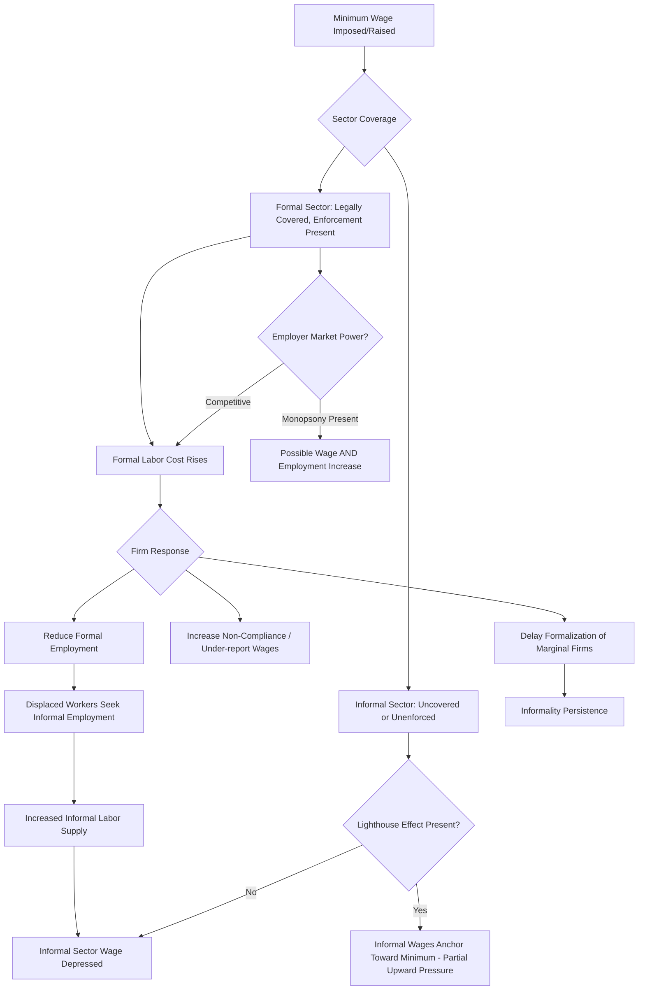

## Minimum Wage Effects in Developing Countries

### Definition and Scope

Minimum wage policy in developing countries concerns the economic effects of legally mandated wage floors in labor markets characterized by extensive informality, weak enforcement capacity, and substantial labor market segmentation — conditions that fundamentally alter the standard competitive-market predictions typically used to analyze minimum wage effects in high-income, largely formal economies. This topic sits at the intersection of the dualist labor market theories and informal sector dynamics discussed elsewhere in this chapter, since minimum wage effects in developing economies operate primarily through their interaction with the formal-informal sector divide.

**Key Points**

- The standard competitive labor market prediction — that a binding minimum wage above the market-clearing wage reduces formal employment — is only one of several theoretically plausible outcomes once labor market segmentation and limited enforcement are incorporated into the analysis.
- Minimum wage laws in developing countries frequently cover only a fraction of the labor force in practice, since informal-sector workers (often the majority, as discussed under formal versus informal sector employment) fall outside the law's practical enforcement reach regardless of its legal scope.
- Empirical minimum wage research in developing-country contexts has produced more mixed and heterogeneous findings than the comparatively more consensus-oriented (though still debated) developed-country literature, reflecting genuine cross-country and methodological variation rather than a single settled effect size.

### Theoretical Frameworks for Minimum Wage Effects

#### The Competitive (Textbook) Model

In a single, competitive labor market, a minimum wage set above the market-clearing equilibrium wage $w^*$ creates excess labor supply (unemployment), since firms reduce labor demand along the labor demand curve while more workers are drawn into the labor force at the now-higher wage:

$$L^d(w_{min}) < L^s(w_{min}), \quad w_{min} > w^*$$

This is the standard prediction taught in introductory labor economics, but its direct applicability to developing-country contexts is limited by the segmented, dualistic structure of most developing labor markets.

#### The Two-Sector (Formal-Informal) Model

Building on the labor market dualism frameworks discussed elsewhere in this chapter, minimum wage laws in developing countries typically apply legally (and are enforced with meaningful probability) only in the formal sector, while the informal sector operates largely outside effective minimum wage coverage. In this setting, a binding formal-sector minimum wage is predicted to:

1. Reduce formal-sector employment (standard competitive-model logic applied to the covered sector).
2. Displace workers from formal to informal employment, since displaced formal-sector workers do not exit the labor force but instead seek work in the uncovered informal sector.
3. Depress the informal-sector wage, as the increased labor supply entering the uncovered sector pushes down the market-clearing informal wage — the two-sector "Harris-Todaro-style" spillover mechanism.

This framework generates a starkly different welfare implication than the single-sector model: rather than simply reducing total employment, the two-sector model predicts a reallocation of workers from (higher-paying) formal to (lower-paying) informal employment, potentially widening formal-informal earnings inequality even as it may raise wages for workers who retain formal jobs.

#### The Monopsony/Efficiency Wage Counter-Case

Where formal-sector employers possess wage-setting (monopsony) power — plausible in some concentrated local labor markets or company-town-like settings common in certain developing-country industrial contexts — a minimum wage set appropriately can theoretically increase both wages and employment simultaneously, since a monopsonist's profit-maximizing wage without the minimum wage constraint is below the competitive level, and a minimum wage imposed up to (but not beyond) the competitive wage level moves the market closer to, rather than further from, the competitive-efficient employment level. Additionally, efficiency wage mechanisms (discussed under labor market dualism theories) suggest that a modest minimum wage increase could in some cases raise worker productivity or reduce costly turnover sufficiently to offset some or all of the direct labor-cost increase, dampening the predicted formal-sector employment decline. [Inference — while these mechanisms are theoretically well-established, their empirical relevance and quantitative importance is context-specific and should not be assumed to dominate the more standard competitive/two-sector predictions in any given developing-country setting without specific supporting evidence.]

#### Lighthouse / Spillover Effects

An additional documented phenomenon in some developing-country contexts is the "lighthouse effect," in which minimum wage changes influence wage-setting even in the informal sector — informal employers or workers may use the legal minimum wage as a reference or bargaining anchor point despite it not being legally binding or enforced in that segment, generating some upward wage spillover into informal employment rather than the pure downward-displacement effect predicted by the basic two-sector model. [Unverified — the strength and prevalence of lighthouse effects varies considerably across the specific country studies documenting this phenomenon and should be checked against current research for any specific country context.]

### Enforcement and Compliance as a Central Determinant

A distinguishing feature of developing-country minimum wage analysis, largely absent from developed-country treatments, is the centrality of enforcement capacity in determining actual policy effects. Key considerations:

- **De jure versus de facto coverage**: A minimum wage's legally stated coverage (which sectors, firm sizes, or worker categories it applies to) often diverges substantially from its practically enforced coverage, given limited labor inspectorate capacity relative to the number of firms, particularly small and micro-enterprises.
- **Non-compliance as a margin of adjustment**: Where enforcement is weak, firms may respond to a minimum wage increase not by reducing employment but simply by paying below the legal minimum with low probability of detection or penalty, meaning observed wage distributions in many developing countries show substantial "spikes" at the minimum wage level alongside a meaningful mass of workers paid below it — a pattern used by researchers to infer effective compliance rates.
- **Interaction with the formalization decision**: Firms operating near the informal-formal margin may respond to a higher minimum wage (if it would apply upon formalization) by remaining informal rather than formalizing, connecting minimum wage policy directly to the informality determinants discussed under formal versus informal sector employment.

### Empirical Methodologies

#### Difference-in-Differences and Bunching Approaches

Common empirical strategies include comparing wage and employment outcomes for workers/sectors more versus less exposed to a minimum wage change (difference-in-differences), and analyzing "bunching" in the wage distribution at or near the legal minimum wage level to infer both compliance rates and the wage floor's binding influence on the broader wage distribution.

#### Cross-Country and Cross-Region Panel Studies

Panel studies exploiting variation in minimum wage levels or changes across countries, regions, or over time are used to estimate average employment and informality effects, though results are sensitive to the specific countries, time periods, and econometric specifications used, contributing to the more heterogeneous overall body of evidence relative to the single-country developed-economy minimum wage literature.

### Diagram: Two-Sector Minimum Wage Spillover Mechanism

### Diagram: Minimum Wage Bunching and Compliance Pattern (svg_diagram)

<svg xmlns="http://www.w3.org/2000/svg" viewBox="0 0 700 380">
<text x="350" y="30" text-anchor="middle" font-size="17" font-weight="bold" fill="#1a1a1a">Wage Distribution Around the Minimum Wage (svg_diagram)</text>
<line x1="70" y1="320" x2="640" y2="320" stroke="#2d3748" stroke-width="2" />
<line x1="70" y1="320" x2="70" y2="60" stroke="#2d3748" stroke-width="2" />
<text x="355" y="350" text-anchor="middle" font-size="12">Wage Level</text>
<text x="35" y="190" text-anchor="middle" font-size="12" transform="rotate(-90 35 190)">Number of Workers</text>
<line x1="360" y1="320" x2="360" y2="70" stroke="#c53030" stroke-width="2" stroke-dasharray="5,3" />
<text x="360" y="60" text-anchor="middle" font-size="11" fill="#c53030">Legal Minimum Wage</text>

<path d="M 100 300 Q 180 270 240 240 Q 300 200 340 100 L 360 90 L 380 250 Q 430 280 500 290 Q 570 300 620 305" fill="none" stroke="`#2b6cb0`" stroke-width="3" />

<text x="230" y="180" font-size="11" fill="`#4a5568`">Non-compliant</text>

<text x="230" y="195" font-size="11" fill="`#4a5568`">(paid below minimum)</text>

<text x="370" y="85" font-size="11" fill="`#4a5568`">Bunching spike</text>

<text x="480" y="260" font-size="11" fill="`#4a5568`">Compliant, above minimum</text>

</svg>

### Illustrative Examples

**Indonesian minimum wage studies**: Indonesia has been a frequently studied setting for developing-country minimum wage research given substantial regional variation in minimum wage levels combined with large informal sector coverage, with studies generally finding evidence of formal-sector employment effects alongside informal-sector spillovers, though specific magnitude estimates vary across studies and time periods examined. [Unverified — precise quantitative estimates from this literature should be checked against current specific studies rather than treated as a single settled figure.]

**Brazilian minimum wage and formal-informal wage compression**: Brazil's minimum wage has been extensively studied for evidence of a "lighthouse effect" given its documented influence extending into segments of the informal wage distribution beyond its narrow legal coverage, alongside its role in compressing the overall formal-sector wage distribution (since it functions as a floor referenced in many collectively bargained and public-sector pay scales in addition to its role as a private-sector minimum).

**South African minimum wage introduction**: South Africa's introduction of a national minimum wage has been studied given the country's combination of extremely high unemployment and relatively higher administrative/enforcement capacity than many other developing-country contexts, providing a useful case for examining minimum wage effects in a setting where the standard competitive-model unemployment concern is a particularly salient pre-existing policy issue. [Unverified — specific evaluated employment effects of this relatively more recent policy should be checked against current research given the ongoing accumulation of post-implementation evidence.]

### Policy Design Considerations

- **Setting the wage level relative to labor market conditions**: Given the theoretical ambiguity introduced by segmentation and monopsony possibilities, appropriate minimum wage levels are context-dependent rather than derivable from a single universal formula, requiring attention to local labor market structure, average wage levels, and informality shares.
- **Enforcement capacity investment**: Since compliance (not just the legislated wage level) determines actual policy effect, investment in labor inspection capacity is a complementary policy lever frequently discussed alongside the wage level itself.
- **Graduated or sector-differentiated minimum wages**: Some countries adopt minimum wage schedules differentiated by region, sector, or firm size to account for substantial within-country variation in labor market conditions and cost of living, aiming to reduce the risk of a uniform national minimum binding excessively in lower-wage regions or sectors.
- **Complementary informal-worker protections**: Given minimum wage laws' limited practical reach into informal employment, minimum wage policy is generally treated as a complement to, rather than substitute for, other informal-worker-focused interventions discussed under formal versus informal sector employment (social insurance extension, simplified formalization pathways).

### Related Topics

- Formal versus informal sector employment
- Labor market dualism theories
- Underemployment and disguised unemployment
- Rural-to-urban migration and structural transformation
- Monopsony power in labor markets
- Efficiency wage theory
- Labor regulation and firm-size distributions
- Social protection extension to informal workers