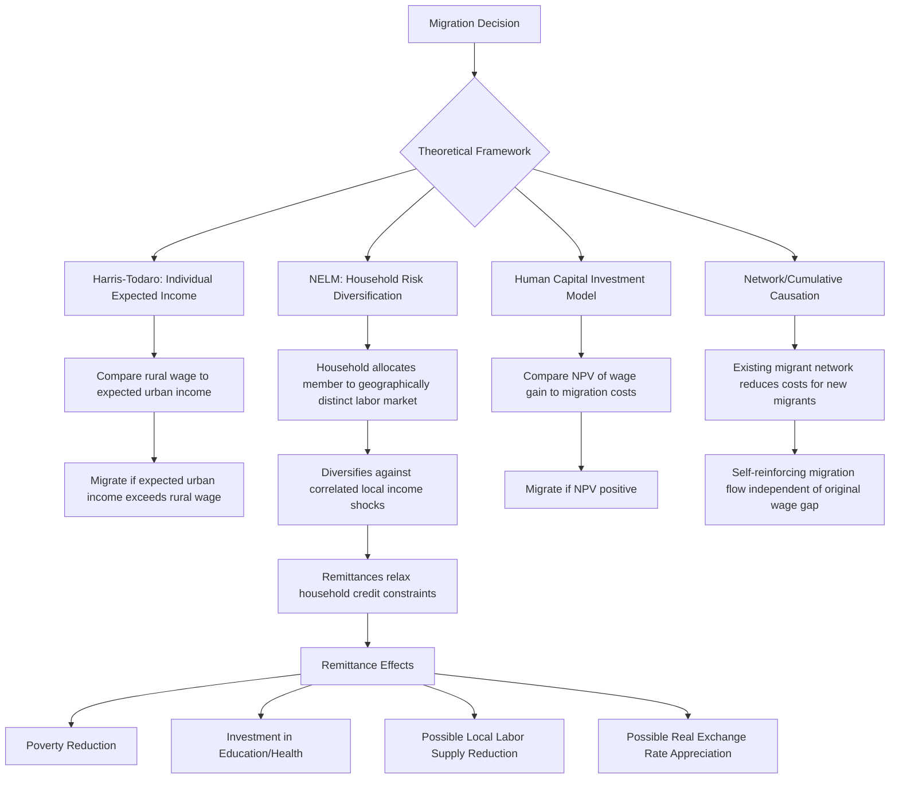

## Labor Migration: Internal and International

### Definition and Scope

Labor migration economics examines the determinants, patterns, and consequences of workers moving between locations — within a country (internal/rural-urban migration) or across national borders (international migration) — in pursuit of employment and income. This topic builds directly on the labor market dualism theories discussed earlier in this chapter, since expected income differentials arising from segmented labor markets are a primary theoretical driver of migration decisions, while extending the analysis to encompass household-level decision-making, remittance economics, and the distinct institutional and welfare dimensions of cross-border movement.

**Key Points**

- Migration decisions are increasingly modeled not as purely individual choices but as household- or family-level risk-management and income-diversification strategies (the New Economics of Labor Migration), a significant departure from the individual expected-income-maximization logic of the classic Harris-Todaro model.
- Remittances — the funds migrants send back to origin households — represent one of the largest and most stable sources of external finance for many developing countries, in many cases exceeding foreign direct investment and official development assistance in aggregate value. [Unverified — the precise current ranking and magnitude of remittances relative to other capital flows should be checked against current World Bank or IMF balance-of-payments data, as these flows and their relative rankings change over time.]
- International migration introduces additional theoretical and policy dimensions absent from internal migration — border policy and legal status, the "brain drain" versus "brain gain" debate, and bilateral labor migration agreements — that have no direct internal-migration analogue.

### Theoretical Frameworks

#### The Harris-Todaro Expected Income Model

As developed under labor market dualism theories, the foundational internal migration model treats the migration decision as driven by comparison of certain rural income against **expected** urban income (formal wage times job-finding probability, potentially incorporating informal-sector absorption in extended versions), explaining continued migration even amid substantial urban unemployment or underemployment. This remains the workhorse framework for internal rural-urban migration analysis in developing economies.

#### The New Economics of Labor Migration (NELM)

Developed substantially as a response to perceived limitations of the purely individualistic Harris-Todaro framing, NELM (associated prominently with Stark and Bloom) reframes migration as a household-level decision undertaken jointly by the migrant and the origin household, serving multiple purposes beyond individual income maximization:

- **Risk diversification**: Sending a household member to a geographically and economically distinct labor market (a different region or country) diversifies the household's income sources against local, correlated income shocks (crop failure, local economic downturn) — functioning as an informal insurance mechanism in the absence of formal insurance markets, directly connecting to the risk-market failure themes discussed under rural credit and financial constraints.
- **Relative deprivation**: Migration decisions may be influenced not only by absolute income prospects but by a household's income position relative to a reference group within their community, since perceived relative deprivation can motivate migration even when absolute income gains are modest.
- **Relaxing local constraints**: Remittances can relax credit and liquidity constraints facing the origin household, enabling investment in agricultural inputs, education, or business activities that would otherwise be unaffordable given local credit market failures.

#### Human Capital / Investment Models of Migration

Following Sjaastad's foundational framing, migration can be modeled as an investment decision in which a worker incurs upfront costs (direct financial costs, foregone earnings during transition, psychological costs of dislocation) in exchange for a discounted stream of expected future income gains:

$$NPV = \sum_{t=0}^{T} \frac{(w_{destination,t} - w_{origin,t})}{(1+r)^t} - C_{migration}$$

where $C_{migration}$ encompasses both direct and psychic migration costs. This framework generates standard human-capital-investment predictions: migration propensity should be higher for younger workers (longer horizon to recoup costs) and for those facing lower migration costs (geographic proximity, existing migrant networks reducing information and settlement costs).

#### Network and Cumulative Causation Theories

Migrant networks — social ties connecting origin communities to destinations with established migrant populations — are widely documented to substantially reduce the costs and risks of migration for subsequent migrants (via information sharing, job referrals, and initial housing/support), generating a self-reinforcing "cumulative causation" dynamic in which migration from a given origin community to a given destination tends to persist and grow over time once initial migration flows are established, independent of the underlying wage differentials that may have originally motivated the initial movement.

### Determinants of Migration

- **Wage/income differentials**: The foundational driver in most models, whether framed as individual expected income (Harris-Todaro) or household income diversification (NELM).
- **Migration costs**: Direct financial costs (transport, relocation), information costs (uncertainty about destination conditions), and psychic/social costs (separation from family and community), all of which migrant networks are documented to substantially reduce.
- **Credit constraints**: Because migration (particularly international migration) often requires substantial upfront capital, credit-constrained households may be unable to finance migration for otherwise profitable moves, a documented empirical pattern sometimes described as generating a "migration hump" — migration propensity initially rising with origin-country income (as credit constraints ease) before eventually declining as income differentials narrow. [Inference — the migration hump pattern is a documented empirical regularity in cross-country migration studies, though its precise shape and turning point vary across studies and country contexts.]
- **Demographic factors**: Age structure (migration propensity is generally higher among younger working-age individuals), education levels, and household composition (presence of dependents can both motivate migration, for income diversification, and constrain it, if care responsibilities limit the mobile household member's options).
- **Destination-country policy**: For international migration specifically, visa regimes, labor market access rules, and bilateral labor agreements directly shape the feasible migration choice set in ways with no internal-migration analogue.

### Remittances: Economics and Development Impact

#### Remittance Channels and Magnitude

Remittances are typically transferred through formal channels (bank transfers, money transfer operators, increasingly mobile money platforms) and informal channels (hand-carried cash, informal value transfer systems), with the relative importance of each channel varying substantially by corridor and regulatory context. Remittance flows to developing countries collectively represent a very large and, notably, comparatively stable source of external finance, often exhibiting less cyclical volatility than private capital flows or foreign direct investment, since remittance-sending decisions are driven by altruistic and risk-sharing motives that can partially counteract, rather than amplify, economic downturns in the origin country (a documented "counter-cyclical" property in a substantial share of the empirical remittance literature). [Inference — while counter-cyclicality is a well-documented general pattern, its strength varies by remittance corridor and specific economic circumstances, and should not be treated as a universal, unconditional property of all remittance flows.]

#### Household-Level Development Impacts

Empirical studies generally find remittances are associated with reduced poverty and, in various specific studies, increased investment in education, health, and housing at the household level, consistent with the NELM framing of remittances relaxing local credit and liquidity constraints. Effects on local investment and entrepreneurship are more mixed across the literature, with some studies finding remittances substituting for local labor supply (a documented "moral hazard" or dependency concern in specific studies) rather than uniformly stimulating productive investment. [Inference — this heterogeneity of investment-related findings across the empirical literature reflects genuine variation across contexts rather than a single settled effect, and specific claimed magnitudes should be checked against the relevant country-specific studies.]

#### Macroeconomic Considerations

At the aggregate level, large and sustained remittance inflows have been analyzed for potential "Dutch disease"-type effects (real exchange rate appreciation reducing the competitiveness of the tradable goods sector) in some heavily remittance-dependent economies, alongside their more straightforwardly positive role in financing current account deficits and supporting foreign exchange reserves. [Unverified — the empirical magnitude and prevalence of Dutch-disease-type remittance effects specifically (as opposed to general capital-inflow effects) remains a debated question in the literature and should be checked against country-specific studies for any particular case.]

### International Migration: Additional Dimensions

#### Brain Drain versus Brain Gain

The emigration of highly skilled workers (doctors, engineers, scientists) from developing to developed countries has historically been analyzed primarily as a "brain drain" imposing a net loss on origin countries (lost human capital investment, reduced provision of skilled services domestically). A revisionist "brain gain" literature has argued that the *prospect* of skilled emigration can incentivize greater investment in education domestically (since more people pursue skilled credentials hoping to emigrate, and not all who invest in skills ultimately do so), potentially generating a net increase in the domestically retained skilled population even after accounting for actual emigration — though this beneficial effect is theoretically and empirically conditional on emigration rates not being too high relative to the induced additional skill investment, and the balance of evidence across specific countries and professions (particularly health-sector emigration from some countries) is genuinely mixed. [Inference — the brain drain/brain gain balance is well-documented in the literature to be context- and sector-specific rather than resolvable to a single universal conclusion, with health-worker emigration from some low-income countries frequently cited as a case with more clearly negative net effects given acute domestic health workforce shortages.]

#### Legal Status and Labor Market Segmentation

International migrants' legal status (documented versus undocumented, temporary versus permanent) substantially shapes their labor market position, wage outcomes, and vulnerability to exploitation, introducing a distinct segmentation dimension layered on top of the formal-informal sector distinctions discussed earlier in this chapter.

#### Bilateral and Regional Labor Migration Agreements

Formal government-to-government agreements governing temporary labor migration (guest worker programs, regional free-movement protocols) aim to formalize and regulate migration flows, with documented variation in the extent to which such agreements protect migrant worker rights versus primarily serving destination-country labor demand management objectives.

### Diagram: Migration Decision Frameworks Compared

### Diagram: Remittance Flow and Household Effects (svg_diagram)

<svg viewBox="0 0 720 380" xmlns="http://www.w3.org/2000/svg">
<text x="360" y="30" text-anchor="middle" font-size="17" font-weight="bold" fill="#1a1a1a">Remittance Flow and Household Effects (svg_diagram)</text>
<rect x="50" y="70" width="180" height="80" rx="8" fill="#ebf8ff" stroke="#2b6cb0" stroke-width="2"/>
<text x="140" y="105" text-anchor="middle" font-size="13" font-weight="bold">Migrant Worker</text>
<text x="140" y="125" text-anchor="middle" font-size="11">Destination labor market</text>
<rect x="490" y="70" width="180" height="80" rx="8" fill="#e6fffa" stroke="#319795" stroke-width="2"/>
<text x="580" y="105" text-anchor="middle" font-size="13" font-weight="bold">Origin Household</text>
<text x="580" y="125" text-anchor="middle" font-size="11">Receives remittances</text>
<line x1="230" y1="110" x2="490" y2="110" stroke="#4a5568" stroke-width="2"/>
<polygon points="490,110 475,103 475,117" fill="#4a5568"/>
<text x="360" y="95" text-anchor="middle" font-size="11" fill="#4a5568">Remittances</text>
<rect x="370" y="200" width="130" height="60" rx="6" fill="#c6f6d5" stroke="#2f855a"/>
<text x="435" y="225" text-anchor="middle" font-size="11" font-weight="bold">Poverty Reduction</text>
<text x="435" y="242" text-anchor="middle" font-size="10">& Consumption Smoothing</text>
<rect x="210" y="200" width="130" height="60" rx="6" fill="#c6f6d5" stroke="#2f855a"/>
<text x="275" y="225" text-anchor="middle" font-size="11" font-weight="bold">Education/Health</text>
<text x="275" y="242" text-anchor="middle" font-size="10">Investment</text>
<rect x="530" y="200" width="150" height="60" rx="6" fill="#fed7d7" stroke="#c53030"/>
<text x="605" y="225" text-anchor="middle" font-size="11" font-weight="bold">Possible Dependency</text>
<text x="605" y="242" text-anchor="middle" font-size="10">/ Reduced Local Labor Supply</text>
<line x1="580" y1="150" x2="435" y2="200" stroke="#718096" stroke-width="1.5"/>
<line x1="580" y1="150" x2="275" y2="200" stroke="#718096" stroke-width="1.5"/>
<line x1="580" y1="150" x2="605" y2="200" stroke="#718096" stroke-width="1.5"/>
</svg>

### Illustrative Examples

**Mexico-United States migration corridor**: One of the most extensively studied international migration corridors, providing substantial empirical evidence on migrant network effects (with documented concentration of migrants from specific Mexican origin communities in specific U.S. destinations, consistent with network/cumulative causation theory), remittance-financed investment at origin, and the labor market effects of both documented and undocumented migration status.

**Philippine labor migration policy**: The Philippines has one of the world's most institutionalized labor export policy frameworks, with government agencies actively facilitating and regulating overseas Filipino worker deployment across multiple destination countries and sectors (notably domestic work, seafaring, and healthcare), and remittances constituting a substantial and closely tracked share of national GDP, frequently cited as an example of a deliberate national labor migration and remittance-dependent development strategy. [Unverified — specific current remittance-to-GDP figures and policy program details should be checked against current Philippine Statistics Authority or Bangko Sentral ng Pilipinas data given periodic updates.]

**Health-worker emigration from Sub-Saharan Africa**: Extensively documented emigration of trained doctors and nurses from several Sub-Saharan African countries to higher-income destinations is a frequently cited case in the brain-drain literature, given the acute domestic health workforce shortages in many origin countries, illustrating the sector-specific cases where the brain-drain framing is considered by most researchers in this literature to be more empirically supported relative to the more optimistic brain-gain counter-narrative. [Inference — this characterization reflects a reasonably strong consensus specifically regarding health-sector emigration from low-income, health-workforce-scarce origin countries, rather than a claim generalizable to all skilled-emigration contexts.]

### Related Topics

- Labor market dualism theories
- Formal versus informal sector employment
- Rural credit and financial constraints
- Smallholder farming and commercialization
- Remittances and macroeconomic stability
- Brain drain and human capital policy
- Underemployment and disguised unemployment
- Minimum wage effects in developing countries