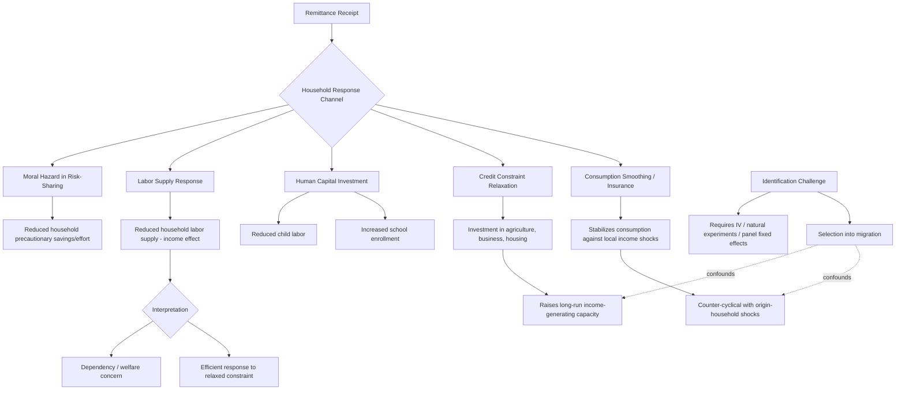

## Remittances and Household Welfare

### Definition and Scope

Remittances and household welfare examines the microeconomic channels through which funds sent by migrant workers to origin households affect recipient household consumption, investment, labor supply, and broader wellbeing outcomes. While the previous topic (labor migration: internal and international) introduced remittances primarily as a component of the migration decision and its aggregate macroeconomic implications, this topic focuses in greater depth on the household-level welfare economics of remittance receipt — the specific mechanisms, empirical findings, and identification challenges involved in measuring their impact.

**Key Points**

- Remittances function simultaneously as a consumption-smoothing/insurance mechanism, a source of investment capital relaxing local credit constraints, and (in some documented cases) a source of labor supply disincentive or dependency — meaning their net welfare effect on a given household depends on which of these channels dominates in a given context.
- A central and persistent empirical challenge in this literature is that migration and remittance receipt are not randomly assigned: households that select into having a migrant member likely differ systematically (in wealth, risk tolerance, network access, or unobserved ability) from non-migrant households, complicating simple comparisons of remittance-receiving versus non-receiving household outcomes.
- Findings across the empirical literature are genuinely heterogeneous across countries, remittance corridors, and outcome measures, reflecting real underlying variation in remittance use and context rather than a single universal effect.

### Theoretical Channels

#### Consumption Smoothing and Insurance

Consistent with the New Economics of Labor Migration framework introduced under labor migration, remittances can function as an informal insurance payout, arriving (or increasing) precisely when the origin household experiences a negative income shock (crop failure, illness, local economic downturn), since migrants — especially those motivated by altruism or an implicit family risk-sharing arrangement — are more likely to increase transfers in response to observed or reported hardship at home. This generates a theoretically distinct prediction from a simple constant-transfer model: remittances should be **counter-cyclical** with respect to origin-household or origin-region income shocks if this insurance channel is operative, a specific testable prediction that a substantial body of empirical work has examined. [Inference — while counter-cyclical remittance responses to shocks are documented in numerous specific studies, the strength of this relationship varies by migrant-household relationship, remittance corridor, and shock type, and is not a uniform, unconditional pattern across all contexts.]

#### Credit Constraint Relaxation and Investment

Remittances can substitute for missing or imperfect formal credit markets (the market failures discussed under rural credit and financial constraints), providing recipient households with liquidity to invest in productive assets — agricultural inputs, small business capital, education, or housing — that would otherwise be constrained by local credit rationing. This channel is theoretically distinct from pure consumption smoothing, since it implies remittances can raise a household's long-run income-generating capacity rather than merely stabilizing current consumption around an unchanged income trajectory.

#### Human Capital Investment

A frequently studied specific investment channel is education: remittance income, by relaxing the household budget constraint and reducing the need for child labor to meet subsistence needs, has been found in several specific country studies to be associated with increased school enrollment and reduced child labor in remittance-receiving households, consistent with a standard household investment response to relaxed liquidity constraints.

#### Labor Supply and Dependency Effects

A competing and empirically documented channel in some contexts is that remittance income, functioning similarly to any unearned income transfer, can reduce recipient household members' labor supply — a standard income effect in labor supply theory, where non-labor income raises the demand for leisure at any given wage. Whether this represents a genuine welfare-reducing "dependency" effect or simply an efficient household response to relaxed budget constraints (working less because it is no longer necessary to work as much to meet subsistence needs) is a matter of interpretation rather than a purely empirical question, though the specific magnitude and prevalence of labor supply reduction varies substantially across the studies documenting it. [Inference — this dual interpretation genuinely divides researchers, and characterizing labor supply reduction as unambiguously "harmful" versus "an efficient response to relaxed constraints" is a normative framing choice rather than a settled empirical matter.]

#### Moral Hazard in Household Risk-Sharing

Where remittances are sent as part of an implicit intra-family insurance arrangement, a moral hazard concern (structurally analogous to insurance moral hazard generally) arises if recipient households reduce their own precautionary savings or risk-mitigating effort, anticipating that remittances will be increased in response to any shock — a theoretically predicted but empirically difficult-to-cleanly-identify effect.

### Empirical Identification Challenges

#### Selection into Migration

Because households (or individuals within households) that produce a migrant are not randomly selected from the population, naive comparisons of remittance-receiving versus non-receiving household outcomes conflate the causal effect of remittances with pre-existing differences between migrant-sending and non-migrant-sending households (in wealth, risk attitudes, network access, or unobserved entrepreneurial ability), a fundamental selection bias concern pervading this literature.

#### Common Identification Strategies

- **Instrumental variables**: Using historical migrant network density, distance to transport infrastructure, or exogenous policy changes in destination-country migration rules as instruments for migration/remittance likelihood, under the exclusion restriction that these instruments affect household outcomes only through their effect on migration/remittances.
- **Natural experiments from destination-country shocks**: Exploiting exogenous economic shocks in migrant destination countries (recessions, exchange rate movements, policy changes) that shift remittance amounts for reasons unrelated to origin-household characteristics, providing a source of plausibly exogenous variation in remittance receipt or magnitude.
- **Panel data with household fixed effects**: Using within-household variation over time (before and after a household member migrates, or across periods with varying remittance amounts) to control for time-invariant unobserved household characteristics, though this approach cannot address time-varying unobserved confounders (e.g., a household experiencing an income shock that simultaneously prompts increased remittances and independently affects other outcomes).

### Formal Representation: Remittances in a Household Budget Constraint

A simplified household consumption/investment model incorporating remittances:

$$C_t + I_t = Y_t^{local} + R_t$$

where $C_t$ is consumption, $I_t$ is investment, $Y_t^{local}$ is local household income (subject to shocks and credit constraints), and $R_t$ is remittance receipt. Under the insurance/consumption-smoothing hypothesis, $R_t$ is modeled as inversely related to shocks to $Y_t^{local}$:

$$R_t = \alpha - \beta \cdot \varepsilon_t^{Y}, \quad \beta > 0$$

where $\varepsilon_t^Y$ is a negative income shock and $\beta$ captures the strength of the implicit insurance response — a larger $\beta$ implies stronger consumption-smoothing behavior by the remitting migrant, an empirically estimated parameter that varies across the specific studies testing this relationship.

### Diagram: Channels from Remittance Receipt to Household Welfare Outcomes

### Diagram: Remittances as Counter-Cyclical Insurance (svg_diagram)

<svg xmlns="http://www.w3.org/2000/svg" viewBox="0 0 700 380">
<text x="350" y="30" text-anchor="middle" font-size="17" font-weight="bold" fill="#1a1a1a">Remittances as Counter-Cyclical Insurance (svg_diagram)</text>
<line x1="70" y1="200" x2="640" y2="200" stroke="#2d3748" stroke-width="2" />
<text x="355" y="360" text-anchor="middle" font-size="12">Time</text>
<text x="35" y="200" text-anchor="middle" font-size="12" transform="rotate(-90 35 200)">Deviation from Trend</text>

<path d="M 80 200 C 150 160, 200 100, 260 190 C 320 260, 360 300, 420 200 C 480 100, 520 160, 580 200 L 620 200" fill="none" stroke="`#c53030`" stroke-width="3" />

<text x="260" y="220" text-anchor="middle" font-size="11" fill="`#c53030`">Local Household Income</text>

<path d="M 80 200 C 150 210, 200 240, 260 220 C 320 190, 360 170, 420 220 C 480 250, 520 220, 580 200 L 620 200" fill="none" stroke="`#2b6cb0`" stroke-width="3" stroke-dasharray="6,3" />

<text x="420" y="255" text-anchor="middle" font-size="11" fill="`#2b6cb0`">Remittance Inflow</text>

<text x="350" y="320" text-anchor="middle" font-size="11" fill="`#4a5568`" font-style="italic">Remittances rise as local income falls, smoothing net household resources</text>

</svg>

### Illustrative Examples

**Philippine remittance and education studies**: Studies examining Philippine households receiving international remittances (drawing on the country's large-scale, institutionalized labor migration system discussed under labor migration: internal and international) have generally found positive associations between remittance receipt and child schooling outcomes, consistent with the human capital investment channel, though as with the broader literature, isolating the causal effect from migration selection effects requires careful identification strategy. [Unverified — specific quantitative effect-size estimates from this literature vary by study and should be checked against particular published studies for precision.]

**El Salvador and Central American remittance studies**: Research on Central American remittance-receiving households (drawing on substantial migration to the United States) has documented evidence consistent with both credit-constraint relaxation (increased small business investment in some studies) and, in other specific studies, reduced adult labor force participation among remittance-receiving household members, illustrating the coexistence of multiple, sometimes offsetting channels within a single migration corridor's literature.

**Weather-shock and remittance response studies**: Several studies exploiting exogenous weather shocks (droughts, storms) in migrant-sending regions have found evidence of increased remittance flows following such shocks, providing relatively credible (quasi-experimental, since weather shocks are plausibly exogenous to unobserved household characteristics) support for the consumption-smoothing/insurance channel specifically. [Inference — while this is a genuinely well-identified pattern in the specific studies using this weather-shock design, generalizing the precise magnitude of remittance response to shocks across all contexts and migrant relationships is not well-supported by a single study or small set of studies.]

### Policy Implications

- **Remittances as a complement to, not substitute for, formal social protection**: Given remittances' documented insurance function, gaps in remittance-based informal insurance (for households without a migrant member, or during shocks large enough to affect the migrant's own income) suggest genuine remaining scope for formal social protection systems, discussed under food security and famine economics, rather than remittances fully substituting for such systems.
- **Facilitating remittance transfer efficiency**: Reducing remittance transfer costs (transaction fees for international money transfers, which have historically been comparatively high for many low-income-country corridors) is a frequently proposed policy lever to increase the net welfare benefit households receive from a given level of migrant earnings, connecting to broader digital financial inclusion themes discussed under rural credit and financial constraints.
- **Addressing genuine dependency concerns where present**: To the extent labor-supply reduction reflects a welfare-reducing dependency dynamic rather than an efficient response to relaxed constraints in a specific context, complementary interventions supporting productive investment of remittance income (financial literacy programs, matched-savings schemes for remittance-linked investment) have been piloted in some contexts, though the evidence base for such complementary interventions' effectiveness is more limited than for the foundational descriptive remittance-effects literature itself. [Unverified — specific program evaluation results in this narrower intervention space should be checked against current sources given the relatively smaller and more recent evidence base.]

### Related Topics

- Labor migration: internal and international
- Rural credit and financial constraints
- Food security and famine economics
- Smallholder farming and commercialization
- Labor market dualism theories
- Household risk-sharing and informal insurance
- Human capital investment and child labor
- Digital financial inclusion and mobile money