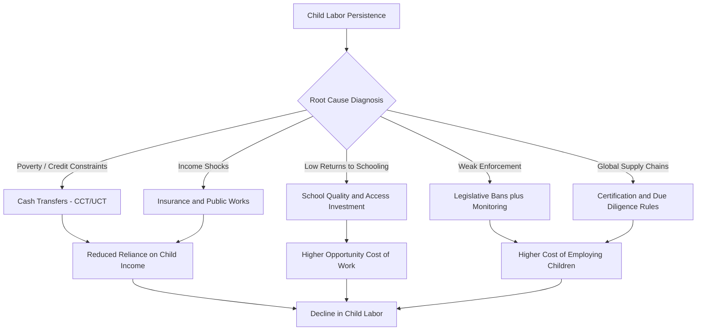

## Child Labor: Causes and Policy Responses

### Definition and Scope

Child labor refers to work that deprives children of their childhood, potential, and dignity, and that is harmful to physical and mental development. It is distinct from child work broadly, which may include light tasks compatible with schooling and development.

The International Labour Organization (ILO) Convention No. 138 (Minimum Age Convention) and Convention No. 182 (Worst Forms of Child Labour Convention) provide the primary legal framework:

- **Minimum age standard**: generally 15 years (14 in developing countries under exceptions), 18 for hazardous work
- **Worst forms** (C182): slavery, trafficking, debt bondage, forced recruitment for armed conflict, prostitution, pornography, illicit activities (e.g., drug trafficking), and hazardous work

**Key Points**

- Not all work by children constitutes child labor under international definitions
- Light work by children above a minimum age (often 12-13) that does not interfere with schooling may be permitted
- The distinction between "child labor" and "hazardous child labor" matters for both measurement and policy targeting

### Global Magnitude and Trends

According to ILO-UNICEF joint estimates, approximately 160 million children (aged 5-17) were in child labor globally as of 2020, with nearly half in hazardous work. Sub-Saharan Africa has both the highest incidence rate and the largest absolute number of child laborers, followed by South Asia.

$$\text{Child Labor Rate} = \frac{\text{Children in Labor Force (5-17)}}{\text{Total Child Population (5-17)}} \times 100$$

[Unverified] Exact current figures should be cross-checked against the latest ILO Global Estimates report, as data collection cycles are irregular (roughly every 4 years) and COVID-19-era disruptions may have altered trends.

### Theoretical Framework: The Household Decision Model

The standard economic framework treats child labor as an outcome of household utility maximization under constraints, following Basu and Van's (1998) luxury axiom and substitution axiom.

**Luxury Axiom**: A household sends children to work only when household income from adult labor falls below a subsistence threshold. Child labor is a "bad" that households would eliminate if income allowed.

**Substitution Axiom**: Child and adult labor are substitutes in production; adult wages are affected by the supply of child labor.

The household's problem can be represented as:

$$\max_{c, l} U(c, l) \quad \text{s.t.} \quad c = w_a L_a + w_c L_c + Y_0$$

Where $c$ is consumption, $l$ is child leisure/schooling, $w_a$ and $w_c$ are adult and child wages, $L_a$ and $L_c$ are labor supplies, and $Y_0$ is non-labor household income.

This generates a key theoretical result: **multiple equilibria** can exist. A "good" equilibrium with high adult wages and no child labor, and a "bad" equilibrium with low adult wages (due to labor market saturation from child workers) that perpetuates child labor. This is central to the argument for coordinated bans (see Policy Responses below).

### Causes of Child Labor

#### 1. Poverty and Credit Constraints

Poverty is the most cited driver, but the relationship is more nuanced than simple income deficiency:

- **Household poverty**: Low adult wages/employment push families to rely on children's earnings for subsistence
- **Credit market failures**: Without access to loans or insurance, households use child labor as a buffer against income shocks (a form of ex-post risk coping) rather than borrowing against future income
- **Intergenerational transmission**: Parents who worked as children are more likely to send their own children to work, partly due to lower educational attainment and income

#### 2. Returns to Education

Where the perceived or actual returns to schooling are low (poor school quality, weak labor market signaling, or credential inflation), the opportunity cost of schooling relative to immediate earnings favors work.

- Distance to schools and direct costs (fees, uniforms, materials) raise the effective price of education
- Poor school quality reduces expected lifetime earnings gains from attendance, tilting the cost-benefit calculation toward work

#### 3. Labor Market Demand

Certain sectors exhibit strong demand for child labor due to:

- **Nimble fingers hypothesis**: Perceived (often contested) advantages of children in tasks requiring dexterity (carpet weaving, garment assembly)
- **Lower wage costs**: Children are paid less than adults for comparable tasks, incentivizing employer substitution
- **Docility/compliance**: Children are less likely to unionize or negotiate, appealing to employers seeking to suppress labor costs

#### 4. Household Composition and Shocks

- **Family size**: Larger families face resource dilution, increasing reliance on child income
- **Orphanhood and health shocks**: Loss of a primary earner (e.g., due to HIV/AIDS, illness, death) directly increases child labor incidence
- **Agricultural shocks**: Weather-related income shocks (droughts, floods) increase child labor as a coping mechanism, particularly in economies lacking crop insurance

#### 5. Social and Cultural Norms

- Cultural acceptance of child work as part of skill transmission (agricultural, artisanal apprenticeships)
- Gender norms shaping the type of child labor (girls disproportionately engaged in domestic work, which is often undercounted in statistics)
- Weak enforcement of compulsory schooling laws

#### 6. Trade and Globalization

[Inference] The relationship between trade openness and child labor is theoretically ambiguous and empirically contested:

- Trade can increase demand for child labor in export sectors (e.g., certain manufacturing or agricultural exports)
- Trade can also raise household incomes and adult wages, reducing reliance on child labor (income effect dominating substitution effect in many empirical studies)

### Causal Diagram: Determinants of Child Labor (svg_diagram)

<svg xmlns="http://www.w3.org/2000/svg" viewBox="0 0 900 620">
<text x="450" y="30" font-size="20" font-weight="bold" text-anchor="middle" fill="#1a1a1a">Determinants of Child Labor (svg_diagram)</text>
<rect x="30" y="70" width="180" height="60" rx="8" fill="#dbeafe" stroke="#2563eb" stroke-width="2" />
<text x="120" y="95" font-size="13" text-anchor="middle" fill="#1e3a8a" font-weight="bold">Household Poverty</text>
<text x="120" y="113" font-size="11" text-anchor="middle" fill="#1e3a8a">Credit Constraints</text>
<rect x="250" y="70" width="180" height="60" rx="8" fill="#dbeafe" stroke="#2563eb" stroke-width="2" />
<text x="340" y="95" font-size="13" text-anchor="middle" fill="#1e3a8a" font-weight="bold">Low Returns to</text>
<text x="340" y="113" font-size="13" text-anchor="middle" fill="#1e3a8a">Schooling</text>
<rect x="470" y="70" width="180" height="60" rx="8" fill="#dbeafe" stroke="#2563eb" stroke-width="2" />
<text x="560" y="95" font-size="13" text-anchor="middle" fill="#1e3a8a" font-weight="bold">Labor Demand</text>
<text x="560" y="113" font-size="11" text-anchor="middle" fill="#1e3a8a">(low-wage sectors)</text>
<rect x="690" y="70" width="180" height="60" rx="8" fill="#dbeafe" stroke="#2563eb" stroke-width="2" />
<text x="780" y="95" font-size="13" text-anchor="middle" fill="#1e3a8a" font-weight="bold">Household Shocks</text>
<text x="780" y="113" font-size="11" text-anchor="middle" fill="#1e3a8a">(health, weather)</text>
<rect x="300" y="220" width="300" height="70" rx="8" fill="#fef3c7" stroke="#d97706" stroke-width="2" />
<text x="450" y="250" font-size="15" font-weight="bold" text-anchor="middle" fill="#78350f">CHILD LABOR</text>
<text x="450" y="270" font-size="11" text-anchor="middle" fill="#78350f">(work displacing school/development)</text>
<line x1="120" y1="130" x2="380" y2="220" stroke="#333" stroke-width="1.5" marker-end="url(#arrow)" />
<line x1="340" y1="130" x2="410" y2="220" stroke="#333" stroke-width="1.5" marker-end="url(#arrow)" />
<line x1="560" y1="130" x2="490" y2="220" stroke="#333" stroke-width="1.5" marker-end="url(#arrow)" />
<line x1="780" y1="130" x2="520" y2="220" stroke="#333" stroke-width="1.5" marker-end="url(#arrow)" />
<rect x="120" y="340" width="200" height="60" rx="8" fill="#fee2e2" stroke="#dc2626" stroke-width="2" />
<text x="220" y="365" font-size="13" font-weight="bold" text-anchor="middle" fill="#7f1d1d">Reduced Schooling</text>
<text x="220" y="383" font-size="11" text-anchor="middle" fill="#7f1d1d">/ Human Capital Loss</text>
<rect x="350" y="340" width="200" height="60" rx="8" fill="#fee2e2" stroke="#dc2626" stroke-width="2" />
<text x="450" y="365" font-size="13" font-weight="bold" text-anchor="middle" fill="#7f1d1d">Health &amp; Safety</text>
<text x="450" y="383" font-size="11" text-anchor="middle" fill="#7f1d1d">Risks</text>
<rect x="580" y="340" width="220" height="60" rx="8" fill="#fee2e2" stroke="#dc2626" stroke-width="2" />
<text x="690" y="365" font-size="13" font-weight="bold" text-anchor="middle" fill="#7f1d1d">Suppressed Adult Wages</text>
<text x="690" y="383" font-size="11" text-anchor="middle" fill="#7f1d1d">(substitution effect)</text>
<line x1="400" y1="290" x2="240" y2="340" stroke="#333" stroke-width="1.5" marker-end="url(#arrow)" />
<line x1="450" y1="290" x2="450" y2="340" stroke="#333" stroke-width="1.5" marker-end="url(#arrow)" />
<line x1="500" y1="290" x2="660" y2="340" stroke="#333" stroke-width="1.5" marker-end="url(#arrow)" />
<rect x="230" y="460" width="440" height="70" rx="8" fill="#ede9fe" stroke="#7c3aed" stroke-width="2" />
<text x="450" y="490" font-size="14" font-weight="bold" text-anchor="middle" fill="#4c1d95">Intergenerational Poverty Trap</text>
<text x="450" y="510" font-size="11" text-anchor="middle" fill="#4c1d95">(low education → low future income → child labor persists)</text>
<line x1="220" y1="400" x2="380" y2="460" stroke="#333" stroke-width="1.5" marker-end="url(#arrow)" />
<line x1="690" y1="400" x2="520" y2="460" stroke="#333" stroke-width="1.5" marker-end="url(#arrow)" />
<path d="M 230 495 C 100 495, 60 200, 110 130" stroke="#7c3aed" stroke-width="1.5" fill="none" stroke-dasharray="6,4" marker-end="url(#arrow)" />
<text x="60" y="300" font-size="11" fill="#4c1d95" transform="rotate(-90, 60, 300)">Feedback Loop</text>
</svg>

### Empirical Evidence on Key Mechanisms

**Conditional Cash Transfers (CCTs)**: Programs like Mexico's *Progresa/Oportunidades* and Brazil's *Bolsa Família* tie cash payments to school attendance, directly raising the relative return to schooling versus work. Evaluations generally find statistically significant reductions in child labor and increases in school enrollment, though effects vary by sector and gender. [Inference] Magnitudes differ substantially by country context, transfer size, and enforcement quality, so pooled estimates should not be treated as universally transferable.

**Trade Shock Studies**: Research on Vietnam's rice trade liberalization (Edmonds and Pavcnik) found that rising rice prices, by raising household incomes, were associated with declines in child labor — consistent with the income effect dominating in a context of near-universal poverty rather than a targeted demand effect.

**Bans and Enforcement**: Evidence on the 1986 U.S. ban on hazardous child labor imports and India's Child Labour (Prohibition and Regulation) Act suggests mixed results; bans without complementary income support or school access can push child labor into unmonitored informal sectors rather than eliminating it (the "informalization" effect).

### Multiple Equilibria and the Case for Coordinated Bans

Basu and Van's model implies that if child and adult labor are substitutes, a legislated ban on child labor can shift the economy from a "bad" (child-labor) equilibrium to a "good" (no-child-labor) equilibrium by tightening labor supply and raising adult wages enough to sustain the ban without further enforcement. This provides a theoretical rationale for legal prohibition beyond simple moral appeals, though it depends on:

- Sufficient substitutability between child and adult labor
- Credible, sustained enforcement during the transition
- Absence of severe poverty traps that make short-run compliance infeasible for subsistence households

**Example**

Consider a rural economy where children's wages are $w_c = 2$ and adults' wages, absent child competition, would rise to $w_a = 6$ under a ban (versus $w_a = 4$ with child labor present, due to labor market slack). If household subsistence requires income of 5 units and one adult plus one child working yields $4 + 2 = 6$, while one adult alone (post-ban, higher wage) yields $6 > 5$, the ban is self-sustaining: households no longer need child income to meet subsistence, so no coordination failure persists.

### Policy Responses

#### 1. Legislative and Regulatory Approaches

- **Minimum age laws**: Setting and enforcing minimum working ages aligned with ILO C138
- **Compulsory education laws**: Mandating school attendance up to a certain age, which mechanically competes with labor time
- **Hazardous work prohibitions**: Targeting the worst forms (C182) with stricter enforcement given the acute harm involved
- **Trade-linked labor standards**: Import restrictions or social clauses in trade agreements conditioning market access on labor standards compliance (e.g., GSP labor eligibility criteria)

[Inference] Legislative bans are most effective as one component of a broader package; standalone bans without addressing the underlying poverty driver risk merely displacing child labor into informal, less visible, and sometimes more hazardous work.

#### 2. Demand-Side Income Support

- **Conditional Cash Transfers (CCTs)**: Cash transfers conditioned on school attendance and/or health check-ups (Bolsa Família, Progresa, Philippines' 4Ps)
- **Unconditional Cash Transfers (UCTs)**: Evidence suggests UCTs can also reduce child labor by relaxing the household budget constraint, though effects are generally smaller than CCTs on schooling-specific margins
- **Public works and employment guarantee schemes**: Programs like India's MGNREGA can raise adult wages/employment, reducing household reliance on child income (consistent with the luxury axiom)

#### 3. Supply-Side Education Interventions

- **Reducing costs of schooling**: Eliminating school fees, providing free uniforms/textbooks/meals (school feeding programs)
- **Improving school quality and returns**: Teacher training, curriculum relevance, vocational tracks that raise perceived future earnings from education
- **Reducing distance/access barriers**: School construction in underserved areas, transportation subsidies

#### 4. Risk-Mitigation Instruments

- **Microinsurance and weather-indexed insurance**: Reducing the need for child labor as an ex-post shock-coping mechanism
- **Microcredit access**: Relaxing credit constraints so households can smooth consumption without withdrawing children from school

#### 5. Supply Chain and Corporate Accountability

- **Certification schemes**: Rugmark/GoodWeave certification in the carpet industry, Fairtrade labeling
- **Corporate due diligence regulations**: EU Corporate Sustainability Due Diligence Directive (CSDDD) and similar frameworks requiring supply chain monitoring for child labor risks
- **International Framework Agreements**: Between multinational corporations and Global Union Federations covering labor standards across supply chains

[Unverified] The current implementation status and scope of the EU CSDDD should be verified against the latest official EU documentation, as due diligence directives have undergone revisions and phased implementation timelines.

#### 6. International and Multilateral Mechanisms

- **ILO-IPEC (International Programme on the Elimination of Child Labour)**: Technical assistance and monitoring support to member states
- **UNICEF programming**: Integrated child protection systems addressing labor alongside health and education
- **SDG Target 8.7**: Global commitment to eliminate child labor in all its forms by 2025 (subsequently widely acknowledged as unmet; the target has driven continued monitoring rather than achieving full elimination)

### Policy Design Trade-offs

| Policy Instrument | Primary Mechanism | Key Limitation |
| --- | --- | --- |
| Legislative bans | Raises cost of employing children | Risk of informalization without enforcement capacity |
| CCTs | Raises relative return to schooling | Fiscal cost; targeting/leakage errors |
| Compulsory education | Time competition with work | Requires adequate school supply and quality |
| Trade sanctions/social clauses | External pressure on export sectors | May harm household income if poorly targeted, worsening welfare |
| Microinsurance/credit | Reduces shock-driven child labor | Limited take-up; market development constraints |
| Supply chain certification | Market-based incentive via consumer/buyer pressure | Coverage limited to formal, export-oriented segments |

### Policy Response Framework (Diagram)

### Measurement and Data Challenges

- **Undercounting domestic and unpaid work**: Girls' household labor is frequently excluded from standard labor force definitions, biasing gender comparisons
- **Informality**: Much child labor occurs in family enterprises or informal agriculture, complicating survey-based measurement and enforcement
- **Definitional inconsistency**: Cross-country comparability is limited by varying national definitions of minimum age and permissible light work

### Conclusion

Child labor in developing economies arises from an interaction of poverty, credit market failures, low returns to schooling, labor demand for cheap and compliant workers, and household risk exposure. The theoretical literature, particularly the Basu-Van framework, clarifies why coordinated interventions (combining income support, education investment, and enforceable legislation) tend to outperform any single instrument in isolation. Effective policy design requires matching the intervention to the dominant local driver—income-constrained households benefit most from cash transfers and insurance, while demand-driven child labor in export sectors may respond better to supply chain accountability mechanisms—while remaining alert to the risk that poorly sequenced bans can displace rather than eliminate harmful child labor.

**Related Topics**

- Human capital theory and returns to schooling in developing economies
- Conditional cash transfer program design and evaluation methodology (RCTs)
- Informal sector labor markets and enforcement capacity
- Intergenerational poverty traps and social mobility
- Gender disparities in child labor and domestic work measurement
- Global supply chain governance and corporate due diligence regulation
- Social protection systems and risk-coping mechanisms in low-income households
- SDG 8.7 monitoring frameworks and ILO Global Estimates methodology