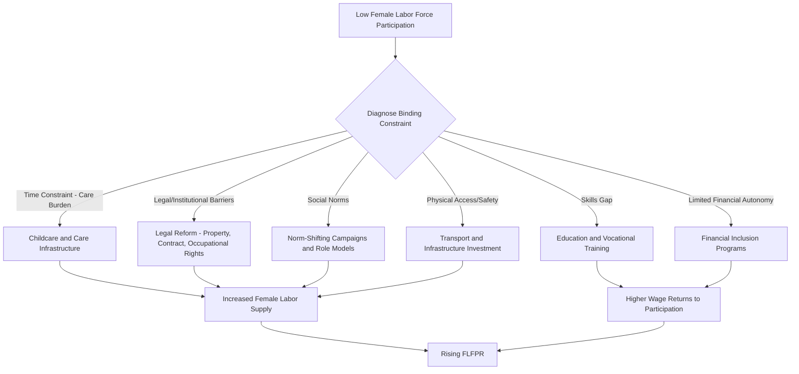

## Gender and Labor Force Participation

### Definition and Measurement

The **Labor Force Participation Rate (LFPR)** measures the share of the working-age population that is either employed or actively seeking employment:

$$LFPR = \frac{\text{Employed} + \text{Unemployed (seeking work)}}{\text{Working-Age Population}} \times 100$$

**Female Labor Force Participation Rate (FLFPR)** and the **gender gap in LFPR** are the primary metrics used to study gendered patterns:

$$\text{Gender Gap} = LFPR_{male} - LFPR_{female}$$

**Key Points**

- LFPR excludes unpaid domestic work and care work from standard employment statistics, systematically undercounting female economic activity
- Discouraged workers (those who stopped searching due to poor prospects) are excluded from the labor force entirely, which can understate true gender gaps in economies with weak job availability for women
- Time-use surveys are increasingly used alongside labor force surveys to capture unpaid care work

### The Feminization U-Hypothesis

A foundational stylized fact in development economics is the **U-shaped relationship** between economic development and FLFPR, first documented by Goldin (1995) using cross-country and historical U.S. data.

**Stages of the U-curve:**

1. **Low-income/agrarian stage**: High FLFPR, as women participate extensively in subsistence agriculture and family enterprises (often as unpaid family labor)
2. **Middle-income/structural transformation stage**: FLFPR declines as economies shift from agriculture to manufacturing; social norms around female work outside the home strengthen (income effect dominates), and rising male incomes reduce the need for women to work
3. **High-income/service-sector stage**: FLFPR rises again as education levels increase, service-sector jobs expand (perceived as more socially acceptable for women), fertility rates decline, and the substitution effect (higher potential wages) dominates

$$FLFPR = f(\text{GDP per capita}) \quad \text{where } f'(\cdot) < 0 \text{ then } f'(\cdot) > 0$$

[Inference] The U-hypothesis is a stylized empirical regularity rather than a strict law; individual country trajectories vary substantially based on institutional context, and several countries (e.g., in the Middle East and North Africa) have not clearly followed the predicted upward arm despite rising incomes.

### U-Curve Diagram (svg_diagram)

<svg xmlns="http://www.w3.org/2000/svg" viewBox="0 0 800 500">
<text x="400" y="30" font-size="20" font-weight="bold" text-anchor="middle" fill="#1a1a1a">Feminization U-Hypothesis (svg_diagram)</text>
<line x1="80" y1="420" x2="750" y2="420" stroke="#333" stroke-width="2" />
<line x1="80" y1="420" x2="80" y2="60" stroke="#333" stroke-width="2" />
<text x="415" y="465" font-size="14" text-anchor="middle" fill="#333">GDP per Capita (Development Level)</text>
<text x="30" y="240" font-size="14" text-anchor="middle" fill="#333" transform="rotate(-90, 30, 240)">Female LFPR</text>
<path d="M 100 150 C 250 380, 450 380, 700 130" stroke="#2563eb" stroke-width="3" fill="none" />
<circle cx="100" cy="150" r="6" fill="#16a34a" />
<text x="100" y="130" font-size="12" text-anchor="middle" fill="#166534" font-weight="bold">Agrarian</text>
<text x="100" y="115" font-size="10" text-anchor="middle" fill="#166534">(subsistence farming)</text>
<circle cx="400" cy="375" r="6" fill="#dc2626" />
<text x="400" y="405" font-size="12" text-anchor="middle" fill="#7f1d1d" font-weight="bold">Structural Transformation</text>
<text x="400" y="420" font-size="10" text-anchor="middle" fill="#7f1d1d">(manufacturing rise, norms bind)</text>
<circle cx="700" cy="130" r="6" fill="#7c3aed" />
<text x="700" y="110" font-size="12" text-anchor="middle" fill="#4c1d95" font-weight="bold">Service Economy</text>
<text x="700" y="150" font-size="10" text-anchor="middle" fill="#4c1d95">(education, services expand)</text>
<line x1="230" y1="60" x2="230" y2="420" stroke="#999" stroke-width="1" stroke-dasharray="4,3" />
<line x1="570" y1="60" x2="570" y2="420" stroke="#999" stroke-width="1" stroke-dasharray="4,3" />
</svg>

### Theoretical Explanations for the Decline (Middle Segment)

#### Income and Substitution Effects

As household income rises with male wage growth, the **income effect** (women can afford to withdraw from paid labor) initially outweighs the **substitution effect** (rising potential female wages that would incentivize work). This dynamic reverses at higher income levels as women's own wages rise faster with education.

#### Social Stigma and Occupational Structure

Manufacturing and factory work in the middle-income stage is often characterized by:

- Physical labor perceived as unsuitable for women under prevailing social norms
- Mixed-gender factory floors seen as violating norms of female seclusion in some contexts (particularly relevant in South Asia and MENA)
- Loss of the flexibility that agricultural/home-based work offered for combining income generation with childcare

#### Education Lag

In the transition stage, women's educational attainment often lags behind the skill requirements of emerging formal-sector jobs, restricting access to the "good" jobs being created while traditional agricultural roles disappear.

### Structural and Institutional Determinants

#### 1. Fertility and Childcare

- Higher fertility rates are associated with lower FLFPR due to time constraints and the "motherhood penalty"
- Availability and affordability of childcare and eldercare services strongly predict FLFPR, particularly at the extensive margin (whether to work at all)
- The demographic transition (declining fertility) is a key structural driver of the upward arm of the U-curve

#### 2. Education

$$\text{Female Wage Potential} = f(\text{Years of Schooling}, \text{Field of Study}, \text{Labor Market Returns})$$

Rising female educational attainment, particularly at secondary and tertiary levels, raises the opportunity cost of non-participation and shifts occupational access toward higher-skill, more socially acceptable sectors (education, healthcare, public administration).

#### 3. Social Norms and Legal Frameworks

- **Legal restrictions**: In some jurisdictions, laws historically restricted women's ability to work without spousal consent, open bank accounts, or enter certain occupations; the World Bank's *Women, Business and the Law* index tracks such legal constraints
- **Social norms**: Attitudes toward women's paid work, often measured through survey instruments (e.g., World Values Survey), correlate strongly with FLFPR even after controlling for income and education
- **Marriage markets**: Norms linking marriageability to non-participation in paid work can suppress FLFPR independent of economic incentives

#### 4. Sectoral Composition of Growth

Growth concentrated in capital-intensive, male-dominated sectors (e.g., mining, heavy industry, construction) generates fewer employment opportunities for women than growth concentrated in labor-intensive, export-oriented manufacturing (textiles, garments) or services (education, health, business process outsourcing).

[Inference] The garment and textile export sector's disproportionate reliance on female labor in countries such as Bangladesh and Vietnam is often cited as an example of how sectoral composition can independently shift FLFPR upward even at relatively low income levels, partially outside the standard U-curve prediction.

#### 5. Infrastructure

- Access to safe transportation affects women's ability to commute to work, particularly relevant given documented safety concerns in urban informal transport systems
- Electrification and access to time-saving domestic technologies (reducing time spent on water/fuel collection and household chores) free up time for market work

### Occupational Segregation and the Gender Wage Gap

Beyond participation, gender gaps persist within employment through:

**Horizontal segregation**: Concentration of women in specific sectors (education, health, informal retail, domestic service) versus men in others (construction, transport, manufacturing management)

**Vertical segregation**: Underrepresentation of women in managerial and leadership positions even within female-dominated sectors

The **gender wage gap** is commonly decomposed using the Oaxaca-Blinder method:

$$\ln(w_m) - \ln(w_f) = \underbrace{(X_m - X_f)\beta_m}_{\text{Explained (characteristics)}} + \underbrace{X_f(\beta_m - \beta_f)}_{\text{Unexplained (discrimination/returns gap)}}$$

Where $X$ represents observable characteristics (education, experience, sector) and $\beta$ represents the returns to those characteristics. The unexplained component is often interpreted as a proxy for labor market discrimination, though it also captures unmeasured productivity differences and selection effects.

### Informality and Vulnerable Employment

Women in developing economies are disproportionately concentrated in **informal employment**, characterized by:

- Lack of social security coverage, contracts, or legal protections
- Lower and more volatile earnings
- Higher representation in "vulnerable employment" categories: unpaid family workers and own-account workers without employees

$$\text{Vulnerable Employment Rate} = \frac{\text{Unpaid Family Workers} + \text{Own-Account Workers}}{\text{Total Employment}} \times 100$$

This pattern is particularly pronounced in South Asia and Sub-Saharan Africa, where women's informal work is frequently home-based or in subsistence agriculture, contributing to the undercounting problem discussed above.

### Unpaid Care Work and the "Double Burden"

Time-use survey evidence consistently shows women perform substantially more unpaid care and domestic work than men across virtually all developing economies, creating a **triple burden**: productive work, reproductive/care work, and (in some contexts) community management activities.

**Example**

In a household time-use survey where women report 5 hours/day on unpaid domestic work versus 1 hour/day for men, and both work 6 hours/day in paid employment, the effective total workday is 11 hours for women versus 7 hours for men — a gap invisible in standard LFPR statistics but critical for understanding constraints on women's labor supply, occupational choice, and reservation wage.

### Policy Interventions

#### 1. Childcare and Care Infrastructure

- Public provision or subsidization of childcare has demonstrated positive effects on FLFPR in multiple contexts, by relaxing the primary time constraint on maternal labor supply
- "Care economy" investments are increasingly framed as productive infrastructure investment rather than purely social spending

#### 2. Legal and Regulatory Reform

- Removing legal restrictions on women's economic activity (property rights, contract rights, occupational restrictions)
- Maternity/paternity leave policies designed to reduce employer discrimination incentives against hiring women of childbearing age
- Equal pay legislation and anti-discrimination enforcement mechanisms

#### 3. Education and Skills Investment

- Conditional cash transfers tied to girls' school attendance (addressing both child labor and future FLFPR simultaneously)
- STEM and vocational training programs targeting sectors with higher female employment potential and wage returns

#### 4. Active Labor Market Policies

- Job search assistance and wage subsidies targeted at female job seekers
- Public employment guarantee schemes with gender-inclusive design features (e.g., on-site childcare provisions, as implemented in some MGNREGA-adjacent programs in India)

#### 5. Financial Inclusion

- Access to formal banking, mobile money, and credit has been associated with increased female entrepreneurship and labor market engagement, partly by providing women greater control over earnings
- Microfinance targeted at women, though evidence on labor market impacts (versus consumption smoothing) is mixed across studies

#### 6. Infrastructure Investment

- Safe and affordable public transportation
- Rural electrification and water access, reducing time burden of domestic tasks

### Policy Response Framework (Diagram)

### Macroeconomic Implications

[Inference] Closing gender gaps in labor force participation is frequently cited in the growth literature as a source of potential GDP gains through expanded effective labor supply, though quantitative estimates (e.g., IMF and McKinsey Global Institute projections of GDP gains from gender parity) depend heavily on modeling assumptions about labor absorption capacity and should be treated as illustrative scenario analysis rather than precise forecasts.

Key transmission channels include:

- **Demographic dividend interaction**: Rising FLFPR can amplify the growth benefits of a favorable dependency ratio during the demographic transition
- **Human capital multiplier**: Higher maternal labor force participation and earnings are frequently associated with increased investment in children's education (particularly daughters'), potentially reinforcing intergenerational gains
- **Aggregate productivity**: Reducing occupational segregation and discrimination-driven misallocation of talent across sectors can raise aggregate output, following misallocation frameworks used in the broader growth and development literature

### Measurement and Data Limitations

- **Survey design bias**: Standard labor force surveys often undercount female economic activity when questions are framed around "primary occupation," missing secondary income-generating activities predominantly performed by women
- **Reference period sensitivity**: FLFPR estimates are sensitive to the recall period used (past week vs. past year), with seasonal agricultural work particularly affected
- **Cross-country comparability**: Definitional differences in what constitutes "economic activity" (e.g., inclusion of subsistence production) limit comparability of headline FLFPR figures across countries

### Conclusion

Gender gaps in labor force participation in developing economies reflect the interaction of structural transformation dynamics (captured in the feminization U-hypothesis), social norms, fertility patterns, educational attainment, and institutional/legal frameworks. While the U-curve provides a useful organizing framework, country-specific institutional and cultural factors generate substantial deviations from the stylized pattern. Effective policy responses require diagnosing the locally binding constraint — whether time poverty from unpaid care work, legal restrictions, skills mismatches, or social norms — rather than applying uniform interventions across contexts with fundamentally different underlying barriers.

**Related Topics**

- Structural transformation and sectoral labor reallocation
- Time-use surveys and measurement of unpaid care work
- Occupational segregation and the Oaxaca-Blinder wage decomposition
- Demographic transition and the demographic dividend
- Women, Business and the Law index and legal barriers to female employment
- Microfinance and female entrepreneurship outcomes
- Child labor, causes and policy responses (girls' education linkages)
- Informal sector employment and social protection gaps