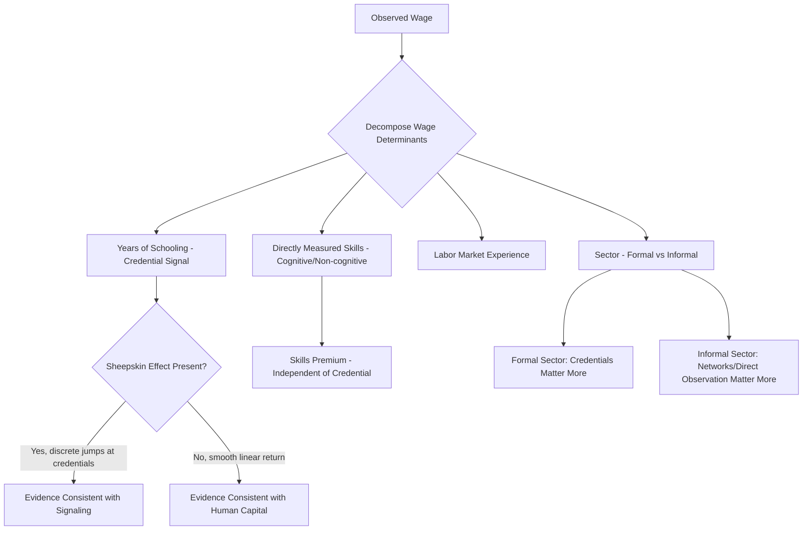

## Skills, Wages, and Labor Market Signaling

### Conceptual Foundations

The relationship between skills, wages, and labor market signaling addresses a central question in development economics: how do labor markets determine compensation when worker productivity is not directly observable to employers? Two competing (and complementary) theoretical frameworks address this: **human capital theory** and **signaling theory**.

**Human Capital Theory** (Becker, Mincer): Education and training directly raise worker productivity, and wages reflect this productivity gain.

**Signaling Theory** (Spence, 1973): Education may not raise productivity directly but instead signals pre-existing, otherwise unobservable ability to employers, who use credentials to sort workers under conditions of asymmetric information.

$$w = f(S, A, X) \quad \text{where } S = \text{schooling}, A = \text{innate ability}, X = \text{other characteristics}$$

Both theories predict a positive education-wage correlation, but they differ sharply in policy implications: human capital theory implies expanding education raises aggregate productivity and output, while pure signaling theory implies expanding education may simply reshuffle who receives scarce "good" jobs without raising aggregate output.

**Key Points**

- Distinguishing between the two channels empirically is difficult because both predict similar cross-sectional wage-education correlations
- In practice, most economists view education as containing both a human capital component and a signaling component, with the relative weights being an empirical and context-dependent question
- The distinction matters significantly for developing-country education policy, where credential inflation and low labor market returns to expanded schooling have been documented

### The Mincer Earnings Equation

The dominant empirical framework for estimating returns to education is the **Mincer equation**:

$$\ln(w_i) = \beta_0 + \beta_1 S_i + \beta_2 EXP_i + \beta_3 EXP_i^2 + \varepsilon_i$$

Where:

- $\ln(w_i)$ is log wages for individual $i$
- $S_i$ is years of schooling
- $EXP_i$ is labor market experience (often proxied by age minus schooling minus a start-age constant)
- $\beta_1$ is interpreted as the **private rate of return to an additional year of schooling**

**Example**

If $\beta_1 = 0.08$, this implies each additional year of schooling is associated with an 8% increase in wages, holding experience constant. In many developing economies, estimated Mincerian returns range from 5-15% per year of schooling, though [Inference] specific point estimates vary widely by country, data vintage, and estimation method, so any single figure should be treated as illustrative rather than a universal parameter.

#### Sheepskin Effects

A key piece of evidence used to detect signaling is the **sheepskin effect**: discontinuous wage jumps at credential-completion years (e.g., 12th grade diploma, university degree) that exceed what would be predicted from a smooth linear or quadratic return to each additional year of schooling.

$$\ln(w_i) = \beta_0 + \beta_1 S_i + \sum_k \gamma_k D_{ik} + \beta_2 EXP_i + \beta_3 EXP_i^2 + \varepsilon_i$$

Where $D_{ik}$ are dummy variables for credential completion (e.g., primary, secondary, tertiary degree). Statistically significant $\gamma_k$ coefficients — wage premiums concentrated at graduation years rather than smoothly distributed across years of schooling — are interpreted as evidence for the signaling channel, since pure human capital accumulation should not produce discrete jumps tied to credential completion specifically.

### The Ability Bias Problem

A central econometric challenge in estimating $\beta_1$ is **ability bias**: individuals with higher innate ability (unobserved to the researcher) may both obtain more schooling and earn higher wages independent of any causal effect of schooling itself, biasing OLS estimates of returns to education upward.

$$\text{Cov}(S_i, \varepsilon_i) \neq 0 \implies \hat{\beta}_1^{OLS} \text{ is biased}$$

**Instrumental Variables (IV) approaches** commonly used to address this include:

- Distance to nearest school (affecting schooling costs but plausibly uncorrelated with ability)
- Compulsory schooling law changes (natural experiments from policy discontinuities)
- Twin studies (differencing out shared family/genetic ability components)

[Inference] IV estimates of returns to schooling in developing-country contexts sometimes exceed OLS estimates, a finding debated in the literature; possible explanations include heterogeneous treatment effects (marginal students induced by the instrument having higher relative returns) or measurement error attenuation in years of schooling, but consensus on the precise mechanism is not settled.

### Signaling Model: The Spence Framework

In Spence's canonical model, workers of high ability ($\theta_H$) and low ability ($\theta_L$) choose education levels at differing costs, since education is assumed cheaper (in effort/time) for high-ability workers:

$$C(S, \theta_H) < C(S, \theta_L) \quad \text{for any } S > 0$$

A **separating equilibrium** exists when high-ability workers acquire a threshold level of education $S^*$ that low-ability workers find too costly to mimic, allowing employers to infer ability from education level even though education itself does not raise productivity:

$$\theta_L \cdot C'(\theta_L) > 1 > \theta_H \cdot C'(\theta_H) \quad \text{(single-crossing condition)}$$

Under this equilibrium, wages are set equal to the expected productivity conditional on the observed signal:

$$w(S) = E[\theta \mid S]$$

### Signaling Equilibrium Diagram (svg_diagram)

<svg xmlns="http://www.w3.org/2000/svg" viewBox="0 0 800 500">
<text x="400" y="30" font-size="19" font-weight="bold" text-anchor="middle" fill="#1a1a1a">Spence Signaling Equilibrium (svg_diagram)</text>
<line x1="80" y1="420" x2="750" y2="420" stroke="#333" stroke-width="2" />
<line x1="80" y1="420" x2="80" y2="60" stroke="#333" stroke-width="2" />
<text x="415" y="465" font-size="13" text-anchor="middle" fill="#333">Education Level (S)</text>
<text x="30" y="240" font-size="13" text-anchor="middle" fill="#333" transform="rotate(-90, 30, 240)">Cost / Wage</text>
<line x1="100" y1="400" x2="700" y2="100" stroke="#dc2626" stroke-width="2.5" />
<text x="710" y="95" font-size="12" fill="#7f1d1d" font-weight="bold">Cost, Low Ability</text>
<line x1="100" y1="400" x2="700" y2="330" stroke="#16a34a" stroke-width="2.5" />
<text x="710" y="335" font-size="12" fill="#166534" font-weight="bold">Cost, High Ability</text>
<line x1="400" y1="60" x2="400" y2="420" stroke="#333" stroke-width="1.5" stroke-dasharray="6,4" />
<text x="400" y="440" font-size="13" text-anchor="middle" fill="#1a1a1a" font-weight="bold">S* (Separating Threshold)</text>
<circle cx="400" cy="60" r="5" fill="#2563eb" />
<line x1="80" y1="180" x2="750" y2="180" stroke="#2563eb" stroke-width="2" stroke-dasharray="3,3" />
<text x="90" y="170" font-size="11" fill="#1e3a8a">w(High Ability) = θ_H</text>
<line x1="80" y1="330" x2="400" y2="330" stroke="#2563eb" stroke-width="2" stroke-dasharray="3,3" />
<text x="90" y="320" font-size="11" fill="#1e3a8a">w(Low Ability) = θ_L</text>

<text x="200" y="450" font-size="10" fill="#555" text-anchor="middle">Low ability: education too costly beyond S*</text>

<text x="580" y="450" font-size="10" fill="#555" text-anchor="middle">High ability: acquires S* to signal</text>

</svg>

### Alternative Screening/Filtering Frameworks

**Filtering (Arrow, 1973)**: Similar to signaling but emphasizes education's role in sorting workers into productivity classes ex-post, closer to a testing/certification function than a costly-effort signal chosen strategically by workers.

**Statistical Discrimination**: Employers use easily observable group characteristics (gender, ethnicity, school reputation, geographic origin) as proxies for expected productivity when individual-level signals are noisy or costly to obtain, potentially generating persistent wage gaps unrelated to actual productivity differences — with particular policy relevance in developing-country labor markets where formal credentialing infrastructure is weaker.

### Labor Market Signaling in Developing-Country Contexts

#### Credential Inflation

As access to schooling expands rapidly (often the direct result of successful enrollment-focused development policy), the **relative** value of a given credential as a signal declines, since it becomes less effective at separating high- from low-ability workers — a dynamic termed "credential inflation" or "sheepskin devaluation."

[Inference] This is frequently cited as a partial explanation for observed declining marginal returns to secondary and tertiary schooling in several rapidly-expanding education systems, though disentangling credential inflation from declining school quality (a supply-side human capital story) versus pure signaling dilution requires context-specific evidence.

#### Weak Institutional Signaling Infrastructure

In many developing labor markets:

- Standardized testing and certification systems are less developed or less trusted than in high-income countries, weakening the reliability of credentials as productivity signals
- Informal sector dominance means a large share of employment occurs outside formal credential-checking mechanisms entirely, limiting the relevance of signaling models calibrated to formal-sector labor markets
- Networks and referrals often substitute for formal credentials as information mechanisms, particularly in small-firm and informal-sector hiring

#### Job Search and Matching Frictions

Search and matching models extend the analysis to explain why wage dispersion persists even among observably similar workers:

$$V(u) = b + \beta \max\{V(u), \int V(w) dF(w)\}$$

Where $V(u)$ is the value of unemployed search, $b$ is unemployment benefit/reservation value, and workers accept wage offers $w$ exceeding their reservation wage. In developing economies with limited unemployment insurance, reservation wages are often depressed, and search frictions combined with informal-sector prevalence generate persistent wage dispersion unexplained by standard human capital variables.

### Empirical Approaches to Disentangling Human Capital from Signaling

| Method | Logic | Key Limitation |
| --- | --- | --- |
| Sheepskin effect tests | Discrete wage jumps at credential years suggest signaling | Discontinuities can also reflect real productivity thresholds (e.g., licensing requirements) |
| Self-employment comparison | Signaling should matter less where there's no employer to signal to; compare wage-education slope for employees vs. self-employed | Self-employed and employed populations differ on unobservables (selection) |
| Job displacement/layoff studies | If signaling matters, credentials should matter more for new job matches than for tenure-based raises within a firm | Requires panel data tracking within-firm vs. between-firm wage growth |
| Randomized credential/certification provision | Experimentally vary access to a credential (holding underlying skill training constant) and observe wage effects | Logistically difficult and rare in practice; ethical considerations |
| Direct skills testing | Compare returns to measured cognitive/technical skills (e.g., literacy, numeracy tests) versus years of schooling | Test score measurement error; tests capture cognitive skills only, missing soft skills |

### Direct Skills Measurement: Beyond Credentials

An increasingly prominent development economics research agenda directly measures cognitive and non-cognitive skills, rather than relying solely on years of schooling as a proxy, using instruments such as:

- **STEP Skills Measurement Surveys** (World Bank): Assess literacy, numeracy, and socio-emotional skills across developing countries
- **Raven's Progressive Matrices** and similar fluid-intelligence tests
- **Big Five personality trait inventories** for non-cognitive/socio-emotional skill measurement

Findings from this literature generally show that **directly measured skills predict wages independently of years of schooling completed**, supporting the view that schooling is an imperfect proxy for productivity-relevant human capital and that credential-based signaling may substitute for, rather than perfectly reflect, underlying skill levels.

### Returns to Skills vs. Returns to Schooling Diagram

### Policy Implications

#### 1. Skills Certification and Testing Systems

- Standardized national examinations and competency-based certification (rather than time-served credentials) can improve signal quality, particularly benefiting high-ability workers from under-resourced schools whose credentials might otherwise be discounted
- Vocational and technical certification systems that test actual competency (e.g., competency-based TVET frameworks) reduce reliance on pure years-of-schooling signals

#### 2. Active Labor Market Policies (ALMPs)

- **Wage subsidies**: Temporarily subsidizing employer costs for hiring workers with uncertain signals (e.g., first-time job seekers, informal-sector transitioners) allows employers to learn true productivity, potentially resolving statistical discrimination against groups with weak observable signals
- **Apprenticeships and on-the-job training**: Directly build verifiable, employer-observed track records that substitute for formal credentials, particularly valuable in contexts with weak testing infrastructure

#### 3. Information Interventions

- Providing employers with standardized skills-test results (rather than relying solely on credentials) has been studied as a mechanism to improve labor market matching efficiency, particularly for youth and informal-sector workers lacking strong formal credentials
- Job fairs and structured referral platforms reduce search frictions in thin, information-poor labor markets

#### 4. Education Quality vs. Quantity Policy Shift

Given evidence that direct skills matter independently of years of schooling, a policy implication increasingly emphasized in development economics is shifting focus from **school enrollment expansion** (quantity) toward **learning outcomes** (quality) — reflected in the "learning crisis" framing used by the World Bank's *World Development Report 2018*.

$$\text{Human Capital Index} = f(\text{Survival}, \text{Expected Years of Schooling}, \text{Learning-Adjusted Years}, \text{Health})$$

[Unverified] Specific World Bank Human Capital Index component weightings and current country scores should be verified against the latest published methodology and data release, as the index has been updated periodically since its 2018 introduction.

### Conclusion

The relationship between skills, wages, and labor market signaling in developing economies reflects an unresolved tension between education as productivity-enhancing investment and education as a costly-to-fake signal of pre-existing ability. Empirical evidence — sheepskin effects, direct skills testing results, and credential inflation patterns — suggests both mechanisms operate simultaneously, with their relative importance varying by labor market segment (formal vs. informal), certification infrastructure quality, and stage of educational expansion. This has direct implications for education policy: contexts where signaling dominates call for improved testing and certification infrastructure to preserve information value, while contexts where human capital accumulation dominates justify continued investment in schooling quality and access as a driver of aggregate productivity growth.

**Related Topics**

- Mincer earnings function estimation and instrumental variable strategies
- Informal sector wage determination and job search models
- World Bank Human Capital Index and the global learning crisis
- Vocational and technical education (TVET) system design
- Statistical discrimination and labor market sorting
- Active labor market policies and wage subsidy program evaluation
- Skills measurement instruments (STEP surveys, cognitive/non-cognitive assessments)
- Child labor and gender labor force participation (education-linked labor supply decisions)