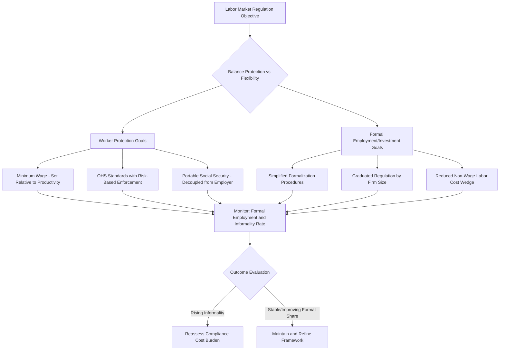

## Labor Market Institutions and Regulation

### Conceptual Overview

Labor market institutions comprise the formal legal rules and informal norms that govern the employment relationship, wage determination, and the resolution of labor disputes. In development economics, the central debate concerns whether these institutions primarily **correct market failures** (asymmetric information, unequal bargaining power, externalities from poor working conditions) or primarily **impose rigidities** that distort efficient labor allocation, particularly in the presence of large informal sectors that operate largely outside regulatory reach.

**Key Points**

- Labor market institutions include minimum wage laws, employment protection legislation, collective bargaining frameworks, social security mandates, and occupational health/safety regulations
- Developing economies are characterized by a large "regulatory gap" between de jure (legal) protections and de facto (enforced) coverage, given weak enforcement capacity and dominant informal employment
- The core analytical tension is between protecting worker welfare and preserving labor market flexibility/formal job creation incentives

### Theoretical Frameworks

#### Competitive Labor Market Benchmark

In a standard competitive model, labor market regulations that raise the cost of labor above the market-clearing wage (e.g., a binding minimum wage) are predicted to reduce formal employment:

$$L^d(w) = L^s(w) \quad \text{at equilibrium wage } w^*$$

If a minimum wage $w_{min} > w^*$ is imposed and enforced:

$$L^d(w_{min}) < L^s(w_{min}) \implies \text{involuntary unemployment} = L^s(w_{min}) - L^d(w_{min})$$

#### Monopsony and Efficiency Wage Alternatives

Where employers possess wage-setting power (monopsony, common in thin rural labor markets or company towns), a minimum wage can **increase** both wages and employment simultaneously by counteracting employer market power:

$$MRP_L = MC_L \quad \text{(monopsonist hires where marginal revenue product equals marginal cost of labor, below competitive wage)}$$

A binding minimum wage set between the monopsony wage and the competitive wage can shift the marginal cost curve, inducing the monopsonist to increase employment even as the wage rises.

**Efficiency wage theory** (Shapiro-Stiglitz) provides an additional rationale: firms may pay above market-clearing wages voluntarily to reduce shirking, turnover, and to attract higher-quality workers, implying regulated wage floors may have smaller-than-predicted disemployment effects where efficiency wage dynamics already push actual wages above the theoretical minimum.

### The Formal-Informal Duality

A defining feature of developing-country labor markets is **segmentation** between a regulated formal sector and an unregulated (or under-regulated) informal sector.

$$\text{Informality Rate} = \frac{\text{Informal Employment}}{\text{Total Employment}} \times 100$$

**Two competing views of informality:**

1. **Exclusion/segmentation view** (Harris-Todaro tradition): Workers are rationed out of a formal sector with wage rigidities (minimum wages, high firing costs) and queue or migrate while working informally as a fallback, implying informality is involuntary and welfare-reducing
2. **Exit/voluntary view** (de Soto tradition): Workers and firms voluntarily choose informality when the costs of formal-sector compliance (taxes, regulatory burden, registration costs) exceed the benefits (legal protection, access to credit, larger markets), implying informality partly reflects rational cost-benefit calculation rather than pure exclusion

[Inference] Empirical evidence suggests both mechanisms operate simultaneously across different worker segments; a "involuntary" informal segment coexists with a "voluntary" segment of relatively higher-earning informal self-employed workers who could plausibly access formal employment but choose not to, though the precise segment sizes are highly context-dependent and contested in the literature.

### Formal-Informal Sector Dynamics Diagram (svg_diagram)

<svg xmlns="http://www.w3.org/2000/svg" viewBox="0 0 850 550">
<text x="425" y="30" font-size="19" font-weight="bold" text-anchor="middle" fill="#1a1a1a">Formal-Informal Labor Market Segmentation (svg_diagram)</text>
<rect x="60" y="80" width="320" height="180" rx="10" fill="#dbeafe" stroke="#2563eb" stroke-width="2.5" />
<text x="220" y="110" font-size="16" font-weight="bold" text-anchor="middle" fill="#1e3a8a">FORMAL SECTOR</text>
<text x="220" y="135" font-size="11" text-anchor="middle" fill="#1e3a8a">Regulated: Minimum wage,</text>
<text x="220" y="150" font-size="11" text-anchor="middle" fill="#1e3a8a">social security, EPL, contracts</text>
<text x="220" y="175" font-size="11" text-anchor="middle" fill="#1e3a8a">Higher wages, job security</text>
<text x="220" y="195" font-size="11" text-anchor="middle" fill="#1e3a8a">Rationed entry (queuing)</text>
<text x="220" y="220" font-size="11" text-anchor="middle" fill="#1e3a8a">Compliance costs: taxes,</text>
<text x="220" y="235" font-size="11" text-anchor="middle" fill="#1e3a8a">registration, licensing</text>
<rect x="470" y="80" width="320" height="180" rx="10" fill="#fee2e2" stroke="#dc2626" stroke-width="2.5" />
<text x="630" y="110" font-size="16" font-weight="bold" text-anchor="middle" fill="#7f1d1d">INFORMAL SECTOR</text>
<text x="630" y="135" font-size="11" text-anchor="middle" fill="#7f1d1d">Unregulated: no minimum wage</text>
<text x="630" y="150" font-size="11" text-anchor="middle" fill="#7f1d1d">enforcement, no social security</text>
<text x="630" y="175" font-size="11" text-anchor="middle" fill="#7f1d1d">Lower/volatile earnings</text>
<text x="630" y="195" font-size="11" text-anchor="middle" fill="#7f1d1d">Self-employment, family firms</text>
<text x="630" y="220" font-size="11" text-anchor="middle" fill="#7f1d1d">Lower entry barriers</text>
<text x="630" y="235" font-size="11" text-anchor="middle" fill="#7f1d1d">No firing costs/flexibility</text>
<line x1="380" y1="140" x2="470" y2="140" stroke="#333" stroke-width="2" marker-end="url(#arr2)" />
<text x="425" y="130" font-size="10" text-anchor="middle" fill="#333">Exclusion</text>
<text x="425" y="165" font-size="10" text-anchor="middle" fill="#333">(rationing)</text>
<line x1="470" y1="200" x2="380" y2="200" stroke="#333" stroke-width="2" marker-end="url(#arr2)" />
<text x="425" y="215" font-size="10" text-anchor="middle" fill="#333">Voluntary exit</text>
<text x="425" y="228" font-size="10" text-anchor="middle" fill="#333">(compliance cost avoidance)</text>
<rect x="230" y="330" width="400" height="90" rx="10" fill="#fef3c7" stroke="#d97706" stroke-width="2" />
<text x="430" y="360" font-size="14" font-weight="bold" text-anchor="middle" fill="#78350f">Regulatory Design Trade-off</text>
<text x="430" y="382" font-size="11" text-anchor="middle" fill="#78350f">Higher formal-sector protection →</text>
<text x="430" y="400" font-size="11" text-anchor="middle" fill="#78350f">larger wedge → greater informalization incentive</text>
<line x1="220" y1="260" x2="350" y2="330" stroke="#666" stroke-width="1.5" stroke-dasharray="4,3" marker-end="url(#arr2)" />
<line x1="630" y1="260" x2="510" y2="330" stroke="#666" stroke-width="1.5" stroke-dasharray="4,3" marker-end="url(#arr2)" />
</svg>

### Categories of Labor Market Regulation

#### 1. Minimum Wage Legislation

$$\text{Kaitz Index} = \frac{\text{Minimum Wage}}{\text{Median Wage}}$$

The Kaitz index measures the "bite" of minimum wage regulation relative to the wage distribution. Higher values indicate a more binding constraint affecting a larger share of the workforce.

Empirical findings on minimum wage effects in developing economies are notably heterogeneous:

- Effects are typically concentrated in the formal sector, since informal-sector enforcement is weak or absent
- Some studies find "lighthouse effects," where formal minimum wages influence informal-sector wage norms even without direct enforcement, as workers and employers use the legal minimum as a reference/bargaining anchor
- Employment effects vary by country, sector, and the size of the minimum wage relative to median/average wages, with some studies finding minimal disemployment effects and others finding significant formal-sector job losses, particularly among low-skilled and youth workers

[Inference] The wide variance in empirical minimum wage employment elasticities across developing-country studies likely reflects genuine heterogeneity in market structure (competitive vs. monopsonistic), enforcement intensity, and the relative size of the minimum wage vis-à-vis the market-clearing wage, rather than indicating a single "true" universal elasticity.

#### 2. Employment Protection Legislation (EPL)

EPL encompasses rules governing dismissal procedures, severance pay requirements, notice periods, and restrictions on temporary/fixed-term contracts.

$$\text{EPL Index} = f(\text{Notice Period}, \text{Severance Pay}, \text{Dismissal Procedure Complexity}, \text{Reinstatement Rights})$$

The **OECD/World Bank Doing Business "Employing Workers" indicators** (historically used, though the Doing Business report was discontinued in 2021 following data integrity concerns) attempted to quantify cross-country EPL stringency.

Theoretical predictions on EPL effects:

- **Job security vs. job creation trade-off**: Strict EPL raises firing costs, which theoretically reduces both hiring (firms anticipate future firing costs) and firing (existing workers are protected), producing ambiguous net employment effects but likely reducing labor market **churn** (worker reallocation/flow rates)
- **Dualism effects**: Strict EPL applied unevenly (e.g., only above a firm-size threshold) can incentivize firms to remain artificially small or rely heavily on temporary/informal contracts to avoid triggering protections, a documented pattern in several Latin American and South Asian labor codes

#### 3. Collective Bargaining and Union Regulation

- **Union density** and the **scope of collective bargaining coverage** (whether agreements extend beyond union members to entire sectors) shape wage-setting dynamics
- In many developing economies, formal-sector unionization is concentrated in public sector and large-firm manufacturing, with minimal informal-sector coverage
- Cross-country evidence on union effects is mixed: unions can raise formal-sector wages above competitive levels (potentially widening formal-informal wage gaps) while also improving working conditions and reducing within-firm wage inequality

#### 4. Social Security and Payroll Tax Mandates

$$\text{Total Labor Cost} = w + \tau_{employer} \cdot w$$

Where $\tau_{employer}$ represents mandated employer contributions (pension, health insurance, unemployment insurance). High mandated non-wage labor costs raise the formal employment threshold and are frequently cited as a driver of informalization, particularly for lower-productivity workers whose value marginal product may not cover the wedge between gross labor cost and net take-home pay.

#### 5. Occupational Health and Safety (OHS) Regulation

- Mandates on workplace safety standards, particularly critical in hazardous sectors (mining, construction, garment manufacturing) where enforcement gaps have produced high-profile disasters (e.g., the 2013 Rana Plaza factory collapse in Bangladesh, which catalyzed international supply chain safety accords)
- OHS regulation exhibits a particularly stark enforcement gap in developing economies given resource-constrained labor inspectorates

### Labor Inspection and Enforcement Capacity

A defining structural feature of developing-country labor regulation is the gap between legislated standards and enforcement capacity:

$$\text{Effective Regulation} = \text{De Jure Standard} \times \text{Enforcement Probability} \times \text{Penalty Severity}$$

Weak enforcement stems from:

- Insufficient labor inspectors relative to the size of the workforce (ILO benchmarks suggest ratios far below those observed in many developing countries)
- Corruption and capture of inspection processes
- Political economy pressures to under-enforce in order to preserve international competitiveness or informal employment as a social safety valve

[Unverified] Specific current ILO labor inspector-to-worker ratio benchmarks and country-level compliance rates should be verified against the latest ILO Labour Administration and Inspection data, as these figures are updated periodically.

### Regulatory Design Trade-offs Table

| Institution | Intended Benefit | Documented Risk in Developing-Country Context |
| --- | --- | --- |
| Minimum wage | Poverty reduction, monopsony correction | Formal-sector disemployment; limited informal-sector reach |
| Strict EPL | Job security, reduced arbitrary dismissal | Reduced hiring/churn; incentive for informal/temporary contracting |
| Mandatory payroll contributions | Social insurance coverage | Higher labor cost wedge; informalization incentive |
| Collective bargaining extension | Wage floor, reduced inequality | Potential formal-informal wage gap widening |
| OHS regulation | Worker safety, reduced accidents | High compliance cost for small firms; weak enforcement undermines credibility |

### Policy Responses and Reform Approaches

#### 1. Graduated/Tiered Regulation

Applying lighter-touch regulatory requirements to micro and small enterprises (below defined employee thresholds), with regulation intensifying as firm size grows, aims to reduce the incentive for firms to stay small or informal purely to avoid compliance costs — though threshold-based rules risk creating "bunching" distortions just below the threshold.

#### 2. Simplified Registration and Formalization Incentives

- Single-window business registration systems reducing formalization compliance costs and time
- Tax and social security contribution simplification for small firms (e.g., simplified flat-rate regimes, as implemented in Brazil's *Simples Nacional* and similar programs elsewhere)
- Conditional formalization incentives linking formal registration to access to credit, government contracts, or business development services

#### 3. Portable Benefits and Universal Social Protection

Decoupling social security benefits from formal employment status (portable pension/health accounts that follow the worker regardless of employer or formal/informal status) addresses the core informalization incentive created by employment-linked mandates, an approach increasingly discussed in universal social protection policy design.

#### 4. Strengthened but Risk-Based Enforcement

Rather than uniformly intensifying enforcement (which may be infeasible given fiscal/administrative constraints), risk-based labor inspection targeting sectors and firms with highest violation probability or severity (e.g., hazardous industries, large repeat offenders) can improve enforcement efficiency given binding resource constraints.

#### 5. International Supply Chain Accountability Mechanisms

Following incidents like Rana Plaza, international frameworks (the Bangladesh Accord on Fire and Building Safety, buyer codes of conduct, corporate due diligence legislation) create parallel private enforcement mechanisms operating alongside weak domestic public enforcement, particularly relevant in export-oriented manufacturing sectors integrated into global value chains.

### Policy Design Framework Diagram

### Measurement and Data Considerations

- **Informality measurement approaches** vary: legalistic definitions (lack of registration/contract), social security-based definitions (lack of pension/health contribution), and productive definitions (firm size, sector) produce different informality rate estimates for the same economy
- **De jure vs. de facto regulation gaps** are difficult to quantify systematically; most cross-country regulatory indices (e.g., historical Doing Business indicators) measured legislated rules rather than actual enforcement intensity, limiting their usefulness for assessing real-world regulatory bite
- **Firm-level survey data** (e.g., World Bank Enterprise Surveys) provide complementary evidence on perceived regulatory burden and compliance costs directly from employers

### Conclusion

Labor market institutions and regulation in developing economies operate within a fundamental tension: protections designed to correct market failures and safeguard worker welfare can, if poorly calibrated to local enforcement capacity and firm cost structures, incentivize informalization and undermine their own intended reach. The formal-informal duality that characterizes most developing labor markets means that regulatory design cannot be evaluated solely against a competitive-market efficiency benchmark, but must account for monopsony power, efficiency wage dynamics, enforcement capacity constraints, and the behavioral responses of firms and workers choosing between formal compliance and informal exit. Effective institutional design increasingly emphasizes graduated regulation, portable and universal social protection mechanisms decoupled from formal employment status, and risk-based enforcement strategies suited to genuine administrative capacity constraints.

**Related Topics**

- Harris-Todaro model of rural-urban migration and formal-sector job rationing
- Informal sector measurement methodologies and enterprise survey data
- Minimum wage monopsony models and empirical elasticity estimation
- Universal social protection and portable benefits system design
- Global value chains and international labor standards enforcement (supply chain accountability)
- Skills, wages, and labor market signaling (formal-sector credentialing interaction)
- Small and medium enterprise (SME) formalization policy
- Occupational health and safety regulation in hazardous export sectors