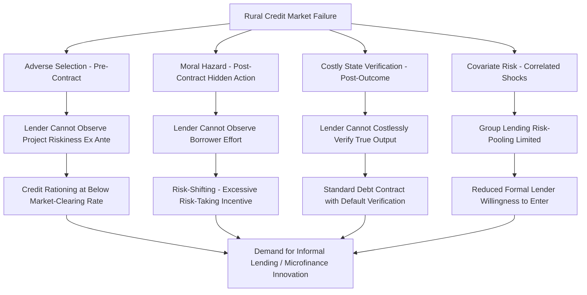

## Information Asymmetries in Rural Credit Markets

### Conceptual Foundations

Rural credit markets in developing economies are characterized by pervasive **information asymmetries** between lenders and borrowers, which prevent markets from clearing through price (interest rate) adjustment alone, as predicted by standard competitive market theory. This framework, formalized primarily by Stiglitz and Weiss (1981), explains persistent phenomena — credit rationing, informal moneylender dominance, collateral requirements, interlinked contracts — that are difficult to reconcile with frictionless market models.

**Key Points**

- Three canonical information problems drive rural credit market failure: adverse selection (pre-contractual), moral hazard (post-contractual, hidden action), and costly state verification/strategic default (post-outcome, hidden information)
- Unlike urban/formal credit markets, rural contexts compound these problems with covariate risk (correlated agricultural shocks across borrowers), limited collateralizable assets (informal land tenure), and high transaction costs from geographic dispersion
- These frictions provide the primary theoretical rationale for microfinance innovations and for the persistence of informal lending arrangements

### Adverse Selection in Credit Markets

#### The Stiglitz-Weiss Model

Lenders cannot perfectly observe borrower riskiness (project quality) prior to lending. If lenders raise interest rates to compensate for average default risk, this can **worsen** the risk pool through adverse selection: safe borrowers with viable low-risk, low-return projects drop out of the market (the interest rate exceeds their acceptable cost of capital), leaving disproportionately risky borrowers willing to accept the same high rate.

$$\pi(r) = \sum_i p_i(r) \cdot [\text{Return}_i - r \cdot L]$$

Where $\pi(r)$ is expected lender profit at interest rate $r$, $p_i(r)$ is the probability borrower type $i$ repays (which itself depends on $r$ through selection effects), and $L$ is loan size.

**Key result**: Expected lender profit is not monotonically increasing in the interest rate. There exists an interest rate $r^*$ that maximizes expected lender return; beyond $r^*$, further rate increases reduce profit due to adverse selection effects dominating the direct pricing effect.

$$\frac{d\pi(r)}{dr} = 0 \quad \text{at } r = r^*$$

**Credit rationing equilibrium**: If loan demand at $r^*$ exceeds available loan supply, lenders do not raise rates further to clear the market (since doing so reduces expected profit), resulting in an equilibrium with excess demand for credit — a stable outcome inconsistent with the standard supply-demand clearing prediction.

### Stiglitz-Weiss Credit Rationing Diagram (svg_diagram)

<svg xmlns="http://www.w3.org/2000/svg" viewBox="0 0 800 520">
<text x="400" y="30" font-size="19" font-weight="bold" text-anchor="middle" fill="#1a1a1a">Stiglitz-Weiss Credit Rationing (svg_diagram)</text>
<line x1="80" y1="440" x2="750" y2="440" stroke="#333" stroke-width="2" />
<line x1="80" y1="440" x2="80" y2="60" stroke="#333" stroke-width="2" />
<text x="415" y="480" font-size="13" text-anchor="middle" fill="#333">Interest Rate (r)</text>
<text x="30" y="250" font-size="13" text-anchor="middle" fill="#333" transform="rotate(-90, 30, 250)">Expected Lender Return / Loan Demand</text>
<path d="M 100 400 C 250 150, 350 100, 420 105 C 500 115, 600 250, 700 400" stroke="#2563eb" stroke-width="3" fill="none" />
<text x="720" y="410" font-size="11" fill="#1e3a8a" font-weight="bold">Expected Return π(r)</text>
<line x1="420" y1="60" x2="420" y2="440" stroke="#dc2626" stroke-width="1.5" stroke-dasharray="6,4" />
<text x="420" y="460" font-size="12" text-anchor="middle" fill="#7f1d1d" font-weight="bold">r* (Optimal Rate)</text>
<path d="M 100 130 C 300 220, 500 320, 700 410" stroke="#16a34a" stroke-width="3" fill="none" stroke-dasharray="8,4" />
<text x="710" y="415" font-size="11" fill="#166534" font-weight="bold" text-anchor="end">Loan Demand L(r)</text>
<line x1="80" y1="200" x2="750" y2="200" stroke="#7c3aed" stroke-width="1.5" stroke-dasharray="4,3" />
<text x="90" y="192" font-size="11" fill="#4c1d95">Loan Supply at r*</text>
<circle cx="420" cy="200" r="6" fill="#7c3aed" />
<line x1="420" y1="200" x2="270" y2="200" stroke="#666" stroke-width="1" />
<circle cx="270" cy="200" r="4" fill="#333" />

<text x="345" y="185" font-size="10" fill="#333" text-anchor="middle">Excess Demand</text>

<text x="345" y="220" font-size="10" fill="#333" text-anchor="middle">= Rationed Borrowers</text>

</svg>

### Moral Hazard

Following loan disbursement, lenders cannot perfectly observe or verify borrower effort, project management quality, or risk-taking behavior — a classic **hidden action** problem.

$$U_{borrower} = R(e, \theta) - r \cdot L - C(e)$$

Where $e$ is unobservable effort, $\theta$ is a random productivity shock, $R(\cdot)$ is project return, and $C(e)$ is the private cost of effort. Because the borrower bears the full cost of effort but shares repayment obligations with the lender in a fixed-rate debt contract (versus the lender bearing downside risk in bad states), borrowers may have suboptimal incentives to exert effort or select riskier projects than the lender would prefer, given standard debt contracts create asymmetric payoff structures (limited liability protects the borrower in very bad states, while the lender absorbs default losses).

**Risk-shifting incentive**: Under standard debt contracts, borrowers capture upside returns above the repayment obligation but are protected from full downside losses by limited liability (inability to repay more than they possess), creating an incentive to select excessively risky projects relative to the lender's preferred risk level — a version of the classic debt-overhang/asset-substitution problem.

### Costly State Verification and Strategic Default

Even when project outcomes are realized, lenders often cannot costlessly observe true output (e.g., actual harvest yield, true business revenue), creating a **costly state verification (CSV)** problem (Townsend, 1979; Gale-Hellwig).

$$\text{Optimal Contract} = \begin{cases} \text{Fixed repayment } R & \text{if } y \geq R \text{ (no verification needed)} \\ \text{Verify } y \text{ at cost } \gamma, \text{ seize all output} & \text{if borrower claims } y < R \end{cases}$$

This CSV framework provides a formal justification for why **standard debt contracts** (fixed repayment regardless of realized output, with costly verification/seizure only triggered by claimed default) emerge as optimal contracts under asymmetric information about project outcomes, rather than more complex state-contingent contracts that would require costless verification.

**Strategic default** occurs when borrowers who could technically repay choose not to, because the lender cannot distinguish strategic default from genuine inability to repay without costly verification or because enforcement mechanisms (legal recourse) are weak or absent in informal rural settings.

### Covariate Risk and Correlated Shocks

A distinguishing feature of rural (particularly agricultural) credit markets is **covariate risk**: shocks affecting one borrower's repayment capacity (drought, flood, pest outbreak, commodity price collapse) are highly correlated across borrowers in the same geographic area, unlike idiosyncratic urban business risks.

$$\text{Cov}(\theta_i, \theta_j) > 0 \quad \text{for borrowers } i, j \text{ in same locality}$$

This has critical implications:

- **Limits the effectiveness of joint liability/group lending mechanisms**, since group members cannot effectively insure each other against shocks that hit the entire group simultaneously (the risk-pooling benefit of group lending, discussed further below, is undermined by covariance)
- **Increases lender exposure to aggregate portfolio risk**, discouraging formal financial institution entry into agricultural lending relative to more diversifiable urban/commercial lending portfolios
- **Motivates demand for index-based weather insurance** as a complementary risk-management tool addressing the specific covariate component of agricultural risk

### Informal Lender Advantages and the Persistence of Moneylenders

Despite formal financial sector expansion, informal moneylenders persist in many rural credit markets because they possess informational advantages formal lenders lack:

- **Local knowledge**: Repeated social interaction and community embeddedness allow informal lenders to observe borrower character, effort, and project outcomes at low cost relative to formal institutions
- **Interlinked contracts**: Rural moneylenders frequently combine credit provision with other transactions (as landlord, input supplier, or output buyer), allowing informal monitoring through these secondary relationships and providing alternative repayment/collateral mechanisms (e.g., tied output sales)
- **Flexible informal enforcement**: Social sanctions, reputation mechanisms, and repeated-game dynamics within tight-knit communities substitute for costly formal legal enforcement

[Inference] The commonly cited high interest rates charged by informal moneylenders (sometimes far exceeding formal-sector rates) are frequently interpreted in the literature as reflecting a combination of monopoly power in geographically segmented micro-markets, compensation for genuinely higher default risk among otherwise credit-excluded borrowers, and the fixed costs of small-scale lending — though the relative weight of each explanation is debated and likely varies by context.

### Collateral and Its Limitations

Standard economic theory suggests collateral requirements can mitigate adverse selection (screening: only confident, likely-to-repay borrowers accept collateral requirements) and moral hazard (borrowers with "skin in the game" exert more effort). However, rural credit markets face specific collateral constraints:

- **Informal or unclear land title**: Absence of formal land registration systems in many developing rural areas prevents land from serving as effective bankable collateral
- **Illiquid or non-transferable assets**: Livestock, informal housing, and agricultural equipment may have limited resale markets, reducing their value as loan security
- **Legal enforcement costs**: Even with formal collateral agreements, foreclosure and asset seizure processes can be prohibitively costly or socially/politically difficult to execute against subsistence-level rural borrowers

This "missing collateral" problem is a central rationale for microfinance innovations that substitute **social collateral** (peer monitoring, joint liability) for traditional physical collateral.

### Information Asymmetry Mechanisms Diagram

### Microfinance Mechanisms as Information Solutions

Microfinance institutions were designed substantially as institutional responses to these specific information problems, rather than as a simple subsidized-credit intervention:

#### Joint Liability Group Lending

Groups of borrowers are made mutually responsible for each other's loan repayment, incentivizing:

- **Peer screening**: Borrowers select group members they know to be reliable (addressing adverse selection using local information lenders lack)
- **Peer monitoring**: Group members observe each other's effort and project management, reducing the lender's moral hazard problem at low marginal cost since monitoring is delegated to informed community members
- **Peer enforcement**: Social sanctions and community pressure substitute for costly formal legal enforcement against default

$$U_i^{group} = R_i - r \cdot L - \max(0, r \cdot L - R_j) \cdot \mathbb{1}[\text{partner defaults}]$$

[Inference] Joint liability's theoretical benefits are most pronounced when borrower risks are relatively idiosyncratic (uncorrelated) rather than covariate; in agricultural contexts with strong covariate risk, the practical risk-sharing benefit of joint liability may be substantially diminished, which is part of the rationale for the industry's broader shift toward individual liability lending models in many contexts over time.

#### Dynamic Incentives and Progressive Lending

Offering small initial loans with progressively larger loan sizes contingent on successful repayment history creates a repeated-game structure that builds a credible track record, substituting dynamically-revealed information for upfront collateral or credit history that would otherwise be unavailable.

#### Frequent Repayment Schedules

Regular (often weekly) repayment installments enable early detection of repayment difficulty, allow closer implicit monitoring of cash flow, and reduce the scope for large-scale strategic default by keeping outstanding exposure low at any given time — though this design also imposes liquidity management burdens on borrowers with lumpy agricultural income.

### Credit Information Systems and Formal Sector Extensions

- **Credit bureaus and credit scoring**: Formal information-sharing mechanisms that reduce adverse selection by making borrower repayment history observable across lenders, though coverage in developing economies is often limited to formal-sector borrowers, excluding the large informally-employed population
- **Mobile money and digital footprint-based credit scoring**: Emerging fintech approaches use transaction history, mobile phone usage patterns, and digital payment records as alternative data sources to construct creditworthiness proxies for borrowers lacking traditional credit histories
- **Warehouse receipt systems**: Formalizing stored agricultural commodities as verifiable, tradeable collateral, addressing both the missing-collateral problem and providing a verifiable signal of borrower assets

[Unverified] The specific effectiveness and current adoption scale of digital/alternative credit scoring mechanisms across different developing-country contexts should be verified against recent fintech and financial inclusion literature, as this is a rapidly evolving area with a fast-changing evidence base.

### Empirical Evidence and Evaluation Approaches

Randomized controlled trials (RCTs) have been extensively used to isolate the causal effects of specific information-based credit market interventions:

| Intervention Type | Information Problem Addressed | General Evidence Pattern |
| --- | --- | --- |
| Group liability vs. individual liability | Adverse selection, moral hazard via peer mechanisms | Mixed; individual liability often performs comparably with lower complexity/covariate-risk vulnerability |
| Weather index insurance bundled with credit | Covariate risk, strategic default ambiguity | Demand often lower than predicted (basis risk, liquidity constraints on premium payment) |
| Credit scoring/credit bureau access | Adverse selection via information sharing | Improved repayment selection where implemented, but coverage gaps persist for informal borrowers |
| Progressive/dynamic lending | Moral hazard, missing track record | Generally supports improved repayment incentives, standard practice across MFI industry |

[Inference] Microfinance impact evaluation more broadly (effects on income, business growth, poverty) has produced more modest and heterogeneous results than initially anticipated by early advocates; this reflects both genuine limits to credit access as a poverty solution and the fact that resolving information asymmetries alone does not address other binding constraints (limited market access, low returns to capital for very poor households, managerial capacity constraints).

### Conclusion

Information asymmetries — adverse selection, moral hazard, and costly state verification — provide the core theoretical explanation for why rural credit markets in developing economies fail to clear through price adjustment alone, generating persistent credit rationing and sustaining reliance on informationally-advantaged informal lenders. These frictions are compounded in agricultural settings by covariate risk and weak collateral institutions (informal land tenure, thin asset resale markets). Microfinance innovations—joint liability, dynamic incentives, frequent repayment—represent institutional responses specifically engineered to substitute for missing formal information and collateral mechanisms, though their effectiveness is bounded by the extent to which local risk is idiosyncratic versus covariate, and by the reality that resolving information problems alone does not eliminate all binding constraints on rural borrower welfare and investment returns.

**Related Topics**

- Group lending mechanisms and joint liability contract design
- Weather index insurance and covariate agricultural risk management
- Land tenure formalization and collateral institution development
- Randomized controlled trials in microfinance impact evaluation
- Digital financial inclusion and alternative credit scoring (fintech)
- Interlinked contracts and agrarian tenancy relationships
- Formal-informal credit market segmentation and interest rate determination
- Labor market institutions and regulation (informal sector overlap)