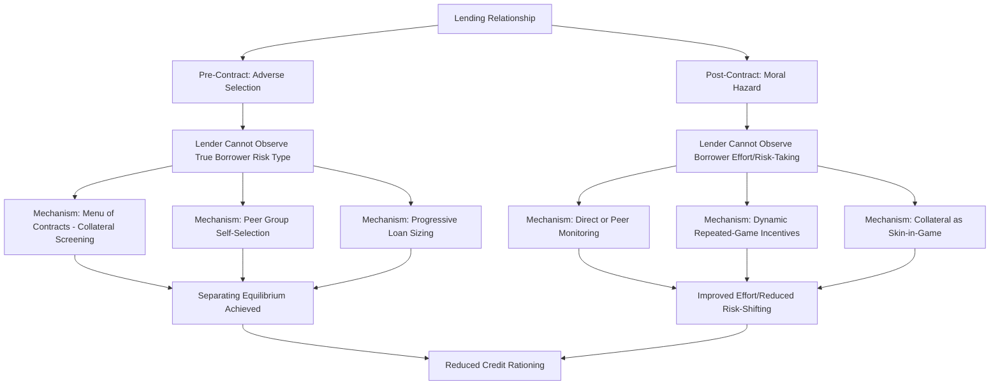

## Adverse Selection and Moral Hazard in Lending

### Conceptual Distinction

Adverse selection and moral hazard are the two canonical categories of information asymmetry problems in lending relationships, distinguished by **timing** relative to the loan contract:

$$\text{Adverse Selection: } t < t_{contract} \qquad \text{Moral Hazard: } t > t_{contract}$$

**Adverse selection** is a **pre-contractual, hidden information** problem: the lender cannot distinguish borrower types (riskiness, project quality) before extending credit. **Moral hazard** is a **post-contractual, hidden action** problem: the lender cannot observe or verify borrower behavior/effort after the loan is disbursed. This chapter item builds directly on the general framework introduced under information asymmetries in rural credit markets, focusing specifically on formal contract-theoretic mechanisms lenders use to address each problem.

**Key Points**

- Both problems arise from the same underlying condition — asymmetric information between contracting parties — but require different mechanism designs to mitigate
- Screening mechanisms target adverse selection (inducing self-selection before contracting); monitoring and incentive mechanisms target moral hazard (shaping behavior after contracting)
- In practice, most real-world lending contracts combine multiple mechanisms simultaneously, since both problems typically coexist

### Adverse Selection: Formal Model

Consider a population of borrowers with heterogeneous project risk types $\theta \in \{\theta_L, \theta_H\}$ (low-risk, high-risk), unobservable to the lender, where the expected return is:

$$E[R \mid \theta] = p(\theta) \cdot R_{success} + (1 - p(\theta)) \cdot 0$$

Assume mean-preserving spread: both types have the same expected return, but the high-risk type has higher variance (lower probability of success $p(\theta_H) < p(\theta_L)$, but higher payoff conditional on success).

At a pooling interest rate $r$, lender expected profit is:

$$\pi(r) = \lambda \cdot p(\theta_L) \cdot r \cdot L + (1-\lambda) \cdot p(\theta_H) \cdot r \cdot L - C$$

Where $\lambda$ is the (unknown) share of low-risk borrowers in the applicant pool. As $r$ rises, low-risk borrowers with lower-variance, more modest-return projects are the first to exit the market (their participation constraint binds first), shifting $\lambda$ downward and worsening the average pool quality — the self-reinforcing mechanism at the heart of the Stiglitz-Weiss credit rationing result.

### Screening Mechanisms for Adverse Selection

#### Menu of Contracts (Self-Selection)

Lenders can offer a **menu of contracts** with varying combinations of interest rate and collateral requirement, designed so that borrower types self-select into the contract intended for them (a separating equilibrium), exploiting the fact that risk-tolerant/risky borrowers value collateral-light contracts more than safe borrowers do.

$$\text{Contract A: } (r_L, K_H) \quad \text{Contract B: } (r_H, K_L)$$

Where low-risk borrowers select the low-interest-rate, high-collateral contract (Contract A) because they are confident of repaying and thus place low expected cost on posting collateral, while high-risk borrowers prefer the high-interest, low-collateral contract (Contract B) since they discount the collateral loss by their lower repayment probability.

**Separating equilibrium condition** (incentive compatibility):

$$p(\theta_L) \cdot [\text{Payoff}_A] \geq p(\theta_L) \cdot [\text{Payoff}_B] \quad \text{and} \quad p(\theta_H) \cdot [\text{Payoff}_B] \geq p(\theta_H) \cdot [\text{Payoff}_A]$$

This result (formalized in Bester, 1985) demonstrates that collateral can serve a **screening function** independent of its role as loss mitigation, resolving adverse selection without requiring interest rates alone to clear the market.

#### Group Formation and Peer Screening

As discussed in rural credit market contexts, allowing borrowers to self-select into liability groups leverages local information: borrowers know their neighbors' riskiness far better than a formal lender does, so voluntary group formation tends to sort similar-risk types together (assortative matching), which the lender can then price differentially by group risk profile if group-level outcomes are observable.

#### Progressive Loan Sizing as a Screening Device

Offering small initial "trial" loans allows the lender to observe repayment behavior before committing larger amounts, functioning as a costly signal: only borrowers confident in their ability to repay find it worthwhile to accept a small loan now in exchange for access to larger future credit, since low-quality/high-default-risk borrowers discount future access more heavily.

### Adverse Selection Screening Diagram (svg_diagram)

<svg xmlns="http://www.w3.org/2000/svg" viewBox="0 0 820 500">
<text x="410" y="30" font-size="19" font-weight="bold" text-anchor="middle" fill="#1a1a1a">Screening via Collateral Menu (svg_diagram)</text>
<line x1="80" y1="430" x2="750" y2="430" stroke="#333" stroke-width="2" />
<line x1="80" y1="430" x2="80" y2="60" stroke="#333" stroke-width="2" />
<text x="415" y="465" font-size="13" text-anchor="middle" fill="#333">Collateral Requirement (K)</text>
<text x="30" y="250" font-size="13" text-anchor="middle" fill="#333" transform="rotate(-90, 30, 250)">Interest Rate (r)</text>
<path d="M 120 380 C 300 340, 500 260, 680 140" stroke="#dc2626" stroke-width="2.5" fill="none" />
<text x="690" y="130" font-size="11" fill="#7f1d1d" font-weight="bold">Low-Risk IC Curve</text>
<path d="M 120 300 C 300 280, 500 220, 680 100" stroke="#16a34a" stroke-width="2.5" fill="none" />
<text x="690" y="90" font-size="11" fill="#166534" font-weight="bold">High-Risk IC Curve</text>
<circle cx="620" cy="170" r="7" fill="#2563eb" />
<text x="565" y="160" font-size="12" fill="#1e3a8a" font-weight="bold">Contract A</text>
<text x="565" y="175" font-size="10" fill="#1e3a8a">(Low r, High K)</text>
<text x="565" y="188" font-size="10" fill="#1e3a8a">chosen by Low-Risk</text>
<circle cx="220" cy="330" r="7" fill="#7c3aed" />
<text x="235" y="325" font-size="12" fill="#4c1d95" font-weight="bold">Contract B</text>
<text x="235" y="340" font-size="10" fill="#4c1d95">(High r, Low K)</text>
<text x="235" y="353" font-size="10" fill="#4c1d95">chosen by High-Risk</text>
</svg>

### Moral Hazard: Formal Model

After loan disbursement, the borrower privately chooses unobservable effort or risk level $e$, which affects the probability distribution of project outcomes:

$$\max_e \left[ p(e) \cdot (R - r \cdot L) - C(e) \right]$$

Where $p(e)$ is the (increasing, concave) probability of project success as a function of effort, $R$ is project revenue conditional on success, and $C(e)$ is the increasing, convex private cost of effort. The borrower's first-order condition:

$$p'(e^*) \cdot (R - r \cdot L) = C'(e^*)$$

**Key distortion**: Since the borrower only captures $(R - r \cdot L)$ of the marginal return to effort (the residual after fixed debt repayment), while bearing the full marginal cost $C'(e)$, the borrower's chosen effort level $e^*$ under debt financing is generally **below** the socially/jointly optimal effort level that would maximize total surplus, because a higher interest rate $r$ directly reduces the borrower's effort incentive:

$$\frac{\partial e^*}{\partial r} < 0$$

This produces a critical feedback loop: raising interest rates to compensate for default risk directly *induces* lower borrower effort (moral hazard channel) in addition to the adverse selection channel discussed above — both mechanisms reinforcing the same qualitative Stiglitz-Weiss conclusion that raising rates can reduce expected lender profit.

### Risk-Shifting (Asset Substitution)

A related moral hazard manifestation is the incentive to shift toward **riskier projects** after loan disbursement, since limited liability means the borrower's downside is capped at losing collateral/equity, while upside gains beyond the debt obligation accrue entirely to the borrower.

$$U_{borrower}(\sigma) = E[\max(R(\sigma) - r \cdot L, 0)]$$

Because the payoff function $\max(\cdot, 0)$ is **convex** in outcome realization, borrower utility is increasing in the variance $\sigma$ of the project return distribution even when higher variance does not raise (or even reduces) the *expected* return — a direct analogy to the option-value logic in corporate finance debt-overhang theory, transplanted to the microfinance/rural lending context.

### Mechanisms Addressing Moral Hazard

#### Monitoring

Direct lender monitoring (site visits, mandatory business record-keeping, group-based peer monitoring) raises the probability that low-effort or excessively risky behavior is detected, effectively raising the implicit cost of shirking or risk-shifting.

$$\text{Effective Cost of Shirking} = C(e) + m \cdot \phi$$

Where $m$ is monitoring intensity and $\phi$ is the penalty imposed if low effort/risk-shifting is detected. Monitoring is costly to the lender directly (site visits, staff time) but can be effectively delegated to peers in group lending structures at much lower marginal cost, which is a central rationale for joint liability contract design.

#### Dynamic (Repeated-Game) Incentives

Threat of credit denial in future periods following default creates an implicit incentive contract even without explicit monitoring, since the borrower's continuation value from maintaining access to future credit exceeds any one-period gain from shirking or strategic default:

$$V(\text{good standing}) = R - r \cdot L + \delta \cdot V(\text{good standing, next period})$$

$$V(\text{default}) = R - r \cdot L + \delta \cdot V(\text{excluded from credit})$$

Where $\delta$ is the borrower's discount factor. Dynamic incentives are effective only when $\delta$ is sufficiently high (borrowers value future credit access) and when the threat of exclusion is credible (the lender can and will enforce it).

#### Contract Design: Debt vs. Equity-Like Instruments

Standard fixed-repayment debt contracts, while resolving costly-state-verification problems efficiently (see prior item), exacerbate moral hazard relative to profit-sharing or equity-like arrangements, since debt gives the borrower full marginal claim on returns above the fixed repayment while lenders bear none of the downside beyond default. Some microfinance and agricultural lending innovations (e.g., profit-sharing contracts, flexible repayment linked to harvest outcomes) attempt to better align incentives at the cost of increased contract complexity and renewed verification challenges.

#### Collateral as Moral Hazard Deterrent

Beyond its screening role (addressing adverse selection), collateral also directly addresses moral hazard: posting collateral that the borrower loses upon default raises the borrower's "skin in the game," partially internalizing the downside risk that would otherwise fall entirely on the lender, thereby restoring stronger effort/risk-taking incentives closer to the socially optimal level.

### Combined Adverse Selection and Moral Hazard Framework

### Interaction Between the Two Problems

In practice, mechanisms designed for one problem often have side effects on the other, requiring careful joint contract design:

| Mechanism | Primary Target | Secondary Effect |
| --- | --- | --- |
| Collateral requirement | Adverse selection (screening) | Also reduces moral hazard (skin in the game) |
| Joint liability | Adverse selection (peer screening) | Also reduces moral hazard (peer monitoring) |
| Higher interest rate | Revenue/risk compensation | Worsens both adverse selection AND moral hazard (Stiglitz-Weiss result) |
| Dynamic/progressive lending | Moral hazard (repeated game) | Also weakly screens (low-quality borrowers discount future access more) |
| Frequent repayment schedule | Moral hazard (early detection) | Limited direct effect on adverse selection |

[Inference] This overlap explains why real-world microfinance contract design (joint liability plus dynamic incentives plus frequent repayment, as in the classic Grameen Bank model) bundles multiple mechanisms simultaneously rather than relying on any single instrument, since most practical mechanisms only partially and imperfectly resolve either information problem in isolation.

### Empirical Identification Challenges

Distinguishing adverse selection from moral hazard empirically is methodologically difficult, since both generate similar reduced-form correlations between contract terms (interest rate, collateral) and default outcomes. Standard approaches include:

- **Structural estimation**: Explicitly modeling both channels and using contract-choice and repayment data to separately identify selection and effort-response parameters
- **Natural experiments in contract terms**: Random or quasi-random variation in offered interest rates or collateral requirements (holding the applicant pool composition observably constant) to isolate the moral hazard (behavioral response) channel from the selection (compositional) channel
- **Repayment timing analysis**: Early-period defaults are more likely to reflect adverse selection (bad type revealed quickly), while later-period defaults conditional on early good repayment more likely reflect moral hazard or shock realization, though this heuristic is imperfect

[Unverified] The specific empirical magnitude of adverse selection versus moral hazard contributions to default in any given market is highly context-dependent, and general claims about which channel "dominates" in developing-country microfinance should be checked against the specific study design and setting being referenced.

### Conclusion

Adverse selection and moral hazard represent temporally distinct but frequently co-occurring information problems in lending relationships: the former distorts which borrowers a lender attracts at a given price, while the latter distorts what borrowers do once financed. Both mechanisms independently generate the Stiglitz-Weiss result that raising interest rates can reduce, rather than increase, expected lender profit — providing a rigorous microfoundation for observed credit rationing in developing-economy credit markets. The mechanism-design response has been the development of layered contractual innovations (collateral menus, group liability, dynamic lending, monitoring) that jointly, though imperfectly, address both problems, forming the theoretical backbone of modern microfinance institutional design.

**Related Topics**

- Information asymmetries in rural credit markets (foundational framework)
- Contract theory: screening versus signaling mechanism design
- Group lending and social collateral mechanisms
- Costly state verification and optimal debt contract theory
- Dynamic incentives and repeated-game lending relationships
- Risk-shifting and debt-overhang in corporate finance (cross-disciplinary parallel)
- Empirical identification strategies for information asymmetry in credit markets
- Microfinance impact evaluation methodology