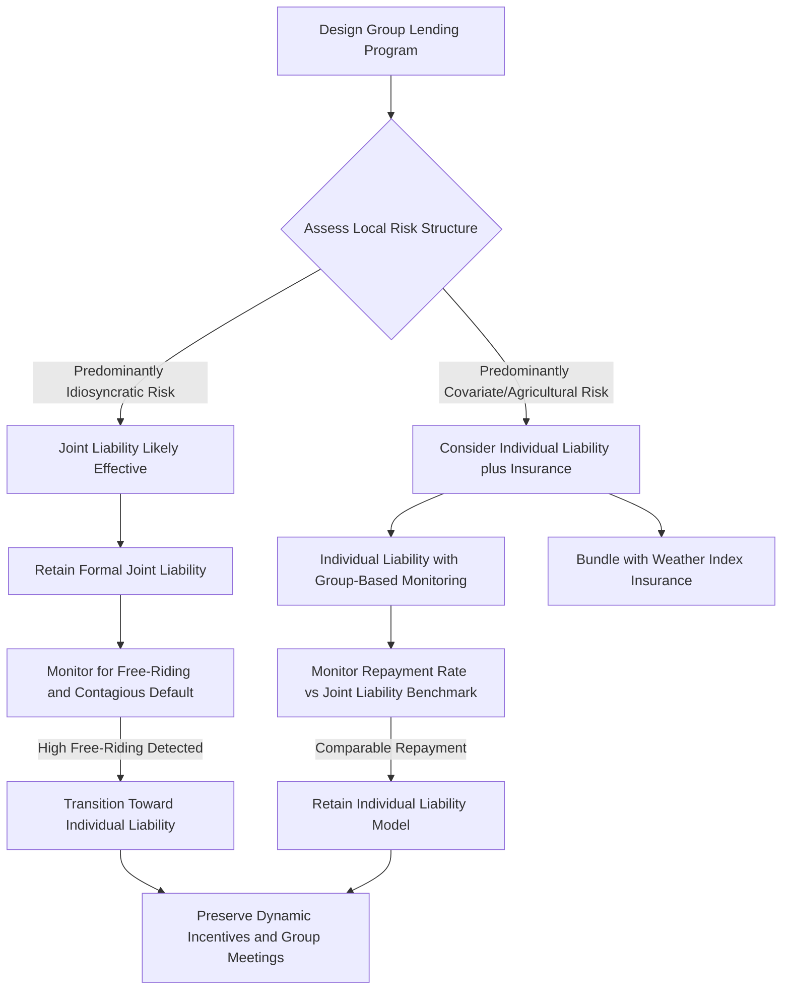

## Group Lending and Joint Liability Models

### Conceptual Overview

Group lending with joint liability is the signature institutional innovation of modern microfinance, pioneered at scale by the Grameen Bank in Bangladesh (Muhammad Yunus, founded 1983). Under joint liability, a small group of borrowers (typically 4-8 members) is collectively responsible for each member's loan repayment: if one member defaults, remaining group members must cover the shortfall or forfeit access to future credit as a group. This mechanism directly targets the information asymmetry problems established in the preceding items — adverse selection, moral hazard, and costly enforcement — by delegating screening, monitoring, and enforcement functions to informed peers rather than the formal lender.

**Key Points**

- Joint liability substitutes **social collateral** (peer relationships, reputation, community standing) for the physical collateral that poor rural borrowers typically lack
- The mechanism's theoretical effectiveness depends critically on borrowers possessing better information about each other's risk type and behavior than the lender possesses
- The global microfinance industry has evolved substantially away from strict joint liability toward individual liability models over the past two decades, a shift itself informative about the mechanism's practical limitations

### The Grameen Bank Model: Institutional Architecture

The canonical Grameen model combines several complementary design features beyond joint liability itself:

- **Group formation**: Borrowers self-select into groups of approximately 5 members, typically same-gender (historically predominantly targeting women), from the same village but not the same household
- **Sequential disbursement**: Loans within a group are often disbursed to a subset of members first (e.g., 2 members), with subsequent members receiving loans only after the first tranche demonstrates satisfactory repayment
- **Center meetings**: Regular (often weekly) group meetings for loan disbursement, repayment collection, and monitoring, conducted publicly within the community
- **Progressive/dynamic lending**: Loan sizes increase over successive cycles contingent on satisfactory repayment history (see prior item on moral hazard mechanisms)
- **No formal collateral requirement**: The signature departure from traditional collateral-based lending, replaced entirely by group liability and dynamic incentives

### Theoretical Mechanisms: How Joint Liability Solves Information Problems

#### 1. Peer Screening (Addressing Adverse Selection)

Because group members are jointly liable for each other's debt, individuals have a strong incentive to select reliable, creditworthy partners when forming groups voluntarily — a mechanism the lender cannot replicate directly since it lacks the borrowers' local information.

$$U_i(\text{group with } j) = p_i \cdot p_j \cdot [\text{repay both}] - p_i(1-p_j) \cdot [\text{cover partner's shortfall}]$$

This payoff structure creates **assortative matching** incentives: safe borrowers (high $p$) prefer partnering with other safe borrowers, since the expected cost of covering a risky partner's default is high. In equilibrium, this can produce risk-homogeneous groups sorted by the borrowers' own private information about each other — information the lender could not have obtained directly (Ghatak, 1999, formalized this assortative matching result).

**Key theoretical result**: Joint liability can achieve **Pareto-improving separation** relative to individual lending at a pooling rate, because safe-type groups effectively subsidize their own lower default risk through the assortative matching process, allowing the lender to reduce the pooling interest rate without inducing adverse selection.

#### 2. Peer Monitoring (Addressing Moral Hazard)

Group members can observe each other's business activities, effort levels, and spending behavior at far lower cost than a formal lender could achieve through direct monitoring, since they live in the same community and interact regularly outside the lending relationship.

$$\text{Monitoring Cost}_{lender} \gg \text{Monitoring Cost}_{peer}$$

This cost asymmetry is the central economic rationale for delegating monitoring to peers: the lender effectively "purchases" monitoring services at zero direct cost by making group members residual claimants on each other's behavior through the joint liability mechanism.

#### 3. Peer Enforcement (Addressing Costly State Verification / Strategic Default)

When a member's project outcome is poor or strategic default is suspected, fellow group members — who possess better information about the borrower's true circumstances than the lender — can apply social sanctions (reputational costs, exclusion from future community-based transactions, direct social pressure) that substitute for costly formal legal enforcement mechanisms largely unavailable or impractical in rural settings.

### Group Lending Mechanism Diagram (svg_diagram)

<svg xmlns="http://www.w3.org/2000/svg" viewBox="0 0 850 560">
<text x="425" y="30" font-size="19" font-weight="bold" text-anchor="middle" fill="#1a1a1a">Joint Liability Group Lending Structure (svg_diagram)</text>
<circle cx="425" cy="220" r="70" fill="#dbeafe" stroke="#2563eb" stroke-width="2.5" />
<text x="425" y="215" font-size="13" font-weight="bold" text-anchor="middle" fill="#1e3a8a">LENDER</text>
<text x="425" y="232" font-size="10" text-anchor="middle" fill="#1e3a8a">(MFI)</text>
<circle cx="200" cy="100" r="50" fill="#fef3c7" stroke="#d97706" stroke-width="2" />
<text x="200" y="105" font-size="12" font-weight="bold" text-anchor="middle" fill="#78350f">Member A</text>
<circle cx="380" cy="60" r="50" fill="#fef3c7" stroke="#d97706" stroke-width="2" />
<text x="380" y="65" font-size="12" font-weight="bold" text-anchor="middle" fill="#78350f">Member B</text>
<circle cx="580" cy="70" r="50" fill="#fef3c7" stroke="#d97706" stroke-width="2" />
<text x="580" y="75" font-size="12" font-weight="bold" text-anchor="middle" fill="#78350f">Member C</text>
<circle cx="650" cy="230" r="50" fill="#fef3c7" stroke="#d97706" stroke-width="2" />
<text x="650" y="235" font-size="12" font-weight="bold" text-anchor="middle" fill="#78350f">Member D</text>
<line x1="200" y1="150" x2="380" y2="180" stroke="#7c3aed" stroke-width="1.5" stroke-dasharray="3,2" />
<line x1="380" y1="110" x2="200" y2="150" stroke="#7c3aed" stroke-width="1.5" stroke-dasharray="3,2" />
<line x1="380" y1="110" x2="580" y2="120" stroke="#7c3aed" stroke-width="1.5" stroke-dasharray="3,2" />
<line x1="580" y1="120" x2="650" y2="180" stroke="#7c3aed" stroke-width="1.5" stroke-dasharray="3,2" />
<line x1="200" y1="150" x2="650" y2="180" stroke="#7c3aed" stroke-width="1" stroke-dasharray="2,2" />

<text x="490" y="145" font-size="10" fill="`#4c1d95`" text-anchor="middle">Peer Screening / Monitoring / Enforcement</text>

<line x1="255" y1="130" x2="365" y2="200" stroke="#333" stroke-width="1.5" marker-end="url(#arr3)" />
<line x1="430" y1="105" x2="425" y2="150" stroke="#333" stroke-width="1.5" marker-end="url(#arr3)" />
<line x1="545" y1="105" x2="480" y2="195" stroke="#333" stroke-width="1.5" marker-end="url(#arr3)" />
<line x1="605" y1="200" x2="490" y2="220" stroke="#333" stroke-width="1.5" marker-end="url(#arr3)" />
<rect x="150" y="380" width="550" height="130" rx="10" fill="#fee2e2" stroke="#dc2626" stroke-width="2" />
<text x="425" y="410" font-size="14" font-weight="bold" text-anchor="middle" fill="#7f1d1d">If Member A Defaults:</text>
<text x="425" y="435" font-size="11" text-anchor="middle" fill="#7f1d1d">Group liable for shortfall OR entire group loses future credit access</text>
<text x="425" y="455" font-size="11" text-anchor="middle" fill="#7f1d1d">→ Incentivizes B, C, D to have screened A carefully upfront</text>
<text x="425" y="475" font-size="11" text-anchor="middle" fill="#7f1d1d">→ Incentivizes B, C, D to monitor A's business activity</text>
<text x="425" y="495" font-size="11" text-anchor="middle" fill="#7f1d1d">→ Incentivizes B, C, D to apply social pressure if A shirks</text>
</svg>

### The Covariate Risk Limitation

As established in the broader information asymmetry framework, joint liability's risk-sharing and enforcement benefits are substantially weakened when borrower risks are **covariate** (correlated) rather than **idiosyncratic** (independent).

$$E[\text{Group Default} \mid \text{covariate shock}] \gg E[\text{Group Default} \mid \text{idiosyncratic shocks only}]$$

In agricultural communities where group members' incomes depend on the same rainfall, crop prices, or local economic conditions, a single adverse shock can simultaneously impair the repayment capacity of the entire group, defeating the risk-pooling logic that underpins the joint liability mechanism. This is one of the primary reasons group lending has proven more suited to non-agricultural, income-diversified rural and peri-urban microenterprise contexts than to purely agricultural lending.

### Free-Riding and Group Lending's Behavioral Costs

Joint liability also introduces potential **negative** incentive effects that partially offset its screening and monitoring benefits:

#### Free-Riding on Group Effort

If a borrower anticipates that other group members will cover their shortfall in bad states, individual effort incentives can be diluted relative to an individual liability contract, since the private cost of one's own default is partially externalized onto the group.

$$U_i = p(e_i) \cdot [\ldots] - C(e_i) - (1 - p(e_i)) \cdot \underbrace{[\text{share of burden borne by group, not fully internalized}]}_{\text{moral hazard dilution}}$$

#### Contagious/Strategic Default

If one member's default is anticipated to trigger group-wide default (since remaining members may rationally choose not to cover a shortfall, especially where the joint liability enforcement mechanism is a group-wide credit freeze rather than individual monetary contribution), a single bad outcome can cascade into complete group repayment collapse — a phenomenon documented in several field studies of microfinance portfolio distress.

#### Social Costs of Peer Enforcement

The reliance on social sanctions to enforce repayment can impose significant psychosocial costs on defaulting borrowers and their families (public shaming, community ostracism), raising ethical concerns about the mechanism's welfare implications that have featured prominently in critiques of aggressive microfinance collection practices, including documented cases linked to borrower distress in some high-profile controversies (e.g., the 2010 Andhra Pradesh microfinance crisis in India).

[Unverified] Specific causal claims connecting individual instances of borrower distress directly to joint liability enforcement practices, versus other contributing factors (over-indebtedness from multiple concurrent loans, aggressive individual-institution collection practices independent of joint liability specifically), remain contested in the academic and policy literature and should be evaluated against the specific evidence base for any given claim.

### The Shift Toward Individual Liability Lending

Over the past two decades, a substantial share of the global microfinance industry — including, notably, Grameen Bank itself through its "Grameen II" reforms initiated in the early 2000s — has moved toward **individual liability** lending models, retaining group-based meetings and dynamic incentives for monitoring/social capital purposes while removing the formal joint repayment obligation.

**Motivations for the shift:**

- Reducing free-riding and contagious default risk documented above
- Responding to borrower preference: survey and experimental evidence generally shows borrowers prefer individual liability, all else equal, given the psychosocial and financial burden of covering peers' defaults
- Growing evidence that dynamic incentives and group-based social monitoring (retained even without formal joint liability) capture much of the original mechanism's benefit without its costs

[Inference] Randomized evaluations comparing individual versus joint liability lending in several contexts have found broadly comparable repayment rates between the two models, suggesting that the specific joint liability feature may be less critical to microfinance's screening/monitoring success than the broader bundle of group-based social infrastructure, dynamic incentives, and frequent repayment scheduling — though this finding should not be over-generalized across all contexts given documented heterogeneity in study results.

### Group Lending Design Trade-offs

| Design Feature | Benefit | Cost/Limitation |
| --- | --- | --- |
| Joint liability (formal) | Strong peer screening/monitoring incentive | Free-riding, contagious default, social cost of enforcement |
| Individual liability with group meetings | Retains monitoring benefit, reduces free-riding | Weaker peer screening incentive at formation stage |
| Homogeneous-risk group formation | Reduces cross-subsidization concerns | Can exclude riskiest/poorest from any group formation |
| Sequential loan disbursement | Limits lender exposure, builds track record | Slows credit access for later-disbursed members |
| Public repayment (center meetings) | Transparency, informal monitoring | Potential public shaming costs upon default |

### Policy and Institutional Design Framework

### Empirical Evidence Summary

Impact evaluation of group lending programs has examined multiple outcome dimensions:

- **Repayment rates**: Grameen-style programs have generally achieved high headline repayment rates (frequently cited above 90-95% in program-reported statistics), though [Unverified] the comparability of self-reported MFI repayment statistics across institutions and time periods, and the extent to which rescheduling/rollover practices affect true default measurement, warrants caution in interpreting these figures at face value
- **Poverty and income impacts**: Randomized evaluations of microcredit access more broadly (not isolating joint liability specifically) have generally found modest, heterogeneous effects on household income and consumption, with more consistent evidence of effects on business investment scale and financial management practices than on poverty reduction per se
- **Female empowerment**: Given microfinance's disproportionate targeting of women borrowers, a substantial literature examines effects on women's bargaining power, financial autonomy, and decision-making influence within households, with findings varying by context and outcome measure used

### Conclusion

Group lending with joint liability represents a landmark institutional innovation directly engineered to resolve the adverse selection, moral hazard, and enforcement problems inherent in lending to collateral-poor rural populations, by delegating screening, monitoring, and enforcement functions to informationally-advantaged peers. The mechanism's theoretical benefits — assortative matching, low-cost peer monitoring, social enforcement — are real but bounded by the degree of covariate risk in the borrower population and offset by genuine costs including free-riding, contagious default, and the psychosocial burden of peer enforcement. The global microfinance industry's substantial shift toward individual liability models over the past two decades reflects accumulated evidence that much of joint liability's practical benefit can be retained through group-based monitoring infrastructure and dynamic lending incentives alone, without the formal joint repayment obligation and its associated costs — an important lesson in institutional design suggesting that bundled features of an intervention should be evaluated and refined individually rather than treated as an indivisible package.

**Related Topics**

- Information asymmetries in rural credit markets (foundational framework)
- Adverse selection and moral hazard in lending (formal mechanism design)
- Grameen Bank institutional history and Grameen II reforms
- Dynamic/progressive lending and repeated-game incentive design
- Weather index insurance as covariate risk complement to group lending
- Microfinance impact evaluation methodology and RCT evidence
- Female empowerment and intra-household bargaining power effects of credit access
- Over-indebtedness and microfinance crisis case studies (Andhra Pradesh 2010)