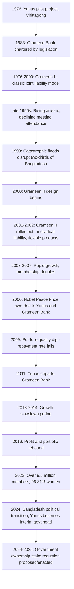

## Grameen Bank Model and Its Evolution

### Institutional Origins

The Grameen Bank was founded by Professor Muhammad Yunus, beginning as an action-research project in 1976 at the University of Chittagong to design a credit delivery mechanism for Bangladesh's rural poor, and was authorized by national legislation to operate as an independent bank in October 1983. Grameen Bank is a microfinance specialized community development bank founded in Bangladesh, making small loans known as microcredit or "grameencredit" to the impoverished without requiring collateral. The bank is jointly operated by its borrower members and the government. In 2006, the bank and its founder, Muhammad Yunus, were jointly awarded the Nobel Peace Prize.

**Key Points**

- Grameen pioneered the joint-liability group lending model at scale, becoming the template subsequently adapted across the global microfinance industry
- The bank's success has inspired similar projects in more than 64 countries around the world, including a World Bank initiative to finance Grameen-type schemes
- The institution underwent a fundamental internal restructuring in 2001-2002 ("Grameen II"), and has more recently experienced significant governance and ownership changes following Bangladesh's 2024 political transition

### Grameen I: The "Classic" Model (1976-2000)

Grameen Bank steadily developed what it now calls its "classic" microcredit system: poor villagers joined weekly-meeting groups, took loans from the bank as individuals, and undertook to help each other should they fall into difficulty. Loans were repaid over a year in equal weekly instalments, and members also deposited small amounts into personal and group-owned savings accounts. [microsave](https://www.microsave.net/2005/01/04/what-is-grameen-ii-is-it-up-and-running-in-the-field-yet/)[microsave](https://www.microsave.net/2005/01/04/what-is-grameen-ii-is-it-up-and-running-in-the-field-yet/)

**Core design features of Grameen I:**

- **Group formation**: 5-member groups, predominantly women, from the same village, formed through self-selection
- **Formal joint liability**: Group members bore collective responsibility for a defaulting member's repayment
- **Rigid loan terms**: Standardized one-year loan tenure, fixed equal weekly installments, limited flexibility in use or repayment schedule
- **Compulsory savings**: Mandatory contributions to group and personal savings funds, with restricted withdrawal rights
- **Center meetings**: Public weekly meetings for disbursement, collection, and monitoring

$$\text{Loan Repayment}_{t} = \frac{L}{52} \quad \text{(fixed weekly installment over one year)}$$

### The Late-1990s Crisis

After two decades of rapid expansion, Grameen ran into trouble in the late 1990s: arrears on loan repayments began to grow, and more clients stopped attending the village-level weekly meetings where bank business was conducted. In 1998, Bangladesh suffered its worst floods in living memory, disrupting the bank's work across nearly two-thirds of the country and dealing a severe blow to its balance sheet. The bank's public image also suffered, with critics challenging its accounting practices and its claimed profitability and sustainability, while international attention shifted toward alternative microfinance models. [GRAMEEN II The First Five Years 2001 2005 +2](https://www.microsave.net/wp-content/uploads/2006/02/GRAMEEN_II_The_First_Five_Years_2001_2005.pdf)

This crisis is theoretically significant beyond Grameen's specific institutional history: it illustrates in practice the **rigidity costs** of the classic joint-liability model discussed in the prior item — fixed, inflexible repayment schedules combined with covariate shock exposure (the 1998 floods) produced widespread simultaneous distress across borrower groups, exposing the model's vulnerability to correlated shocks that undermine peer-based risk-sharing.

### Grameen II: The 2001 Reform ("Grameen Generalised System")

A key moment came in early 2000 when Grameen began redesigning its core system. This led in 2001 to the launch of Grameen II, formally implemented across the bank's network by 2002. Grameen declared that in April 2002 "Grameen Bank II has emerged" and by August of that year every one of its 1,175 branches had adopted the new system. [GRAMEEN II The First Five Years 2001 2005 +2](https://www.microsave.net/wp-content/uploads/2006/02/GRAMEEN_II_The_First_Five_Years_2001_2005.pdf)

#### Core Changes Under Grameen II

**1. Elimination of formal joint liability**

Since 2001, Grameen has actually broken from the model it made famous: borrowers are no longer jointly liable for one another's default. This directly addresses the free-riding and contagious-default problems inherent in strict joint liability, discussed in the preceding syllabus item, while retaining group meetings for monitoring and social-capital purposes. [cgdev](https://www.cgdev.org/node/1423596)

**2. Flexible loan products**

Grameen II moved to more flexible loans with top-up mechanisms, allowing clients to manage cash flows more effectively than under the rigid Grameen I structure. Loans could increasingly be used for various purposes beyond productive or return-generating activities, including consumption smoothing and funding life-cycle expenditures — a significant conceptual shift from the "poverty lending" paradigm (credit strictly for microenterprise investment) toward a broader "financial systems" approach to serving poor households' full financial needs. [findevgateway](https://findevgateway.org/paper/2010/06/grameen-ii-and-portfolios-poor)[findevgateway](https://findevgateway.org/paper/2010/06/grameen-ii-and-portfolios-poor)

**3. Open-access, flexible savings products**

Grameen II introduced withdrawal-enabled passbook savings accounts to help clients manage cash flows, alongside commitment savings accounts (Grameen Pension Savings) that allowed accumulation of large sums over time. Grameen also began offering attractive savings products more broadly, and by late 2004 Grameen's savings portfolio had surprisingly surpassed its loan portfolio in size — transforming Grameen from a pure microcredit lender into something closer to a full-service retail bank for low-income households. [findevgateway](https://findevgateway.org/paper/2010/06/grameen-ii-and-portfolios-poor)[cgdev](https://www.cgdev.org/node/1423596)

**4. New specialized products**

Grameen II addressed frontier issues in microfinance including open-access savings, flexible loan products, self-reliance and absence of donor dependency for funds, and product development catering to retirees (Grameen Pension Scheme) and their adult children (Higher Education Loans). [socioeco](https://ripess2.socioeco.org/bdf_fiche-publication-583_fr.html)

**5. Loan restructuring flexibility**

Rather than treating any missed payment as formal default, Grameen II introduced mechanisms allowing struggling borrowers to restructure loan terms (extending repayment periods, adjusting installment sizes) without full exclusion from the credit relationship — a substantial departure from the rigid, all-or-nothing enforcement logic of the classic model.

### Grameen I vs. Grameen II Comparison Diagram (svg_diagram)

<svg xmlns="http://www.w3.org/2000/svg" viewBox="0 0 850 480">
<text x="425" y="30" font-size="19" font-weight="bold" text-anchor="middle" fill="#1a1a1a">Grameen I to Grameen II Transition (svg_diagram)</text>
<rect x="50" y="70" width="330" height="360" rx="10" fill="#fee2e2" stroke="#dc2626" stroke-width="2.5" />
<text x="215" y="100" font-size="15" font-weight="bold" text-anchor="middle" fill="#7f1d1d">GRAMEEN I (1976-2000)</text>
<line x1="70" y1="115" x2="360" y2="115" stroke="#dc2626" stroke-width="1" />
<text x="215" y="140" font-size="11" text-anchor="middle" fill="#7f1d1d">Formal joint liability</text>
<text x="215" y="165" font-size="11" text-anchor="middle" fill="#7f1d1d">Fixed 1-year loan term</text>
<text x="215" y="190" font-size="11" text-anchor="middle" fill="#7f1d1d">Equal weekly installments</text>
<text x="215" y="215" font-size="11" text-anchor="middle" fill="#7f1d1d">Compulsory, illiquid savings</text>
<text x="215" y="240" font-size="11" text-anchor="middle" fill="#7f1d1d">Loans for enterprise only</text>
<text x="215" y="265" font-size="11" text-anchor="middle" fill="#7f1d1d">Rigid, one-size-fits-all product</text>
<text x="215" y="290" font-size="11" text-anchor="middle" fill="#7f1d1d">Default = group crisis</text>
<text x="215" y="330" font-size="11" font-weight="bold" text-anchor="middle" fill="#7f1d1d">Vulnerable to covariate</text>
<text x="215" y="350" font-size="11" font-weight="bold" text-anchor="middle" fill="#7f1d1d">shocks (1998 floods crisis)</text>
<rect x="470" y="70" width="330" height="360" rx="10" fill="#dcfce7" stroke="#16a34a" stroke-width="2.5" />
<text x="635" y="100" font-size="15" font-weight="bold" text-anchor="middle" fill="#166534">GRAMEEN II (2001-present)</text>
<line x1="490" y1="115" x2="780" y2="115" stroke="#16a34a" stroke-width="1" />
<text x="635" y="140" font-size="11" text-anchor="middle" fill="#166534">Individual liability</text>
<text x="635" y="165" font-size="11" text-anchor="middle" fill="#166534">Flexible loan terms, top-ups</text>
<text x="635" y="190" font-size="11" text-anchor="middle" fill="#166534">Adjustable repayment schedules</text>
<text x="635" y="215" font-size="11" text-anchor="middle" fill="#166534">Open-access, withdrawable savings</text>
<text x="635" y="240" font-size="11" text-anchor="middle" fill="#166534">Loans for consumption too</text>
<text x="635" y="265" font-size="11" text-anchor="middle" fill="#166534">Pension, education, housing products</text>
<text x="635" y="290" font-size="11" text-anchor="middle" fill="#166534">Individual restructuring option</text>
<text x="635" y="330" font-size="11" font-weight="bold" text-anchor="middle" fill="#166534">Financial-systems approach:</text>
<text x="635" y="350" font-size="11" font-weight="bold" text-anchor="middle" fill="#166534">full-service retail bank for poor</text>
<line x1="380" y1="250" x2="470" y2="250" stroke="#333" stroke-width="2" />
<polygon points="470,250 460,244 460,256" fill="#333" />
<text x="425" y="240" font-size="10" text-anchor="middle" fill="#333">2001-02</text>
<text x="425" y="265" font-size="10" text-anchor="middle" fill="#333">reform</text>
</svg>

### Theoretical Interpretation of the Grameen II Shift

The original Grameen Bank model came from what has been characterized as a "poverty lending" approach, while Grameen II moved much closer to a "financial systems" approach favored by organizations such as the Consultative Group to Assist the Poor (CGAP). This reframing reflects a broader shift in development finance thinking: [manchester](https://hummedia.manchester.ac.uk/institutes/gdi/publications/workingpapers/bwpi/bwpi-wp-6008.pdf)

- **Poverty lending approach**: Credit is provided primarily as a subsidized or specially-designed instrument targeted narrowly at productive investment for the poor, often prioritizing outreach and social mission over strict financial self-sustainability
- **Financial systems approach**: Poor households are treated as a viable, diverse customer segment requiring a full range of financial services (savings, credit, insurance, pensions) tailored to genuine cash-flow management needs, including consumption smoothing — not just microenterprise investment — with institutional financial sustainability treated as central to long-run outreach

[Inference] The elimination of formal joint liability under Grameen II is consistent with the broader empirical finding (discussed in the prior item) that individual liability lending, combined with retained group-based monitoring infrastructure and dynamic incentives, can sustain comparable repayment performance while reducing the free-riding and contagious-default costs associated with strict joint liability — though Grameen's specific reform was driven as much by the acute 1998-2000 crisis as by ex-ante theoretical optimization.

### Post-Grameen II Growth and Outcomes

Grameen took 27 years to reach 2.5 million members, then doubled that figure during the full establishment of Grameen II. Even in Bangladesh's competitive microfinance environment, Grameen continued to grow rapidly, attracting around 140,000 new members each month — roughly 1.7 million new members annually. In the three years to December 2005, Grameen's deposit base tripled and its loans outstanding doubled, while the bank simultaneously introduced more conservative provisioning policy and improved overall loan portfolio quality and profitability. [by Graham Wright, Stuart Rutherford and David Cracknell +2](https://www.microsave.net/lessons-from-the-grameen-ii-revolution/)

By subsequent years, the institution had grown substantially further: Grameen Bank's membership crossed the milestone of 10 million, with no other microcredit organization in the world reaching such a member count (as reported in 2022), and as of January 2022, total borrowers numbered nearly 9.5 million, with 96.81% of those being women. As of 2022, the bank operated 2,568 branches with approximately 18,203 employees, total assets of ৳301.05 billion, and total equity of ৳26.920 billion. [thefinancialexpress](https://old.thefinancialexpress.com.bd/national/grameen-bank-performs-much-better-after-departure-of-yunus-its-md-says-1658683490)

Grameen Bank is owned jointly by its borrower members and the Government of Bangladesh, with 94% of total equity owned by borrowers and the remaining 6% owned by the Government of Bangladesh (per historical reporting; ownership shares have since shifted, see below).

### Portfolio Quality Volatility Post-Reform

Despite the structural improvements from Grameen II, the bank's loan portfolio has continued to exhibit periodic quality fluctuations reflecting the broader challenges of scaling microfinance operations. In the second half of 2009, Grameen's repayment rate — the fraction of amounts due actually paid — fell from 97.81% to 96.55%, marking the sharpest drop for that indicator in the bank's publicly recorded history at the time, illustrating that Grameen II's flexibility reforms, while addressing some structural rigidities, did not eliminate portfolio risk entirely. Bank activities reportedly slowed in 2013 and 2014 due to various uncertainties affecting profit margins, before strengthening again in late 2015 and continuing through 2016, with loan portfolio, membership, outstanding loans, and net profit all rising in 2016 compared to 2015. [cgdev](https://www.cgdev.org/node/3077892)[thedailystar](https://www.thedailystar.net/node/1340407)

### Governance Transitions (2011-2026)

Grameen Bank's institutional history since 2011 has been marked by significant governance disputes, particularly concerning the role of founder Muhammad Yunus:

Yunus was reported to have had no association with Grameen Bank in any capacity after 2011, and Grameen Bank's Managing Director stated in 2022 that the bank performed much better after Yunus's departure, noting the bank had no perception issues running without its founder and had been placed in the highest position of progress across all important indicators that year. During the pandemic year 2020, the bank made a profit of Tk 4.81 billion. [grameen bank performs much better after departure of yunus its md says 1658683490 +2](https://old.thefinancialexpress.com.bd/national/grameen-bank-performs-much-better-after-departure-of-yunus-its-md-says-1658683490)

Following Bangladesh's 2024 political transition (Yunus subsequently became head of the country's interim government), Grameen Bank's ownership structure has undergone further significant revision:

- The interim government's Advisory Council gave in-principle approval to amend the Grameen Bank Ordinance, reducing the government's stake in the bank from 25 percent to 10 percent (reported April 2025)
- An earlier draft plan (reported January 2025) had proposed reducing the government's stake from 25 percent to as low as 5 percent, alongside major changes to bank ownership and board structure
- The interim government reinstated Grameen Bank's tax exemption for a further five years, through December 2029 (reported October 2024)
- As of November 2025, the bank experienced a security incident when petrol bombs were reportedly hurled at a Grameen Bank branch in Gazipur, damaging the branch gate

[Unverified] The final, formally enacted ownership percentages and board composition under any amended Grameen Bank Ordinance should be verified against the most current official government and Grameen Bank sources, as these reforms were reported as being in draft/in-principle stages as of the search results available, and legislative details may have been finalized or further revised since. The specific circumstances and resolution of the November 2025 security incident likewise warrant independent verification if operationally relevant.

### Institutional Evolution Timeline Diagram

### The Grameen Model's International Replication and Adaptation

The bank's success has inspired similar projects in more than 64 countries around the world. International replications have generally adapted rather than adopted the model wholesale, reflecting the theoretical lessons about context-dependency established in the prior syllabus item:

- **Grameen America**: A separate US-based affiliate applying group-lending principles adapted to a high-income-country informal/immigrant small-business context; Grameen America reported granting $4 billion in cumulative loans for women entrepreneurs across 27 US cities, with a target of $5 billion in cumulative lending by 2030 (reported February 2024).
- **CreditAccess Grameen (India)**: A commercially-oriented, for-profit microfinance institution using the Grameen name and group-lending heritage; as of the relevant reporting period, it operated as the largest microfinance institution in India by loan book size, having diversified into non-micro loan products and international funding sources. [business-standard](https://www.business-standard.com/companies/interviews/we-have-restrained-from-taking-sfb-route-creditaccess-grameen-md-ceo-124051200374_1.html)
- **Latin American and other regional adaptations**: Numerous NGO-led programs across Latin America, South Asia, and Africa have replicated group-based lending methodologies with local modifications to group size, liability structure, and product design, often converging toward the individual-liability, flexible-product model that Grameen itself adopted post-2001

[Inference] The heterogeneity of international Grameen replications — ranging from strict nonprofit poverty-lending mandates to fully commercial, profit-oriented microfinance institutions — illustrates that "the Grameen model" has functioned less as a single fixed blueprint and more as an evolving methodology continuously reshaped by both Grameen Bank's own internal reforms and the specific institutional, regulatory, and market contexts of adopting countries.

### Conclusion

The Grameen Bank's institutional trajectory — from the rigid, strictly joint-liability "classic" model through the 2001 Grameen II reforms toward a flexible, individually-liable, full-service financial institution, and subsequently through significant governance upheaval in the 2020s — offers a real-world case study in how theoretical critiques of joint liability (free-riding, contagious default, vulnerability to covariate shocks) translate into concrete institutional redesign. The late-1990s crisis, triggered by a combination of accumulating rigidities and a catastrophic covariate shock (the 1998 floods), forced an internal reckoning that pushed Grameen from a narrow poverty-lending paradigm toward a broader financial-systems approach emphasizing flexible savings, adjustable credit terms, and diversified product lines. The bank's subsequent growth to become the world's largest microlender by membership, alongside recurring portfolio quality fluctuations and, more recently, substantial governance and ownership restructuring tied to Bangladesh's broader political transition, together illustrate that even the most iconic and widely replicated microfinance institution has required continuous adaptation rather than static adherence to its founding model.

**Related Topics**

- Group lending and joint liability models (theoretical foundations)
- Adverse selection and moral hazard in lending
- Financial systems approach versus poverty lending approach in microfinance
- Microfinance commercialization and for-profit MFI models (CreditAccess Grameen, compartamos)
- Covariate risk and vulnerability of group lending to correlated shocks
- Muhammad Yunus, social business theory, and the 2024 Bangladesh political transition
- Cross-country microfinance replication and institutional adaptation
- Female empowerment outcomes in group-based microfinance programs