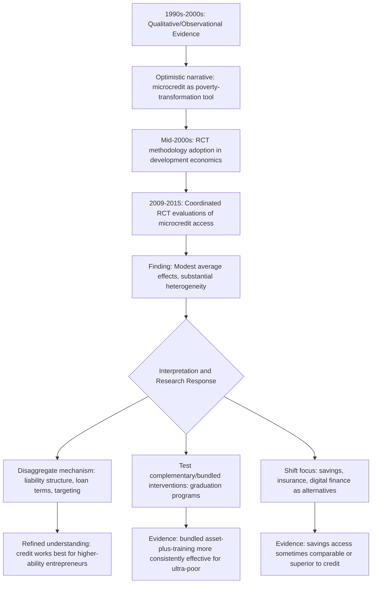

## Microfinance Impact Evaluation Evidence

### Conceptual Overview

Microfinance impact evaluation constitutes one of the largest and most methodologically rigorous bodies of empirical research in development economics, driven by the field's broader "credibility revolution" toward randomized controlled trials (RCTs) and quasi-experimental identification strategies. This body of evidence directly tests the theoretical claims underlying the institutional mechanisms discussed in preceding syllabus items — whether resolving information asymmetries and expanding credit access through microfinance actually translates into improved welfare outcomes for borrowers.

**Key Points**

- Early qualitative and observational evidence (1990s-2000s) generated highly optimistic narratives about microfinance's poverty-reduction potential, substantially predating rigorous causal identification
- The mid-2000s to mid-2010s wave of RCTs evaluating microcredit access produced considerably more modest and heterogeneous findings than early advocacy suggested, prompting significant recalibration of expectations across the field
- Contemporary research has shifted toward disaggregating "microfinance" into its component design features (liability structure, loan size, repayment flexibility, complementary services) to identify which specific elements drive which specific outcomes

### The Identification Challenge

Estimating the causal impact of microfinance access faces a fundamental **selection problem**: individuals who choose to take microloans differ systematically from those who do not, on both observable and unobservable dimensions (entrepreneurial ability, risk tolerance, existing business opportunities).

$$\text{Naive Estimate: } E[Y \mid \text{Borrower}] - E[Y \mid \text{Non-borrower}] \neq \text{ATE}$$

This naive comparison conflates the true treatment effect with **selection bias**:

$$E[Y \mid \text{Borrower}] - E[Y \mid \text{Non-borrower}] = \underbrace{\text{ATT}}_{\text{true effect}} + \underbrace{E[Y(0) \mid \text{Borrower}] - E[Y(0) \mid \text{Non-borrower}]}_{\text{selection bias}}$$

Where $Y(0)$ is the potential outcome absent treatment. If more entrepreneurially capable or motivated individuals self-select into borrowing, $Y(0)$ for borrowers exceeds that for non-borrowers even absent any credit effect, biasing naive comparisons upward.

### Identification Strategies Used in the Literature

#### Randomized Controlled Trials (Gold Standard)

The dominant credible identification approach randomizes access to microfinance at some level (individual, group, or geographic/branch level) to ensure treatment and control groups are, in expectation, identical on both observable and unobservable dimensions.

$$ATE = E[Y_i \mid T_i = 1] - E[Y_i \mid T_i = 0]$$

Where $T_i$ is randomly assigned treatment status. Common randomization designs include:

- **Individual-level randomization**: Among loan applicants meeting a lending threshold, randomly approving/denying a subset (used where demand exceeds supply)
- **Group/branch-level randomization**: Randomly phasing in microfinance branch openings across eligible communities (staggered rollout), comparing early- versus late-access areas
- **Encouragement design**: Randomly varying marketing/informational encouragement to take up existing microfinance access, using assignment as an instrument for actual take-up (addressing take-up-driven selection even under randomized offer)

#### Quasi-Experimental Approaches

- **Regression discontinuity**: Comparing outcomes for borrowers just above versus just below an eligibility threshold (e.g., a credit score or loan-size cutoff)
- **Difference-in-differences**: Comparing outcome trends in areas gaining microfinance access versus comparison areas, before and after program introduction
- **Instrumental variables**: Using variation in program placement or eligibility rules plausibly unrelated to unobserved borrower characteristics

### Landmark Studies and Their Findings

#### The 2015 Special Issue: Six Randomized Evaluations

A coordinated set of six randomized evaluations of microcredit expansion, published together in a special issue of the *American Economic Journal: Applied Economics* (covering Bosnia and Herzegovina, Ethiopia, India (Hyderabad), Mexico, Mongolia, and Morocco), represents the most influential coordinated evidence base on microcredit's average causal effects.

**General pattern of findings across this coordinated study set:**

- Modest or statistically insignificant average effects on household income and consumption
- Generally positive but modest effects on business investment scale, business creation among existing entrepreneurs, and (in some studies) business profits among a subset of higher-ability entrepreneurs
- No consistent evidence of transformative poverty reduction or dramatic income gains at the average treatment effect level
- Some evidence of heterogeneous effects, with more capable or already-operating micro-entrepreneurs benefiting more than marginal or first-time borrowers

[Inference] The convergence of modest average effects across six methodologically similar studies conducted in substantially different country contexts is widely interpreted in the literature as strong evidence against the "microcredit as poverty-transformation silver bullet" narrative that characterized earlier advocacy, though this should not be over-generalized to claim microfinance has zero value — the evidence supports a more nuanced picture of modest, heterogeneous, and context-dependent benefits.

### Impact Evaluation Evidence Summary Diagram (svg_diagram)

<svg xmlns="http://www.w3.org/2000/svg" viewBox="0 0 850 560">
<text x="425" y="30" font-size="19" font-weight="bold" text-anchor="middle" fill="#1a1a1a">Microfinance Impact Evidence by Outcome (svg_diagram)</text>
<line x1="280" y1="70" x2="280" y2="500" stroke="#999" stroke-width="1" stroke-dasharray="4,3" />
<line x1="570" y1="70" x2="570" y2="500" stroke="#999" stroke-width="1" stroke-dasharray="4,3" />

<text x="140" y="65" font-size="13" font-weight="bold" text-anchor="middle" fill="#333">Weak/Null Evidence</text>

<text x="425" y="65" font-size="13" font-weight="bold" text-anchor="middle" fill="#333">Mixed/Modest Evidence</text>

<text x="710" y="65" font-size="13" font-weight="bold" text-anchor="middle" fill="#333">Consistent Positive Evidence</text>

<rect x="60" y="90" width="160" height="55" rx="8" fill="#fee2e2" stroke="#dc2626" stroke-width="2" />
<text x="140" y="112" font-size="11" font-weight="bold" text-anchor="middle" fill="#7f1d1d">Household Income</text>
<text x="140" y="128" font-size="11" font-weight="bold" text-anchor="middle" fill="#7f1d1d">(average effect)</text>
<rect x="60" y="160" width="160" height="55" rx="8" fill="#fee2e2" stroke="#dc2626" stroke-width="2" />
<text x="140" y="182" font-size="11" font-weight="bold" text-anchor="middle" fill="#7f1d1d">Poverty Rate</text>
<text x="140" y="198" font-size="11" font-weight="bold" text-anchor="middle" fill="#7f1d1d">Reduction</text>
<rect x="350" y="90" width="150" height="55" rx="8" fill="#fef3c7" stroke="#d97706" stroke-width="2" />
<text x="425" y="112" font-size="11" font-weight="bold" text-anchor="middle" fill="#78350f">Business Profits</text>
<text x="425" y="128" font-size="11" font-weight="bold" text-anchor="middle" fill="#78350f">(heterogeneous)</text>
<rect x="350" y="160" width="150" height="55" rx="8" fill="#fef3c7" stroke="#d97706" stroke-width="2" />
<text x="425" y="182" font-size="11" font-weight="bold" text-anchor="middle" fill="#78350f">Consumption</text>
<text x="425" y="198" font-size="11" font-weight="bold" text-anchor="middle" fill="#78350f">Smoothing</text>
<rect x="350" y="230" width="150" height="55" rx="8" fill="#fef3c7" stroke="#d97706" stroke-width="2" />
<text x="425" y="252" font-size="11" font-weight="bold" text-anchor="middle" fill="#78350f">Female Empowerment</text>
<text x="425" y="268" font-size="11" font-weight="bold" text-anchor="middle" fill="#78350f">(context-dependent)</text>
<rect x="640" y="90" width="150" height="55" rx="8" fill="#dcfce7" stroke="#16a34a" stroke-width="2" />
<text x="715" y="112" font-size="11" font-weight="bold" text-anchor="middle" fill="#166534">Business Investment</text>
<text x="715" y="128" font-size="11" font-weight="bold" text-anchor="middle" fill="#166534">Scale</text>
<rect x="640" y="160" width="150" height="55" rx="8" fill="#dcfce7" stroke="#16a34a" stroke-width="2" />
<text x="715" y="182" font-size="11" font-weight="bold" text-anchor="middle" fill="#166534">Business Ownership</text>
<text x="715" y="198" font-size="11" font-weight="bold" text-anchor="middle" fill="#166534">Rate</text>
<rect x="640" y="230" width="150" height="55" rx="8" fill="#dcfce7" stroke="#16a34a" stroke-width="2" />
<text x="715" y="252" font-size="11" font-weight="bold" text-anchor="middle" fill="#166534">Financial Behavior/</text>
<text x="715" y="268" font-size="11" font-weight="bold" text-anchor="middle" fill="#166534">Debt Management</text>

<text x="425" y="330" font-size="12" fill="#333" text-anchor="middle" font-style="italic">Note: Categorization reflects general pattern across the coordinated 2015 AEJ Applied</text>

<text x="425" y="348" font-size="12" fill="#333" text-anchor="middle" font-style="italic">six-country evaluation set and related literature; individual study results vary</text>

<rect x="150" y="400" width="550" height="120" rx="10" fill="#dbeafe" stroke="#2563eb" stroke-width="2" />
<text x="425" y="425" font-size="13" font-weight="bold" text-anchor="middle" fill="#1e3a8a">Overall Synthesis</text>
<text x="425" y="450" font-size="11" text-anchor="middle" fill="#1e3a8a">Microcredit access modestly expands business scale and</text>
<text x="425" y="468" font-size="11" text-anchor="middle" fill="#1e3a8a">investment for existing/capable entrepreneurs, with limited</text>
<text x="425" y="486" font-size="11" text-anchor="middle" fill="#1e3a8a">average effects on income/poverty at the population level</text>
</svg>

### Explanations for Modest Average Effects

Several mechanisms have been proposed to explain why credit access, despite resolving genuine information asymmetries, produces smaller-than-expected welfare effects:

#### 1. Low Returns to Capital for Marginal Borrowers

Not all borrowers possess high-return business opportunities; for many very poor households, microenterprise represents a subsistence/necessity activity rather than a high-growth investment opportunity, implying the marginal return to additional capital may be genuinely low or highly variable across the borrower population — heterogeneity that is masked in average treatment effect estimates.

$$ATE = \sum_i w_i \cdot \text{Treatment Effect}_i$$

Where weights $w_i$ reflect population shares; a small subgroup with very high returns can be masked by a larger subgroup with near-zero returns when reporting only the pooled average.

#### 2. Non-Credit Binding Constraints

Credit access alone does not resolve other constraints that may bind more tightly on business growth: limited managerial capacity/business skills, thin local product markets limiting demand, lack of complementary inputs, or regulatory/infrastructure barriers. Where these non-credit constraints bind, additional credit alone yields limited marginal returns.

#### 3. Loan Term Mismatch

Standard microfinance loan terms — short duration, rigid frequent repayment schedules, small loan sizes — may be poorly suited to businesses requiring larger up-front capital investment or longer gestation periods before generating returns, limiting the loans' usefulness for genuine business scaling relative to consumption smoothing or working capital needs.

#### 4. Fungibility of Credit

Loans nominally designated for business purposes are frequently used partially or wholly for consumption smoothing, debt consolidation, or other household needs, meaning administrative loan "purpose" categories may not reflect actual use, complicating interpretation of business-outcome-focused evaluations.

### Impact Evaluation Evidence by Outcome Domain

| Outcome Domain | General Evidence Pattern | Key Caveat |
| --- | --- | --- |
| Household income/consumption | Modest, often statistically insignificant average effects | Substantial heterogeneity masked in pooled estimates |
| Business investment/scale | More consistently positive, particularly among existing entrepreneurs | Effects concentrated among already-operating businesses |
| Business creation | Mixed; some studies find modest increases in self-employment | Displacement effects (business creation crowding out wage employment) documented in some contexts |
| Consumption smoothing/risk management | Reasonably consistent evidence of improved ability to manage cash-flow volatility | Distinct from productive-investment effects; a genuine but different benefit channel |
| Female empowerment/bargaining power | Highly context-dependent; some positive effects on decision-making autonomy, others null or even negative in specific contexts | Measurement heterogeneity across studies (different empowerment indices) limits direct comparability |
| Children's education/health | Generally modest or null average effects | Some evidence of trade-offs (child labor increases if household enterprise expands) |
| Over-indebtedness/financial distress | Documented risk in specific high-penetration contexts | Notably relevant to the 2010 Andhra Pradesh crisis (see prior item) |

### Heterogeneous Treatment Effects: The "Gambler" and "Talent" Framings

A prominent finding across several studies (particularly from Bosnia-Herzegovina and other contexts within the coordinated evaluation set) is substantial **treatment effect heterogeneity** correlated with borrower characteristics:

- Borrowers with pre-existing business experience or observably higher entrepreneurial "talent" (proxied variously by education, prior business ownership, or baseline business performance) tend to show larger and more consistently positive responses to expanded credit access
- Borrowers taking loans for consumption smoothing or without pre-existing business plans show minimal average impact on income-generating outcomes, consistent with the credit serving primarily a risk-management rather than investment-expansion function for this segment

[Inference] This heterogeneity evidence has motivated a shift in both research and practitioner focus toward **targeting mechanisms** — identifying which borrowers are likely to generate high returns from additional capital — rather than treating microcredit as a uniformly beneficial intervention across the entire population of poor households, though reliable low-cost targeting mechanisms for this purpose remain an active area of research rather than a solved problem.

### Beyond Microcredit: Evidence on Complementary Interventions

Given the modest effects of credit access alone, subsequent research has evaluated **bundled interventions** combining microfinance with complementary services:

#### Graduation/"Big Push" Programs

Multi-faceted programs combining an asset transfer (e.g., livestock), consumption support during a stabilization period, business skills training, and coaching — evaluated through coordinated multi-country RCTs (notably the BRAC-inspired "graduation approach" studied across Bangladesh, Ethiopia, Ghana, Honduras, India, Pakistan, and Peru) — have generally shown more consistently positive and often more persistent effects on income, consumption, and asset accumulation among the ultra-poor than credit access alone.

[Inference] The comparatively stronger and more consistent evidence base for these bundled "graduation" interventions relative to standalone microcredit is often interpreted as supporting the view that credit constraints alone are frequently not the sole or even primary binding constraint facing the poorest households, who may require complementary asset transfers and skills investment to productively utilize additional credit — though the higher cost and complexity of bundled interventions relative to standalone microcredit is itself a significant implementation consideration.

#### Business Training and Consulting

Evidence on standalone business training programs (without accompanying credit or capital) shows similarly modest and heterogeneous average effects on business practices and profits, suggesting that neither credit nor training alone reliably resolves the multiple constraints facing small-scale entrepreneurs, reinforcing the case for bundled, multi-constraint-addressing program design.

#### Savings-Led Approaches

Some evidence suggests that facilitating access to formal or semi-formal **savings** mechanisms (rather than credit) can generate comparable or in some cases larger effects on business investment and household welfare, at potentially lower risk to borrowers than debt-based instruments, given savings do not carry repayment obligation risk in adverse states.

### Research Evolution Framework Diagram

### Methodological Critiques and Ongoing Debates

- **External validity concerns**: Results from any single RCT context may not generalize to different market, regulatory, or cultural settings, motivating the coordinated multi-country evaluation approach but not fully resolving generalizability concerns
- **General equilibrium effects**: Most microcredit RCTs measure partial-equilibrium individual or household-level effects; village- or market-level general equilibrium effects (e.g., increased local competition among microenterprises reducing individual returns as microfinance access expands broadly) are more difficult to capture and may attenuate estimated benefits at scale
- **Measurement of business profits**: Self-reported business profit and revenue data in informal microenterprise settings are subject to substantial measurement error, potentially attenuating estimated treatment effects toward zero
- **Time horizon limitations**: Most RCT follow-up periods (1-3 years) may be insufficient to capture longer-run business growth trajectories or intergenerational effects (e.g., on children's human capital), an active area of ongoing long-term follow-up research

[Unverified] The most current state of long-term (5+ year) follow-up studies from the original coordinated evaluation set, and any more recent large-scale RCT evidence published after the mid-2010s wave, should be checked against the latest development economics literature, as this remains an active and evolving research area.

### Conclusion

Microfinance impact evaluation evidence has undergone a substantial arc: from early, largely uncontrolled optimism about microcredit's transformative poverty-reduction potential, through a rigorous mid-2000s to mid-2010s wave of randomized evaluations that established more modest, heterogeneous average effects, to a contemporary research agenda focused on disaggregating which specific design features and borrower segments drive positive outcomes, and on testing complementary interventions (asset transfers, training, savings) that address constraints beyond credit access alone. This evolution exemplifies the broader "credibility revolution" in development economics and offers an important methodological lesson: interventions grounded in sound theoretical mechanisms (resolving genuine information asymmetries, as established in preceding syllabus items) do not automatically translate into large average welfare effects, particularly when other binding constraints — managerial capacity, market access, genuinely low returns for marginal borrowers — remain unaddressed.

**Related Topics**

- Group lending and joint liability models (mechanism being evaluated)
- Grameen Bank model and its evolution (institutional case study)
- Randomized controlled trial methodology in development economics
- Graduation approach and ultra-poor targeting programs
- Business training and entrepreneurship support program evaluation
- Savings-led microfinance and formal savings access
- Heterogeneous treatment effects and targeting mechanism design
- General equilibrium effects in microfinance market saturation