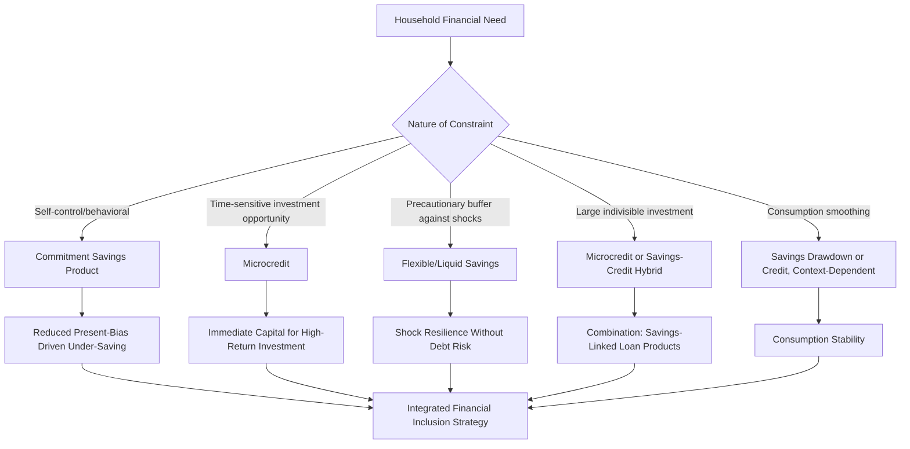

## Microcredit versus Microsavings

### Conceptual Overview

Microcredit and microsavings represent two distinct financial service models for addressing the financial constraints facing poor households in developing economies, differing fundamentally in their underlying risk allocation, behavioral requirements, and theoretical mechanism of impact. While microcredit dominated the early microfinance movement (as documented in the Grameen Bank item), a substantial body of subsequent theory and evidence has motivated renewed attention to microsavings as a complementary, and in some contexts superior, instrument for household financial management and welfare improvement.

**Key Points**

- Microcredit involves the household taking on debt obligation with fixed repayment regardless of income realization, while microsavings involves accumulating a household's own resources with no repayment risk
- The choice between credit-based and savings-based approaches has direct implications for who bears risk, what behavioral biases are engaged, and which household financial goals are best served
- Evidence increasingly suggests these instruments are complements rather than substitutes, addressing overlapping but distinct dimensions of household financial constraint

### Fundamental Structural Differences

$$\text{Microcredit: } C_t = Y_t + L - r \cdot L \quad \text{(debt obligation, fixed repayment)}$$

$$\text{Microsavings: } C_t = Y_t - S_t + S_{t-1}(1+i) \quad \text{(own resources, no repayment risk)}$$

Where $Y_t$ is income, $L$ is loan principal, $r$ is the interest rate, $S_t$ is savings deposited, and $i$ is the savings interest rate. The critical distinction: under microcredit, the household is contractually obligated to repay $r \cdot L$ regardless of realized income shocks (downside risk borne primarily by the household, subject to limited liability and lender enforcement responses), whereas under microsavings, the household draws only on previously accumulated own resources, with no equivalent third-party claim or default risk.

### Comparative Risk Allocation

| Dimension | Microcredit | Microsavings |
| --- | --- | --- |
| Default/repayment risk | Borne by household (with lender enforcement recourse) | None — no repayment obligation |
| Timing of resource availability | Available immediately (before resource generation) | Available only after prior accumulation |
| Vulnerability to income shocks | High — fixed obligations persist despite shocks | Low — no external obligation to meet |
| Behavioral requirement | Discipline to repay under external contractual pressure | Discipline to save under internal/self-imposed constraint |
| Interest flow direction | Household pays interest to lender | Household earns (or forgoes) interest on deposits |
| Institutional risk exposure | Lender bears portfolio credit risk | Institution bears counterparty/liquidity risk on deposits |

### Theoretical Case for Microsavings

#### 1. Addressing Self-Control and Behavioral Constraints

Behavioral economics models of **present bias** (hyperbolic discounting) suggest that many households possess the desire to save for future goals or investments but face self-control problems that lead to under-saving relative to their own stated long-run preferences.

$$U_t = u(c_t) + \beta \sum_{\tau=1}^{\infty} \delta^{\tau} u(c_{t+\tau}) \quad \text{where } \beta < 1 \text{ (present bias)}$$

Under present-biased preferences, a household's period-$t$ self may value immediate consumption disproportionately relative to future consumption, undermining voluntary savings accumulation even when the household's long-run self would prefer greater savings. **Commitment savings devices** — accounts with withdrawal restrictions, penalties for early withdrawal, or goal-linked lock-in features — directly address this self-control problem by allowing the household's more patient long-run preferences to bind against its own future short-run temptation.

This behavioral rationale has no direct analogue on the credit side: credit relaxes a liquidity/resource constraint, but does not address a self-control problem, and in principle could exacerbate present-bias-driven overconsumption if loan proceeds are used for immediate consumption rather than productive investment.

#### 2. No Downside Risk from Adverse Shocks

Because microsavings involves no repayment obligation, households are not exposed to the risk of debt distress, over-indebtedness, or aggressive collection practices that have been documented in high-penetration microcredit markets (as referenced in the Grameen Bank and joint liability discussions, including the 2010 Andhra Pradesh crisis). This makes savings-based approaches particularly attractive for **risk-averse households** or in contexts with high covariate shock exposure (agricultural communities subject to correlated weather risk), where debt obligations combined with correlated income shocks can trigger widespread simultaneous financial distress.

#### 3. Avoiding the Debt-Overhang and Risk-Shifting Distortions

As established in the moral hazard discussion, debt financing creates incentives for risk-shifting (asset substitution) since borrowers capture upside gains while lenders absorb downside losses beyond limited liability. Savings-financed investment does not generate this distortion, since the household bears both the full upside and downside of its own investment decisions using its own accumulated resources — better aligning incentives with efficient risk-taking.

#### 4. Lower Institutional and Borrower Transaction Costs

Savings mobilization can, in principle, be less costly to administer than credit extension, since it does not require the same intensity of screening, monitoring, and enforcement infrastructure that credit — subject to adverse selection and moral hazard, as detailed in prior items — necessitates. [Inference] This cost advantage is context-dependent, however, since savings mobilization requires its own infrastructure (secure deposit-taking, liquidity management, deposit insurance/regulatory compliance) that carries different but not necessarily lower costs, particularly for regulated deposit-taking institutions.

### Theoretical Case for Microcredit

#### 1. Addressing Genuine Liquidity/Timing Constraints

For households with high-return investment opportunities but insufficient prior accumulated savings, credit provides immediate access to capital that pure savings accumulation cannot replicate — closing the temporal gap between when a productive investment opportunity arises and when self-financed resources would otherwise become available.

$$\text{Opportunity Cost of Waiting to Save} = \sum_{\tau=0}^{T} (1+r_{investment})^{\tau} - (1+r_{savings})^{\tau}$$

Where $T$ is the time required to accumulate sufficient savings through gradual deposits; if the investment return $r_{investment}$ substantially exceeds the achievable savings return $r_{savings}$, the opportunity cost of delaying investment until sufficient savings accumulate can be substantial, particularly for time-sensitive opportunities (seasonal agricultural inputs, inventory purchases ahead of demand peaks).

#### 2. Enables Larger Up-Front Investment

Credit allows immediate access to lump-sum capital exceeding what a household could self-finance from current income alone, which can be critical for indivisible investments (equipment purchase, livestock acquisition) that cannot be effectively scaled down to match gradual savings accumulation.

#### 3. Insurance Function Against Shocks (Ex-Ante)

Access to credit as a contingent resource (even if not currently drawn upon) can itself serve an insurance-like function, allowing households to smooth consumption against anticipated future shocks by borrowing when needed rather than requiring pre-accumulated precautionary savings buffers for every possible contingency — though this substitutes credit risk for the opportunity cost of holding idle precautionary savings.

### Behavioral and Empirical Evidence

#### Commitment Savings Product Evidence

Randomized evaluations of commitment savings products — accounts with self-imposed withdrawal restrictions or goal-linked features — have generally found that a meaningful share of target populations demonstrate demand for such products and that take-up is associated with increased savings balances and, in some studies, improved downstream outcomes (business investment, health-related expenditure, educational spending), providing behavioral evidence consistent with the present-bias/self-control theoretical framework.

[Inference] The finding that many households voluntarily choose to restrict their own future access to funds (accepting a commitment device with real liquidity costs) is difficult to reconcile with a model of fully rational, time-consistent preferences, and is generally interpreted in the literature as direct behavioral evidence supporting the present-bias/quasi-hyperbolic discounting framework, though alternative explanations (external pressure from social networks that commitment devices help resist) have also been proposed.

#### Comparative Studies of Savings versus Credit Interventions

Several studies have directly compared microsavings access/promotion interventions against microcredit access, generally finding:

- Savings access interventions can produce comparable or, in some documented cases, larger effects on business investment and household welfare relative to microcredit, while avoiding the debt-related distress risks
- Savings interventions appear particularly effective for female microentrepreneurs in some contexts, plausibly reflecting the greater control over funds that self-held savings can provide within intrahousehold bargaining dynamics, relative to loan proceeds that may be subject to greater claims from other household members
- Take-up and sustained usage rates for formal savings products have historically been challenged by the same infrastructure and trust barriers that affect credit access in many developing rural contexts (distance to bank branches, minimum balance requirements, documentation barriers)

[Unverified] Specific quantitative comparisons of savings versus credit treatment effect magnitudes vary considerably by study context and outcome measure, and general claims about which instrument is "more effective" should be evaluated against the specific studies and populations being referenced rather than treated as a universal finding.

### Microcredit vs. Microsavings Comparison Diagram (svg_diagram)

<svg xmlns="http://www.w3.org/2000/svg" viewBox="0 0 850 540">
<text x="425" y="30" font-size="19" font-weight="bold" text-anchor="middle" fill="#1a1a1a">Microcredit vs Microsavings: Mechanism Comparison (svg_diagram)</text>
<rect x="50" y="70" width="340" height="400" rx="10" fill="#fee2e2" stroke="#dc2626" stroke-width="2.5" />
<text x="220" y="100" font-size="15" font-weight="bold" text-anchor="middle" fill="#7f1d1d">MICROCREDIT</text>
<line x1="70" y1="115" x2="370" y2="115" stroke="#dc2626" stroke-width="1" />
<text x="220" y="140" font-size="11" font-weight="bold" text-anchor="middle" fill="#7f1d1d">Solves: Liquidity/Timing Gap</text>
<text x="220" y="165" font-size="10" text-anchor="middle" fill="#7f1d1d">Immediate access to lump-sum capital</text>
<text x="220" y="185" font-size="10" text-anchor="middle" fill="#7f1d1d">Enables time-sensitive investment</text>
<text x="220" y="205" font-size="10" text-anchor="middle" fill="#7f1d1d">Contingent-access insurance function</text>
<text x="220" y="235" font-size="11" font-weight="bold" text-anchor="middle" fill="#7f1d1d">Risk: Repayment Obligation</text>
<text x="220" y="260" font-size="10" text-anchor="middle" fill="#7f1d1d">Fixed obligation regardless of shocks</text>
<text x="220" y="280" font-size="10" text-anchor="middle" fill="#7f1d1d">Debt distress / over-indebtedness risk</text>
<text x="220" y="300" font-size="10" text-anchor="middle" fill="#7f1d1d">Risk-shifting / asset substitution</text>
<text x="220" y="330" font-size="11" font-weight="bold" text-anchor="middle" fill="#7f1d1d">Institution Bears: Credit Risk</text>
<text x="220" y="355" font-size="10" text-anchor="middle" fill="#7f1d1d">Requires screening/monitoring/</text>
<text x="220" y="373" font-size="10" text-anchor="middle" fill="#7f1d1d">enforcement infrastructure</text>
<text x="220" y="410" font-size="11" font-weight="bold" text-anchor="middle" fill="#7f1d1d">Best suited: High-return, time-</text>
<text x="220" y="428" font-size="11" font-weight="bold" text-anchor="middle" fill="#7f1d1d">sensitive investment opportunities</text>
<rect x="460" y="70" width="340" height="400" rx="10" fill="#dcfce7" stroke="#16a34a" stroke-width="2.5" />
<text x="630" y="100" font-size="15" font-weight="bold" text-anchor="middle" fill="#166534">MICROSAVINGS</text>
<line x1="480" y1="115" x2="780" y2="115" stroke="#16a34a" stroke-width="1" />
<text x="630" y="140" font-size="11" font-weight="bold" text-anchor="middle" fill="#166534">Solves: Self-Control / Present Bias</text>
<text x="630" y="165" font-size="10" text-anchor="middle" fill="#166534">Commitment devices bind future self</text>
<text x="630" y="185" font-size="10" text-anchor="middle" fill="#166534">No repayment risk exposure</text>
<text x="630" y="205" font-size="10" text-anchor="middle" fill="#166534">Builds precautionary buffer over time</text>
<text x="630" y="235" font-size="11" font-weight="bold" text-anchor="middle" fill="#166534">Risk: Accumulation Delay</text>
<text x="630" y="260" font-size="10" text-anchor="middle" fill="#166534">Cannot fund time-sensitive opportunity</text>
<text x="630" y="280" font-size="10" text-anchor="middle" fill="#166534">Limited to gradually accumulated sum</text>
<text x="630" y="300" font-size="10" text-anchor="middle" fill="#166534">Opportunity cost of waiting</text>
<text x="630" y="330" font-size="11" font-weight="bold" text-anchor="middle" fill="#166534">Institution Bears: Liquidity Risk</text>
<text x="630" y="355" font-size="10" text-anchor="middle" fill="#166534">Requires deposit security/regulatory</text>
<text x="630" y="373" font-size="10" text-anchor="middle" fill="#166534">compliance infrastructure</text>
<text x="630" y="410" font-size="11" font-weight="bold" text-anchor="middle" fill="#166534">Best suited: Self-control constrained</text>
<text x="630" y="428" font-size="11" font-weight="bold" text-anchor="middle" fill="#166534">households, risk-averse contexts</text>
</svg>

### The Complementarity View

Rather than treating microcredit and microsavings as competing instruments, an increasingly influential perspective in the literature treats them as **complementary components of a full household financial toolkit**, each addressing distinct constraints:

$$\text{Household Welfare} = f(\text{Credit Access}, \text{Savings Access}, \text{Insurance Access}, \text{Payment Services})$$

This complementarity is reflected in the institutional evolution of major microfinance providers: as documented in the Grameen II reform (prior item), Grameen Bank itself moved decisively toward offering flexible, open-access savings products alongside its traditional credit business, explicitly recognizing that credit alone did not serve the full range of household financial management needs. Similarly, broader **financial inclusion** policy frameworks (as promoted by organizations such as CGAP and the World Bank) have shifted emphasis from narrowly "microcredit" toward comprehensive access to a full suite of financial services — savings, credit, insurance, and payments — recognizing that different households and different needs within the same household call for different instruments at different times.

### Savings-Credit Complementarity Framework

### Institutional and Regulatory Considerations

Microsavings mobilization introduces distinct institutional and regulatory requirements not present in pure credit-focused microfinance:

- **Deposit-taking licensing**: Many jurisdictions impose stricter regulatory requirements (capital adequacy, deposit insurance participation) on institutions accepting savings deposits from the public than on pure lending institutions, given depositor protection concerns
- **Trust and institutional credibility**: Households must trust that deposited savings will be safely held and accessible when needed, a distinct credibility requirement from the trust required to take on debt obligations
- **Liquidity management**: Savings-taking institutions must manage the risk of deposit withdrawals (bank-run-type dynamics), requiring liquid reserve management practices distinct from credit portfolio risk management

[Unverified] The specific current regulatory frameworks governing microfinance deposit-taking vary substantially by country and have evolved considerably since the early 2000s in response to both financial inclusion goals and prudential stability concerns; current country-specific regulatory detail should be verified against up-to-date national financial sector regulation sources if operationally relevant.

### Conclusion

Microcredit and microsavings address distinct, though overlapping, dimensions of the financial constraints facing poor households in developing economies: credit resolves genuine liquidity and timing gaps for productive investment but introduces repayment risk and enforcement costs, while savings addresses self-control and behavioral under-saving problems and eliminates repayment risk but cannot fund time-sensitive opportunities faster than gradual accumulation allows. The empirical evidence — commitment savings product demand, comparative studies of savings versus credit interventions, and the institutional evolution of major providers like Grameen Bank toward integrated savings-and-credit models — increasingly supports treating these instruments as complements within a broader financial inclusion framework rather than as competing or substitutable approaches, with the appropriate instrument mix depending on the specific nature of the household's binding financial constraint, risk tolerance, and the time-sensitivity of the underlying need being addressed.

**Related Topics**

- Grameen Bank model and its evolution (institutional case study of credit-to-savings integration)
- Behavioral economics of present bias and commitment devices
- Microfinance impact evaluation evidence (comparative outcome studies)
- Financial inclusion policy and the CGAP/World Bank comprehensive-access framework
- Deposit-taking regulation and prudential supervision of microfinance institutions
- Intrahousehold bargaining and control over savings versus loan proceeds
- Weather index insurance and complementary risk-management instruments
- Digital financial inclusion and mobile money savings mechanisms