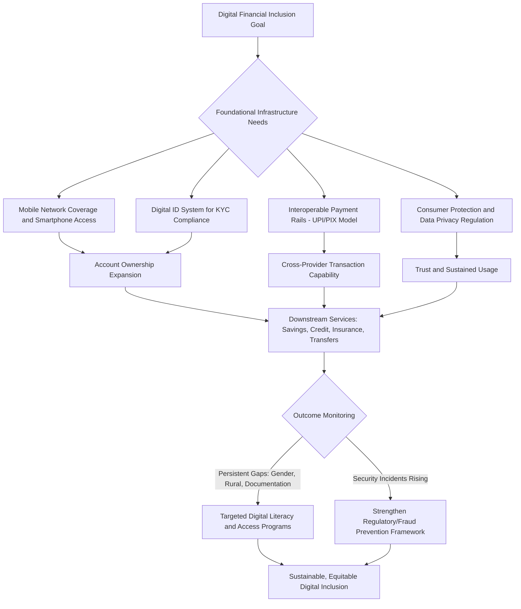

## Digital Financial Inclusion

### Conceptual Overview

Digital financial inclusion refers to the use of mobile phones, digital platforms, and related technologies to expand access to formal financial services — savings, credit, payments, insurance — among populations historically excluded from traditional brick-and-mortar banking infrastructure. This topic builds directly on the microcredit-versus-microsavings framework by examining how digital delivery channels reshape the cost structure, information environment, and reach of financial services in developing economies, addressing several of the structural constraints (thin bank branch networks, high transaction costs, weak formal credit histories) discussed throughout this chapter.

**Key Points**

- Mobile money — accounts held and transacted via mobile phone rather than a traditional bank — has been the primary driver of financial inclusion gains in developing economies over the past 15 years, particularly in Sub-Saharan Africa
- Digital delivery fundamentally alters the economics of serving low-income, geographically dispersed populations by dramatically reducing the marginal cost of account provision, transaction processing, and (increasingly) credit screening
- According to the World Bank Group's Global Findex 2025 report, based on nationally representative surveys of approximately 145,000 adults across 141 economies conducted in 2024, global account ownership reached 79% of adults worldwide in 2024, up from 51% in 2011, with low- and middle-income economies reaching 75% account ownership in 2024, up from 42% in 2011

### The Core Economic Rationale for Digital Delivery

#### Fixed and Marginal Cost Reduction

Traditional brick-and-mortar banking carries substantial fixed costs (branch construction, staffing) and marginal transaction costs (teller time, cash handling, physical travel for customers) that make serving small-value, geographically dispersed rural clients commercially unattractive for conventional financial institutions.

$$\text{Cost per Transaction}_{\text{branch}} \gg \text{Cost per Transaction}_{\text{mobile}}$$

Digital platforms substantially lower marginal costs by:

- Eliminating the need for physical branch infrastructure in every serviced community
- Automating account opening, balance inquiry, and transfer processing
- Leveraging existing mobile network agent infrastructure (airtime resellers, small shopkeepers) as low-cost cash-in/cash-out points rather than requiring dedicated bank branches

#### Addressing Information Asymmetry Through Digital Footprints

As referenced in the skills-and-signaling discussion of alternative credit scoring, digital transaction histories (mobile money usage patterns, airtime purchase behavior, digital payment records) provide lenders with observable proxies for creditworthiness among populations lacking traditional credit histories or formal collateral — directly addressing the adverse selection problem central to the information asymmetries framework established earlier in this chapter.

$$\text{Credit Score} = f(\text{Transaction Frequency}, \text{Balance Volatility}, \text{Payment Regularity}, \text{Network Characteristics})$$

### Digital Financial Inclusion Architecture (svg_diagram)

<svg xmlns="http://www.w3.org/2000/svg" viewBox="0 0 850 540">
<text x="425" y="30" font-size="19" font-weight="bold" text-anchor="middle" fill="#1a1a1a">Digital Financial Inclusion Ecosystem (svg_diagram)</text>
<rect x="340" y="60" width="170" height="60" rx="8" fill="#dbeafe" stroke="#2563eb" stroke-width="2.5" />
<text x="425" y="85" font-size="13" font-weight="bold" text-anchor="middle" fill="#1e3a8a">Mobile Network</text>
<text x="425" y="103" font-size="11" text-anchor="middle" fill="#1e3a8a">Operator (MNO)</text>
<rect x="60" y="180" width="170" height="70" rx="8" fill="#fef3c7" stroke="#d97706" stroke-width="2" />
<text x="145" y="205" font-size="12" font-weight="bold" text-anchor="middle" fill="#78350f">Agent Network</text>
<text x="145" y="222" font-size="10" text-anchor="middle" fill="#78350f">(cash-in/cash-out</text>
<text x="145" y="237" font-size="10" text-anchor="middle" fill="#78350f">at local shops)</text>
<rect x="280" y="180" width="170" height="70" rx="8" fill="#fef3c7" stroke="#d97706" stroke-width="2" />
<text x="365" y="205" font-size="12" font-weight="bold" text-anchor="middle" fill="#78350f">Mobile Money</text>
<text x="365" y="222" font-size="10" text-anchor="middle" fill="#78350f">Wallet Account</text>
<text x="365" y="237" font-size="10" text-anchor="middle" fill="#78350f">(user-held)</text>
<rect x="500" y="180" width="170" height="70" rx="8" fill="#fef3c7" stroke="#d97706" stroke-width="2" />
<text x="585" y="205" font-size="12" font-weight="bold" text-anchor="middle" fill="#78350f">Digital ID</text>
<text x="585" y="222" font-size="10" text-anchor="middle" fill="#78350f">System</text>
<text x="585" y="237" font-size="10" text-anchor="middle" fill="#78350f">(KYC verification)</text>
<rect x="720" y="180" width="110" height="70" rx="8" fill="#fef3c7" stroke="#d97706" stroke-width="2" />
<text x="775" y="205" font-size="11" font-weight="bold" text-anchor="middle" fill="#78350f">Regulatory</text>
<text x="775" y="222" font-size="10" text-anchor="middle" fill="#78350f">Framework</text>
<text x="775" y="237" font-size="10" text-anchor="middle" fill="#78350f">(interoperability)</text>
<line x1="400" y1="120" x2="200" y2="180" stroke="#333" stroke-width="1.5" marker-end="url(#arr4)" />
<line x1="410" y1="120" x2="370" y2="180" stroke="#333" stroke-width="1.5" marker-end="url(#arr4)" />
<line x1="450" y1="120" x2="580" y2="180" stroke="#333" stroke-width="1.5" marker-end="url(#arr4)" />
<rect x="180" y="310" width="470" height="80" rx="10" fill="#dcfce7" stroke="#16a34a" stroke-width="2.5" />
<text x="415" y="335" font-size="14" font-weight="bold" text-anchor="middle" fill="#166534">Downstream Digital Financial Services</text>
<text x="415" y="358" font-size="11" text-anchor="middle" fill="#166534">Savings — Instant P2P Payments — Bill Pay — Remittances —</text>
<text x="415" y="376" font-size="11" text-anchor="middle" fill="#166534">Alternative-Data Credit Scoring — Micro-Insurance — Government Transfers</text>
<line x1="145" y1="250" x2="300" y2="310" stroke="#666" stroke-width="1.5" marker-end="url(#arr4)" />
<line x1="365" y1="250" x2="400" y2="310" stroke="#666" stroke-width="1.5" marker-end="url(#arr4)" />
<line x1="585" y1="250" x2="500" y2="310" stroke="#666" stroke-width="1.5" marker-end="url(#arr4)" />
<line x1="775" y1="250" x2="600" y2="310" stroke="#666" stroke-width="1.5" marker-end="url(#arr4)" />
<rect x="220" y="440" width="390" height="70" rx="10" fill="#ede9fe" stroke="#7c3aed" stroke-width="2" />
<text x="415" y="465" font-size="13" font-weight="bold" text-anchor="middle" fill="#4c1d95">Household Welfare Outcomes</text>
<text x="415" y="488" font-size="11" text-anchor="middle" fill="#4c1d95">Consumption smoothing, remittance receipt, savings, credit access</text>
<line x1="415" y1="390" x2="415" y2="440" stroke="#333" stroke-width="2" marker-end="url(#arr4)" />
</svg>

### Current State of Global Financial Inclusion (Global Findex 2025)

According to the World Bank's Global Findex 2025 report, mobile-phone technology played a key role in the surge, with 10 percent of adults in developing economies using a mobile-money account to save — a 5-percentage-point increase from 2021. In 2024, 40 percent of adults in developing economies saved in a financial account, a 16-percentage-point increase since 2021 and the fastest rise in more than a decade.

**Regional and gender patterns:**

- In Sub-Saharan Africa, 40% of adults had a mobile money account in 2024, up from 27% in 2021, and formal savings rose by 12 percentage points to reach 35% of adults; in Latin America and the Caribbean, 37% of adults had a mobile money account, up from 22% in 2021
- More than half of all accounts in low- and middle-income economies are now digitally enabled (usable with a card or phone)
- Digital financial services are helping narrow the gender gap in account ownership: globally, 77 percent of women have accounts compared with 81 percent of men, and in low- and middle-income countries, women's account ownership nearly doubled from 37 percent in 2011 to 73 percent in 2024
- Globally, 86 percent of adults owned a mobile phone in 2024, including 68 percent who owned a smartphone, per the Global Findex Digital Connectivity Tracker 2025

**Remaining exclusion:**

Despite this progress, 1.3 billion adults worldwide still lack financial accounts, with over 650 million of them residing in just eight economies: Bangladesh, China, Egypt, India, Indonesia, Mexico, Nigeria, and Pakistan. The most common reason cited for not having an account is lack of money (cited by 59% in Sub-Saharan Africa specifically regarding mobile money accounts), alongside high fees, distance to financial institutions, and documentation barriers.

[Unverified] Country-specific figures beyond those directly cited above, and any developments in the Global Findex series or mobile money penetration data following this 2025 report, should be checked against the World Bank's most current release, given the fast-moving nature of this data series.

### Instant Payment Systems and Interoperability

A key structural enabler highlighted in recent World Bank analysis is investment in systems that enable instant money transfers — such as UPI (Unified Payments Interface) in India or PIX in Brazil — which can help expand financial usage by allowing seamless transfers across different banks and providers rather than confining users to a single closed-loop wallet ecosystem. World Bank Group President Ajay Banga has emphasized that digital finance requires several complementary "ingredients" to convert inclusion potential into reality, including access to digital IDs, digital cash-transfer-based social protection systems, modernized payment systems, and removal of regulatory roadblocks limiting financing access for people and businesses.

$$\text{Interoperability Value} = \sum_{i,j} P(\text{transact}_i \leftrightarrow \text{transact}_j) \quad \text{across all providers } i,j$$

Interoperable systems increase the network value of digital accounts by allowing value transfer across the entire financial ecosystem rather than being confined to a single provider's closed-loop network, directly addressing a key limitation of early mobile money deployments that operated as isolated, non-interoperable systems.

### Application to the Chapter's Core Themes

#### Digital Delivery and Microcredit/Microsavings

Digital rails directly extend both the microcredit and microsavings models discussed in the prior item:

- **Digital microsavings**: Mobile-money-based savings mechanisms lower the transaction cost of small, frequent deposits relative to physical branch visits, potentially strengthening the commitment-savings and self-control mechanisms discussed previously by making saving more convenient and immediate
- **Digital credit scoring and disbursement**: Alternative data-based credit scoring (transaction histories, mobile usage patterns) can partially substitute for the peer screening function of joint liability group lending discussed earlier, potentially enabling a shift toward individual-liability digital lending with lower administrative cost than traditional group-based models

#### Digital Government Transfers

The World Bank has highlighted the construction of social protection programs using digital cash-transfer systems that deliver resources directly to recipients, connecting digital financial infrastructure directly to the conditional/unconditional cash transfer policy instruments discussed in the child labor and gender labor force participation syllabus items — digital rails reduce leakage and transaction costs in transfer delivery relative to physical cash disbursement.

### Risks and Limitations of Digital Financial Inclusion

#### Security and Consumer Protection Risks

The rising use of mobile phones for digital transactions comes with new risks, and while digital access is narrowing gender gaps and reducing cash dependency, security risks persist, including fraud, unauthorized transactions, and consumer protection gaps in rapidly scaling digital financial ecosystems, particularly where regulatory frameworks lag behind product innovation.

#### Persistent Structural Exclusion

Even among the "banked" population via mobile money, a substantial share of unbanked adults do own mobile phones (with the World Bank noting nearly 900 million unbanked adults owning a mobile phone, including over 500 million smartphone owners in some reporting), indicating that phone ownership alone is insufficient to guarantee financial inclusion — other barriers (documentation requirements for KYC/digital ID verification, minimum balance thresholds, lack of trust in digital systems, low digital/financial literacy) continue to constrain uptake even where the underlying technology is accessible.

#### Data Privacy and Algorithmic Bias in Digital Credit Scoring

[Inference] The use of alternative data sources (mobile phone metadata, social network characteristics, app usage patterns) for credit scoring raises data privacy concerns and the potential for algorithmic bias or discriminatory outcomes if underlying data reflects existing social inequalities (e.g., systematically less digital footprint data for women or rural populations due to lower baseline smartphone/data access), an active area of policy and regulatory development rather than a fully resolved design question.

#### Covariate Risk in a Digital Context

As with traditional group lending's vulnerability to correlated agricultural shocks (discussed in the group lending item), digital credit models relying on transaction-history-based scoring may be similarly vulnerable to systemic shocks (a regional economic downturn or crop failure simultaneously degrading transaction histories and repayment capacity across many digitally-scored borrowers), suggesting digital delivery changes the *mechanism* of screening and monitoring without necessarily eliminating the underlying covariate risk exposure inherent to serving geographically or sectorally concentrated borrower populations.

### Digital Financial Inclusion Policy Framework

### Policy Implications

#### 1. Digital ID Infrastructure Investment

Building robust, accessible digital identification systems is treated as foundational infrastructure for scaling formal account ownership, since Know-Your-Customer (KYC) documentation requirements are frequently cited as a barrier to account opening among populations lacking traditional identification documents.

#### 2. Interoperability Mandates

Regulatory frameworks that require or incentivize interoperability across mobile money providers and traditional banks (following the UPI/PIX model) increase the network value of digital accounts and reduce the risk of fragmented, provider-specific closed-loop systems limiting the utility of financial inclusion gains.

#### 3. Proportionate Regulation

Regulatory approaches need to balance consumer protection and financial stability concerns against the risk of over-regulation stifling the fintech innovation that has driven much of the inclusion progress documented in the Global Findex series — echoing the graduated/risk-based regulatory design principles discussed in the labor market institutions item, applied here to financial sector regulation.

#### 4. Complementary Financial and Digital Literacy Programs

Given that phone/technology access alone does not guarantee meaningful financial inclusion, complementary investment in digital and financial literacy is frequently recommended to ensure populations can safely and effectively use expanding digital financial infrastructure.

### Conclusion

Digital financial inclusion represents a technology-driven transformation of the cost structure and information environment underlying the credit market frictions and financial access constraints examined throughout this chapter, dramatically lowering the marginal cost of reaching geographically dispersed, low-income populations relative to traditional branch-based banking. The Global Findex 2025 evidence demonstrates substantial recent progress — record growth in formal savings, narrowing gender gaps in account ownership, and mobile money's central role in this expansion — while also revealing persistent structural exclusion (1.3 billion adults still unbanked, concentrated in a small number of large economies) and emerging risks around security, consumer protection, and algorithmic bias in digital credit scoring. As with the broader microfinance evidence base discussed earlier in this chapter, digital delivery channels appear to meaningfully expand the *reach* of financial services, but realizing their full welfare potential depends on complementary investments in digital identification, interoperable payment infrastructure, proportionate regulation, and financial literacy — reinforcing this chapter's recurring theme that resolving access and information constraints is necessary but not sufficient for translating expanded financial access into improved household welfare outcomes.

**Related Topics**

- Microcredit versus microsavings (mechanism extension via digital channels)
- Information asymmetries in rural credit markets (digital alternative credit scoring)
- Mobile money interoperability and instant payment systems (UPI, PIX)
- Digital identification systems and KYC regulatory frameworks
- Global Findex database methodology and financial inclusion measurement
- Conditional and unconditional cash transfers via digital rails
- Data privacy and algorithmic bias in alternative credit scoring
- Fintech regulation and proportionate/risk-based supervisory design