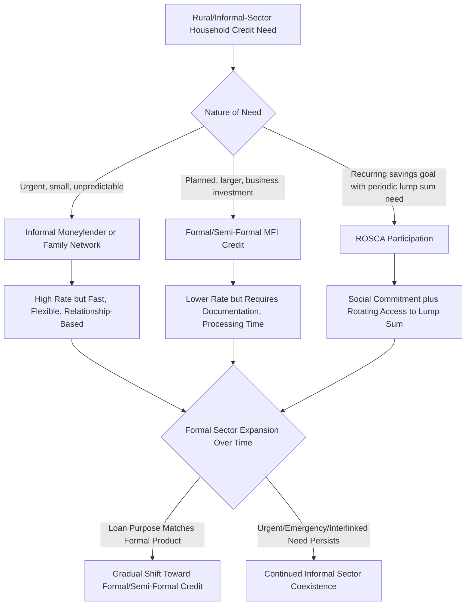

## Informal Credit and Moneylenders

### Conceptual Overview

Informal credit — lending arrangements operating outside formally regulated banking institutions — remains a dominant source of rural finance in many developing economies despite decades of formal financial sector expansion and the microfinance innovations discussed throughout this chapter. Informal lenders include professional village moneylenders, landlords extending credit to tenants, traders providing input credit, friends and family, and rotating savings and credit associations (ROSCAs). This item examines why informal credit persists, how it is priced and structured, and how it interacts with — rather than is simply displaced by — formal and semi-formal alternatives.

**Key Points**

- Informal lenders persist not merely as a symptom of formal market failure but often because they possess genuine informational and enforcement advantages over formal institutions, as introduced in the rural credit market information asymmetries item
- Interest rates charged by informal moneylenders are frequently far higher than formal-sector rates, a pattern requiring careful decomposition of monopoly power, genuine risk compensation, and fixed-cost effects
- Formal and informal credit markets typically coexist in **fragmented equilibrium** rather than one fully displacing the other, with different borrower segments and loan purposes sorting across the two sectors

### Categories of Informal Lending Arrangements

#### Professional Moneylenders

Individuals whose primary or significant economic activity is lending money, typically operating within a defined geographic area (village or neighborhood) where they have accumulated detailed knowledge of borrower reliability through repeated community interaction.

#### Interlinked Agrarian Credit

Landlords, input suppliers, or output traders extend credit as part of a broader multi-dimensional relationship with tenants or farmers, with repayment frequently tied to output sales, land rental terms, or future input purchases rather than structured as a standalone cash loan.

$$\text{Interlinked Contract: } (r_{credit}, w_{labor}, \rho_{land rent}, p_{output}) \text{ jointly determined}$$

Where the lender-landlord sets terms across multiple linked markets simultaneously, potentially extracting surplus through any combination of the linked prices rather than relying solely on the interest rate — complicating simple interest-rate-based measures of the "true cost" of interlinked credit.

#### Rotating Savings and Credit Associations (ROSCAs)

Groups of individuals contribute a fixed amount to a common pool at regular intervals, with the full pool disbursed to a different member each round (by rotation, lottery, or bidding) until all members have received the pool once.

$$\text{Pool}_t = n \cdot c \quad \text{disbursed to member } i \text{ in round } t$$

Where $n$ is group size and $c$ is the fixed periodic contribution. ROSCAs function simultaneously as a savings-commitment device (addressing the present-bias problem discussed in the microsavings item) and as an informal credit mechanism (members receiving the pool early effectively borrow from those receiving it later).

#### Family and Social Network Lending

Informal, often interest-free or below-market-rate lending among relatives and close social contacts, frequently embedded in broader reciprocal obligation networks (risk-sharing arrangements where lending today creates an implicit obligation for reciprocal support in future need states) rather than structured as discrete, price-based transactions.

### Informal Credit Market Structure Diagram (svg_diagram)

<svg xmlns="http://www.w3.org/2000/svg" viewBox="0 0 850 520">
<text x="425" y="30" font-size="19" font-weight="bold" text-anchor="middle" fill="#1a1a1a">Informal Credit Sources and Mechanisms (svg_diagram)</text>
<rect x="40" y="70" width="180" height="110" rx="10" fill="#fee2e2" stroke="#dc2626" stroke-width="2" />
<text x="130" y="98" font-size="13" font-weight="bold" text-anchor="middle" fill="#7f1d1d">Professional</text>
<text x="130" y="115" font-size="13" font-weight="bold" text-anchor="middle" fill="#7f1d1d">Moneylenders</text>
<text x="130" y="140" font-size="10" text-anchor="middle" fill="#7f1d1d">Local knowledge-based</text>
<text x="130" y="155" font-size="10" text-anchor="middle" fill="#7f1d1d">High, flexible rates</text>
<text x="130" y="170" font-size="10" text-anchor="middle" fill="#7f1d1d">Fast disbursement</text>
<rect x="250" y="70" width="180" height="110" rx="10" fill="#fef3c7" stroke="#d97706" stroke-width="2" />
<text x="340" y="98" font-size="13" font-weight="bold" text-anchor="middle" fill="#78350f">Interlinked</text>
<text x="340" y="115" font-size="13" font-weight="bold" text-anchor="middle" fill="#78350f">Agrarian Credit</text>
<text x="340" y="140" font-size="10" text-anchor="middle" fill="#78350f">Landlord/trader-tied</text>
<text x="340" y="155" font-size="10" text-anchor="middle" fill="#78350f">Repayment via output</text>
<text x="340" y="170" font-size="10" text-anchor="middle" fill="#78350f">Multi-market pricing</text>
<rect x="460" y="70" width="180" height="110" rx="10" fill="#dbeafe" stroke="#2563eb" stroke-width="2" />
<text x="550" y="98" font-size="13" font-weight="bold" text-anchor="middle" fill="#1e3a8a">ROSCAs</text>
<text x="550" y="140" font-size="10" text-anchor="middle" fill="#1e3a8a">Rotating pooled fund</text>
<text x="550" y="155" font-size="10" text-anchor="middle" fill="#1e3a8a">Commitment + credit hybrid</text>
<text x="550" y="170" font-size="10" text-anchor="middle" fill="#1e3a8a">Social enforcement</text>
<rect x="670" y="70" width="150" height="110" rx="10" fill="#dcfce7" stroke="#16a34a" stroke-width="2" />
<text x="745" y="98" font-size="12" font-weight="bold" text-anchor="middle" fill="#166534">Family/Social</text>
<text x="745" y="115" font-size="12" font-weight="bold" text-anchor="middle" fill="#166534">Network Lending</text>
<text x="745" y="140" font-size="10" text-anchor="middle" fill="#166534">Low/zero interest</text>
<text x="745" y="155" font-size="10" text-anchor="middle" fill="#166534">Reciprocal obligation</text>
<text x="745" y="170" font-size="10" text-anchor="middle" fill="#166534">Risk-sharing embedded</text>
<rect x="230" y="270" width="400" height="90" rx="10" fill="#ede9fe" stroke="#7c3aed" stroke-width="2.5" />
<text x="430" y="300" font-size="14" font-weight="bold" text-anchor="middle" fill="#4c1d95">Common Informational Advantage</text>
<text x="430" y="325" font-size="11" text-anchor="middle" fill="#4c1d95">Local knowledge of character, effort, and true income</text>
<text x="430" y="343" font-size="11" text-anchor="middle" fill="#4c1d95">at near-zero marginal information cost</text>
<line x1="130" y1="180" x2="330" y2="270" stroke="#666" stroke-width="1.5" stroke-dasharray="4,3" />
<line x1="340" y1="180" x2="380" y2="270" stroke="#666" stroke-width="1.5" stroke-dasharray="4,3" />
<line x1="550" y1="180" x2="470" y2="270" stroke="#666" stroke-width="1.5" stroke-dasharray="4,3" />
<line x1="745" y1="180" x2="530" y2="270" stroke="#666" stroke-width="1.5" stroke-dasharray="4,3" />
<rect x="230" y="410" width="400" height="80" rx="10" fill="#fee2e2" stroke="#dc2626" stroke-width="2" />
<text x="430" y="440" font-size="13" font-weight="bold" text-anchor="middle" fill="#7f1d1d">Persistent Coexistence with Formal Sector</text>
<text x="430" y="465" font-size="11" text-anchor="middle" fill="#7f1d1d">Fragmented equilibrium, not full displacement</text>
<line x1="430" y1="360" x2="430" y2="410" stroke="#333" stroke-width="2" />
</svg>

### Explaining High Informal Interest Rates

Informal moneylender interest rates are commonly documented to substantially exceed formal-sector rates, sometimes by very large margins. Several complementary (non-mutually-exclusive) theoretical explanations have been proposed:

#### 1. Local Monopoly Power

Villages or neighborhoods often have few active moneylenders, creating localized market power. A moneylender facing limited local competition can charge rates well above the competitive level without losing the entire customer base to alternative lenders, since switching to a formal institution or a lender in a different location carries its own transaction/travel/relationship-building costs.

$$r^{monopoly} > r^{competitive}$$

#### 2. Genuine Risk Compensation

Borrowers who rely on informal moneylenders are frequently those excluded from formal credit precisely because they are perceived (often correctly, from the formal lender's perspective) as higher default risk, given weak collateral and thin formal credit histories. High rates may partly reflect a genuine risk premium compensating for elevated default probability among this residual borrower pool — consistent with the adverse-selection-driven credit rationing framework established in the Stiglitz-Weiss model.

#### 3. Fixed Costs of Small-Scale Lending

Administering many small loans carries roughly fixed transaction costs per loan (assessment, disbursement, collection effort) regardless of loan size, meaning the effective annualized interest rate required to cover fixed costs is inversely related to loan size — small informal loans may carry high percentage rates simply to cover largely fixed per-loan servicing costs, a pattern also observed (though generally to a lesser degree given more efficient administrative processes) in formal microfinance interest rate structures.

$$r_{effective} = \frac{\text{Fixed Cost} + \text{Risk Premium} + \text{Opportunity Cost of Capital}}{\text{Loan Size}}$$

As loan size $L$ decreases, holding fixed cost constant, $r_{effective}$ rises mechanically — a structural explanation independent of monopoly power or discriminatory pricing.

#### 4. Limited Access to Wholesale Capital

Individual moneylenders typically fund their lending from their own capital or limited local sources, rather than accessing the broader wholesale funding markets available to formal financial institutions, implying a higher marginal cost of loanable funds that is passed through to borrowers.

[Inference] The relative contribution of these four mechanisms to observed informal interest rate levels varies substantially across empirical contexts and is difficult to disentangle without detailed micro-level data on lender cost structures, local market concentration, and borrower risk profiles; blanket claims attributing high informal rates primarily to "exploitation" versus primarily to "cost-reflective pricing" are both likely oversimplified without context-specific evidence.

### Segmented Credit Market Coexistence

Rather than formal credit fully displacing informal lenders as financial sector development proceeds, empirical evidence across many developing economies documents persistent **segmentation**, with different loan purposes and borrower types sorting systematically across formal and informal sources:

| Loan Characteristic | More Likely Formal Sector | More Likely Informal Sector |
| --- | --- | --- |
| Loan size | Larger, planned investment | Small, urgent/emergency needs |
| Purpose | Fixed business investment, housing | Consumption smoothing, emergency health/funeral costs |
| Speed required | Can tolerate processing delay | Immediate disbursement needed |
| Collateral available | Some verifiable collateral or credit history | None; relationship-based trust substitutes |
| Borrower formality | Registered business, some documentation | Undocumented, informal sector employment |
| Seasonality | Less time-sensitive | Highly time-sensitive (planting season inputs) |

[Inference] This segmentation pattern suggests formal and informal credit are often **complements serving distinct household needs** rather than pure substitutes competing for an identical loan-demand pool, meaning formal microfinance expansion may reduce but is unlikely to fully eliminate demand for informal credit's speed, flexibility, and relationship-based features, particularly for emergency and highly time-sensitive borrowing needs.

### Interlinkage and the Landlord-Moneylender Problem

The interlinked contract literature (Bardhan and others) formalizes why credit provision is frequently bundled with other economic relationships in agrarian settings — a pattern with direct implications for measuring true credit costs and for policy design:

$$U_{landlord-lender} = \max_{r, \rho, w} \left[ \text{Interest Income} + \text{Land Rent} - \text{Input Cost} \right] \quad \text{s.t. tenant participation constraint}$$

Because the landlord-lender can extract surplus through multiple linked channels (interest rate, land rent share, wage rate for labor, output purchase price), a policy intervention targeting only one dimension (e.g., an interest rate ceiling) may simply cause the lender to extract equivalent surplus through an adjustment in the other linked terms, leaving the tenant's overall welfare largely unchanged — an important caution against evaluating informal credit costs or designing regulatory interventions using the interest rate in isolation from the broader interlinked relationship.

[Inference] This interlinkage mechanism is frequently cited as an explanation for why simple interest rate caps or informal moneylender prohibition policies have historically shown limited effectiveness in developing-country contexts, and can sometimes worsen borrower welfare if the lender responds by withdrawing credit access entirely rather than adjusting linked terms, though the empirical magnitude of such displacement effects is context-dependent.

### Policy Responses to Informal Credit Market Dominance

#### 1. Formal Sector Expansion and Competition

Expanding formal and semi-formal (microfinance) credit access, as discussed extensively in preceding items, directly increases competitive pressure on informal moneylenders, potentially reducing their monopoly power and associated rate premiums where formal alternatives genuinely substitute for informal loan purposes.

#### 2. Interest Rate Ceilings (Usury Laws)

Legally capping maximum permissible interest rates is a long-standing policy response, but faces significant limitations given the fixed-cost and interlinkage mechanisms discussed above:

- Binding rate ceilings below the cost-covering rate for small, risky loans can drive formal and semi-formal lenders out of the small-loan segment entirely, potentially *reducing* credit access for the poorest, most costly-to-serve borrowers (a documented unintended consequence in several historical contexts)
- Ceilings may simply shift surplus extraction to other linked contract dimensions in interlinked arrangements, as discussed above, without genuinely improving borrower welfare

#### 3. Formalizing and Regulating Informal Lenders

Rather than prohibition, some policy approaches focus on bringing informal lenders into a lighter regulatory framework (registration, basic disclosure requirements, dispute resolution mechanisms) to improve transparency and borrower protection while preserving the informational and speed advantages that make informal credit valuable.

#### 4. Formalizing ROSCA-like Mechanisms

Recognizing the demonstrated demand for ROSCA-style pooled savings-and-credit mechanisms, some formal and semi-formal financial institutions have developed products explicitly modeled on or complementary to ROSCA structures, aiming to combine the social-commitment benefits of informal group savings with the security and scale advantages of formal institutional backing.

#### 5. Warehouse Receipts and Alternative Collateral Systems

As discussed in the rural credit information asymmetries item, formalizing agricultural output as verifiable, storable collateral can reduce farmers' reliance on interlinked trader/landlord credit specifically tied to output sale obligations, potentially weakening one channel of informal lender market power over agrarian borrowers.

### Informal-Formal Credit Interaction Framework

### Measurement Challenges

- **Informal loan data collection**: Household surveys often undercount or inconsistently measure informal borrowing given social desirability bias, imprecise recall of informal transaction terms, and respondents' potential reluctance to disclose informal debt relationships
- **True cost measurement in interlinked contracts**: As discussed above, the effective cost of interlinked informal credit cannot be captured by the stated interest rate alone, requiring more comprehensive multi-market data collection that is rarely available in standard household surveys
- **Distinguishing gift/reciprocal transfers from credit**: Family and social network "lending" often blurs the line between a discrete credit transaction and an ongoing reciprocal risk-sharing relationship without clearly defined repayment terms, complicating standard credit market analysis frameworks

### Conclusion

Informal credit and moneylenders persist as a structurally important, rather than merely residual, component of rural financial systems in developing economies, sustained by genuine informational and enforcement advantages — local knowledge, flexible interlinked contracting, and social-network-based enforcement — that formal institutions, including microfinance, have only partially replicated despite substantial expansion over recent decades. The observed segmentation between formal and informal credit use by loan purpose and urgency suggests these sources function more as complements addressing distinct household needs than as full substitutes in direct competition, implying that formal financial sector expansion is likely to reduce, but not eliminate, the role of informal credit, particularly for emergency, small-scale, and socially-embedded borrowing needs. Policy interventions such as interest rate ceilings that ignore the interlinked, multi-market nature of many informal credit relationships risk unintended consequences, reinforcing this chapter's broader lesson that credit market interventions must be designed with careful attention to the specific informational and structural mechanisms — rather than surface-level price indicators alone — that sustain any given credit market equilibrium.

**Related Topics**

- Information asymmetries in rural credit markets (foundational framework for informal lender advantages)
- Interlinked contracts and agrarian tenancy relationships
- Group lending and joint liability models (formal sector's social-collateral analog to ROSCAs)
- Digital financial inclusion (formal sector competitive response to informal credit)
- Usury law history and interest rate ceiling policy evaluation
- Rotating savings and credit associations (ROSCA) mechanism design and formalization
- Warehouse receipt systems and agricultural collateral innovation
- Microcredit versus microsavings (formal sector product design responding to informal sector functions)