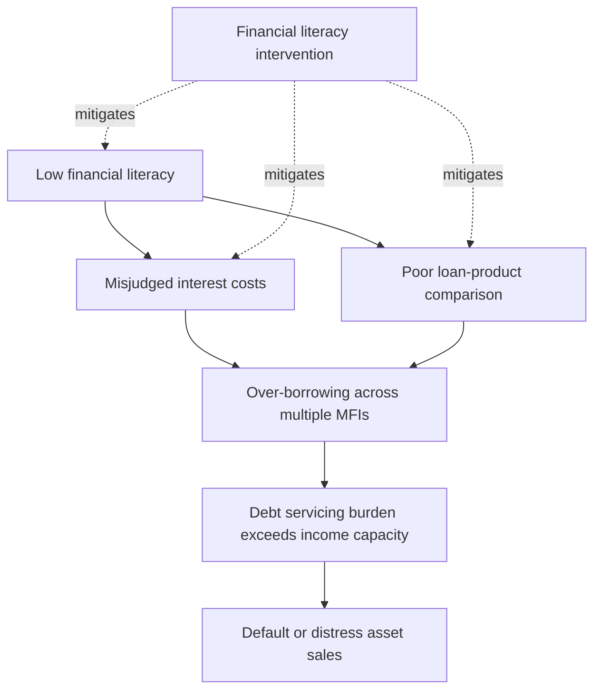
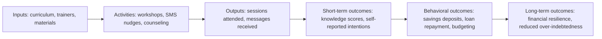

## Financial Literacy Interventions

### Definition and Scope

Financial literacy interventions are structured programs designed to improve individuals' knowledge, attitudes, and behaviors regarding financial decision-making, typically encompassing budgeting, saving, debt management, insurance, and investment concepts. In development economics, these interventions are studied primarily for their effects on the financial behaviors of low-income and often financially excluded populations in developing countries.

**Key Points**

- Financial literacy is generally decomposed into financial knowledge (numeracy, understanding of interest rates, inflation, risk diversification) and financial capability (the ability to act on that knowledge given behavioral, social, and structural constraints)
- Interventions range from classroom-style curricula to entertainment-education (edutainment), one-on-one counseling, and just-in-time messaging tied to specific transactions
- The field sits at the intersection of behavioral economics, education economics, and credit market research, since low financial literacy is hypothesized to contribute to over-indebtedness, under-saving, and vulnerability to predatory lending

### Theoretical Motivation

The rationale for these interventions draws on several strands of economic theory.

#### Human Capital Framing

Financial literacy can be modeled as a form of human capital that affects the returns to financial decisions. Under this view, an individual's welfare-maximizing choice over savings, borrowing, and insurance depends on a stock of financial knowledge $K$, such that improving $K$ shifts the individual's decision closer to the theoretically optimal path.

A simplified lifecycle consumption-savings problem illustrates the channel:

$$\max_{\{c_t\}} \sum_{t=0}^{T} \beta^t u(c_t) \quad \text{s.t.} \quad a_{t+1} = (1+r)a_t + y_t - c_t$$

Low financial literacy is hypothesized to distort the perceived value of $r$ (the interest rate) or the individual's understanding of compounding, leading to suboptimal $c_t$ and $a_t$ paths. Financial literacy interventions attempt to correct this distortion by improving the accuracy of the individual's mental model of $r$ and $\beta$ (their effective discount factor as applied to financial products).

#### Behavioral Economics Critique

An influential counter-current, associated with Bertrand, Mullainathan, and others working on scarcity and cognitive load, argues that poverty itself imposes a "bandwidth tax" that impairs decision-making independent of knowledge deficits. This suggests financial literacy training alone may be insufficient if it does not also address present bias, limited attention, or structural barriers (e.g., lack of formal ID, high transaction costs).

**Key Points**

- Two competing (not mutually exclusive) diagnoses: (1) a knowledge gap that training fixes, and (2) a behavioral/structural constraint that information alone does not fix
- This distinction motivates the design differences between "traditional" classroom literacy training and "just-in-time" or "nudge"-based interventions

### Typology of Interventions

| Type | Delivery Mechanism | Typical Duration | Example Content |
| --- | --- | --- | --- |
| Classroom-based training | In-person workshops, often via NGOs or MFIs | Multiple sessions over weeks | Budgeting, interest rate calculation, debt basics |
| Edutainment | Radio/TV soap operas, video content | Ongoing series | Financial concepts embedded in narrative plots |
| Individual counseling | One-on-one financial coaching | Single or repeated sessions | Personalized debt repayment plans |
| Just-in-time/rule-of-thumb messaging | SMS, point-of-sale prompts | Brief, transaction-linked | Simple heuristics (e.g., "save before you spend") |
| Curriculum-based school programs | Integrated into secondary/university curricula | Semester-long | Formal personal finance coursework |
| Digital/app-based nudges | Mobile banking app notifications | Ongoing, automated | Savings goal reminders, spending alerts |

### Landmark Studies and Evidence Base

#### Rule-of-Thumb vs. Standard Training

A widely cited study by Drexler, Fischer, and Schoar (2014) compared standard accounting-based financial training against simplified "rule-of-thumb" training among microentrepreneurs in the Dominican Republic. The rule-of-thumb approach, which taught simple heuristics rather than formal accounting principles, produced larger improvements in business practices and outcomes than the standard curriculum, suggesting that simplification and relevance to the target population's actual decision environment matter more than comprehensiveness.

#### Meta-Analytic Evidence

Fernandes, Lynch, and Netemeyer (2014) conducted a meta-analysis finding that financial education interventions explain only a small fraction of the variance in financial behaviors, and that effects decay rapidly over time — often within 20 months. This finding has been influential in shifting the field toward "just-in-time" interventions delivered close to the moment of financial decision-making, on the premise that decaying knowledge is less costly if the information is refreshed near the point of use.

**Key Points**

- Effect sizes in the literature are generally modest, and heterogeneous across contexts, populations, and intervention design
- Programs that are simplified, targeted to a specific behavior (e.g., loan repayment, savings), and delivered close to the decision point tend to outperform generic, comprehensive curricula
- [Inference] The decay pattern suggests financial literacy behaves more like a perishable skill requiring reinforcement than a permanently acquired capacity, though the underlying mechanism (forgetting vs. loss of salience/motivation) is not fully settled in the literature

### Interaction with Microfinance and Credit Markets

Financial literacy training is frequently bundled with microfinance loan disbursement, based on the hypothesis that borrower education can reduce default risk and over-indebtedness while improving loan utilization.

#### Bundled vs. Standalone Delivery

Research (e.g., Karlan and Valdivia, 2011, on FINCA Peru) has examined bundling business/financial training with group lending. Findings generally show modest but positive effects on business knowledge and practices, with more limited or context-dependent effects on loan repayment and business revenue.

#### Debt Literacy and Over-Indebtedness

A specific strand examines whether financial literacy reduces over-indebtedness in contexts of multiple borrowing ("double-dipping") across microfinance institutions. The theoretical concern is that a mix of information asymmetry, limited financial literacy, and aggressive MFI competition can push borrowers into unsustainable debt loads.

### Measurement of Financial Literacy

Standard measurement relies on survey-based indices, most prominently the "Big Three" questions developed by Lusardi and Mitchell, covering:

1. **Numeracy/interest compounding**: e.g., understanding how an amount grows under compound interest over time
2. **Inflation**: understanding the relationship between nominal returns and purchasing power
3. **Risk diversification**: understanding that spreading investment across assets reduces risk

**Example**

A typical interest compounding question:

"Suppose you had $100 in a savings account and the interest rate was 2% per year. After 5 years, how much would you have if you left the money to grow?"

Response options typically include "more than $102," "exactly $102," "less than $102," and "do not know," testing whether respondents grasp compounding versus simple interest.

**Key Points**

- The Big Three (and extensions like the Big Five, adding risk comprehension and mortgage-related items) are widely used across World Bank, OECD/INFE, and FinAccess-style surveys for cross-country comparability
- Measurement is subject to critique: literacy questions may conflate numeracy with financial-specific knowledge, and framing effects can influence response accuracy independent of true understanding
- [Unverified] Cross-country comparability of literacy scores can be affected by translation, question framing, and local financial product familiarity, though the extent of bias varies by study and is not uniformly quantified across contexts

### Design Considerations for Effective Interventions

#### Targeting and Timing

Evidence favors delivering content close to relevant financial decisions (e.g., loan origination, tax filing, enrollment in savings products) rather than generic curricula unconnected to an immediate action.

#### Simplification

Rule-of-thumb and heuristic-based content (e.g., "separate business and personal cash," "pay yourself first") tends to outperform technically comprehensive accounting-style instruction for low-literacy or low-numeracy populations, per the Drexler et al. findings.

#### Delivery Channel

Mobile-based and digital delivery has expanded reach and reduced marginal cost relative to in-person classroom training, though take-up and sustained engagement with digital nudges is itself a design challenge subject to attrition.

#### Complementary Bundling

Some evidence suggests financial literacy training combined with a savings or credit product (rather than delivered in isolation) yields stronger behavioral effects, since the training has an immediate application. This is contrasted with information-only approaches, which show weaker average effects in meta-analytic evidence.

### Evaluation Methodology

Rigorous evaluation of financial literacy interventions typically uses randomized controlled trials (RCTs), given concerns about selection into training programs (individuals who seek out financial education may differ systematically from those who do not).

#### Standard RCT Design

$$Y_{i} = \alpha + \beta T_i + \gamma X_i + \epsilon_i$$

Where $Y_i$ is a financial behavior/outcome (savings rate, loan default, budget adherence), $T_i$ is a treatment indicator for exposure to the intervention, $X_i$ is a vector of baseline covariates, and $\beta$ is the estimated treatment effect.

**Key Points**

- Common outcome variables: savings account balances, loan repayment rates, use of formal financial products, self-reported budgeting behavior, and (less commonly, due to measurement difficulty) welfare/consumption smoothing outcomes
- Attrition and social desirability bias in self-reported financial behavior are common threats to internal validity; administrative data (e.g., bank/MFI transaction records) is preferred over self-report when available
- Spillover effects (control group members learning from treated neighbors/family) can attenuate estimated treatment effects in village-randomized designs, motivating cluster-randomized designs in some studies

### Cost-Effectiveness Considerations

Given the generally modest effect sizes documented in meta-analyses, cost-effectiveness comparisons with alternative interventions (e.g., unconditional cash transfers, product simplification/default-option redesign, or commitment savings devices) are a recurring theme in the policy literature. [Inference] Because classroom-based training carries relatively high per-participant delivery costs relative to its measured effect sizes, digital and just-in-time approaches are increasingly favored in cost-effectiveness comparisons, though the underlying cost data varies considerably by program and country context and is not standardized across the literature.

### Critiques and Open Debates

- **Modest and decaying effects**: the meta-analytic evidence (Fernandes et al., 2014) remains a central reference point for skepticism about the standalone efficacy of financial education
- **Behavioral vs. informational constraints**: critics argue interventions should address present bias and self-control (e.g., via commitment devices) rather than assuming a pure knowledge deficit
- **External validity**: effects estimated in one country/context (e.g., microfinance clients in Peru) may not generalize to different financial systems, literacy baselines, or product markets
- **Gender-differentiated effects**: several studies find heterogeneous effects by gender, with financial literacy training sometimes showing larger effects on women's financial decision-making autonomy within households, though findings are not uniform across all study contexts

### Illustrative Program Logic Model

**Next Steps**

- Rule-of-thumb vs. formal financial education design (Drexler, Fischer, Schoar framework)
- Microfinance group lending and joint liability mechanisms
- Behavioral economics of poverty (scarcity, bandwidth, cognitive load)
- Commitment savings devices and default-option/nudge design
- Over-indebtedness and multiple borrowing in microfinance markets
- Digital financial services and mobile money adoption
- Measurement of financial capability (Big Three/Big Five indices, OECD/INFE surveys)
- Randomized controlled trial design in development economics
- Consumer protection regulation in microfinance and credit markets