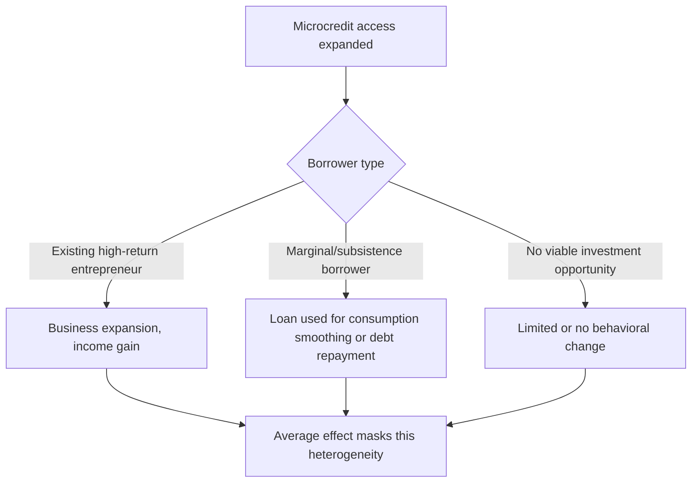
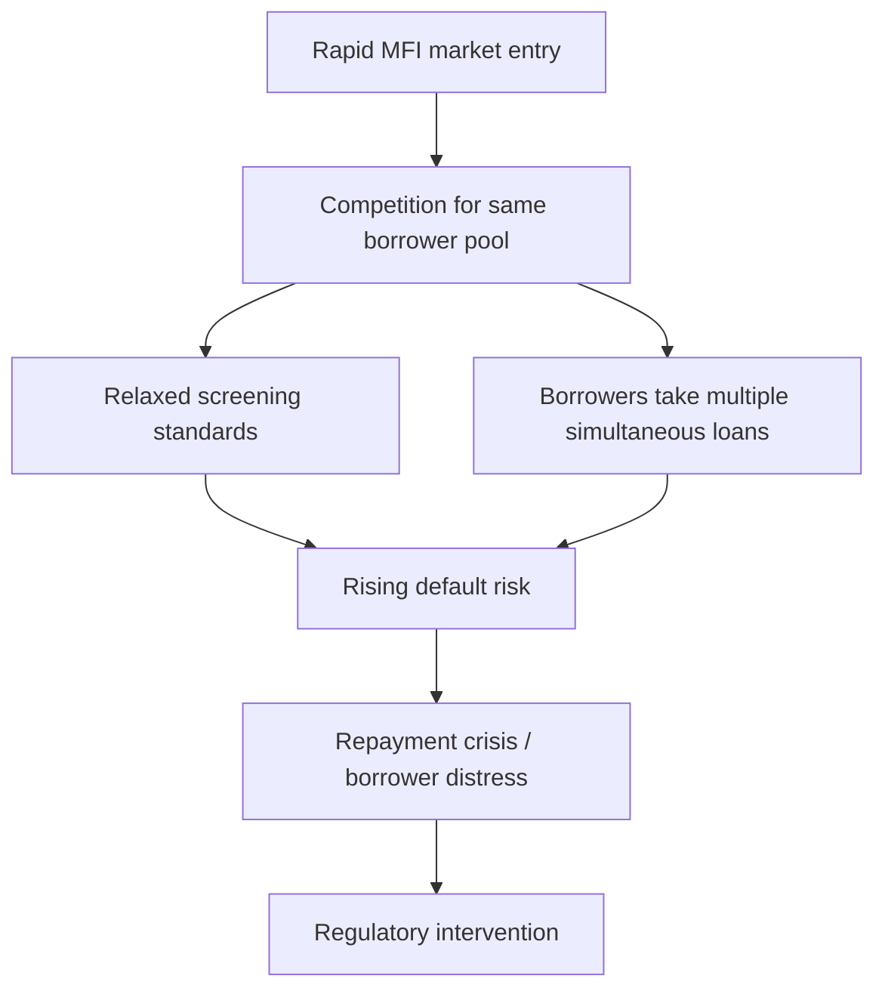

## Critiques and Limits of Microfinance

### Overview

Microfinance emerged in the 1970s–1980s, popularized by institutions such as Grameen Bank, as a poverty-alleviation tool premised on the idea that access to small loans could enable poor households and micro-entrepreneurs to invest in income-generating activities, smooth consumption, and escape credit rationing imposed by formal banks. Since the 2000s, a substantial body of empirical and theoretical work has challenged the scale, mechanism, and even the direction of microfinance's welfare effects, giving rise to a distinct "critiques of microfinance" literature within development economics.

**Key Points**

- Early enthusiasm (1990s–2000s) framed microfinance as a near-universal poverty-reduction tool, culminating in the 2006 Nobel Peace Prize to Muhammad Yunus and Grameen Bank
- Rigorous RCT evidence from roughly 2009 onward substantially tempered these claims, finding modest, heterogeneous, or null average effects on income and consumption
- Critiques operate at multiple levels: empirical (does it work?), theoretical (why might it not work as modeled?), and normative/political-economy (who benefits, and at what cost?)

### The "Microfinance Promise" and Its Theoretical Basis

The original case for microfinance rested on a specific diagnosis of poverty: that poor households and entrepreneurs face **credit rationing** due to lack of collateral, and that this rationing (not lack of ability or opportunity) is a binding constraint preventing profitable investment.

The canonical model treats a microentrepreneur as facing a production function $f(k)$ with returns to capital $k$, where credit constraints mean the household's chosen capital stock $k^*$ is below the unconstrained optimum $k^{**}$:

$$k^* < k^{**} \quad \text{where} \quad f'(k^{**}) = r$$

Microcredit was theorized to relax this constraint by providing capital at $k^*$, allowing convergence toward $k^{**}$ and raising marginal returns. **Joint liability lending** (group lending with peer monitoring) was the key institutional innovation addressing information asymmetry and enforcement, substituting social collateral for physical collateral.

**Key Points**

- The model implicitly assumes uniformly high, unmet demand for capital among the poor, and that the marginal return to capital $f'(k)$ is high and diminishes smoothly
- This assumption underlies claims that microcredit access alone (without complementary inputs like skills, market access, or risk management tools) would generate significant income gains

### The RCT Evidence Base: The "Six Studies"

The most influential empirical rebuttal comes from a coordinated set of randomized evaluations of microcredit expansion, published together in a special issue of the *American Economic Journal: Applied Economics* (2015), covering Bosnia and Herzegovina, Ethiopia, India (Hyderabad), Mexico, Mongolia, and Morocco.

#### Aggregate Findings

Across these studies, the consistent pattern was **modest or null average effects on household income, consumption, and broader measures of social welfare (education, health, women's empowerment)**, despite generally positive effects on borrowing, business investment, and self-employment activity. Where positive effects appeared, they tended to be concentrated among a subset of borrowers (often those with pre-existing businesses or higher baseline entrepreneurial aptitude) rather than the average recipient.

| Study Site | Business Investment | Income/Consumption | Broader Welfare |
| --- | --- | --- | --- |
| Hyderabad, India (Banerjee et al.) | Increased | No significant average effect | No significant average effect |
| Bosnia and Herzegovina | Increased | No significant average effect | Mixed |
| Mexico (Compartamos) | Modest increase | No significant average effect | No significant average effect |
| Morocco | Increased for existing businesses | No significant average effect for new entrants | No significant average effect |
| Mongolia | Increased | Mixed by loan type | Mixed |
| Ethiopia | Limited take-up | No significant average effect | No significant average effect |

[Inference] The consistency of "increased investment/self-employment but flat consumption or income" across such varied contexts suggests a structural feature of microcredit's mechanism (e.g., binding non-credit constraints) rather than a set of independent contextual failures, though the studies themselves generally stop short of asserting a single unified causal explanation.

#### Interpretation: Heterogeneous Treatment Effects

A key finding across these and related studies (e.g., work by Banerjee, Duflo, and coauthors) is that average treatment effects mask substantial heterogeneity: a small subset of borrowers with high underlying entrepreneurial talent or existing businesses capture most of the gains, while the majority experience little change or use loans for consumption smoothing rather than investment.

### Core Theoretical Critiques

#### 1. Demand-Side Limits: Not Everyone Is a Latent Entrepreneur

A central critique challenges the assumption that most poor households have high-return investment opportunities merely awaiting capital. In practice, take-up rates for microcredit are often lower than anticipated, and a substantial share of borrowers appear to lack scalable business opportunities, instead using credit for smoothing, education expenses, or emergencies.

#### 2. Diminishing and Heterogeneous Returns to Capital

Related work on returns to capital among microenterprises (e.g., de Mel, McKenzie, and Woodruff's work on capital grants in Sri Lanka) finds that returns to capital are highly heterogeneous and, for a meaningful share of enterprises, low or statistically indistinguishable from zero — undermining the assumption of uniformly high $f'(k)$.

#### 3. Debt Overhang and Over-Indebtedness

Because microcredit is debt (not equity or a grant), poor investment outcomes still carry repayment obligations. This has generated concern about **over-indebtedness**, particularly in contexts of MFI market saturation and "double-dipping" (borrowing simultaneously from multiple MFIs), most visibly in the 2010 Andhra Pradesh microfinance crisis in India, where aggressive competition, high effective interest rates, and coercive collection practices were linked to borrower distress and, controversially, a cluster of borrower suicides that triggered state-level regulatory intervention.

#### 4. Interest Rate Levels and Cost Structures

Microfinance interest rates are structurally higher than conventional bank rates due to the high transaction cost of servicing small, geographically dispersed loans. Critics argue that effective annual percentage rates (APRs), which can range widely (often cited in the 20–100%+ range depending on institution and country, reflecting operating cost structures rather than pure risk premia) can erode the net benefit of borrowing, particularly for low-return uses.

**Key Points**

- High interest rates are, in part, a mechanical consequence of the fixed administrative cost of processing small loans spread over a small principal — a cost structure critique distinct from claims of exploitative intent
- [Unverified] The extent to which specific MFIs' rates reflect legitimate cost recovery versus rent extraction is contested and varies by institution, ownership structure (nonprofit vs. for-profit), and regulatory environment, and is not resolved by a single universally applicable finding

#### 5. Joint Liability's Double-Edged Nature

While joint liability was designed to solve adverse selection and moral hazard, it also imposes social costs: peer pressure to repay can extend into social sanctioning, and one member's default can impose repayment burdens or social costs on other group members. This has driven a shift among several MFIs toward individual liability lending, though the change involves trade-offs in monitoring costs and interest rate pass-through.

### The Compartamos Controversy: For-Profit Microfinance

Compartamos Banco (Mexico) became a flashpoint in the critique literature after its 2007 IPO, which generated substantial returns for early investors while the bank continued charging borrowers relatively high interest rates. This case crystallized a normative debate: whether microfinance should be structured as a **poverty-alleviation mission** (nonprofit, subsidized) or a **commercially sustainable financial service** (for-profit, market-rate), and whether the two are compatible.

**Key Points**

- The "institutionist" view (associated with figures like Elisabeth Rhyne) argues commercial sustainability is necessary for scale and continuity of service
- The "welfarist" view argues commercialization risks mission drift — prioritizing loan volume and profitability over depth of poverty outreach
- [Speculation] Some critics have characterized aggressive commercial microfinance expansion as bearing structural similarities to subprime lending dynamics, though this framing remains a contested analogy rather than an empirically settled equivalence

### Mission Drift

**Mission drift** refers to the empirical tendency of MFIs, particularly as they scale or commercialize, to shift toward wealthier clients and larger loan sizes, moving away from the poorest segments of the population that were the original target population. This is theorized to arise from the cost structure of lending: serving very poor, low-loan-size clients is less profitable per unit of administrative cost than serving somewhat better-off clients with larger loan demands.

$$\text{Average Loan Size Growth Rate} > \text{Client Poverty Depth Growth Rate}$$

is used informally in the sector as an indicator of potential mission drift, though no single universally standardized quantitative threshold exists across the literature.

### Gender Dimensions and Critiques

Microfinance has been heavily targeted at women, based on evidence that female borrowers exhibit higher repayment rates and hypotheses that credit access increases women's bargaining power within households. However, this framing has drawn its own critiques:

- **Loan capture**: evidence in some contexts that loans nominally disbursed to women are controlled or redirected by male household members, limiting the intended empowerment channel
- **Added burden**: critics argue that targeting women adds financial and social obligations (loan repayment, group meeting attendance) without guaranteed corresponding gains in autonomy or welfare
- **Heterogeneous empowerment effects**: empirical findings on women's empowerment outcomes are mixed across contexts, with some studies finding positive effects on decision-making participation and others finding no significant change

### Market Saturation and Systemic Risk

As microfinance has scaled, some markets (e.g., Andhra Pradesh pre-2010, parts of Bosnia pre-2008 crisis, and Nicaragua's "No Pago" movement) have experienced **saturation dynamics**: multiple MFIs competing for the same borrower pool, leading to over-lending, deteriorating credit assessment discipline, and eventual repayment crises. This has motivated calls for **credit bureau infrastructure** and cross-MFI information sharing to prevent multiple, uncoordinated borrowing.

### Regulatory and Consumer Protection Responses

In response to documented harms, several jurisdictions have introduced regulatory frameworks, including interest rate caps or disclosure requirements, mandatory credit bureau reporting, restrictions on coercive collection practices, and licensing/capital adequacy requirements for MFIs transitioning to deposit-taking institutions. [Inference] These regulatory responses reflect a broader shift in the field from viewing microfinance purely as a development tool toward treating it as a financial service subject to conventional consumer protection and prudential regulation, though the specific regulatory architecture varies considerably by country.

### Reassessment: From "Miracle" to "One Tool Among Many"

The current mainstream position in development economics (post-2015 RCT evidence) treats microcredit not as a standalone poverty solution but as one input among several needed for microenterprise growth — alongside business training, savings products, insurance, and, in some cases, larger capital grants for higher-return entrepreneurs. This has driven diversification of the "microfinance" sector into adjacent product lines:

| Alternative/Complementary Tool | Rationale |
| --- | --- |
| Microsavings | Addresses savings constraints distinct from credit constraints |
| Microinsurance | Addresses risk exposure that credit alone cannot smooth |
| Cash transfers (conditional/unconditional) | Bypasses debt obligation; tests whether liquidity alone suffices |
| Graduation programs (asset transfer + training + coaching) | Targets ultra-poor populations for whom credit is not appropriate |
| Digital credit/mobile money-linked lending | Reduces transaction costs; raises new data privacy/over-indebtedness concerns |

**Key Points**

- The "graduation approach" (pioneered by BRAC) explicitly targets those considered too poor or risk-averse for standard microcredit, using asset grants rather than loans
- This diversification reflects an implicit acceptance of the core critique: that credit access alone does not address the full set of constraints facing poor households

### Illustrative Effect-Size Comparison (Stylized)

svg_diagram

<svg xmlns="http://www.w3.org/2000/svg" viewBox="0 0 700 380">
<text x="350" y="30" text-anchor="middle" font-size="18" font-weight="bold" fill="#1a1a1a">Stylized Distribution of Household Income Effects (svg_diagram)</text>
<line x1="80" y1="320" x2="620" y2="320" stroke="#333" stroke-width="2" />
<line x1="80" y1="320" x2="80" y2="60" stroke="#333" stroke-width="2" />
<text x="350" y="360" text-anchor="middle" font-size="13" fill="#333">Change in Household Income (relative to control)</text>
<text x="35" y="190" text-anchor="middle" font-size="13" fill="#333" transform="rotate(-90 35 190)">Number of Households</text>
<path d="M 100 315 Q 200 300 300 200 Q 400 100 500 260 Q 560 300 600 315" fill="none" stroke="#2563eb" stroke-width="3" />
<line x1="350" y1="320" x2="350" y2="60" stroke="#dc2626" stroke-width="2" stroke-dasharray="6,4" />
<text x="355" y="75" font-size="12" fill="#dc2626">Zero effect line</text>
<text x="470" y="150" font-size="12" fill="#1a1a1a">Small high-return</text>
<text x="470" y="165" font-size="12" fill="#1a1a1a">subgroup</text>
<text x="150" y="270" font-size="12" fill="#1a1a1a">Majority: minimal</text>
<text x="150" y="285" font-size="12" fill="#1a1a1a">change</text>
</svg>

**Next Steps**

- Joint liability vs. individual liability lending mechanisms
- The Andhra Pradesh microfinance crisis and its regulatory aftermath
- Returns to capital in microenterprises (de Mel, McKenzie, Woodruff)
- Graduation approach and ultra-poor targeting (BRAC model)
- Savings-led microfinance and commitment savings products
- Digital credit, mobile money, and data-driven lending risks
- Consumer protection regulation in credit markets
- Women's empowerment and intrahousehold bargaining models
- Mission drift and MFI commercialization/for-profit transitions