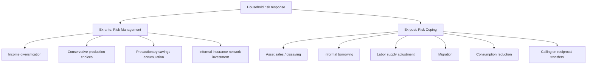
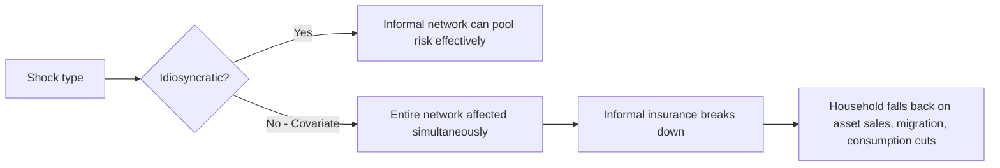

## Risk-Coping Strategies of Poor Households

### Definition and Conceptual Framing

Risk-coping strategies are the ex-ante and ex-post mechanisms poor households use to manage exposure to income and consumption volatility in the frequent absence of formal insurance markets, credit access, or social safety nets. This topic sits at the core of household risk management in development economics, distinguishing between **risk management** (actions taken before a shock occurs, to reduce exposure) and **risk coping** (actions taken after a shock occurs, to absorb its impact).

**Key Points**

- The foundational puzzle: formal insurance and credit markets are frequently missing, incomplete, or inaccessible for poor rural households, particularly in developing-country agrarian contexts
- Households therefore rely on informal, often costly, substitutes to smooth consumption despite volatile income
- The distinction between **consumption smoothing** (protecting consumption levels) and **income smoothing** (reducing income variance itself, often at a cost to expected returns) is central to the literature

### Theoretical Foundation: Consumption Smoothing Under Market Incompleteness

The standard benchmark is the **permanent income/life-cycle hypothesis** extended to a stochastic environment, where a fully insured household would smooth consumption entirely, leaving consumption uncorrelated with idiosyncratic income shocks:

$$c_{it} = c_t^{agg} + \varepsilon_{it}, \quad \text{Cov}(c_{it}, y_{it} - \bar{y}_t) = 0$$

Under **full risk-sharing** (Townsend, 1994), household consumption should move only with aggregate shocks, not idiosyncratic ones, because a complete set of contingent claims (formal or informal) fully insures idiosyncratic risk. Empirical tests of full insurance regress individual consumption growth on individual income growth, controlling for village/time aggregate consumption:

$$\Delta c_{it} = \alpha + \beta \Delta y_{it} + \gamma \Delta \bar{c}_{vt} + \epsilon_{it}$$

A finding of $\beta > 0$ (excess sensitivity of consumption to own income) is interpreted as evidence against full insurance — a result found robustly across most empirical settings, motivating the study of the partial, informal mechanisms households use instead.

**Key Points**

- Townsend's (1994) study of Indian ICRISAT villages is the canonical reference testing (and generally rejecting, though not uniformly) full risk-sharing at the village level
- Rejection of full insurance does not mean zero informal insurance — most studies find partial risk-sharing, i.e., $\beta$ significantly greater than zero but less than the value implied by no insurance at all

### Typology: Ex-Ante (Risk Management) vs. Ex-Post (Risk Coping)

### Ex-Ante Strategies (Risk Management)

#### Income and Crop Diversification

Rural households, especially in agrarian settings, diversify income sources (multiple crops, off-farm labor, non-farm enterprises) to reduce the variance of aggregate household income, even when diversification implies foregoing higher expected-return but riskier options.

**Example**

A farming household might plant a portfolio of drought-resistant low-yield crops alongside higher-yield water-dependent crops rather than specializing fully, sacrificing expected income for reduced variance — a behavior consistent with risk-averse portfolio choice under incomplete insurance.

#### Conservative Production and Technology Choices

A well-documented pattern (e.g., work by Rosenzweig and Binswanger, and later Karlan et al. on agricultural risk) is that uninsured risk causes farmers to under-invest in higher-return but riskier technologies (improved seed varieties, fertilizer, irrigation), even when expected returns are substantially higher. This is a central explanation for persistently low agricultural productivity in risk-exposed environments.

$$E[\pi_{risky}] > E[\pi_{safe}] \quad \text{yet} \quad \text{Var}(\pi_{risky}) \text{ deters adoption under risk aversion}$$

**Key Points**

- This "ex-ante cost of risk" is distinct from the ex-post cost of an actual shock — the mere presence of uninsured risk lowers investment and income even absent a realized shock
- Rosenzweig and Binswanger (1993) found that wealthier (better-insured) farmers in India held riskier, higher-return production portfolios than poorer farmers, consistent with wealth-dependent risk aversion under incomplete markets

#### Precautionary Savings

Households accumulate buffer stock savings (cash, grain stores, livestock) specifically to draw down during shocks, a behavior modeled formally in buffer-stock savings theory (Deaton, 1991; Carroll). This differs from consumption-smoothing savings under certainty because the target buffer level responds to the perceived variance of income risk.

#### Livestock as a Savings/Insurance Asset

Livestock (particularly small ruminants) function as a liquid, semi-divisible store of value that can be sold incrementally in response to shocks, documented extensively in pastoralist and agro-pastoralist contexts (e.g., Fafchamps, Udry, and Czukas's work on livestock as insurance in Burkina Faso).

#### Informal Risk-Sharing Network Formation

Households invest in social relationships (gift-giving, attendance at ceremonies, reciprocal labor exchange) partly as an investment in future access to informal insurance, a mechanism studied under **relational/reciprocity-based insurance** and formalized in models of limited commitment risk-sharing (Coate and Ravallion, 1993; Ligon, Thomas, and Worrall, 2002).

### Ex-Post Strategies (Risk Coping)

#### Asset Sales and Dissaving

When a shock hits, households often sell productive or non-productive assets (livestock, land, jewelry, tools) to smooth consumption. This strategy carries a well-documented cost: **distress sales** often occur when many households in the same area are shocked simultaneously (e.g., a regional drought), depressing local asset prices precisely when households most need liquidity — a form of **covariate risk** that undermines this coping mechanism's effectiveness.

$$P_{asset}^{shock} < P_{asset}^{normal} \quad \text{(fire-sale effect under covariate shocks)}$$

#### Informal Borrowing

Households borrow from relatives, neighbors, local moneylenders, or rotating savings and credit associations (ROSCAs) to bridge consumption gaps. Informal credit is frequently interest-free or low-interest among kin networks (reflecting reciprocal, relationship-based lending) but can carry high effective rates from commercial moneylenders.

#### Labor Supply Adjustments

Households increase labor supply (additional household members entering the labor force, extra hours, migration for wage labor) in response to shocks — a mechanism studied extensively in the added-worker-effect literature applied to developing-country contexts.

#### Migration

Both short-term/seasonal and longer-term migration serve as risk-coping and risk-diversification mechanisms, particularly where migrant remittances are imperfectly correlated with home-village income shocks (e.g., Rosenzweig and Stark's classic study of marriage-based migration as risk diversification in India, and Munshi's work on migrant networks).

#### Reduction in Consumption (Including Nutritionally Damaging Cuts)

When other coping mechanisms are exhausted, households reduce consumption directly, sometimes including calorie intake or reallocating consumption within the household (with documented evidence of gender- or age-differentiated impacts, e.g., reduced spending on girls' nutrition or education during shocks in some contexts).

#### Child Labor and Human Capital Disinvestment

A well-documented and concerning coping mechanism is the withdrawal of children from school or increased child labor during shocks, representing a potentially irreversible cost since human capital accumulation is time-sensitive (Jacoby and Skoufias's work on seasonality and schooling in India is a key reference).

**Key Points**

- These "distress" coping strategies are often described in the literature as generating **poverty traps**: the coping mechanism itself (asset depletion, human capital loss) undermines future income-generating capacity, making the household more vulnerable to the next shock
- This motivates policy interest in ex-ante safety nets (e.g., index insurance, cash transfer programs) that intervene before households resort to these costlier strategies

### Informal Risk-Sharing Networks: Mechanism and Limits

Informal insurance operates largely through **reciprocal, relationship-based transfers** rather than formal contracts, typically sustained by repeated interaction, social sanction for defection, and kinship/community ties.

#### Limited Commitment Models

Since informal insurance arrangements are not legally enforceable, they are modeled as **self-enforcing** — sustained only as long as the discounted value of continued participation exceeds the value of defecting (walking away from future reciprocal obligations):

$$V_i^{participate} \geq V_i^{defect}$$

This generates the prediction that risk-sharing is **partial** (not full insurance), constrained by the enforceability of the implicit contract, and can break down disproportionately for wealthier households (whose defection temptation is stronger) — a pattern documented by Ligon, Thomas, and Worrall (2002).

#### Covariate vs. Idiosyncratic Risk

Informal networks are structurally better at insuring **idiosyncratic** shocks (illness, individual crop failure, death) than **covariate** shocks (drought, flood, regional price crashes) that hit the entire network simultaneously, since risk pooling requires some members to be unaffected and able to transfer resources to affected members.

### Empirical Testing of Risk-Coping Effectiveness

#### Full Insurance Rejection Tests

As noted above, most empirical tests reject full risk-sharing but find meaningful partial insurance, with the degree of insurance varying by shock type, network structure, and wealth.

#### Consumption Smoothing Against Specific Shock Types

Studies (e.g., Kazianga and Udry on Burkina Faso drought; Townsend on Thai and Indian villages) generally find that households are better able to smooth consumption against idiosyncratic shocks (illness, individual crop loss) than against large covariate shocks (regional drought), consistent with the limited-commitment/covariate-risk framework above.

### Policy Implications and Complementary Formal Interventions

The identification of costly and imperfect informal coping mechanisms has motivated a substantial policy and research agenda around formal risk-management tools designed to complement or substitute for informal coping:

| Formal Tool | Target Gap in Informal Coping |
| --- | --- |
| Index-based (weather/rainfall) insurance | Covariate risk that informal networks cannot pool |
| Public works/safety net programs (e.g., NREGA, PSNP) | Buffer against seasonal income shocks without asset depletion |
| Cash transfer programs (conditional/unconditional) | Direct consumption smoothing without debt or asset loss |
| Formal savings products (commitment savings) | Address self-control/behavioral limits on precautionary savings |
| Contingent credit lines | Reduce reliance on distress asset sales |

**Key Points**

- Index insurance was specifically designed to address the covariate-risk gap in informal insurance (see companion topic on index-based agricultural insurance), though it faces its own well-documented adoption and basis-risk challenges
- [Inference] The persistence of costly informal coping mechanisms despite decades of formal-sector intervention attempts suggests structural barriers (trust, financial literacy, liquidity constraints, and basis risk in formal products) remain only partially resolved, though the relative importance of each barrier is context-specific and debated in the literature

### Summary Comparison: Strategy Effectiveness and Costs

| Strategy | Protects Against | Covariate Risk Coverage | Long-Run Cost |
| --- | --- | --- | --- |
| Crop diversification | Idiosyncratic + partial covariate | Low-moderate | Foregone expected income |
| Precautionary savings | Idiosyncratic + moderate covariate | Moderate | Foregone investment/consumption |
| Livestock sales | Idiosyncratic + covariate (with fire-sale risk) | Moderate (degraded under covariate shocks) | Asset depletion, price risk |
| Informal borrowing | Idiosyncratic primarily | Low | Debt burden, network reciprocity obligations |
| Migration | Idiosyncratic + covariate (if destination uncorrelated) | High (if well-diversified) | Separation costs, migration risk |
| Consumption/schooling cuts | Last-resort buffer | N/A (symptom, not risk-pooling) | Human capital loss, potentially irreversible |

**Next Steps**

- Index-based (weather) agricultural insurance and basis risk
- Full risk-sharing tests and limited commitment models (Coate-Ravallion, Ligon-Thomas-Worrall)
- Poverty traps and asset-based welfare dynamics
- Conditional and unconditional cash transfer programs
- Rotating savings and credit associations (ROSCAs)
- Migration as a risk-diversification strategy
- Buffer-stock savings theory (Deaton, Carroll)
- Public works and workfare safety nets (e.g., NREGA)
- Intrahousehold resource allocation under shocks