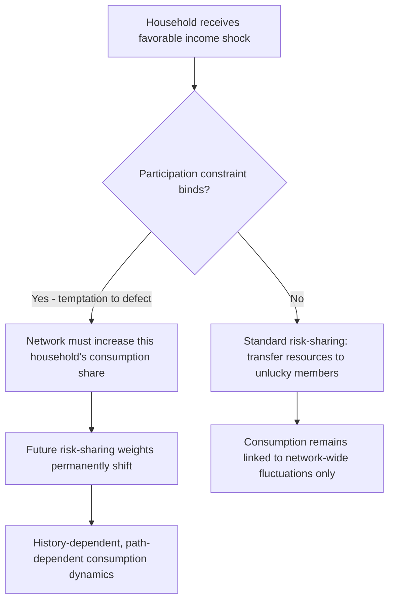

## Informal Insurance and Risk-Sharing Networks

### Definition and Conceptual Framing

Informal insurance refers to non-contractual, socially embedded mechanisms through which households pool and share idiosyncratic risk in the absence of formal insurance markets — primarily through kinship networks, village communities, and reciprocal gift/transfer relationships. This topic forms the theoretical core of household risk-sharing in development economics, distinct from (but overlapping with) the broader set of risk-coping strategies covered elsewhere in this chapter.

**Key Points**

- Informal insurance operates through **transfers** (gifts, loans, in-kind support) exchanged among network members, sustained by social norms, reciprocity, and repeated interaction rather than enforceable contracts
- The central theoretical question is how much risk-sharing such networks can sustain given the absence of external enforcement, and why observed risk-sharing is consistently **partial** rather than full
- The literature spans testing for full risk-sharing, modeling constrained/limited-commitment risk-sharing, and characterizing network structure's effect on insurance capacity

### The Full Risk-Sharing Benchmark

The theoretical starting point is the **complete markets/full insurance** benchmark, in which a social planner allocates consumption across households to maximize a weighted sum of utilities subject only to an aggregate resource constraint:

$$\max \sum_i \lambda_i u_i(c_{it}) \quad \text{s.t.} \quad \sum_i c_{it} \leq \sum_i y_{it}$$

The first-order conditions imply that each household's marginal utility of consumption moves in fixed proportion to every other household's marginal utility, and — critically — **individual consumption should not respond to individual income shocks**, only to aggregate (village-level) shocks:

$$\frac{u_i'(c_{it})}{u_j'(c_{jt})} = \frac{\lambda_j}{\lambda_i} \quad \text{(constant across time and states)}$$

This yields the standard **full insurance test** (Townsend, 1994; Mace, 1991; Cochrane, 1991):

$$\Delta \ln c_{it} = \alpha + \beta \Delta \ln y_{it} + \gamma \Delta \ln \bar{c}_{vt} + \epsilon_{it}$$

Under full insurance, $\beta = 0$: idiosyncratic income growth should not predict idiosyncratic consumption growth once aggregate (village) consumption is controlled for.

**Key Points**

- Townsend's (1994) study of ICRISAT villages in semi-arid India is the canonical empirical application, generally finding **rejection of full insurance** but substantial partial risk-sharing
- Subsequent studies across many developing-country contexts replicate this pattern: $\beta$ is significantly positive but well below the value implied by zero informal insurance, indicating meaningful but incomplete risk pooling
- [Inference] The robustness of partial (rather than zero or full) risk-sharing findings across highly varied settings suggests informal insurance is a structurally stable but fundamentally limited institution, rather than a context-specific anomaly

### Why Full Insurance Fails: Limited Commitment

Because informal insurance arrangements are not legally enforceable, the dominant theoretical explanation for partial risk-sharing is the **limited commitment (self-enforcing constraint)** framework, developed by Coate and Ravallion (1993) and formalized dynamically by Kocherlakota (1996) and Ligon, Thomas, and Worrall (2002).

#### Participation Constraints

Each household must find it individually rational to remain in the risk-sharing arrangement in every period and state of the world. Defection triggers reversion to autarky (or some punishment state), so participation requires:

$$V_i^{\text{stay in network}}(s_t) \geq V_i^{\text{autarky}}(y_{it})$$

Where $V_i^{\text{stay}}$ is the discounted expected utility from continued participation in the risk-sharing arrangement, and $V_i^{\text{autarky}}$ is the value of defecting and relying solely on own (uninsured) income thereafter.

#### Implications for Risk-Sharing Dynamics

This framework generates several distinctive, empirically testable predictions that differ sharply from the full-insurance benchmark:

- **History dependence**: unlike full insurance (where only the current state matters), the limited-commitment model implies consumption allocations depend on the history of past shocks, since binding participation constraints permanently shift the implicit risk-sharing "weights" $\lambda_i$
- **Amplified response to large shocks**: a household experiencing a very favorable income shock may be tempted to defect, forcing the arrangement to grant it a larger consumption share to keep it participating — meaning consumption still responds to idiosyncratic income shocks, but asymmetrically and only when constraints bind
- **Wealthier or higher-outside-option households are harder to insure**: a household with a strong outside option (e.g., access to alternative credit, higher own income) has a higher defection temptation, so networks must front-load its consumption share to retain it — implying such members are effectively harder to insure at the margin

### Network Structure and Insurance Capacity

A distinct strand of the literature examines how the **structure** of social networks (who is linked to whom, network density, clustering) affects the scope and efficiency of informal risk-sharing, moving beyond the assumption of a single village-wide risk pool.

#### Key Structural Findings

- **Network density and reach**: households with more numerous and more diverse network connections (across wealth levels, occupations, geography) tend to achieve better consumption smoothing, since a more diversified network reduces the correlation of shocks across linked households
- **Segmented risk-sharing**: empirical work (e.g., Angelucci, De Giorgi, and Rasul on Mexican extended families; Fafchamps and Lund on Philippine networks) finds that risk-sharing often occurs within sub-groups (extended family, caste, or friendship clusters) rather than uniformly across an entire village, meaning the village-level full-insurance test may mask both better-than-village-level insurance within tight sub-networks and worse-than-village-level insurance across them
- **Geographic/kinship-based network formation**: households appear to strategically form and maintain ties (through marriage, gift-giving, ceremonial participation) partly as investment in future insurance access, implying network structure is partly endogenous to risk-sharing motives rather than purely exogenous social structure

#### Formal Network Representation

Networks are often represented as a graph $G = (V, E)$ where $V$ is the set of households and $E$ is the set of risk-sharing links (defined by observed transfers, kinship, or self-reported reliance relationships). Key structural metrics used in the literature include:

$$\text{Degree centrality: } d_i = \sum_{j \neq i} \mathbb{1}[(i,j) \in E]$$

$$\text{Clustering coefficient: measures the extent to which a household's network contacts are also connected to each other}$$

**Key Points**

- Higher clustering can, somewhat counterintuitively, *reduce* effective risk pooling if it means the network is fragmented into tightly-knit but mutually disconnected sub-groups rather than being broadly diversified
- [Unverified] The precise quantitative relationship between specific network topology metrics (e.g., clustering coefficient thresholds) and risk-sharing efficiency is not standardized across studies and depends heavily on context-specific network measurement methodology

### Covariate vs. Idiosyncratic Risk: The Core Limitation

Informal insurance networks are structurally well-suited to pooling **idiosyncratic** risk (illness, individual crop failure, death, localized theft) but poorly suited to **covariate** risk (drought, flood, regional price collapse, epidemic) that affects most or all network members simultaneously, since risk pooling mechanically requires some unaffected members with surplus resources to transfer to affected members.

$$\text{Insurance capacity} \propto \frac{\text{Number of unaffected network members with surplus}}{\text{Number of affected members needing support}}$$

Under a purely idiosyncratic shock, this ratio remains favorable; under a covariate shock, it collapses toward zero, and informal insurance breaks down precisely when it is most needed.

**Example**

In a village hit by a localized pest infestation affecting only a few farms, unaffected neighbors can transfer food or cash to affected households. In a village-wide drought, nearly all households are simultaneously affected, and the same informal network has little surplus capacity to redistribute — households instead fall back on asset sales, migration, or external aid.

### Mechanisms Sustaining Informal Insurance

Beyond the formal limited-commitment framework, the literature identifies several complementary mechanisms that help sustain informal risk-sharing arrangements despite the absence of legal enforcement:

- **Reciprocity norms and social sanction**: repeated interaction within small, close-knit communities allows reputational and social sanctioning (exclusion from future transfers, social disapproval) to substitute for formal contract enforcement
- **Multiplexity of relationships**: risk-sharing partners are often linked through multiple simultaneous relationships (kinship, religious community, economic exchange), raising the cost of defection since it jeopardizes multiple valued relationships at once
- **Information and monitoring**: informal networks typically have superior local information about members' true income and effort relative to formal insurers, mitigating moral hazard and adverse selection problems that plague formal insurance in the same settings
- **Gift exchange as insurance**: ceremonial and social gift-giving (weddings, funerals, festivals) has been documented as functioning partly as a disguised insurance mechanism, allowing transfers to occur without the stigma or reciprocity pressure of an explicit "loan"

### Empirical Testing Approaches

| Test Type | Approach | Typical Finding |
| --- | --- | --- |
| Full insurance regression test | Regress $\Delta c_{it}$ on $\Delta y_{it}$, controlling for village-time consumption | Reject $\beta = 0$; partial insurance |
| Limited commitment structural estimation | Estimate dynamic model with participation constraints; test for history dependence | Support for history-dependent consumption dynamics in several settings |
| Network-based heterogeneity tests | Interact income shocks with network centrality/connections measures | Better-connected households show lower consumption sensitivity to own shocks |
| Covariate vs. idiosyncratic shock comparison | Compare consumption response to shocks affecting one household vs. many simultaneously | Substantially weaker smoothing against covariate shocks |

### Interaction with Formal Insurance and Crowding-Out

A distinct and policy-relevant question is whether the introduction of formal insurance or social protection programs **crowds out** informal risk-sharing arrangements — since formal insurance may reduce the value households place on maintaining costly reciprocal obligations, potentially eroding informal networks that also provide non-insurance social benefits (information sharing, social capital).

**Key Points**

- Empirical evidence on crowd-out is mixed: some studies find introduction of formal insurance/transfers reduces informal transfers received (partial crowd-out), while others find limited displacement, particularly where formal programs target risks (covariate shocks) that informal networks could not cover in the first place
- [Inference] Crowd-out is theoretically more likely when formal and informal mechanisms insure the *same* risk (redundant coverage) and less likely when formal insurance fills a genuine gap (covariate risk) that informal networks structurally cannot address, though the empirical magnitude of this effect is context-dependent and not uniformly quantified across the literature
- This tension is directly relevant to the design of index-based insurance and cash transfer programs discussed elsewhere in this chapter, which are explicitly motivated by the covariate-risk gap in informal insurance

### Summary: Informal Insurance Capacity by Risk Type

| Risk Type | Informal Network Capacity | Key Constraint |
| --- | --- | --- |
| Individual illness/injury | Moderate-high | Requires network members to have surplus at the time |
| Idiosyncratic crop/asset loss | Moderate-high | Same as above; depends on network diversification |
| Death/funeral costs | High (often ritualized/normed) | Social obligation strongly enforced |
| Regional drought/flood | Low | Covariate shock exhausts network-wide surplus |
| Epidemic/pandemic | Low | Covariate shock; may also disrupt monitoring/interaction |
| Price shocks (commodity crashes) | Low-moderate | Depends on whether network members are similarly exposed to the same market |

**Next Steps**

- Full risk-sharing tests and Townsend's ICRISAT village studies
- Limited commitment models (Coate-Ravallion, Kocherlakota, Ligon-Thomas-Worrall)
- Social network analysis methods in development economics
- Index-based (weather) agricultural insurance as covariate-risk complement
- Risk-coping strategies of poor households (asset sales, migration, borrowing)
- Crowd-out effects of formal safety nets on informal transfers
- Gift-giving, ceremonies, and disguised insurance mechanisms
- Intrahousehold and extended-family risk-sharing arrangements