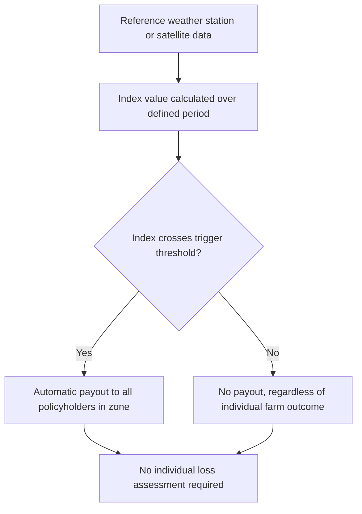

## Index-Based Weather Insurance

### Definition and Core Mechanism

Index-based weather insurance (also called index insurance or weather index insurance) is a financial product that pays out based on an objectively measurable external index (e.g., cumulative rainfall, temperature, satellite-derived vegetation indices) rather than on a direct assessment of an individual policyholder's realized losses. It was developed specifically to address the structural gaps in informal risk-sharing and traditional indemnity-based crop insurance in developing-country agricultural contexts.

**Key Points**

- Payouts are triggered automatically when the index crosses a predefined threshold (e.g., rainfall below X mm during a critical crop growth period), regardless of whether an individual farmer's actual crop was damaged
- This design explicitly targets **covariate risk** (drought, regional flooding) — the category of risk that informal insurance networks (covered elsewhere in this chapter) are structurally unable to pool, since it affects most network members simultaneously
- The product substitutes an objective, third-party-verifiable index for costly individual loss assessment, which is the central innovation relative to traditional indemnity-based crop insurance

### Theoretical Motivation

#### The Problem with Traditional Indemnity Insurance

Conventional crop insurance requires insurers to verify each policyholder's actual losses, which is prohibitively costly for smallholder farmers dispersed across large rural areas. This generates two classic insurance market failures at severe scale in this context:

- **Moral hazard**: if payouts depend on observed individual losses, insured farmers have reduced incentive to exert effort to prevent or mitigate losses
- **Adverse selection**: insurers cannot easily distinguish high-risk from low-risk farmers, and higher-risk farmers are more likely to purchase insurance, driving up average claims and premiums

#### How Index Insurance Addresses These Failures

Because payouts are tied to an external, verifiable index rather than the individual's own reported or assessed loss, index insurance largely eliminates both moral hazard (a farmer's individual effort does not affect the area-wide rainfall index) and much of the adverse selection problem (the insurer does not need private information about individual farm risk, only about the correlation between the index and typical local yields), while also dramatically reducing administrative/verification costs.

$$\text{Payout} = \begin{cases} 0 & \text{if } I_t \geq \tau \\ f(\tau - I_t) & \text{if } I_t < \tau \end{cases}$$

Where $I_t$ is the realized index value (e.g., cumulative rainfall at a reference weather station during the growing season), $\tau$ is the strike/trigger threshold, and $f(\cdot)$ is typically a linear payout function up to a maximum liability.

### Core Design Parameters

| Parameter | Description |
| --- | --- |
| Index type | Rainfall, temperature, evapotranspiration, satellite vegetation index (NDVI), area-yield index |
| Reference station/source | Physical weather station or satellite/remote-sensing data source |
| Measurement period | Growing season, often subdivided into critical growth stages (planting, flowering, harvest) |
| Trigger (strike) | Threshold at which payouts begin |
| Exit point | Threshold at which maximum payout is reached |
| Tick value | Payout amount per unit of index deviation beyond the trigger |
| Sum insured/maximum liability | Cap on total payout per policy |

### The Central Limitation: Basis Risk

**Basis risk** is the single most important and extensively documented limitation of index insurance: the risk that the index does not accurately reflect an individual farmer's actual losses, due to imperfect correlation between the index measurement and localized farm-level outcomes.

#### Sources of Basis Risk

- **Spatial basis risk**: the reference weather station may be located far from a given farmer's field, and rainfall/weather can vary substantially over short distances (particularly for convective rainfall patterns common in many tropical agricultural regions)
- **Design/product basis risk**: the index (e.g., cumulative rainfall) may not accurately capture the actual agronomic determinants of crop loss (e.g., timing of rainfall relative to crop growth stages, pest damage, soil quality variation, or non-weather-related losses)
- **Idiosyncratic basis risk**: even with a well-designed index, individual farm-level factors (soil type, farming practices, microclimate) mean some genuinely damaged farms will not trigger a payout, and some undamaged farms will receive one

$$\text{Basis Risk} = |\text{Individual Farmer Loss} - \text{Index-Implied Loss}|$$

**Key Points**

- Basis risk is widely identified in the empirical literature (e.g., Clarke, 2016; Mobarak and Rosenzweig on India; Jensen, Barrett, and Mude on Kenya's livestock index insurance) as the primary explanatory factor behind persistently low voluntary take-up rates of index insurance among smallholder farmers
- [Inference] Because basis risk directly undermines the core value proposition of insurance (reliable protection against one's own losses), farmers' rational responses to perceived basis risk — rather than pure behavioral biases or lack of financial literacy — plausibly explain a substantial share of low observed demand, though the literature attributes low demand to a combination of factors rather than basis risk alone

### Demand for Index Insurance: The Low Take-Up Puzzle

Despite substantial donor and government subsidization efforts, voluntary uptake of index insurance products in most pilot and scaled programs has remained persistently low, generating an extensive literature examining why.

#### Documented Demand Constraints

| Constraint | Mechanism |
| --- | --- |
| Basis risk | Reduces perceived and actual value of the product relative to its cost |
| Liquidity constraints | Premiums are typically due at planting (when cash is scarcest), before the season's outcome or any payout is known |
| Trust deficits | Limited farmer experience with insurance institutions; skepticism that payouts will actually be honored |
| Limited understanding of probabilistic products | Insurance requires understanding of probability and expected value concepts that may be unfamiliar |
| Present bias / high discount rates | Difficulty valuing a probabilistic future payout against a certain current premium cost |
| Price sensitivity | Demand elasticity studies (e.g., Cole et al., 2013, in India) find demand highly sensitive to price, with steep drop-offs even at modest premium increases above actuarially fair levels |

#### Randomized Evidence on Take-Up Interventions

Several RCTs have tested interventions to raise take-up: price subsidies/discount vouchers (Cole, Giné, Tobacman, Topalova, Townsend, Vickery, 2013), improved product understanding through video/game-based education, and delayed/harvest-time premium payment structures (Casaburi and Willis's work on interlinking premium payment with input finance in Kenya's sugarcane sector, where premiums were deducted from crop proceeds at harvest, substantially raising take-up relative to upfront premium payment).

**Key Points**

- Price subsidies robustly increase take-up (unsurprising given elastic demand), but this raises the separate policy question of long-run fiscal sustainability
- The Casaburi-Willis interlinked contract design (paying premiums from harvest proceeds rather than upfront) is a notable innovation directly targeting the liquidity-constraint channel, distinct from addressing basis risk

### Effects of Index Insurance on Behavior and Welfare

Where evaluated via RCTs, index insurance has shown some of its most consistent positive effects not on ex-post payouts alone, but on **ex-ante production decisions** — consistent with the theoretical prediction that reducing uninsured risk exposure encourages higher-risk, higher-return investment.

#### Ex-Ante Investment Effects

Multiple studies (e.g., Karlan, Osei, Osei-Akoto, and Udry in Ghana; Mobarak and Rosenzweig in India) find that farmers offered index insurance shift toward higher-return but riskier production choices (more fertilizer use, riskier but higher-yield crop varieties, larger cultivated area) relative to farmers without insurance access, mirroring the theoretical prediction that uninsured risk depresses productive investment discussed in the risk-coping strategies topic.

$$\Delta(\text{Risky Input Use}) > 0 \text{ when insurance reduces downside variance, holding expected returns constant}$$

#### Ex-Post Consumption Smoothing

Evidence on realized consumption-smoothing benefits from actual payouts is more limited and mixed, in part because many pilot programs have not yet experienced enough severe covariate shock realizations within their study windows to generate statistically well-powered payout-effect estimates, and in part due to basis risk reducing payout accuracy when shocks do occur.

**Key Points**

- The stronger and more consistently documented effect channel is the "ex-ante risk-reduction effect on investment," rather than "ex-post payout smooths consumption" — a nuance frequently emphasized in the literature as distinguishing index insurance's value proposition from conventional intuitions about insurance
- [Unverified] Long-run welfare effects of sustained (multi-year) index insurance access remain less well established than short-run investment behavior effects, given the relatively limited number of long-duration randomized evaluations completed to date

### Index Design Approaches

#### Weather Station-Based Indices

The original and most common design, using rainfall or temperature data from fixed meteorological stations. Advantages include relatively low data cost and interpretability; the primary disadvantage is spatial basis risk from station-to-farm distance.

#### Satellite/Remote-Sensing-Based Indices

Increasingly used to reduce spatial basis risk by providing higher-resolution, spatially continuous data (e.g., NDVI-based vegetation greenness indices, satellite-derived rainfall estimates). This approach removes dependence on a sparse network of physical weather stations, though it introduces its own measurement and calibration challenges (e.g., NDVI can be affected by non-drought factors like cloud cover or land-use change).

#### Area-Yield Index Insurance

An alternative index construction using average crop yields for a defined geographic area (e.g., a district) rather than weather data directly, paying out when area-average yield falls below a threshold. This can better capture the actual agronomic outcome of interest but requires reliable, timely yield data collection infrastructure, which is often limited in the same low-capacity settings where index insurance is most needed.

### Livestock Index Insurance: A Distinct Application

A prominent adaptation is **Index-Based Livestock Insurance (IBLI)**, implemented notably in Kenya and Ethiopia among pastoralist communities, where the index is constructed from satellite-derived vegetation cover (a proxy for forage availability and, consequently, livestock mortality risk) rather than direct rainfall measurement.

**Key Points**

- IBLI addresses covariate livestock mortality risk from drought-induced forage scarcity, a major and recurring source of pastoralist asset loss and poverty dynamics in East African drylands
- Evaluations (Jensen, Barrett, Mude) find IBLI reduces distress livestock sales and other costly coping behaviors during drought periods among insured households, though — consistent with the broader pattern — take-up remains a persistent challenge outside of subsidized pilot contexts

### Delivery Models and Scaling Challenges

| Delivery Model | Description | Trade-off |
| --- | --- | --- |
| Direct-to-farmer sales | Insurer or NGO sells policies directly to individual farmers | High marketing/distribution cost |
| Bundled with agricultural credit | Insurance mandatory or bundled with input loans | Reduces adverse selection in credit; raises effective loan cost |
| Bundled with input purchase | Insurance embedded in price of seeds/fertilizer | Simplifies distribution but limits customization |
| Government/donor-subsidized programs | Public sector subsidizes premiums to raise scale | Fiscal sustainability and targeting concerns |
| Reinsurance/international risk transfer | Local insurers cede aggregated covariate risk to international reinsurance markets | Enables local insurer solvency against large covariate shocks |

**Key Points**

- Because index insurance targets *covariate* risk by design, a local insurer underwriting many policies in the same geographic area faces concentrated aggregate exposure, making access to international reinsurance or catastrophe risk pooling mechanisms (e.g., regional risk pools such as the African Risk Capacity) structurally important for program solvency
- Government-led and donor-subsidized scaling (e.g., India's modified National Agricultural Insurance Scheme incorporating weather-index components) has achieved larger enrollment numbers than purely voluntary market-based pilots, reflecting the persistent voluntary demand constraints discussed above

### Summary: Index Insurance vs. Alternative Risk Instruments

| Feature | Index Insurance | Traditional Indemnity Insurance | Informal Risk-Sharing |
| --- | --- | --- | --- |
| Verification cost | Low (objective index) | High (individual loss assessment) | Low (local information) |
| Moral hazard | Minimal | Significant | Minimal |
| Basis risk | Significant | Minimal (by construction) | Not applicable (different failure mode) |
| Covariate risk coverage | Designed for this | Possible but costly to underwrite | Poor (structural limitation) |
| Idiosyncratic risk coverage | Poor (by construction) | Good | Good |
| Scalability | High (low admin cost) | Low (high admin cost per policy) | Limited by network size |

**Next Steps**

- Basis risk measurement and mitigation techniques (satellite index refinement, hybrid designs)
- Risk-coping strategies of poor households (companion topic on informal alternatives)
- Informal insurance and risk-sharing networks (covariate risk gap motivating index insurance)
- Demand elasticity for insurance products and behavioral pricing experiments
- Index-Based Livestock Insurance (IBLI) case studies in East Africa
- Interlinked contracts and premium-financing innovations (Casaburi-Willis model)
- Agricultural credit and insurance bundling
- Catastrophe risk pooling and sovereign/regional reinsurance mechanisms