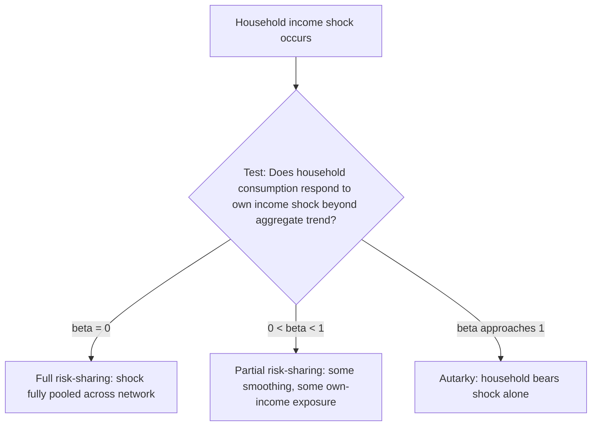
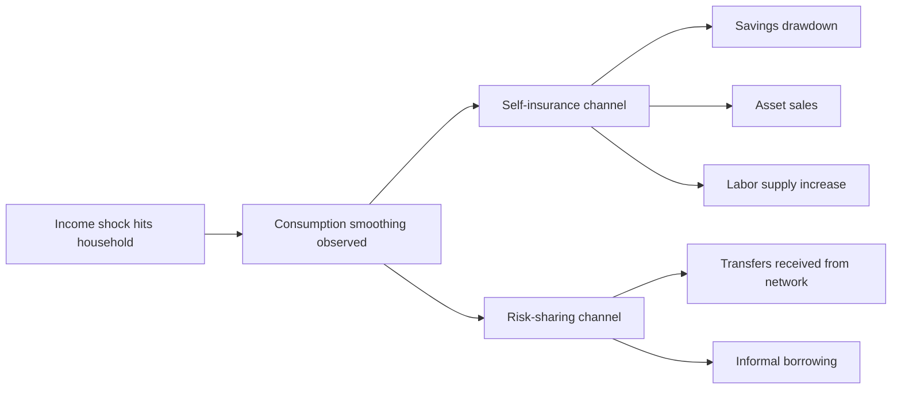

## Consumption Smoothing Evidence

### Definition and Scope

Consumption smoothing evidence refers to the empirical literature testing the degree to which households in developing countries stabilize consumption in the face of income volatility, and through which specific mechanisms. This topic synthesizes the empirical methodology and cross-study findings underlying claims made throughout this chapter about risk-coping strategies, informal insurance, and index insurance — focusing specifically on how researchers measure and identify consumption smoothing, rather than the coping mechanisms themselves.

**Key Points**

- Consumption smoothing evidence is distinct from theory: it comprises the empirical tests, identification strategies, and accumulated findings across many country/context studies
- The literature generally proceeds in two complementary tracks: (1) testing the **full insurance/full risk-sharing hypothesis** at the village or network level, and (2) directly estimating the **excess sensitivity** of household consumption to income shocks
- A recurring empirical regularity across decades of studies is **partial insurance**: consumption responds to idiosyncratic income shocks less than one-for-one, but more than zero-for-one, implying meaningful but incomplete smoothing

### The Permanent Income Hypothesis as Null Benchmark

The starting benchmark for all consumption-smoothing tests is the **permanent income hypothesis (PIH)**, under which consumption should respond only to changes in permanent income, not to transitory fluctuations, since households can borrow and save to smooth transitory shocks:

$$c_{it} = \frac{r}{1+r}\sum_{s=t}^{\infty}\left(\frac{1}{1+r}\right)^{s-t}E_t[y_{is}]$$

A pure transitory income shock should have a small effect on current consumption (spread across the household's remaining lifetime via saving/borrowing), while a permanent shock should be reflected roughly one-for-one in consumption.

**Key Points**

- Rejecting PIH-consistent behavior (finding consumption tracks transitory income too closely) is interpreted as evidence of binding credit constraints, precautionary motives, or both — distinguishing this test from the risk-sharing tests below, which instead examine whether idiosyncratic shocks are pooled *across* households via informal insurance
- The two literatures (PIH/credit-constraint tests and full risk-sharing tests) are related but methodologically distinct, and both are used as complementary evidence on the overall capacity of households to smooth consumption

### Full Risk-Sharing Test Methodology

The dominant empirical framework, developed by Townsend (1994), Mace (1991), and Cochrane (1991), tests whether individual household consumption growth is explained by aggregate (village/network) consumption growth alone, or whether idiosyncratic income shocks retain independent explanatory power.

#### Baseline Specification

$$\Delta \ln c_{it} = \alpha + \beta \Delta \ln y_{it} + \gamma \Delta \ln \bar{c}_{vt} + X_{it}'\delta + \epsilon_{it}$$

Under full insurance, $\beta = 0$ (idiosyncratic income growth has no independent effect on consumption growth once aggregate consumption is controlled for); under autarky (no insurance at all), $\beta$ approaches the value implied by households consuming their own income directly.

#### Key Empirical Findings from This Approach

| Study/Context | Setting | Finding |
| --- | --- | --- |
| Townsend (1994) | ICRISAT villages, India | Full insurance rejected; substantial partial insurance found |
| Deaton (1997), synthesis | Multiple developing-country contexts | Consistent rejection of full insurance across settings |
| Fafchamps and Lund (2003) | Rural Philippines | Risk-sharing occurs within kinship/friendship networks, not uniformly village-wide |
| Grimard (1997) | Côte d'Ivoire | Partial risk-sharing found within ethnic groups, less across groups |
| Kazianga and Udry (2006) | Burkina Faso | Limited insurance against covariate drought shocks specifically; better smoothing of idiosyncratic shocks |

**Key Points**

- The consistent qualitative finding across highly varied contexts (South Asia, West Africa, Southeast Asia) is rejection of full insurance combined with meaningful partial insurance — a robust empirical regularity that motivated the shift toward limited-commitment theoretical models discussed in the informal insurance topic
- [Inference] The cross-context consistency of "partial but incomplete" risk-sharing findings suggests this is a structural feature of informal insurance institutions generally, rather than an artifact of any single dataset or estimation approach, though effect magnitudes vary meaningfully by context

### Distinguishing Shock Types in Consumption-Smoothing Evidence

A major refinement in the empirical literature has been disaggregating results by **shock type**, since aggregate tests can mask sharply differing smoothing capacity across idiosyncratic and covariate shocks.

#### Idiosyncratic Shocks

Studies isolating idiosyncratic shocks — individual illness, death of a household member, localized crop pest damage, individual asset loss — generally find **better** consumption smoothing than for covariate shocks, consistent with the theoretical prediction that informal networks pool risk more effectively when only some members are affected at a given time.

#### Covariate Shocks

Studies examining regional or village-wide shocks (drought, flood, regional price crashes, epidemic-related disruption) consistently find **weaker** smoothing, since the entire local risk-sharing network is affected simultaneously and lacks unaffected members with surplus resources to redistribute.

$$\beta_{\text{idiosyncratic}} < \beta_{\text{covariate}}$$

(a smaller estimated sensitivity coefficient for idiosyncratic shocks indicates *better* smoothing, since consumption is less exposed to that shock type)

**Key Points**

- This idiosyncratic/covariate distinction is one of the most policy-relevant findings in the consumption-smoothing literature, directly motivating the design rationale for index-based weather insurance (covered elsewhere in this chapter) as a tool targeting precisely the shock category informal insurance handles worst
- Kazianga and Udry's (2006) Burkina Faso study is frequently cited as a clear illustration: households showed limited ability to protect consumption against the 1984 drought (a severe covariate shock), despite evidence of functioning informal transfer networks for smaller, more localized shocks

### Health Shocks as a Specific Test Case

Health shocks (illness or death of income-earning household members) have received particular empirical attention because they combine both an income shock (lost labor earnings) and an expenditure shock (medical costs), providing a sharper test of smoothing capacity.

#### Notable Findings

Studies in this vein (e.g., Gertler and Gruber's work on Indonesia) generally find that households can smooth consumption reasonably well against **minor** illness but show significantly **worse** smoothing against **major** illness (defined by functional limitation severity), suggesting that the size of a shock — not just its idiosyncratic/covariate classification — independently affects smoothing capacity, since larger shocks are more likely to exceed the capacity of available informal transfers and precautionary buffers.

**Key Points**

- This finding adds a **magnitude dimension** to the consumption-smoothing evidence base, complementing the idiosyncratic/covariate distinction: even purely idiosyncratic shocks can overwhelm informal insurance capacity if sufficiently severe
- [Unverified] The precise severity threshold at which informal smoothing capacity breaks down likely varies by community wealth, network density, and the availability of complementary formal safety nets, and is not established as a universal quantitative threshold across the literature

### Methodological Critiques and Refinements

#### Measurement Error in Income and Consumption

A persistent methodological concern is that self-reported income and consumption data in household surveys are subject to substantial measurement error, which can bias estimated smoothing coefficients. Researchers have addressed this through instrumental variable approaches (instrumenting income with rainfall or other exogenous shock proxies) and through the use of higher-frequency panel data to reduce recall-based measurement error.

#### Testing Higher-Order Moments

Beyond first-moment (mean consumption) smoothing, a smaller strand examines whether households also smooth the **variance** of consumption, or whether risk-sharing arrangements affect higher moments (skewness) of the consumption distribution — motivated by the idea that limited-commitment risk-sharing (discussed in the informal insurance topic) predicts specific patterns in how consumption *volatility*, not just levels, should evolve with a household's history of shocks.

#### Distinguishing Self-Insurance from Risk-Sharing

A key methodological advance has been separating **self-insurance** (a household's own savings, asset sales, labor supply adjustment) from **risk-sharing** (transfers received from others) as distinct smoothing channels, since aggregate consumption-smoothing tests alone cannot distinguish which mechanism is doing the work. Studies decomposing these channels (e.g., examining asset changes alongside consumption) generally find that a substantial share of observed smoothing operates through self-insurance (savings buffers, asset sales) rather than risk-sharing transfers alone, particularly for larger or more persistent shocks.

### Formal Safety Net Evidence as a Complementary Test

A related empirical literature examines consumption smoothing effects of **formal** interventions (cash transfers, public works programs, pensions) as a way of establishing counterfactual benchmarks against which informal smoothing capacity can be compared, and of testing whether formal programs fill genuine smoothing gaps rather than crowding out existing informal mechanisms.

**Key Points**

- Studies of unconditional cash transfer programs generally find strong consumption-smoothing effects during the transfer period, used partly as a benchmark for how much "smoothing gap" existed prior to the intervention
- Evidence on crowd-out of informal transfers by formal programs is mixed (as discussed in the informal insurance topic), complicating simple before/after comparisons of total household smoothing capacity

### Summary of Core Empirical Regularities

| Empirical Regularity | Status in Literature |
| --- | --- |
| Full risk-sharing is rejected in virtually all tested settings | Well-established, highly robust finding |
| Partial risk-sharing (some but incomplete smoothing) is the norm | Well-established, highly robust finding |
| Idiosyncratic shocks are smoothed better than covariate shocks | Well-established across multiple contexts |
| Larger/more severe shocks are smoothed worse than smaller shocks | Well-established, though precise thresholds vary by context |
| Risk-sharing occurs more within sub-networks (kin, ethnicity) than village-wide | Well-established in network-focused studies |
| Self-insurance (savings, assets) plays a substantial role alongside risk-sharing transfers | Established, though relative contribution varies by shock size/type |
| Long-run welfare costs of imperfect smoothing (human capital, asset depletion) | Documented in specific contexts; less uniformly quantified across the literature |

**Next Steps**

- Risk-coping strategies of poor households (companion topic on coping mechanisms)
- Informal insurance and risk-sharing networks (theoretical limited-commitment framework)
- Index-based weather insurance (formal response to covariate-risk smoothing gap)
- Health shocks and medical expenditure risk in developing countries
- Measurement error and instrumental variable strategies in household survey data
- Cash transfer programs and consumption-smoothing evaluations
- Panel data methods for household income and consumption analysis