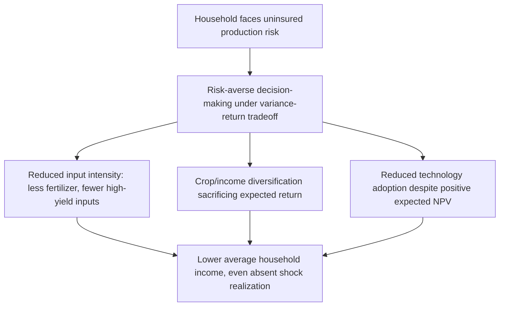

## Behavioral Responses to Uninsured Risk

### Definition and Scope

Behavioral responses to uninsured risk refers to the study of how households systematically alter production, investment, labor, and consumption decisions specifically because they lack access to insurance — distinct from the coping strategies deployed *after* a shock occurs. This topic focuses on the **ex-ante distortionary effects** of risk exposure itself: even in years with no realized shock, the mere presence of uninsured risk changes household behavior, often in ways that perpetuate low income and poverty.

**Key Points**

- The central conceptual distinction from risk-coping strategies (covered elsewhere in this chapter) is timing and causality: risk-coping strategies respond to a realized shock, while behavioral responses to uninsured risk operate continuously, shaping decisions under risk aversion even absent any shock realization in a given period
- This literature provides the microeconomic foundation for a specific poverty-trap mechanism: uninsured risk lowers expected income not only through shock realizations but through the precautionary behavioral adjustments households make in anticipation of risk
- The topic connects directly to the ex-ante investment effects of index insurance (covered elsewhere in this chapter), which are best understood as evidence generated by removing this behavioral distortion experimentally

### Theoretical Framework: Risk Aversion Under Missing Insurance

The starting point is a household maximizing expected utility over a risky income stream, where utility is concave (risk-averse), $u''(\cdot) < 0$:

$$\max_{k} E[u(f(k,\theta))] \quad \text{where } \theta \text{ is a random productivity/weather shock}$$

Absent insurance, the household's optimal capital/input choice $k^*$ trades off expected return against the utility cost of variance:

$$E[u'(f(k,\theta))f_k(k,\theta)] = 0$$

Under risk aversion, this first-order condition implies the household chooses a **lower** $k$ than the risk-neutral, expected-profit-maximizing level $k^{RN}$ whenever higher $k$ raises the variance of output — even though $E[f(k^{RN},\theta)] > E[f(k^*,\theta)]$.

$$k^* < k^{RN} \quad \text{whenever} \quad \frac{\partial \text{Var}(f(k,\theta))}{\partial k} > 0$$

**Key Points**

- This result — sometimes called the "ex-ante cost of risk" — implies uninsured risk imposes an income cost on households *independent of whether a bad shock ever actually occurs*, purely through the precautionary/conservative behavior it induces
- The magnitude of this distortion depends on the household's degree of risk aversion (often parameterized via constant relative risk aversion, $u(c) = \frac{c^{1-\rho}}{1-\rho}$) and the correlation between the risky choice variable and shock exposure

### Production and Technology Choice Distortions

#### Foundational Evidence: Rosenzweig and Binswanger

Rosenzweig and Binswanger's (1993) study of Indian semi-arid agriculture is a foundational reference documenting that farm households facing greater income risk (measured via rainfall variability) hold **less risky, lower-return production portfolios**, and that this effect is stronger among poorer households — consistent with decreasing absolute risk aversion, where poorer households (closer to subsistence) cannot afford to bear as much variance regardless of expected return.

#### Input Use and Technology Adoption

A large subsequent literature documents specific behavioral margins along which uninsured risk deters adoption of higher-return practices:

| Behavioral Margin | Mechanism |
| --- | --- |
| Fertilizer/improved seed adoption | Higher expected yield but often higher variance (e.g., hybrid seeds more vulnerable to specific rainfall patterns) |
| Irrigation investment | High upfront cost with returns exposed to complementary risks (credit repayment risk if investment fails) |
| Crop specialization vs. diversification | Diversification sacrifices expected return to reduce variance |
| Land allocation to cash crops vs. subsistence crops | Cash crops often higher expected return but more price/market risk exposure |
| Off-farm labor supply vs. own-farm investment | Off-farm wage labor offers lower but more certain returns |

### Experimental Evidence: Insurance Provision as Identification Strategy

Because directly measuring the "ex-ante cost of risk" from observational data is difficult (risk exposure and other household characteristics are jointly determined), a key empirical strategy has been randomizing access to insurance and measuring resulting changes in production behavior — treating insurance provision as an instrument that isolates the causal effect of risk removal.

#### Karlan, Osei, Osei-Akoto, and Udry (2014) — Ghana

This widely cited study randomized access to rainfall index insurance among Ghanaian farmers (alongside a separate cash grant treatment) and found that insurance access — more than the cash grant alone — induced farmers to invest significantly more in agricultural inputs and cultivate larger areas, providing direct evidence that **binding risk constraints**, not merely liquidity constraints, were suppressing investment.

#### Mobarak and Rosenzweig (2013) — India

This study similarly found that rainfall insurance access shifted farmers toward higher-risk, higher-return crop and input choices, and specifically found effects concentrated among farmers who had, at baseline, been engaging in informal risk-sharing arrangements that implicitly constrained their production choices (reflecting the participation-constraint dynamics discussed in the informal insurance topic).

**Key Points**

- The consistent finding across these and related studies — that insurance access changes production *decisions*, not merely post-shock outcomes — is considered some of the strongest available evidence that uninsured risk itself (not just realized shocks) is a binding constraint on smallholder investment and income
- [Inference] The finding that insurance affects investment even in years without a triggering payout event suggests the mechanism operates primarily through reduced *anticipated* downside risk rather than through realized liquidity from claims, consistent with the theoretical ex-ante cost-of-risk framework above

### Behavioral and Psychological Channels

Beyond the standard expected-utility/risk-aversion framework, a complementary literature examines specific psychological and cognitive channels through which uninsured risk shapes decision-making, drawing on behavioral economics more broadly.

#### Loss Aversion and Reference Dependence

Some studies apply prospect-theory-style reference dependence to explain patterns not well fit by standard expected utility — for instance, farmers exhibiting disproportionately strong aversion to outcomes below a subsistence or reference consumption level, which can generate more extreme risk-avoidance than constant relative risk aversion alone would predict.

#### Scarcity and Cognitive Load

Related work (associated with Mullainathan, Shafir, and colleagues) argues that the persistent psychological burden of managing uninsured risk consumes cognitive "bandwidth," potentially impairing decision quality on unrelated tasks and contributing to a broader cycle in which risk exposure degrades the very decision-making capacity needed to escape it.

**Key Points**

- This channel is conceptually distinct from the standard risk-aversion mechanism: it is not that households rationally choose lower-variance, lower-return strategies, but that the psychological burden of risk exposure itself may degrade the quality of decisions made under any strategy
- [Speculation] The relative quantitative contribution of this cognitive-load channel versus standard risk-aversion-driven portfolio choice to overall underinvestment remains an active and not fully resolved area of the literature, with most rigorous causal identification concentrated on the risk-aversion channel rather than the cognitive-load channel specifically

### Labor Market and Occupational Choice Responses

Uninsured risk also shapes labor allocation decisions beyond agricultural production choices:

- **Occupational conservatism**: households facing uninsured risk may under-invest in entrepreneurial ventures with uncertain but potentially high returns, favoring lower-variance wage labor or subsistence activities even when expected entrepreneurial returns are higher
- **Migration timing and destination choice**: risk considerations affect not just whether households send migrants (a risk-diversification strategy, covered in the risk-coping topic) but the specific choice of migration destination, favoring destinations with income streams less correlated with home-area shocks even at some cost to expected migrant earnings
- **Reduced specialization in human capital investment**: in some contexts, households facing uninsured risk to future returns on education (e.g., uncertain labor market prospects) have been found to under-invest in schooling relative to a frictionless benchmark, though this channel is less definitively established than the agricultural production literature

### Distinguishing Risk-Aversion Effects from Credit Constraint Effects

A significant methodological challenge in this literature is disentangling behavioral responses to *risk* specifically from responses to *credit constraints*, since both can independently suppress investment and are often correlated in the same populations (poorer, credit-constrained households also tend to be more risk-averse or less able to bear risk).

$$\text{Observed underinvestment} = \underbrace{f(\text{risk aversion, uninsured variance})}_{\text{risk channel}} + \underbrace{g(\text{credit access, collateral})}_{\text{credit channel}}$$

Studies like Karlan et al. (2014) address this directly by including both an insurance treatment arm and a cash-grant treatment arm in the same experimental design, allowing separate identification of the risk-removal effect (insurance) from the liquidity-relaxation effect (cash grant).

**Key Points**

- The Karlan et al. (2014) finding that insurance had *larger* effects on investment than an equivalently-sized cash grant is considered particularly important evidence that the risk channel, not merely the credit/liquidity channel, is independently binding — a result that shifted substantial research and policy attention toward insurance-based interventions rather than credit alone
- This finding directly complements the broader critique-of-microfinance literature (covered elsewhere in this chapter), which similarly found that relaxing credit constraints alone often failed to generate large income gains — together suggesting uninsured risk may be an underappreciated binding constraint relative to credit access alone in some contexts

### Summary: Behavioral Margins Affected by Uninsured Risk

| Decision Margin | Direction of Distortion Under Uninsured Risk |
| --- | --- |
| Input intensity (fertilizer, improved seed) | Reduced below expected-profit-maximizing level |
| Crop/income diversification | Increased beyond expected-profit-maximizing level |
| Technology adoption | Delayed or foregone despite positive expected NPV |
| Land allocation to cash crops | Reduced in favor of lower-return subsistence crops |
| Entrepreneurial venture formation | Reduced in favor of lower-variance wage labor |
| Migration destination choice | Shifted toward less correlated but potentially lower-return destinations |
| Cultivated area | Reduced relative to unconstrained optimum |

**Next Steps**

- Index-based weather insurance and its ex-ante investment effects (companion topic)
- Risk-coping strategies of poor households (ex-post responses, contrasted with this topic's ex-ante focus)
- Poverty traps and dynamic asset-based welfare models
- Behavioral economics of scarcity and cognitive load (Mullainathan and Shafir)
- Returns to capital in microenterprises and underinvestment puzzles
- Prospect theory and reference-dependent preferences in development contexts
- Migration as risk diversification strategy
- Critiques and limits of microfinance (credit vs. risk constraint distinction)