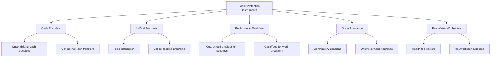

## Social Protection and Safety Nets

### Definition and Scope

Social protection and safety nets encompass the set of formal, publicly (or donor-) financed programs designed to protect households against poverty and risk, complementing or substituting for the informal risk-sharing mechanisms and formal insurance products covered elsewhere in this chapter. This topic covers the major program types, their theoretical rationale, targeting mechanisms, and the empirical evidence on their effectiveness — situating safety nets as the state/institutional-level response to the same risk-management problem examined at the household level throughout this chapter.

**Key Points**

- Social protection is typically organized around three broad functions: **protective** (preventing deprivation, e.g., cash transfers during a crisis), **preventive** (avoiding deprivation before it occurs, e.g., insurance-like mechanisms), and **promotive/transformative** (enhancing capabilities and addressing structural inequities, e.g., graduation programs, rights-based approaches)
- Unlike the informal insurance and index insurance mechanisms discussed elsewhere in this chapter, safety nets are financed and administered by governments or international organizations, raising distinct considerations of fiscal sustainability, political economy, and administrative/targeting capacity
- This topic connects directly to the risk-coping and consumption-smoothing evidence covered earlier: safety nets are frequently justified and evaluated based on their ability to reduce households' reliance on costly informal coping mechanisms (asset sales, child labor, distress migration)

### Theoretical Rationale

#### Market Failure Justification

The core economic rationale mirrors the market-failure logic underlying informal and index insurance: formal private insurance markets are frequently missing or incomplete for the poor due to moral hazard, adverse selection, and high transaction costs relative to policy size. Public safety nets can substitute where private markets fail, particularly for **covariate risks** (regional drought, macroeconomic shocks, pandemics) that overwhelm both individual self-insurance and local informal risk-sharing networks, as established in the consumption-smoothing evidence discussed earlier in this chapter.

#### Redistribution and Poverty Reduction

A distinct rationale, independent of market failure, is direct redistribution: even absent any insurance market failure, safety nets can be justified on social welfare grounds as transferring resources to those below a socially defined minimum standard of living.

#### Human Capital and Poverty Trap Rationale

A further justification, particularly prominent in the design of conditional cash transfer (CCT) programs, is that safety nets can prevent households from resorting to coping strategies with long-run, potentially irreversible costs — such as child labor or withdrawal from schooling during shocks — thereby breaking a channel through which short-run shocks generate long-run poverty persistence (a poverty-trap mechanism connecting directly to the risk-coping strategies topic earlier in this chapter).

### Typology of Safety Net Instruments

| Instrument | Description | Representative Example |
| --- | --- | --- |
| Unconditional cash transfers (UCT) | Cash provided with no behavioral requirements | GiveDirectly programs, Kenya |
| Conditional cash transfers (CCT) | Cash tied to behavioral requirements (school attendance, health check-ups) | Progresa/Oportunidades (Mexico), Bolsa Família (Brazil) |
| Public works/workfare | Guaranteed employment, often at a set wage, on public infrastructure projects | Mahatma Gandhi National Rural Employment Guarantee Act (NREGA), India |
| Food/in-kind transfers | Direct provision of food or vouchers | Public Distribution System (India), food-for-work programs |
| Social pensions | Non-contributory old-age cash transfers | South Africa's Old Age Pension |
| Fee waivers/subsidies | Reduced cost for essential services or inputs | Health user-fee removal, fertilizer subsidy programs |
| Productive/graduation programs | Asset transfer plus training plus coaching, targeting ultra-poor | BRAC's graduation model |

### Conditional Cash Transfers: Design and Evidence

CCTs, pioneered at scale by Mexico's Progresa (later Oportunidades, then Prospera) in 1997, condition cash payments on household behaviors intended to build human capital — typically school enrollment/attendance and health clinic visits.

#### Rationale for Conditionality

The conditionality is theoretically justified on grounds that households may under-invest in children's human capital relative to the socially optimal level, due to **intrahousehold agency problems** (the decision-maker may not fully internalize a child's future returns), **credit constraints** on financing human capital investment, or externalities (social returns to education exceeding private returns captured by the household).

#### Empirical Evidence on CCTs

Progresa/Oportunidades, evaluated via a large-scale randomized phase-in design, is among the most extensively studied social programs in development economics. Documented effects include increased school enrollment (particularly at the secondary level, where dropout risk was highest), increased health clinic utilization, and improved child nutritional and health outcomes, with subsequent studies tracking longer-run effects on eventual educational attainment and, in some cases, adult labor market outcomes.

**Key Points**

- Effects on enrollment tend to be concentrated at transition points (primary-to-secondary) where dropout risk was highest absent the transfer, rather than uniformly across all grade levels
- A distinct and actively debated empirical question is whether the **conditionality itself** (versus the cash alone) drives behavioral change — several studies comparing CCTs to UCTs of similar size find mixed evidence on whether conditions add substantial behavioral impact beyond the income effect, with results varying by outcome and context
- [Unverified] The generalizability of Progresa-style conditionality effects to different institutional contexts (e.g., settings with weaker school/health service supply capacity) is not uniformly established, since conditions requiring service use are only as effective as the underlying service quality and accessibility

### Unconditional Cash Transfers: Design and Evidence

UCTs have expanded substantially in the research and policy literature, partly driven by evidence questioning conditionality's added value and by lower administrative costs relative to monitoring compliance with conditions.

#### Key Evidence Base

Large-scale RCTs of UCT programs (notably GiveDirectly's evaluations in Kenya) find substantial positive effects on consumption, asset holdings, psychological wellbeing, and — addressing a common political-economy concern — generally find little to no evidence of increased spending on "temptation goods" (alcohol, tobacco) as a result of unconditional transfers, a finding replicated across multiple contexts and considered an important empirical rebuttal to a common objection to unconditional transfer design.

**Key Points**

- UCT evidence generally shows strong short-run consumption and asset effects; evidence on longer-run "graduation" out of poverty (sustained income gains after transfers end) is more limited and mixed across studies
- Local economic spillover effects (general equilibrium effects on prices and non-recipient households in villages with high transfer saturation) have been documented in some studies (e.g., Egger et al. on GiveDirectly's Kenya program), suggesting transfer effects extend beyond direct recipients through local demand and price channels — though the direction and magnitude of these spillovers can vary by market conditions

### Public Works Programs: Design and Evidence

Public works/workfare programs guarantee employment (often at a fixed, typically below-market wage) on public infrastructure projects, functioning simultaneously as an income safety net and, ideally, as a self-targeting mechanism (since the below-market wage discourages participation by those with better outside options).

#### India's NREGA as Reference Case

The Mahatma Gandhi National Rural Employment Guarantee Act (NREGA), guaranteeing up to 100 days of wage employment per rural household per year, is among the most extensively studied public works programs globally, given its scale (one of the largest safety net programs in the world by coverage).

**Key Points**

- Evidence on NREGA generally finds positive effects on rural wages (including spillover effects on private-sector agricultural wages, as the guaranteed program raises the effective reservation wage) and on consumption smoothing during agricultural lean seasons
- Self-targeting via below-market wages is theoretically attractive (reducing the need for costly means-testing) but empirically imperfect — implementation quality, rationing of available work, and administrative capacity substantially affect actual targeting outcomes in practice
- [Inference] The wage spillover finding suggests public works programs can have general equilibrium labor market effects beyond direct participants, a distinguishing feature relative to targeted cash transfer programs, though the magnitude of such spillovers is context- and labor-market-specific

### Targeting Mechanisms and Their Trade-offs

A central design and evaluation question across all safety net types is **targeting**: how to identify and reach intended beneficiaries while minimizing both exclusion errors (eligible households missed) and inclusion errors (ineligible households included).

| Targeting Method | Mechanism | Key Trade-off |
| --- | --- | --- |
| Means testing | Direct verification of income/assets | Accurate but administratively costly; income hard to verify in informal economies |
| Proxy means testing (PMT) | Statistical prediction of poverty using observable correlates (housing quality, asset ownership) | Lower administrative cost but subject to prediction error and gaming |
| Geographic targeting | Allocate resources to poorer regions/districts | Simple to administer but high within-region exclusion error |
| Community-based targeting | Local communities identify beneficiaries | Leverages local information but subject to elite capture/local favoritism risk |
| Self-targeting | Program design (low wages, in-kind form) discourages non-poor participation | Reduces administrative cost but imperfect and can exclude vulnerable non-labor-capable households |
| Categorical targeting | Eligibility based on observable category (age, disability, single motherhood) | Simple and transparent but excludes poor households outside the category |

**Key Points**

- Comparative studies of targeting methods (e.g., Alatas, Banerjee, Hanna, Olken, and Tobias's work comparing PMT, community-based, and hybrid targeting in Indonesia) find no single method dominates on accuracy grounds, with community-based targeting sometimes better capturing locally-defined notions of need even when it diverges from PMT-measured consumption poverty
- Targeting errors are unavoidable to some degree in essentially all real-world programs; the empirical literature focuses on quantifying and comparing exclusion/inclusion error rates across methods rather than identifying a single unambiguously superior approach

### Interaction with Informal Insurance and Risk-Coping

Consistent with the crowd-out discussion in the informal insurance topic, a specific empirical question examined for safety nets is whether formal transfers displace informal transfers and risk-sharing networks that would otherwise have provided support.

**Key Points**

- Evidence on crowd-out of informal transfers by formal safety net programs is mixed across studies; the degree of displacement appears to depend on whether the formal program addresses risks (e.g., covariate shocks) that informal networks were structurally unable to cover in the first place, versus risks informal networks were already handling
- A related and consistently documented finding across cash transfer evaluations is reduced reliance on costly coping strategies among recipient households — including reduced distress asset sales, reduced child labor, and reduced high-interest informal borrowing — directly connecting safety net evidence to the risk-coping strategies topic earlier in this chapter

### Fiscal Sustainability and Political Economy Considerations

$$\text{Program Cost} = \sum_i (\text{Benefit}_i \times \text{Coverage}_i) + \text{Administrative Cost}$$

Scaling safety nets from pilot programs to national systems raises distinct considerations not fully captured by RCT evidence at pilot scale: fiscal space and macroeconomic sustainability, general equilibrium price effects at scale (beyond the localized spillovers noted for NREGA and GiveDirectly), political economy of program design and beneficiary selection (patronage risk in targeting), and administrative capacity constraints in low-capacity state contexts.

**Key Points**

- [Inference] Because most rigorous causal evidence on safety net effectiveness derives from geographically or programmatically bounded RCTs, extrapolating cost-effectiveness and general equilibrium effects to full national scale-up carries some inherent uncertainty, a limitation acknowledged within the broader RCT-based development economics literature rather than specific to safety nets alone
- Sustainability considerations have motivated growing interest in **adaptive social protection** — safety net systems designed with the administrative and financing flexibility to scale up rapidly during covariate shocks (e.g., drought, pandemic), integrating safety nets more closely with the covariate-risk-focused instruments (index insurance, contingency financing) discussed elsewhere in this chapter

### Summary Comparison of Major Instrument Types

| Instrument | Primary Risk Addressed | Administrative Complexity | Key Evidence Strength |
| --- | --- | --- | --- |
| CCTs | Human capital underinvestment, chronic poverty | High (monitoring conditions) | Strong RCT evidence on schooling/health outcomes |
| UCTs | General consumption/asset poverty | Low-moderate | Strong RCT evidence on consumption, assets, wellbeing |
| Public works | Seasonal income risk, underemployment | Moderate-high (project management) | Strong evidence on wages and consumption smoothing (esp. NREGA) |
| Social pensions | Old-age income insecurity | Low (categorical targeting) | Solid evidence on household-level welfare, some evidence on intrahousehold spillovers |
| Graduation programs | Ultra-poverty, asset-less households | Very high (multi-component) | Strong RCT evidence on sustained asset/income gains among ultra-poor |

**Next Steps**

- Consumption smoothing evidence (companion topic on empirical smoothing tests)
- Risk-coping strategies of poor households (behavioral link to reduced distress coping)
- Index-based weather insurance and its complementarity with adaptive social protection
- Targeting methods and proxy means testing design
- Conditional vs. unconditional cash transfer comparative evidence
- Graduation approach and ultra-poor programming (BRAC model)
- General equilibrium and spillover effects of large-scale transfer programs
- Political economy of social protection program design