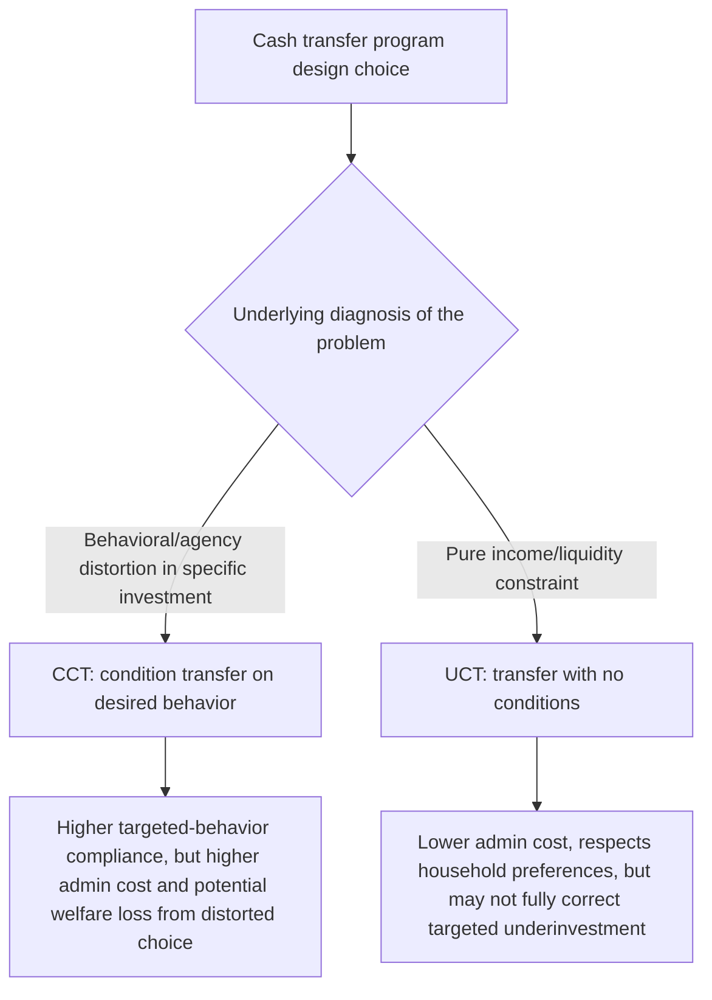
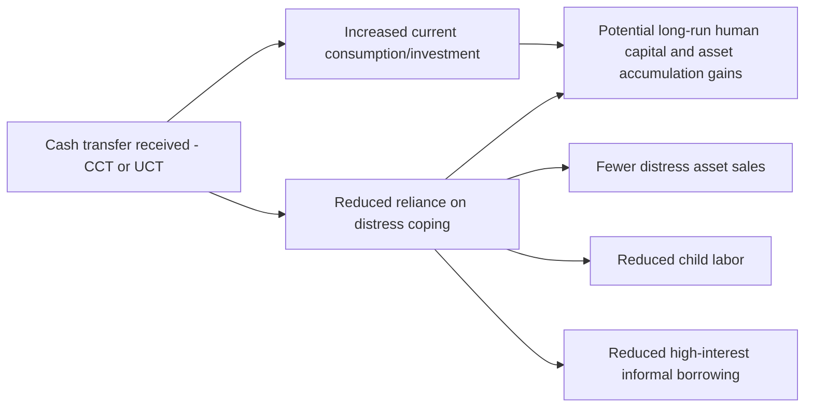

## Cash Transfer Programs: Conditional and Unconditional

### Definition and Scope

Cash transfer programs provide direct monetary payments to eligible households, distinguished primarily by whether receipt is contingent on specified behaviors (**conditional cash transfers, CCTs**) or provided without behavioral requirements (**unconditional cash transfers, UCTs**). While introduced briefly under the broader social protection topic in this chapter, this entry provides deeper technical treatment of program design mechanics, the specific economic logic of conditionality, and the comparative empirical evidence distinguishing the two approaches.

**Key Points**

- Both instrument types share the underlying goal of protecting or raising household consumption and welfare, but rest on different theoretical premises about *why* households may under-invest or under-consume absent intervention
- CCTs are grounded in a **behavioral market failure** argument (households systematically under-invest in specific goods, usually child human capital); UCTs are grounded more directly in a **liquidity/income constraint** argument (households simply lack resources, and are otherwise capable of allocating them efficiently)
- This distinction has generated one of the more active comparative empirical literatures in development economics: does conditionality add value beyond the income effect of the transfer itself?

### Theoretical Rationale for Conditionality

#### Intrahousehold Agency and Externality Arguments

The core argument for conditionality rests on the premise that the private return to certain investments (particularly children's health and education) captured by the household's decision-maker may fall short of the full social or even full private lifetime return, due to:

- **Intrahousehold principal-agent problems**: the household member making spending decisions (often not the child) may not fully internalize the child's long-run welfare gain from schooling or health investment
- **Present bias / self-control problems**: households may systematically under-invest in delayed-return goods (education, preventive healthcare) relative to their own long-run preferences, due to hyperbolic discounting
- **Positive externalities**: social returns to child health and education (reduced disease transmission, broader human capital accumulation) may exceed the fully internalized private return, justifying a public nudge toward investment

$$U_{decision-maker}(\text{child education}) < U_{child, lifetime}(\text{child education})$$

Under this framing, a pure income transfer (UCT) may be only partially effective at raising investment in the targeted good, since the household allocates the additional income according to its own (potentially distorted) preferences, whereas conditionality directly targets the specific behavioral margin of concern.

#### Contrast with the Liquidity-Constraint View

UCT design instead emphasizes that if the primary barrier to investment or consumption is simply insufficient income (a standard budget constraint problem, not a behavioral distortion), then an unconditional transfer should be equally or more efficient, since it allows the household to allocate resources according to its own assessment of highest-value use — avoiding both the administrative cost of monitoring conditions and any efficiency loss from distorting household choices away from their true preferences.

### Program Design Mechanics

#### CCT Structural Components

| Component | Design Choice | Example |
| --- | --- | --- |
| Conditions | Health check-ups, school enrollment/attendance, nutrition monitoring | Progresa: school attendance ≥85%, clinic visits |
| Transfer amount structure | Flat vs. scaled by household size/grade level | Progresa: scaled by grade level, higher for girls at secondary level |
| Monitoring mechanism | Administrative verification of condition compliance | School attendance records, health facility check-in logs |
| Payment frequency | Monthly, bimonthly | Varies by program; Bolsa Família is monthly |
| Enforcement | Suspension/reduction of benefits for non-compliance | Varies in strictness; some programs use "soft" enforcement |

#### UCT Structural Components

| Component | Design Choice | Example |
| --- | --- | --- |
| Eligibility determination | Means testing, proxy means testing, geographic/categorical targeting | GiveDirectly: extreme poverty proxy indicators |
| Transfer size and duration | Lump-sum vs. periodic; fixed duration vs. open-ended | GiveDirectly: often large lump-sum or extended monthly transfers |
| Delivery mechanism | Mobile money, direct cash, bank transfer | Mobile money (e.g., M-Pesa) increasingly standard in East Africa |
| Recipient designation | Household head vs. specific member (often mother) | Many programs designate female household members as recipients |

**Key Points**

- The choice of recipient (often a mother or female household member, even in nominally household-level UCT/CCT programs) reflects an implicit theoretical premise related to intrahousehold bargaining — evidence in several contexts suggests transfers to women are associated with greater allocation toward children's welfare, though this finding is not uniform across all studies and contexts
- Digital/mobile money delivery has substantially reduced transaction and leakage costs relative to physical cash disbursement in many recent program implementations, a design shift documented extensively in the GiveDirectly and related large-scale UCT literature

### Landmark CCT Evidence: Progresa/Oportunidades

Mexico's Progresa (launched 1997, later renamed Oportunidades and then Prospera) is the most extensively studied CCT program globally, benefiting from a randomized phase-in design across communities that has generated a substantial body of causal evidence.

#### Documented Effects

- **Schooling**: increased enrollment, particularly at the primary-to-secondary transition, where dropout risk was historically concentrated
- **Health**: increased clinic visit frequency and improved child growth/nutritional indicators in the evaluated period
- **Longer-run follow-up studies**: subsequent research tracking original program cohorts into adulthood has examined effects on eventual educational attainment, labor market outcomes, and, in some analyses, effects on the next generation of children in beneficiary households

**Key Points**

- The randomized phase-in design (communities randomly assigned to early vs. delayed program rollout) is frequently cited as a methodological landmark, enabling credible causal identification that was unusual for large-scale government programs at the time
- [Inference] The scale and rigor of the Progresa evaluation substantially shaped subsequent CCT program design internationally (e.g., Bolsa Família in Brazil, various Central American CCT programs), though direct causal attribution of policy diffusion to the evaluation evidence specifically, versus broader contemporaneous development policy trends, is not something the evaluation literature itself formally establishes

### Landmark UCT Evidence: GiveDirectly and Related Programs

Large-scale randomized evaluations of unconditional transfers, particularly GiveDirectly's programs in Kenya, have become an influential reference point in the UCT literature, in part due to their scale and methodological rigor (large sample sizes, long-run follow-up, general equilibrium spillover analysis).

#### Documented Effects

Evidence from these evaluations generally shows increased consumption, increased asset holdings (including productive assets and housing investments), improved psychological wellbeing measures, and — addressing a frequently raised political-economy objection — little to no evidence of increased spending on alcohol or tobacco ("temptation goods"), a finding that has been replicated across multiple UCT evaluations in different contexts.

#### General Equilibrium/Spillover Evidence

Egger, Haushofer, Miguel, Niehaus, and Walker's study of GiveDirectly's large-scale Kenya rollout is notable for documenting **local economic spillover effects**: because the program achieved high transfer saturation within specific villages, researchers were able to detect effects on local prices, non-recipient household welfare, and broader local economic activity — evidence generally not observable in smaller-scale pilot RCTs.

**Key Points**

- The absence of significant temptation-good spending effects across multiple UCT studies is one of the more consistently replicated findings in this literature and has been influential in shifting some policy skepticism away from unconditional cash transfer design
- [Unverified] The extent to which general equilibrium spillover findings from a specific high-saturation Kenya rollout generalize to other market and institutional contexts (different price elasticities, market integration levels) is not established as a universal finding across all UCT implementations

### Comparative Evidence: Does Conditionality Add Value?

A distinct and directly comparative empirical literature has examined whether conditions meaningfully add behavioral impact beyond the income effect of an equivalently sized unconditional transfer — the central question distinguishing CCT and UCT design choices.

#### Notable Comparative Studies

Baird, McIntosh, and Özler's (2011) study in Malawi directly compared conditional and unconditional transfers of similar size and found that conditional transfers produced larger school enrollment effects for some subgroups, but unconditional transfers produced comparatively larger effects on other outcomes (including some marriage/fertility-related outcomes among out-of-school girls), suggesting the relative advantage of conditionality is not uniform across all outcome margins or population subgroups.

$$\text{Effect}_{CCT} - \text{Effect}_{UCT} = \text{"value added of conditionality"}$$

This difference has been found to vary considerably by outcome variable, population subgroup, and context across the comparative literature, rather than showing a single consistent direction favoring one design over the other.

**Key Points**

- The comparative evidence base does not support a categorical claim that conditionality is either uniformly beneficial or uniformly unnecessary; the appropriate design choice depends on the specific targeted behavior, population, and available implementation/monitoring capacity
- [Inference] Because conditions carry real administrative and monitoring costs, and comparative evidence shows conditionality's marginal behavioral benefit is inconsistent across contexts, the choice between CCT and UCT design in practice often reflects a context-specific cost-effectiveness judgment rather than a universally superior default, though the literature does not converge on a single decision rule for making this trade-off

### Administrative Cost and Implementation Considerations

| Consideration | CCT | UCT |
| --- | --- | --- |
| Monitoring infrastructure required | High (school/clinic attendance tracking systems) | Low |
| Vulnerability to condition-compliance gaming | Present (e.g., falsified attendance records) | Not applicable |
| Exclusion of eligible but non-compliant households | Risk present (e.g., households unable to meet conditions due to school/clinic access barriers) | Not applicable |
| Political economy/public acceptability | Often higher public support (perceived reciprocity) | Sometimes lower public support (perceived "free money" objection, despite limited empirical support for concerns about misuse) |
| Cost per dollar transferred to beneficiary | Lower net efficiency due to monitoring overhead | Higher net efficiency (lower overhead) |

**Key Points**

- The political economy dimension is a notable non-technical factor influencing program design choice: conditionality is sometimes adopted partly for public and political acceptability reasons (framing transfers as an exchange rather than a "handout"), independent of the technical evidence on behavioral value-added
- Condition-compliance monitoring, particularly in contexts with weak administrative or service-delivery infrastructure, can itself generate exclusion errors, since it becomes conflated with underlying service accessibility rather than purely household behavior

### Interaction with Broader Risk and Insurance Themes

Both CCTs and UCTs connect to the consumption-smoothing and risk-coping themes developed earlier in this chapter: rigorous evaluations generally document reduced reliance on costly informal coping strategies (asset sales, child labor, high-interest borrowing) among recipient households of both transfer types, directly supporting the broader chapter argument that formal safety nets can substitute for costly informal risk-coping mechanisms, particularly for covariate shocks that overwhelm informal insurance networks.

### Summary Comparison Table

| Dimension | Conditional Cash Transfers | Unconditional Cash Transfers |
| --- | --- | --- |
| Theoretical basis | Behavioral/agency market failure in specific investment | Liquidity/income constraint |
| Targeted outcome | Specific behavior (schooling, health visits) | General welfare/consumption |
| Administrative complexity | High | Low-moderate |
| Evidence on temptation-good spending | Not typically a central concern given conditions | Consistently low across multiple studies |
| Evidence on human capital outcomes | Strong direct evidence (Progresa and similar) | Positive but less behavior-specific evidence |
| Cost-effectiveness per dollar reaching household | Lower (monitoring overhead) | Higher |
| Political/public acceptability | Often higher | Sometimes contested, though evidence generally supportive |

**Next Steps**

- Social protection and safety nets (broader instrument typology, this chapter)
- Progresa/Oportunidades long-run follow-up evidence
- GiveDirectly and general equilibrium spillover evidence
- Targeting methods: proxy means testing and community-based targeting
- Intrahousehold bargaining and gendered transfer recipient design
- Risk-coping strategies of poor households (connection to reduced distress coping)
- Graduation programs and multi-component ultra-poor interventions
- Political economy of social program design and public support