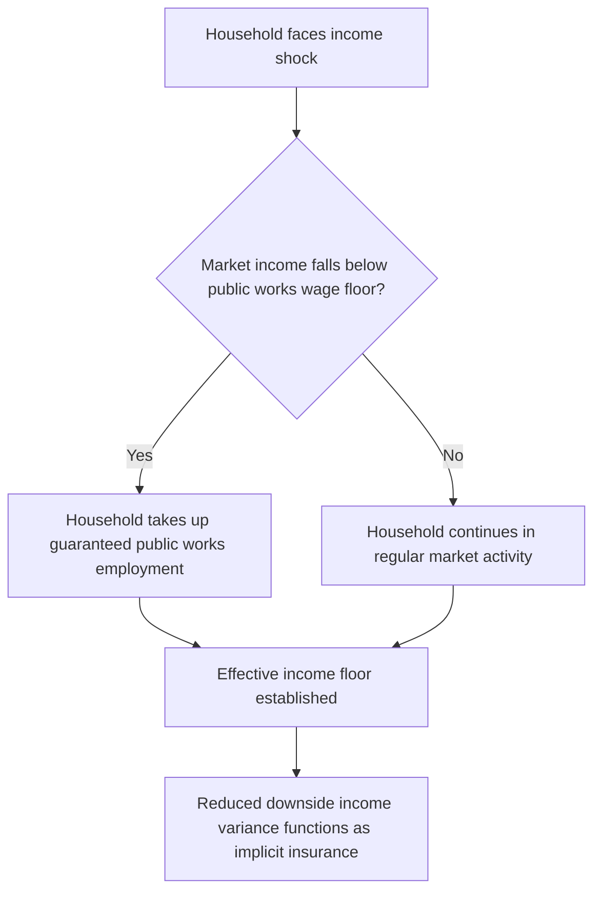
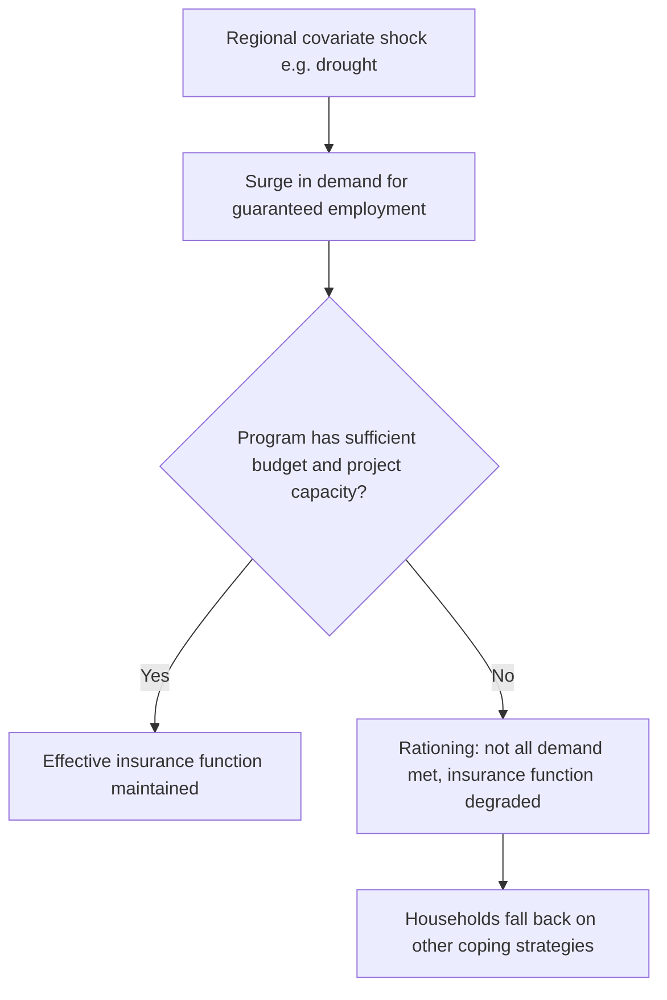

## Public Works Programs as Insurance

### Definition and Scope

Public works programs as insurance examines guaranteed-employment/workfare schemes not merely as poverty-reduction or infrastructure-provision tools, but specifically through the lens of their function as an **implicit insurance mechanism** — providing households a fallback income source during idiosyncratic or covariate shocks. This entry builds on the brief treatment of public works under the broader social protection topic in this chapter, focusing specifically on the theoretical and empirical case for treating such programs as an insurance instrument rather than purely an employment or infrastructure program.

**Key Points**

- The insurance framing distinguishes public works from standard safety net analysis by emphasizing the **option value** of guaranteed employment — the value to a household of knowing a fallback income source exists, independent of whether they ever actually use it in a given period
- This connects directly to the ex-ante behavioral responses to uninsured risk covered earlier in this chapter: a credible guarantee of fallback employment can, in principle, reduce precautionary underinvestment even without any shock being realized
- Public works programs are distinguished from cash/in-kind transfers by requiring labor in exchange for benefits, which has specific implications for **self-targeting** and moral hazard that do not apply to unconditional transfers

### Theoretical Framework: Insurance via Guaranteed Employment Option

#### The Option Value Argument

A guaranteed employment scheme functions analogously to a **put option** on household income: the household is guaranteed a wage floor $w_{PW}$ (the public works wage) regardless of the realization of other income sources. If market income $y_{it}$ falls below what the household could earn from the guaranteed program, the household simply takes up public works employment instead.

$$y_{it}^{effective} = \max(y_{it}^{market}, w_{PW} \cdot h_{PW})$$

Where $h_{PW}$ is hours/days of public works employment available (often capped, e.g., 100 days/year under India's NREGA). This creates an income floor, directly reducing downside variance in a manner conceptually similar to insurance, even though no formal insurance contract exists.

#### Distinction from Standard Safety Net Framing

Under a pure poverty-reduction framing, a public works program is evaluated primarily on static welfare/income effects for participants in a given period. Under the insurance framing, the program's value additionally includes:

- **Ex-ante risk-reduction value**: the value to *all* eligible households (not just current participants) of knowing the option exists, which — mirroring the ex-ante behavioral responses to uninsured risk topic — can affect production and investment decisions even absent current participation
- **Self-targeting via option design**: because take-up requires actual labor supply at a (typically) below-market wage, the program is theoretically accessed disproportionately by those experiencing negative shocks, functioning similarly to a deductible/trigger mechanism in formal insurance

### Self-Targeting Mechanism and Its Insurance-Like Properties

The defining design feature distinguishing public works from unconditional cash transfers is that eligibility is not means-tested directly; instead, the program is theoretically **self-targeting** through wage-setting: setting the public works wage below the prevailing market wage discourages participation by households with better outside options, while still attracting those with no better alternative (often precisely those experiencing an income shock).

$$w_{PW} < w_{market}^{normal} \quad \text{but} \quad w_{PW} \geq w_{market}^{shock-affected}$$

This wage-setting logic is analogous to a deductible in formal insurance: it screens out low-need claimants (those with adequate market alternatives) while still providing coverage to genuinely shock-affected households, without requiring costly means-testing or shock verification.

**Key Points**

- The theoretical elegance of self-targeting is that it avoids the administrative cost and information requirements of means-testing or shock verification that formal insurance and targeted cash transfers require
- In practice, self-targeting is imperfect: rationing of available work (fixed budgets or project availability), information gaps about program availability, and non-wage participation costs (distance to worksite, gender norms restricting participation) can all cause targeting to deviate from the theoretical prediction
- [Inference] Because self-targeting relies on households possessing accurate information about the relative value of program participation versus outside options, targeting accuracy plausibly depends on program information dissemination and administrative implementation quality, though this specific channel is not always separately quantified in program evaluations relative to other implementation factors

### Empirical Evidence: NREGA as the Central Case Study

India's Mahatma Gandhi National Rural Employment Guarantee Act (NREGA), guaranteeing up to 100 days of employment per rural household annually at a legislated minimum wage, is the most extensively studied large-scale public works program examined through this insurance lens, given its scale and the availability of rich administrative and survey data.

#### Consumption-Smoothing Evidence

Studies of NREGA generally find evidence consistent with an insurance function: households in districts with more effective NREGA implementation show reduced consumption sensitivity to agricultural income shocks (particularly rainfall shocks) relative to districts with weaker implementation, supporting the interpretation of the program as functioning as insurance against agricultural income risk specifically.

#### Wage Spillover Evidence (Ex-Ante Effect)

A distinctive body of evidence examines NREGA's effect on **private-sector agricultural wages**, finding that the guaranteed program's wage floor raises the effective reservation wage for agricultural laborers generally, leading to increases in private agricultural wages in areas with active NREGA implementation — evidence of a market-wide effect extending beyond direct program participants.

**Key Points**

- The wage spillover finding is particularly relevant to the insurance framing: it demonstrates that the *existence* of the guarantee affects market outcomes even for households not currently participating, consistent with the option-value argument that a credible guaranteed floor changes behavior beyond direct usage
- [Unverified] The precise magnitude of wage spillover effects varies considerably across studies and Indian states, reflecting heterogeneous program implementation quality, local labor market conditions, and the specific empirical methodology used, and is not established as a single universal effect size

#### Migration and Ex-Ante Investment Evidence

Some studies find that NREGA availability reduces distress out-migration during agricultural lean seasons and, in specific analyses, is associated with changes in agricultural input use and risk-taking behavior on household farms — evidence connecting to the ex-ante behavioral responses to uninsured risk topic earlier in this chapter, suggesting the guaranteed fallback option may reduce precautionary underinvestment in a manner structurally analogous to the index insurance investment effects also covered in this chapter.

### Comparison to Formal Insurance Instruments

| Feature | Public Works (Insurance Framing) | Index Insurance | Informal Risk-Sharing |
| --- | --- | --- | --- |
| Trigger mechanism | Self-selected participation (implicit) | Objective index threshold (explicit) | Network member observes need |
| Covariate risk coverage | Strong, if program scales with local shock severity | Designed specifically for this | Weak (structural limitation) |
| Moral hazard | Limited (labor requirement itself is costly) | Minimal (index-based, individual effort doesn't affect index) | Present (individual effort affects need) |
| Administrative/verification cost | Moderate (project management, wage payment) | Low (once index infrastructure established) | Low (local information) |
| Basis risk | Low (direct income floor, not indexed to external proxy) | Significant (index may not match individual loss) | Not applicable (different failure mode) |
| Ex-ante behavioral effect (reduced precautionary underinvestment) | Documented in some contexts (NREGA wage/investment spillovers) | Well-documented (Karlan et al., Mobarak-Rosenzweig) | Limited/mixed evidence |

**Key Points**

- Public works programs have a notable advantage over index insurance in avoiding basis risk, since the "payout" (guaranteed wage) is directly tied to the household's own labor supply decision rather than an external, imperfectly correlated index
- However, public works programs impose a labor cost on recipients (foregone leisure/alternative activities) that pure cash-based insurance instruments do not, representing a distinct efficiency trade-off not present in index insurance or cash transfer comparisons

### Limitations of the Insurance Framing

#### Imperfect Coverage of Covariate Shocks

While theoretically capable of covering covariate shocks (since the program does not rely on peer risk-pooling capacity the way informal insurance does), public works programs face their own covariate-risk-scaling constraint: during a severe, widespread regional shock, demand for guaranteed employment can surge simultaneously across many households, straining program budgets, administrative capacity, and available project work — a form of program-level covariate exposure distinct from, but structurally analogous to, the covariate risk limitation of informal insurance networks.

#### Labor Market Distortion Concerns

Because the guaranteed wage can raise reservation wages market-wide (as documented in NREGA wage spillover studies), public works programs can generate labor market effects on non-participating employers (e.g., raising costs for private agricultural employers), a general equilibrium consideration not present with pure cash-based insurance instruments.

#### Exclusion of Labor-Constrained Households

Because benefits require labor supply, households lacking able-bodied working-age members (elderly-headed households, households with disability, certain female-headed households facing mobility or social constraints) may be structurally excluded from the insurance function that public works provides to labor-capable households — a limitation not shared by unconditional cash transfers or index insurance, which do not condition benefits on labor supply.

**Key Points**

- This labor-capacity exclusion is a recurring critique in comparative social protection design discussions, motivating combined program designs (e.g., pairing public works for labor-capable households with unconditional transfers or pensions for labor-constrained households) rather than relying on a single instrument to serve the full population's insurance needs
- [Inference] Because the insurance value of public works programs is conditional on labor capacity, the effective insurance coverage of a population is narrower than headline eligibility figures might suggest, though the magnitude of this exclusion gap varies by program design and local demographic composition and is not uniformly quantified across country contexts

### Fiscal and Design Considerations Specific to the Insurance Function

| Design Parameter | Insurance-Relevant Trade-off |
| --- | --- |
| Wage level relative to market wage | Higher wage improves coverage/adequacy but weakens self-targeting and raises fiscal cost |
| Days/employment cap | Higher cap improves coverage during severe shocks but raises fiscal exposure to covariate risk |
| Demand-responsiveness of budget | Rigid budgets undermine insurance function during covariate shocks; flexible/contingent financing improves it |
| Project pipeline readiness | Insufficient "shovel-ready" project availability can ration effective access during shock-driven demand surges |
| Payment timeliness | Delayed wage payment (a documented NREGA implementation challenge in some periods/states) undermines the program's effective liquidity/insurance value even where nominal entitlement exists |

**Key Points**

- Payment delay has been specifically documented as an implementation challenge affecting NREGA's practical insurance value in some contexts, illustrating that formal entitlement design and actual delivered insurance value can diverge based on administrative execution quality
- This connects to the broader **adaptive social protection** design principle introduced in the social protection topic: for public works to function effectively as covariate-risk insurance, program financing and administrative systems need built-in flexibility to scale rapidly during shock periods, rather than operating solely as a fixed-budget program

### Summary: Insurance Properties of Public Works Programs

| Insurance Property | Assessment |
| --- | --- |
| Idiosyncratic risk coverage | Generally strong, given individual-level self-targeting |
| Covariate risk coverage | Theoretically strong but practically constrained by program budget/capacity scaling |
| Moral hazard | Limited, due to inherent labor cost of participation |
| Basis risk | Low relative to index insurance (direct wage floor, not indexed proxy) |
| Ex-ante behavioral effect | Documented in NREGA wage spillover and some investment studies |
| Population coverage completeness | Excludes labor-constrained households by design |
| Administrative/fiscal demands | Moderate-high, with covariate-shock scaling as a key vulnerability |

**Next Steps**

- Social protection and safety nets (broader instrument typology, this chapter)
- NREGA wage spillover and consumption-smoothing evidence
- Behavioral responses to uninsured risk (ex-ante investment effects, companion topic)
- Index-based weather insurance (comparison of basis risk vs. self-targeting trade-offs)
- Adaptive social protection and contingent financing design
- Self-targeting mechanisms in safety net program design
- Cash transfer programs: conditional and unconditional (comparison of labor-conditioned vs. unconditional benefits)
- Labor market general equilibrium effects of large-scale public programs