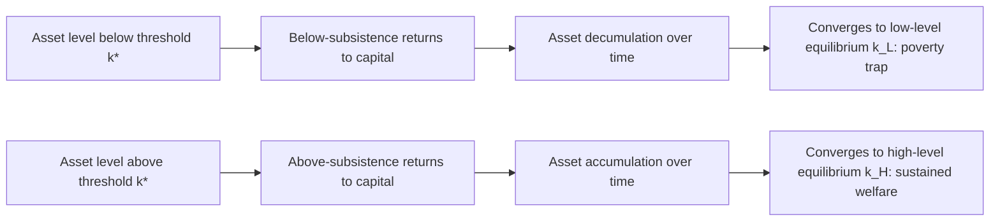
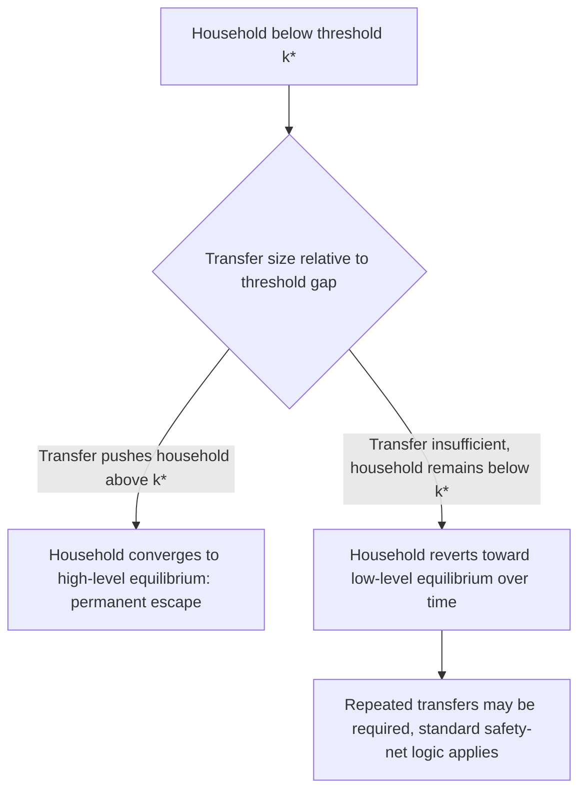

## Shock Persistence and Poverty Dynamics

### Definition and Scope

Shock persistence and poverty dynamics examines how transitory income or asset shocks translate into **long-run, sometimes permanent** poverty outcomes, and the specific mechanisms through which short-run shocks generate lasting welfare effects. This topic synthesizes and formalizes a theme threaded throughout this chapter — from risk-coping strategies, to consumption smoothing evidence, to behavioral responses to uninsured risk — by focusing specifically on the **dynamic, long-run** consequences of shock exposure and the conditions under which shocks generate persistent rather than transitory effects.

**Key Points**

- The central analytical question is not merely "do households smooth consumption during a shock" (covered in the consumption-smoothing evidence topic) but "does an otherwise-transitory shock leave a lasting mark on household welfare trajectories" — a distinct dynamic question requiring panel data and longer time horizons to answer
- This topic provides the theoretical foundation for **poverty trap** models, in which shocks push households below a critical threshold from which self-sustaining recovery does not occur, distinguishing persistent poverty from purely transitory low-income episodes
- The mechanisms connecting shocks to persistence are largely the same coping strategies documented earlier in this chapter (asset sales, child labor, migration, human capital disinvestment) — this topic examines their **long-run consequences** rather than their short-run deployment

### Theoretical Framework: Asset Dynamics and Poverty Traps

#### The S-Shaped Asset Dynamics Model

The dominant theoretical framework, developed notably by Barrett, Carter, Zimmerman, and Lybbert, models household asset accumulation as following a **nonlinear, S-shaped dynamic process**, in contrast to the standard neoclassical growth model's assumption of a single stable equilibrium.

$$k_{t+1} = g(k_t) + \varepsilon_t$$

Where the accumulation function $g(k_t)$ exhibits multiple equilibria: a **low-level equilibrium** $k_L$ (a poverty trap) and a **high-level equilibrium** $k_H$, separated by an unstable threshold $k^*$ (sometimes called a Micawber threshold).

**Key Points**

- The theoretical crux is that the threshold $k^*$ is unstable: a household with assets slightly below $k^*$ tends toward the low equilibrium over time, while a household slightly above tends toward the high equilibrium — meaning a shock large enough to push a household below $k^*$ can have permanent consequences, even if the shock itself is transitory in nature
- This nonlinearity is the key theoretical distinction from a standard single-equilibrium growth model, in which any transitory shock would eventually be smoothed out with the household returning to its original trajectory
- [Inference] The existence and location of such a threshold is a theoretical construct that motivates specific empirical tests (discussed below); its existence in any particular empirical setting is a testable proposition rather than a universally established fact, and the literature treats it as such

#### Contrast with Single-Equilibrium (Stochastic Convergence) Models

An alternative and competing theoretical view holds that, absent poverty traps, households experiencing a negative shock should eventually converge back toward a single, shock-independent long-run equilibrium determined by underlying structural characteristics (education, land quality, market access) rather than shock history — implying persistence in poverty dynamics reflects underlying structural disadvantage rather than shock-driven trap dynamics.

$$k_{t+1} = g(k_t) + \varepsilon_t, \quad g'(k) < 1 \text{ everywhere (single stable equilibrium)}$$

Distinguishing empirically between these two models — multiple equilibria (poverty trap) versus single equilibrium with structural heterogeneity — has been a central methodological challenge in this literature.

### Mechanisms Linking Shocks to Persistent Poverty

The specific channels through which a transitory shock generates lasting effects largely mirror the risk-coping strategies covered earlier in this chapter, examined here for their **dynamic, cumulative** consequences.

#### Asset Depletion and Productive Capacity Loss

When households sell productive assets (livestock, land, tools) during a shock — particularly under the fire-sale/distress-price conditions documented in the risk-coping strategies topic — the loss of productive capacity can persist well beyond the shock episode itself, since rebuilding an asset base takes time and may require accumulating savings from an already-diminished income base.

#### Human Capital Disinvestment

Withdrawal of children from school or reduced health investment during a shock represents a particularly consequential persistence channel, since human capital accumulation is strongly **time-sensitive**: a missed year of schooling at a critical age, or malnutrition during early childhood developmental windows, may not be fully reversible even once household income recovers.

$$\text{Human Capital}_{adult} = h(\text{Investment}_{critical period}) \quad \text{with limited substitutability across periods}$$

**Key Points**

- Jacoby and Skoufias's work on seasonal schooling disruption in India, and subsequent literature on early-childhood shock exposure (e.g., studies linking in-utero or early-life shock exposure to adult height, cognitive outcomes, and earnings), provide some of the most compelling evidence for irreversible or difficult-to-reverse persistence channels
- [Inference] The time-sensitivity of human capital investment suggests shocks occurring during specific developmental windows (early childhood, key schooling transitions) may generate disproportionately persistent effects relative to equivalently sized shocks occurring at other life stages, though the precise critical-window boundaries and dose-response relationships remain an active area of empirical research rather than settled parameters

#### Debt Accumulation and Overhang

Where coping relies on informal borrowing (covered in the risk-coping strategies topic), the resulting debt burden can constrain future investment capacity, creating a form of debt overhang that persists after the triggering shock has passed, particularly when combined with the over-indebtedness dynamics discussed in the critiques of microfinance topic.

#### Occupational and Locational Lock-In

Shock-driven migration or occupational shifts (e.g., forced entry into lower-return informal-sector work) can, in some cases, become persistent even after the original shock's direct effects have faded, particularly where switching costs, network effects, or skill specialization make reversal costly.

### Empirical Identification Strategies

#### Panel Data and Shock-History Regressions

The standard empirical approach uses household panel data spanning a shock episode and measures whether households exposed to a specific shock (identified via exogenous variation, e.g., rainfall, regional conflict, or price shocks) show significantly different asset or income trajectories years later relative to otherwise similar unexposed households.

$$k_{i,t+n} = \alpha + \beta \cdot \text{Shock}_{i,t} + \gamma X_{i,t} + \epsilon_{i,t+n}$$

A finding of significant, persistent $\beta$ many periods after the shock (rather than $\beta$ decaying to zero) is interpreted as evidence of shock persistence, though distinguishing trap-driven persistence from simple slow mean-reversion requires additional structure.

#### Testing for Multiple Equilibria (Poverty Trap Tests)

A more demanding empirical test, associated particularly with Lybbert, Barrett, Desta, and Coppock's work on pastoralist livestock dynamics in Ethiopia, looks for evidence of the theoretically predicted **nonlinear, S-shaped** relationship between current and future asset levels — specifically testing whether households near the hypothesized threshold $k^*$ show bifurcating trajectories (some converging up, some down) rather than the smooth, single-direction convergence a single-equilibrium model would predict.

**Key Points**

- Evidence for poverty trap dynamics (multiple equilibria) has been found in some specific empirical contexts (notably pastoralist livestock studies), but is not uniformly established across all settings where it has been tested — some studies find evidence more consistent with single-equilibrium, structural-heterogeneity explanations for observed poverty persistence
- [Unverified] Whether poverty trap dynamics (in the strict multiple-equilibria sense) represent a general phenomenon across developing-country contexts, versus a feature specific to certain asset types (e.g., livestock, where herd dynamics create genuine biological nonlinearities) and settings, remains a debated and empirically unresolved question in the broader literature, distinct from the well-established finding that shocks can have lasting negative effects through the mechanism channels described above (which does not require formal multiple-equilibria dynamics to be true)

### Distinguishing Structural and Stochastic Poverty

A related and complementary empirical literature (associated with Baulch and Hoddinott, Carter and Barrett, and others) decomposes observed household poverty status over time into:

| Poverty Category | Description |
| --- | --- |
| Chronic/structural poor | Persistently poor across most or all observed periods, associated with low underlying asset/human capital endowments |
| Transitory poor | Poor in some periods due to shocks, but with underlying capacity to recover |
| Never poor | Consistently above the poverty line |
| Trapped by shock (if poverty traps exist) | Pushed below a critical threshold by a shock, subsequently unable to recover despite similar underlying endowments to the transitory poor group |

**Key Points**

- This decomposition has significant policy implications: chronic/structural poverty is generally understood to require different interventions (asset-building, education, structural transformation) than transitory poverty (which safety nets and consumption-smoothing tools, covered earlier in this chapter, are well-suited to address)
- Identifying whether a specific household's persistent poverty reflects a genuine shock-induced trap (potentially reversible with a sufficiently large asset transfer to push them back above $k^*$) versus low structural endowments (requiring longer-run human capital or productivity interventions) has direct implications for targeting and program design, discussed further below

### Policy Implications: Big-Push Transfers vs. Standard Safety Nets

If poverty trap dynamics are empirically present in a given context, the policy implication differs meaningfully from the standard consumption-smoothing rationale for safety nets discussed elsewhere in this chapter: a **sufficiently large, one-time asset transfer** that pushes a trapped household's assets above the threshold $k^*$ could, in principle, generate a permanent escape from poverty, whereas smaller or repeated transfers below the threshold might only delay but not resolve trap dynamics.

**Key Points**

- This "big-push" logic has directly motivated the design of **graduation programs** (e.g., BRAC's model, referenced in the social protection topic), which combine a substantial asset transfer with complementary training and coaching specifically intended to help ultra-poor households cross a hypothesized threshold
- Evaluations of graduation programs (e.g., Banerjee, Duflo, and coauthors' multi-country randomized evaluation) have generally found sustained, multi-year positive effects on consumption and assets among ultra-poor participants, evidence considered broadly consistent with (though not definitively proving) a poverty-trap-crossing interpretation
- [Inference] The persistence of graduation program effects several years after the intervention, in excess of what a simple one-time income boost with normal mean-reversion would predict, is consistent with a threshold-crossing/poverty-trap interpretation, though rigorously distinguishing this from other explanations (e.g., simply larger transfer size than typical safety net programs, allowing more durable asset accumulation without requiring formal nonlinear trap dynamics) remains a point of ongoing methodological discussion in the literature

### Summary: Shock Persistence Mechanisms and Policy Response

| Mechanism | Persistence Channel | Relevant Policy Response |
| --- | --- | --- |
| Productive asset depletion | Reduced future income-generating capacity | Asset transfers, graduation programs |
| Human capital disinvestment | Time-sensitive, difficult-to-reverse skill/health loss | Early intervention safety nets, CCTs targeting critical periods |
| Debt overhang | Constrained future investment capacity | Debt relief, access to affordable formal credit |
| Occupational/locational lock-in | Switching costs prevent return to prior, higher-return activity | Labor market/skills programs, portable safety nets |
| Threshold-crossing (formal poverty trap) | Nonlinear asset dynamics below a critical level | Large one-time transfers (graduation model) rather than repeated small transfers |

**Next Steps**

- Risk-coping strategies of poor households (short-run mechanisms examined here for long-run consequences)
- Consumption smoothing evidence (distinguishing transitory shock response from lasting effects)
- Behavioral responses to uninsured risk (ex-ante underinvestment as a related persistence channel)
- Graduation programs and multi-component ultra-poor interventions
- Early childhood shock exposure and long-run human capital outcomes
- Critiques and limits of microfinance (debt overhang connections)
- Asset-based poverty measurement and chronic vs. transitory poverty decomposition
- Pastoralist livestock dynamics and empirical poverty trap testing